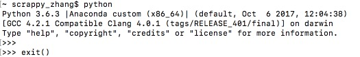
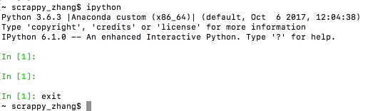

# 2.1 Python基础语法

## 第一个Python程序

​	Python语言简单，像其他语言一样，我们可以在本地的文本编辑中书写以下代码：

```python
my_name = input('please input your name:\n')
print(my_name)
```

​	保存文档后重命名为`hello.py`，在文档所在目录下打开终端，并输入命令行`python hello.py`即可运行该python代码。就是这么方便。不过笔者建议做python项目开发时可以使用Pycharm这样类似的工具，更方便，详见Python软件基础那一章，[具体使用方法点击链接](https://www.cnblogs.com/muziyunxuan/p/7985265.html)。

​	以上代码中，`input`函数一般用于在运行过程中，让用户输入，是python基础中经常用到的命令，括号中的字符串为显示在终端上的提示信息；`print`函数一般用于打印显示信息，括号内的变量等即为要显示的内容。

## Python交互方式

### 文本模式

- Python代码保存在文件中，解释器对文件逐行解释执行
- 在终端中输入`python 要执行的文件名`，就像前文的hello name例子那样。

### 交互模式

- 直接在终端中运行解释器
- 在交互模式中边输入边执行Python代码，会立即看到程序执行结果
- 常用Python解释器和IPython解释器

#### Python解释器

##### 优点

- 适合于学习/验证Python语法或者局部代码

##### 缺点

- 代码不能保存
- 不适合运行太大的程序

##### 使用方法



- 如图所示，在终端中输入python即可进入python解释器环境
- 在python解释器环境中输入`exit()`即可退出解释器

#### IPython解释器

##### 特点

- 支持自动补全


- 自动缩进
- 支持`bash shell`命令
- 内置一些功能和函数
- 需要额外安装，命令`pip install ipython`

##### 使用方法



- 如图所示，在终端中输入ipython即可进入python解释器环境
- 在python解释器环境中输入`exit`即可退出解释器

## 缩进

​	学习 Python 与其他语言最大的区别就是，Python 的代码块不使用大括号 {} 来控制类，函数以及其他逻辑判断。python 最具特色的就是用缩进来写模块。

​	缩进的空白数量是可变的，但是所有代码块语句必须包含相同的缩进空白数量，这个必须严格执行。

例如如下代码缩进一致，运行则不会出错:

```python
if True:
    print("True")
else:
  	print("False")
```

如下代码，缩进不一致，运行则会出错：

```python
if True:
    print("True")
else:
 print("False")
```

## 多行语句

Python语句中一般以新行作为语句的结束符。但是我们可以使用斜杠（ \）将一行的语句分为多行显示，如下所示：

```python
total = item_one + \
        item_two + \
        item_three
```

语句中包含 [], {} 或 () 括号就不需要使用多行连接符。如下实例：

```python
days = ['Monday', 'Tuesday', 'Wednesday',
        'Thursday', 'Friday']
```

## Python引号

Python 可以使用引号( **'** )、双引号( **"** )、三引号( **'''** 或 **"""** ) 来表示字符串，引号的开始与结束必须的相同类型的。其中三引号可以由多行组成，编写多行文本的快捷语法，常用于文档字符串，在文件的特定地点，被当做注释。但是一段字符串只能有一种类型的引号来表示整个字符串，在字符串中间若需要引号，必须和起始结束的字符串不同。如：

```python
# 正确语法
string1 = '他说："他想学Python"'

# 错误语法
string1 = '他说：'他想学Python''
```


## Python注释

### 单行注释

python中单行注释以及行末注释采用 # 开头。

```python
# 第一个注释
print("Hello, Python!");  # 第二个注释,代码与“#”号相隔两个空格
```

### 多行注释

python 中多行注释使用三个单引号(''')或三个双引号(""")。

```python
'''
这是多行注释，使用单引号。
这是多行注释，使用单引号。
这是多行注释，使用单引号。
'''

"""
这是多行注释，使用双引号。
这是多行注释，使用双引号。
这是多行注释，使用双引号。
"""
```

## Python空行

​	函数之间或类的方法之间用空行分隔，表示一段新的代码的开始。类和函数入口之间也用一行空行分隔，以突出函数入口的开始。

​	空行与代码缩进不同，空行并不是Python语法的一部分。书写时不插入空行，Python解释器运行也不会出错。但是空行的作用在于分隔两段不同功能或含义的代码，便于日后代码的维护或重构。

<font color=red>注意</font>：空行也是程序代码的一部分。

## 命令行参数

```Python
$ python test.py arg1 arg2 arg3
```

Python 中可以所用 **sys** 的 **sys.argv** 来获取命令行参数：

- sys.argv 是命令行参数列表。
- len(sys.argv) 是命令行参数个数。
- sys.argv[0] 表示脚本名。

实例`test.py`文件：

```python
import sys


print '参数个数为:', len(sys.argv), '个参数。'
print '参数列表:', str(sys.argv)
```

在终端命令中运行时输入`python test.py 1 2 3 4`,结果为：

```
$ python test.py 1 2 3 4
参数个数为: 5 个参数。
参数列表: ['test.py', '1', '2', '3', '4']
```

