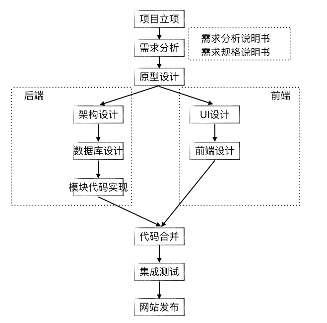

# 1、web项目常见开发流程

如图所示，为常见的web项目开发流程。其中，还要分为前后端分离开发和前后端不分离开发。前后端分离开发是没有模板语言的，仅仅需要如json格式的数据进行前后端通信。我们这一章进行的是前后端不分离开发，即全栈开发。

我们需要完成：

- 项目功能模块设计——一个电商网站
- 开发环境选择——python3.6与Django1.8.2
- 项目部署设计与技术选择
- 前后端不分离设计等。