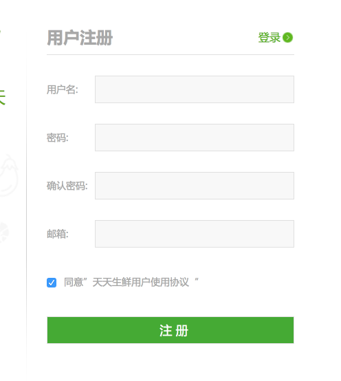
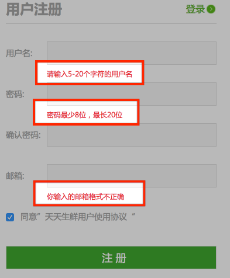
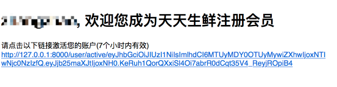

# 5、用户注册

## 5.1 基本配置

用户注册我们打算通过类视图来实现，而不是视图函数。

```python
from django.views.generic import View
```

在设计注册页面逻辑时，我们先看一下注册页面：



在设计时，我们计划将注册页面的URL规划为`/user/register`。

那么，在`user`应用中，url配置如下：

```python
from django.conf.urls import url
from apps.user.views import RegisterView  # RegisterView为即将要实现的注册视图类

urlpatterns = [
    url(r'^register$', RegisterView.as_view(), name='register'),  # 注册
]
```

为了后续URL调整方便，我们为该路径起名`register`。因此:

- 在模板中我们可以反解析该URL来使用:

```python

```

- 在视图逻辑中我们可以反解析使用该URL：

```python
from django.core.urlresolvers import reverse
redirect(reverse('user:register'))
```

除此之外，我们可以看出，访问注册页面有两种方式get和post，因此视图类RegisterView要分别编写get方式的处理函数和post方式的处理函数。

```python
# /user/register
class RegisterView(View):
    """注册"""

    def get(self, request):
        """显示"""
        do something
        pass
    def post(self, request):
        """注册处理"""
        do something
        pass
```

## 5.2 get方式处理函数

很明显，get方式仅仅是显示注册页面，因此我们仅需要调用模板目录下对应的注册模板文件`templates→register.html`即可。

```python
    def get(self, request):
        """显示"""
        return render(request, 'register.html')
```

## 5.3 post方式处理函数

post方式的目的主要是完成由前端将用户注册的输入信息回传到后端，然后经后端校验处理，写入用户信息库、发送注册确认邮件等这一过程。

其业务逻辑如下：

- 获取username、password、email参数
- 校验参数格式是否合法
  - 若参数不正确，跳转回注册页面
- 将注册信息写入用户信息表`df_user`
- 发送注册确认邮件
- 跳转至首页。

### 1、获取参数

```python
username = request.POST.get('user_name', None)  # None
password = request.POST.get('pwd')
email = request.POST.get('email')
```

> 注意：在用户注册填写数据时，一些初步格式判断及相应的提示信息由前端来完成。
>
> 

### 2、参数校验

```python
import re

# 2.参数校验(后端校验)
        # 校验数据的完整性
        if not all([username, password, email]):
            return render(request, 'register.html', {'errmsg': '数据不完整'})

        # 校验邮箱格式
        if not re.match(r'^[a-z0-9][\w.\-]*@[a-z0-9\-]+(\.[a-z]{2,5}){1,2}$', email):
            return render(request, 'register.html', {'errmsg': '邮箱格式不正确'})

        # 校验用户名是否已注册
        try:
            user = User.objects.get(username=username)
        except User.DoesNotExist:
            user = None

        if user is not None:
            return render(request, 'register.html', {'errmsg': '用户名已注册'})

        # 校验邮箱是否被注册...为了方便，此处不作校验，以便个人开发学习时重复使用邮箱
```

### 3、注册信息存入用户信息表

```python
# 3.业务处理：注册
        user = User.objects.create_user(username, email, password)
        user.is_active = 0  # 用户注册完后还未激活，即默认激活状态为0，待激活时设置为1
        user.save()
```

### 4、发送注册确认邮件

发送注册邮件有两种方式：

- 直接在post视图处理中发送邮件——逻辑清晰，但是只有邮件发送后才会执行后面的调整首页操作，用户可能需要等待。
- 交给其他进程来进行处理——像发邮件这种耗时操作交给其他进行来处理，而视图函数直接执行跳转，用户不等待，提高用户体验。

#### 4.1、 django发送邮件配置

##### settings配置

```python
# 163邮箱配置：需要先在163邮箱处配置为smtp。
EMAIL_BACKEND = 'django.core.mail.backends.smtp.EmailBackend'
EMAIL_HOST = 'smtp.163.com'
EMAIL_PORT = 25
# 发送邮件的邮箱
EMAIL_HOST_USER = 'xxx@163.com'
# 在邮箱中设置的客户端授权密码
EMAIL_HOST_PASSWORD = 'password'
# 收件人看到的发件人
EMAIL_FROM = '注册确认<xxx@163.com>'
```

##### 发送邮件

```python
"""发送激活邮件"""
    # 组织邮件内容
    subject = '天天生鲜欢迎信息'
    message = ''
    sender = settings.EMAIL_FROM
    receiver = [to_email]
    html_message = """
                        <h1>%s, 欢迎您成为天天生鲜注册会员</h1>
                        请点击以下链接激活您的账户(7个小时内有效)<br/>
                        <a href="http://127.0.0.1:8000/user/active/%s">http://127.0.0.1:8000/user/active/%s</a>
                    """ % (username, token, token)

    # 发送激活邮件
    # send_mail(subject=邮件标题, message=邮件正文,from_email=发件人, recipient_list=收件人列表)
    send_mail(subject, message, sender, receiver, html_message=html_message)
```

其中token为每个用户注册后生成的特定url部分路径。一般情况下，都需要对其进行加密，以防安全问题发生。

#### 4.2、itsdangerous包的简单使用

```python
安装:
  pip install itsdangerous

使用:
  from itsdangerous import TimedJSONWebSignatureSerializer as Serializer
  from itsdangerous import SignatureExpired

  # 创建Serializer类对象
  serializer = Serializer('加解密密钥', '解密有效时间')
  info = {'confirm': 1}
  # 调用dumps方法实现加密，返回值类型为bytes
  token = serializer.dumps(info)
  # 调用loads方法实现解密
  try:
    res = serializer.loads(token)
  except SignatureExpired as e:
    # 超过解密有效时间，抛出异常
    pass
```

#### 4.3、直接在视图函数内进行邮件发送处理

```python
from django.core.mail import send_mail
from itsdangerous import TimedJSONWebSignatureSerializer as Serializer

# 对用户的身份信息进行加密，生成激活token信息
        serializer = Serializer(settings.SECRET_KEY, 3600 * 7) # 加密失效时间为7小时后
        info = {'confirm': user.id}
        # 返回bytes类型
        token = serializer.dumps(info) # 加密
        # str
        token = token.decode()

        组织邮件信息
        subject = '天天生鲜欢迎信息'
        message = ''
        sender = settings.EMAIL_FROM
        receiver = [email]
        html_message = """
                    <h1>%s, 欢迎您成为天天生鲜注册会员</h1>
                    请点击一下链接激活您的账号(7小时之内有效)<br/>
                    <a href="http://127.0.0.1:8000/user/active/%s">http://127.0.0.1:8000/user/active/%s</a>
                """ % (username, token, token)

        # 发送激活邮件
        # send_mail(subject='邮件标题',
        #           message='邮件正文',
        #           from_email='发件人',
        #           recipient_list='收件人列表')
        send_mail(subject, message, sender, receiver, html_message=html_message)
```

#### 4.4、celery的使用


如上图所示，我们将耗时任务放到后台异步执行。不会影响用户其他操作。除了注册功能，例如上传，图形处理等等耗时的任务，都可以按照这种思路来解决。 如何实现异步执行任务呢？我们可使用celery. celery除了刚才所涉及到的异步执行任务之外，还可以实现定时处理某些任务。

> Celery是一个功能完备即插即用的任务队列。它使得我们不需要考虑复杂的问题，使用非常简单。celery看起来似乎很庞大，本章节我们先对其进行简单的了解，然后再去学习其他一些高级特性。 celery适用异步处理问题，当发送邮件、或者文件上传, 图像处理等等一些比较耗时的操作，我们可将其异步执行，这样用户不需要等待很久，提高用户体验。 celery的特点是：
>
> - 简单，易于使用和维护，有丰富的文档。
> - 高效，单个celery进程每分钟可以处理数百万个任务。
> - 灵活，celery中几乎每个部分都可以自定义扩展。
>
> celery非常易于集成到一些web开发框架中.
>
> python的web开发中可以使用celery，django中也可以直接使用dcelery等。
>
> <font color=blue>详细的操作请查看：</font>[celery官方仓库](https://pypi.python.org/pypi/celery/)或者笔者github文件夹`其他→celery`

> celery简易操作示意：
>
> ```python
> celery(异步任务队列):
> 1) 任务发出者: 发出任务。
> 2) 任务处理者: 处理任务。
> 3）中间人(broker): 又叫任务队列，用于任务发出者和处理者之间信息的交换。
>
> 注意点:
> 1）celery中，任务发出者、中间人和任务处理者可以在不同的电脑上，但前提是
> 发出者和处理者必须都能连接到中间人。
> 2）在celery中，任务就是函数，处理者就是工作的进程。
> 3）celery发出任务时，只是发出的要执行的任务函数的名字和所需的参数。
>
> 使用:
> 1）安装
>   pip install celery
> 2) 无论是发出任务还是启动工作的进程，都需要一个Celery类的对象。
>   from celery import Celery
>   app = Celery('demo', broker='中间人地址')
> 3）定义任务函数tasks.py
>   @app.task
>   def task_func(a, b):
>     print('任务函数...')
> 4）启动工作进程
> celery -A 任务函数所在文件的路径 worker -l info
> 5）发送任务
> task_func.delay(2, 3)
> ```

#### 4.5、交给celery来进行发送邮件处理

流程示意：


> redis配置等操作请查看**数据库部分Redis**

**1）本文采用celery来进行配置，其中通过redis来充当中间人。**

在项目根目录下创建名为`celery_tasks`的python包，里面包含的文件如下：

```
celery_tasks  # celery任务专门python包
├── __init__.py
├── celery.py # 创建celery实例
├── celeryconfig.py # celery设置：redis使用情况
└── tasks.py # 任务函数文件
```

```python
# ├── celery.py
from celery import Celery

# 创建celery实例
app = Celery('celery_tasks')
app.config_from_object('celery_tasks.celeryconfig') # celery任务的设置全部来自celeryconfig

# 自动搜索任务
app.autodiscover_tasks(['celery_tasks'])
```

```python
# ├── celeryconfig.py
from kombu import Exchange, Queue

BROKER_URL = 'redis://127.0.0.1:6379/1' # 由本地的redis数据库的1号数据库来传输任务
CELERY_RESULT_BACKEND = 'redis://127.0.0.1:6379/2'  # 由本地的redis数据库的2号数据库来存储任务返回的参数结果
```

```python
# └── tasks.py # 任务函数文件
from django.conf import settings  # 导入settings里设置的163邮箱配置
from django.core.mail import send_mail # 导入django发送邮件函数

from celery_tasks.celery import app as app  # 导入创建的Celery类的对象

# 定义发送邮件任务函数
@app.task
def send_register_active_email(to_email, username, token):
    """发送激活邮件"""
    # 组织邮件内容
    subject = '天天生鲜欢迎信息'
    message = ''
    sender = settings.EMAIL_FROM
    receiver = [to_email]
    html_message = """
                        <h1>%s, 欢迎您成为天天生鲜注册会员</h1>
                        请点击以下链接激活您的账户(7个小时内有效)<br/>
                        <a href="http://127.0.0.1:8000/user/active/%s">http://127.0.0.1:8000/user/active/%s</a>
                    """ % (username, token, token)

    # 发送激活邮件
    # send_mail(subject=邮件标题, message=邮件正文,from_email=发件人, recipient_list=收件人列表)
    send_mail(subject, message, sender, receiver, html_message=html_message)
```

**2）post处理方法调用celery任务**

替换掉之前视图类post方法中的相应代码片段即可。

```python
from celery_tasks import tasks  # 导入自定义的celery任务

# 对用户的身份信息进行加密，生成激活token信息
        serializer = Serializer(settings.SECRET_KEY, 3600 * 7)
        info = {'confirm': user.id}
        # 返回bytes类型
        token = serializer.dumps(info)
        # str
        token = token.decode()

        # 组织邮件信息
        # subject = '天天生鲜欢迎信息'
        # message = ''
        # sender = settings.EMAIL_FROM
        # receiver = [email]
        # html_message = """
        #             <h1>%s, 欢迎您成为天天生鲜注册会员</h1>
        #             请点击一下链接激活您的账号(7小时之内有效)<br/>
        #             <a href="http://127.0.0.1:8000/user/active/%s">http://127.0.0.1:8000/user/active/%s</a>
        #         """ % (username, token, token)
        #
        # # 发送激活邮件
        # # send_mail(subject='邮件标题',
        # #           message='邮件正文',
        # #           from_email='发件人',
        # #           recipient_list='收件人列表')
        # send_mail(subject, message, sender, receiver, html_message=html_message)
        tasks.send_register_active_email.delay(email, username, token)
```

注册邮件运行结果示例：



### 5、 响应跳转首页

```python
返回应答: 跳转到首页
        return redirect(reverse('goods:index')) 
# ------------------------------------------------------------
# 由于此时还没有对index页面进行细化的逻辑设计，此处暂时只要弹出首页即可
# http://127.0.0.1:8000
# /
# goods应用中的urls文件和views文件进行相应配置

url(r'^$', IndexView.as_view(), name='index'),  # 首页


class IndexView(View):
    """首页"""

    def get(self, request):
        return render(request, 'index.html')
```


## 5.4 注册邮件确认激活处理

激活url：

```python
url(r'^active/(?P<token>.*)$', ActiveView.as_view(), name='active'),  # 激活
```

视图函数：

```python
from django.shortcuts import redirect
from django.http import HttpResponse
from django.core.urlresolvers import reverse

from itsdangerous import TimedJSONWebSignatureSerializer as Serializer
from itsdangerous import SignatureExpired

from apps.user.models import User

# /user/active/加密token
class ActiveView(View):
    """激活"""

    def get(self, request, token):
        """激活"""
        # print('---active---')
        serializer = Serializer(settings.SECRET_KEY, 3600 * 7)
        try:
            # 解密
            info = serializer.loads(token)
            # 获取待激活用户id
            user_id = info['confirm']
            # 激活用户
            user = User.objects.get(id=user_id)
            user.is_active = 1
            user.save()

            # 跳转登录页面
            return redirect(reverse('user:login'))
        except SignatureExpired as e:
            # 激活链接已失效
            # 实际开发: 返回页面，让用户点击链接再发激活邮件
            return HttpResponse('激活链接已失效')
```

