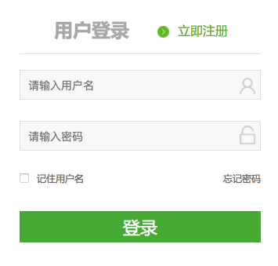
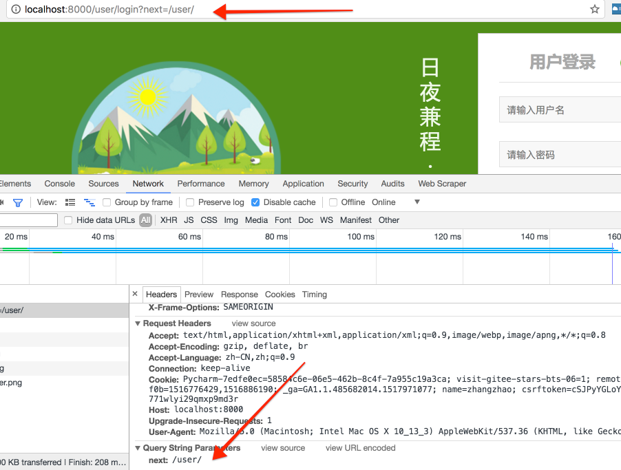
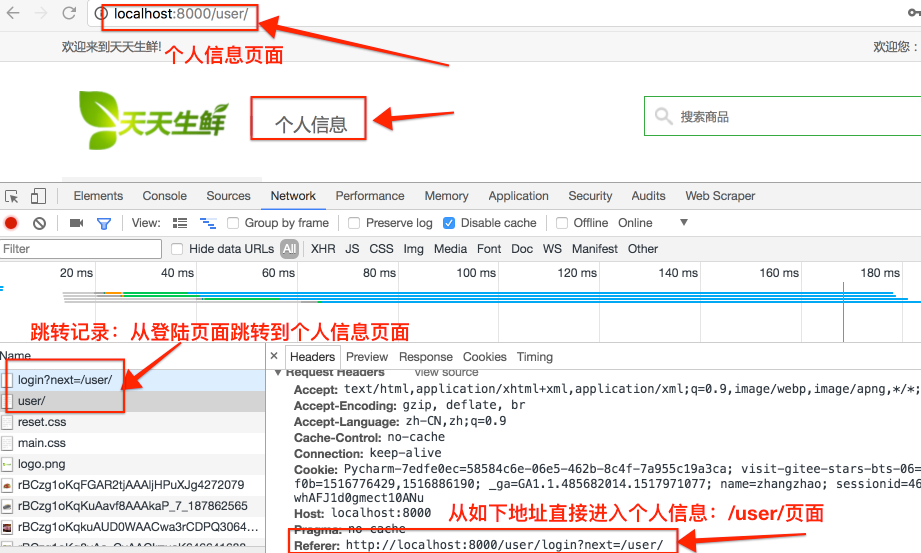

# 6、用户登录

在用户完成注册并激活后，肯定是要登录进入网站浏览或消费的。登录便是第一步。




用户登录分两种请求：

- GET请求，打开登录页面
- POST请求：
  - 登录输入参数校验
  - 登录信息校验
    - 若用户未激活，则告知其未激活，并返回登录页面
    - 若成功跳转首页
      - 若选择了记住用户名，需要设置cookies

这里涉及的知识点有：

- Django的session存储方式
  - 我们选择redis缓存，因此涉及redis缓存配置
- [Django内置认证系统中的web请求中的认证](https://yiyibooks.cn/xx/django_182/topics/auth/default.html)

## 6.1 session配置

在Django中首先要通过中间件来启动session功能：

```python
MIDDLEWARE_CLASSES = (
'django.contrib.sessions.middleware.SessionMiddleware',
)
```

> 使用django-admin命令创建django项目时已默认添加

配置session引擎：

默认情况下，Django 存储会话到我们项目所使用的数据库中（使用`django.contrib.sessions.models.Session`模型）。但是这有时候会比较慢，我们常常需要将session存储到缓存等其他位置。

- 基于数据库的session

  - 需要在`INSTALLED_APPS`中添加`django.contrib.sessions`
  - 然后迁移执行后，session会保存在django-session表中

- 基于缓存的session

  - 一般为了更好的性能，需要使用一个基于缓存的会话后端

  - 有两种模式：

    - 简单缓存会话存储：

      - ```
        设置SESSION_ENGINE 为"django.contrib.sessions.backends.cache" 。此时会话数据将直接存储在你的缓存中。然而，缓存数据将可能不会持久：如果缓存填满或者缓存服务器重启，缓存数据可能会被清理掉。
        ```

    - 持久的会话缓存

      - ```
        设置SESSION_ENGINE为"django.contrib.sessions.backends.cached_db"。它的写操作使用缓存 —— 对缓存的每次写入都将再写入到数据库。对于读取的会话，如果数据不在缓存中，则从数据库读取。
        ```

  - 注：本项目使用基于Redis的缓存存储，可以实现会话数据持久化存储，[官方缓存设置级别](https://yiyibooks.cn/xx/django_182/topics/cache.html)

- 基于文件的session

  - 即会话数据以文件的形式存储

  - 设置session引擎：

    - ```
      设置SESSION_ENGINE为"django.contrib.sessions.backends.file"
      ```

  - 设置文件路径：

    - ```
      设置SESSION_FILE_PATH（它的默认值来自tempfile.gettempdir()的输出，大部分情况是/tmp）来控制Django在哪里存储会话文件。请保证Web 服务器具有读取和写入这个位置的权限。
      ```

- 基于Cookie的session

  - ```
    设置SESSION_ENGINE 为"django.contrib.sessions.backends.signed_cookies"
    ```

  - ```
    会话数据的存储将使用Django 的加密签名工具和SECRET_KEY设置
    ```

本项目settings中配置redis作为session后端及Django缓存：

> django-redis：[http://django-redis-chs.readthedocs.io/zh_CN/latest/#](http://django-redis-chs.readthedocs.io/zh_CN/latest/)

```python
# 需要先安装django-redis
# 设置Django框架的缓存
CACHES = {
    "default": {
        "BACKEND": "django_redis.cache.RedisCache",
        # 设置django缓存的数据保存在redis数据库中
        "LOCATION": "redis://127.0.0.1:6379/5",  # 选用本地的redis的5号数据库
        "OPTIONS": {
            "CLIENT_CLASS": "django_redis.client.DefaultClient",
        }
    }
}

# Django的session存储设置
SESSION_ENGINE = "django.contrib.sessions.backends.cache"
# 设置session信息存储在CACHES配置项default对应的redis中
SESSION_CACHE_ALIAS = "default"
```

> cache其他参数说明：
>
> - TIMEOUT:
>
>   - 缓存的默认过期时间，以秒为单位， 这个参数默认是 300 seconds (5 分钟).
>   - 可以设置TIMEOUT 为 None 这样的话，缓存默认永远不会过期。
>   - 值设置成0造成缓存立即失效。
>
> - OPTIONS：配置缓存库
>
>   - `MAX_ENTRIES`:高速缓存允许的最大条目数，超出这个数则旧值将被删除. 这个参数默认是`300`.
>   - `CULL_FREQUENCY`:当达到`MAX_ENTRIES` 的时候,被删除的条目比率。 实际比率是 `1 / CULL_FREQUENCY`, 所以设置`CULL_FREQUENCY` 为`2`会在达到`MAX_ENTRIES` 所设置值时删去一半的缓存。这个参数应该是整数，默认为 `3`.
>   - 把 `CULL_FREQUENCY`的值设置为 `0` 意味着当达到`MAX_ENTRIES`时,缓存将被清空。某些缓存后端 (`database`尤其)这将以很多缓存丢失为代价,大大*much* 提高接受访问的速度。
>
> - **KEY_PREFIX:**一个会自动列入缓存key值的的字符串。
>
>   **VERSION:**缓存key值生成时使用的版本数字。
>
>   **KEY_FUNCTION：**key值最终生成所使用的方法。


## 6.2 Django认证系统的web请求认证

### 1、认证与登入

在Django内置认证系统中，会使用session和中间件来拦截请求中的request对象到认证系统中。它们在每个请求上提供一个`request.user`属性，表示当前的用户。若当前的用户没有登入，该属性将设置成`AnonymousUser`的一个实例，否则它将是`User`的实例。

我们可以通过`is_authenticated()`来判断用户是否认证，如下伪代码：

```python
if request.user.is_authenticated():
    # Do something for authenticated users.
    ...
else:
    # Do something for anonymous users.
    ...
```

加入我们现在用已认证的用户登录当前会话，如何登入呢？Django提供了`login()`函数来完成，它接受一个`HttpRequest`对象和一个`User`对象，然后利用Django的session框架将用户ID保存到session中。

如下示例：在定义的视图函数`my_view()`完成了用户认证以及用户登入操作。

> 注：当你是手工登入一个用户时，你*必须*在调用[`login()`](https://yiyibooks.cn/__trs__/xx/django_182/topics/auth/default.html#django.contrib.auth.login)之前通过[`authenticate()`](https://yiyibooks.cn/__trs__/xx/django_182/topics/auth/default.html#django.contrib.auth.authenticate)成功地认证该用户。[`authenticate()`](https://yiyibooks.cn/__trs__/xx/django_182/topics/auth/default.html#django.contrib.auth.authenticate)在[`用户`](https://yiyibooks.cn/__trs__/xx/django_182/ref/contrib/auth.html#django.contrib.auth.models.User)上设置一个属性，注意哪个认证后端成功验证了该用户（有关详细信息，请参阅[*后端文档*](https://yiyibooks.cn/__trs__/xx/django_182/topics/auth/customizing.html#authentication-backends)），以及此信息以后在登录过程中需要。

```python
from django.contrib.auth import authenticate, login

def my_view(request):
    username = request.POST['username']
    password = request.POST['password']
    user = authenticate(username=username, password=password)
    if user is not None:
        if user.is_active:
            login(request, user)
            # Redirect to a success page.
        else:
            # Return a 'disabled account' error message
            ...
    else:
        # Return an 'invalid login' error message.
        ...
```

### 2、登出

同样的，登入后就存在用户退出当前登入的操作，即登出，Django提供了`logout()`函数来完成登出操作。它接收一个HttpRequest对象但没有返回值。

> 当调用[`logout()`](https://yiyibooks.cn/__trs__/xx/django_182/topics/auth/default.html#django.contrib.auth.logout)时，当前请求的会话数据将被完全清除。所有存在的数据都将清除。这是为了防止另外一个人使用相同的Web浏览器登入并访问前一个用户的会话数据。

```python
from django.contrib.auth import logout

def logout_view(request):
    logout(request)
```

### 3、只允许登录的用户访问

我们在web设计中，总会有一些页面只允许一个登录的用户去查看这个与用户id对应的页面，如订单信息、地址信息、个人基本信息等。这就需要在访问时先进行登录校验怎么做呢？接下来介绍几种常见的方法。

#### 1）`request.user.is_authenticated()`

我们可以通过认证请求中request.user来限制页面访问，若非已登录，则重定向到登录页面使其登录后再直接返回该页面：

```python
from django.conf import settings
from django.shortcuts import redirect

def my_view(request):
    if not request.user.is_authenticated():
        return redirect('%s?next=%s' % (settings.LOGIN_URL, request.path))
    # ... LOGIN_URL为要跳转的登录页面URL路径
```

或者直接显示一个错误信息：

> 注意，为了提高网站资源利用率，能不传404这样无用的页面占用资源就不传。即像上面那样可以直接跳转登录页面。

```python
from django.shortcuts import render

def my_view(request):
    if not request.user.is_authenticated():
        return render(request, 'myapp/login_error.html')
    # ...
```

#### 2）`login_required装饰器`

```python
# 源码：
def login_required(function=None, redirect_field_name=REDIRECT_FIELD_NAME, login_url=None):
    """
    Decorator for views that checks that the user is logged in, redirecting
    to the log-in page if necessary.
    """
    actual_decorator = user_passes_test(
        lambda u: u.is_authenticated(), # 用户验证匿名函数
        login_url=login_url, # 登录URL路径
        redirect_field_name=redirect_field_name # 默认next参数，可以在此用其它名称。
    )
    if function:
        return actual_decorator(function)
    return actual_decorator

# 使用方法
from django.contrib.auth.decorators import login_required
login_required([redirect_field_name=REDIRECT_FIELD_NAME, login_url=None])
```

从源码中可以很清晰的看出`login_required装饰器`主要完成了几件事：

- 如果用户没有登入，则重定向到[settings.LOGIN_URL](https://yiyibooks.cn/__trs__/xx/django_182/ref/settings.html#std:setting-LOGIN_URL)，并将当前访问的绝对路径传递到查询字符串中。例如：`/accounts/login/?next=/polls/3/`。
- 如果用户已经登入，则正常执行视图。视图的代码可以安全地假设用户已经登入。

> 注：
>
> 1. 默认情况下，在成功认证后用户应该被重定向的路径存储在查询字符串的一个叫做`"next"`的参数中。如果对该参数你倾向使用一个不同的名字，`login_required()`带有一个可选的`redirect_field_name`参数：
>
> ```python
> from django.contrib.auth.decorators import login_required
>
> @login_required(redirect_field_name='my_redirect_field')
> def my_view(request):
>     ...
> ```
>
> 2. 可选的`login_url`参数：即指定那些没有通过检查的用户要重定向至哪里
>
> ```
> from django.contrib.auth.decorators import login_required
>
> @login_required(login_url='/accounts/login/')
> def my_view(request):
>     ...
> ```
>
> 3. 如果你没有指定`login_url`参数，你需要确保`settings.LOGIN_URL`与你的登录视图正确关联。例如，使用默认值，可以添加下面几行到的URLconf中：
>
> ```
> from django.contrib.auth import views as auth_views
> url(r'^accounts/login/$', auth_views.login),
> ```
>
> 4. `settings.LOGIN_URL`同时还接收视图函数名和[*命名的URL模式*](https://yiyibooks.cn/__trs__/xx/django_182/topics/http/urls.html#naming-url-patterns)。

> Django认证系统中还提供了权限认证、以及很多关于认证的通用视图，详情见https://yiyibooks.cn/xx/django_182/topics/auth/default.html

## 6.3 用户登录操作实现

settings配置：

```python
# 指定登录页面对应的url地址
LOGIN_URL = '/user/login'
```

### 1、GET页面视图函数

​	从本章一开始的登录页面可以很清晰的看到，用户登录页面共输入三个参数——username、password、是否记住用户名。因此我们在用户打开登录页面时，即GET请求时，需要以下操作：

- 读取cookies，获取用户之前是否记录了用户名
  - 若记录了，则直接在页面用户名栏显示之前登录的用户名——需要向前端登录模板页面传入获取的用户名，并默认选择记住用户名一栏
  - 若没有记录，则显示正常没有用户名的页面
- 然后再显示页面

```python
# /user/login
class LoginView(View):
    """登录"""

    def get(self, request):
        """显示"""
        # 判断用户是否记住用户名
        username = request.COOKIES.get('username')

        checked = 'checked'
        if username is None:
            # 没有记住用户名
            username = ''
            checked = ''

        # 使用模板
        return render(request, 'login.html', {'username': username, 'checked': checked})
```

### 2、POST视图函数

POST函数需要处理的就是用户点击登录后的操作。在进行POST函数处理逻辑分析之前，我们需要先来分析前端场景和代码：

```html
<form method="post">
                        <input type='hidden' name='csrfmiddlewaretoken' value='3nUbIeNwKhE2hoEFRwq0r60Ywl37wW3Z' />
						<input type="text" name="username" value="" class="name_input" placeholder="请输入用户名">
						<div class="user_error">输入错误</div>
						<input type="password" name="pwd" class="pass_input" placeholder="请输入密码">
						<div class="pwd_error">输入错误</div>
						<div class="more_input clearfix">
							<input type="checkbox" name="remember" >
							<label>记住用户名</label>
							<a href="#">忘记密码</a>
						</div>
						<input type="submit" name="" value="登录" class="input_submit">
					</form>
```

> 其中隐藏的input域为Django为了csrf的要求。

通常，登录页面分这么两种情景：

- 用户直接登录，进入首页
- 用户登录时效已过，从之前的已登录页面访问其他需登录后才可查看的页面时认证失败跳转至登录页面，待登录后又直接跳转回来。
  - 一般将跳转前的页面路径信息设计到登录页面显示时的URL后的next参数中，方便后续直接跳转。

为了满足以上需求，前端在设计时，form表单提交的`action`选项为空，将会默认将表单信息提交到浏览器中的URL地址，这样方便我们传递登录前的页面，旨在合适的登陆后跳转。

接下来我们分析POST函数的处理程序，它需要完成：

- 参数获取：`username、password、是否记住用户名`
- 后端参数初步校验：判断输入是否有效
- 登录校验认证
  - 若用户信息和密码不符，则跳回并告知信息错误
  - 判断用户是否为激活用户，若不是，则告知其需要邮箱激活
  - 若已激活，则登入，然后跳转至next指定的地址
    - 若next为空，则默认跳转首页

```python
from django.contrib.auth import authenticate, login

	def post(self, request):
        """登录校验"""
        # 1.接收参数
        username = request.POST.get('username')
        password = request.POST.get('pwd')
        remember = request.POST.get('remember', None)  # 没有记住用户名则设为None

        # 2.参数校验(后端校验)
        if not all([username, password]):
            return render(request, 'login.html', {'errmsg': '参数不完整'})

        # 3.业务处理：登录校验
        user = authenticate(username=username, password=password)
        if user is not None:
            # 用户名和密码正确
            if user.is_active:
                # 用户已激活
                # 记住用户的登录状态
                login(request, user)

                # 获取用户登录之前访问的url地址，默认跳转到首页
                next_url = request.GET.get('next', reverse('goods:index'))  # None

                # 跳转到next_url
                response = redirect(next_url)  # HttpResponseRedirect

                # 判断是否需要记住用户名
                if remember == 'on':
                    # 设置cookie username
                    response.set_cookie('username', username, max_age=7 * 24 * 3600)
                else:
                    # 删除cookie username
                    response.delete_cookie('username')
                # 跳转到首页
                return response
            else:
                # 用户未激活
                return render(request, 'login.html', {'errmsg': '用户未激活'})
        else:
            # 用户名或密码错误
            return render(request, 'login.html', {'errmsg': '用户名或密码错误'})
```

如下为在用户个人信息页面用户登录时效失效时跳转到登录页面并经登录直接返回个人信息页面的代码运行结果：






## 6.4 用户退出

```python
from django.contrib.auth import logout
# /user/logout
class LogoutView(View):
    """退出"""

    def get(self, request):
        """退出"""
        # 清除用户登录状态,内置的logout函数会自动清除当前session
        logout(request)

        # 跳转到登录
        return redirect(reverse('user:login'))
```

