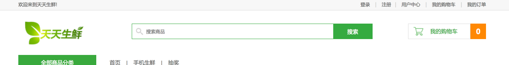
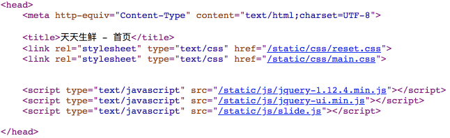
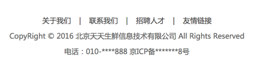
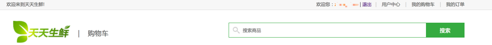
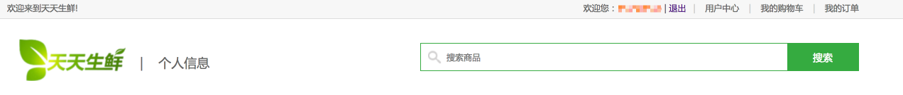
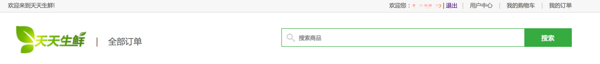
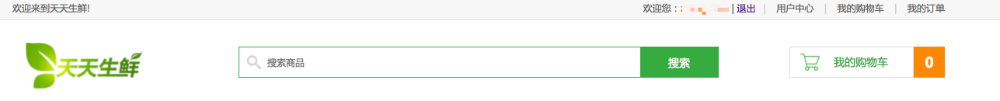

# 7、模板继承建立基模板

所谓模板继承的目的，是为了提高代码复用率，保证开发效率。我们都知道，一个网站总会是一种风格，例如，每页的导航栏、页脚版权等地方基本相同。因此，我们有必要抽取这些页面的相同点实现工作量的简化，否则每个页面都需要重复编写。

抽取原则：

```
1）针对静态index.html，从上向下进行浏览，所有页面都有的内容保留，某些位置每个页面都不相同则预留块。
2）对于大多数页面都相同的内容，也可以放在父模板中，但是要包在块中。
```

在我们的项目实例中，我们需要分析从前端工程师或者自己编写的网站全部静态页面文件进行分析。这里举例：以首页为头开始分析，可以看到首页顶部栏的页面显示除了注册和登录页面外，其他页面均相同。

首页顶部:



所有顶部css与部分页面js：



所有页面底部：



用户中心——购物车顶部：



用户中心——个人信息顶部：



用户中心——全部订单顶部：



商品详情页与商品列表页顶部：



可以看出，抽取并构建基模板非常有必要。

## 7.1 base.html文件建立

通过我们队网站相关页面的分析，我们可以轻松的所有页面相同部分放入`base.html`文件中，并为不同之处留出接口。

我们先来为不同之处创建接口，并产出原前端工程师设计的静态页面对应的相关内容。

- 网页标题块：所有页面都不同

```html
<title></title>
```

- 网页顶部欢迎块：注册和登录页面不需要——它们在继承base模板时直接复写该块为空即可。

```html
{# 网页顶部欢迎信息块 #}

	<div class="header_con">
		<div class="header">
			<div class="welcome fl">欢迎来到天天生鲜!</div>
			<div class="fr">
                
                <div class="login_info fl">
					欢迎您：<em>{{ user.username }}</em>
                    <span>|</span>
					<a href="">退出</a>
				</div>
                
				<div class="login_btn fl">
					<a href="">登录</a>
					<span>|</span>
					<a href="">注册</a>
				</div>
                
				<div class="user_link fl">
					<span>|</span>
					<a href="">用户中心</a>
					<span>|</span>
					<a href="">我的购物车</a>
					<span>|</span>
					<a href="">我的订单</a>
				</div>

			</div>
		</div>		
	</div>

```

- 网页顶部搜索块：用户中心的搜索css不同，需要复写

```html

	<div class="search_bar clearfix">
		<a href="" class="logo fl"></a>
		<div class="search_con fl">
            <form method="get" action="/search">
                <input type="text" class="input_text fl" name="q" placeholder="搜索商品">
                <input type="button" class="input_btn fr" name="" value="搜索">
            </form>
		</div>
		<div class="guest_cart fr">
			<a href="" class="cart_name fl">我的购物车</a>
			<div class="goods_count fl" id="show_count">{{ cart_count }}</div>
		</div>
	</div>

```

- 网页主题内容块：每个页面你都不一样，预留

```html

```

- 底部js操作块：在购物车操作等个别页面需要在底部书写前端js操作，为其预留接口

```html
    {# 网页底部html元素块 #}
    
    {# 网页底部引入文件块 #}
	
```

其他相同的内容保留。这样此基模板便满足了该网站开发中所有页面的共同需求，在开发相应网页时可直接继承，不需要再去书写。

## 7.2 base_detail_list.html文件建立

在一开始我们看到商品详情页和商品列表显示页的部分内容是相同的，因此我们也可以为它们再构建一个共同的基模板。

首先，我们继承最根本的基模板`base.html`。

```
{# 详情页 列表页 #}

```

其次，我们复写这两个文件之间相同的部分：

- 由于重复内容在base文件的body块内，因此复写此块
- 在body块中，两个网页仅仅有一部分相同，其他不同的地方需要预留接口块。

```html

    <div class="navbar_con">
		<div class="navbar clearfix">
			<div class="subnav_con fl">
				<h1>全部商品分类</h1>
				<span></span>
				<ul class="subnav">
					
					<li><a href="" class="{{ type.logo }}">{{ type.name }}</a></li>
					
				</ul>
			</div>
			<ul class="navlist fl">
				<li><a href="">首页</a></li>
				<li class="interval">|</li>
				<li><a href="">手机生鲜</a></li>
				<li class="interval">|</li>
				<li><a href="">抽奖</a></li>
			</ul>
		</div>
	</div>
    {# 详情页 列表页主体内容块 #}
    

```

## 7.3 base_no_cart.html建立

在购物车页面、提交订单页面、用户中心页面均没有购物车，因此可以考虑为它们建立共同的基模板`base_no_cart.html`。

同样，继承与base模板，然后复写与base不同之处和这些页面相同之处，若需要额外的不同内容接口，则创建之。

```html


{# 网页顶部搜索框块 #}

	<div class="search_bar clearfix">
		<a href="" class="logo fl"></a>
		<div class="sub_page_name fl">|&nbsp;&nbsp;&nbsp;&nbsp;</div>
		<div class="search_con fr">
            <form method="get" action="/search">
                <input type="text" class="input_text fl" name="q" placeholder="搜索商品">
                <input type="button" class="input_btn fr" name="" value="搜索">
            </form>
		</div>
	</div>

```

## 7.4 base_user_center.html建立

一开始，我们就看到了用户中心下面的几个网页页面大部分是相同的，我们应当考虑为它们建立基模板文件`base_user_center.html`。

```html
{# 用户中心-3页面 #}

天天生鲜-用户中心
用户中心

    <div class="main_con clearfix">
		<div class="left_menu_con clearfix">
			<h3>用户中心</h3>
			<ul>
				<li><a href="" class="active">· 个人信息</a></li>
				<li><a href="" class="active">· 全部订单</a></li>
				<li><a href="" class="active">· 收货地址</a></li>
			</ul>
		</div>
        {# 用户中心右侧内容块 #}
		
	</div>

```

> 其他页面均继承于以上四个模板，不再详细讲述。