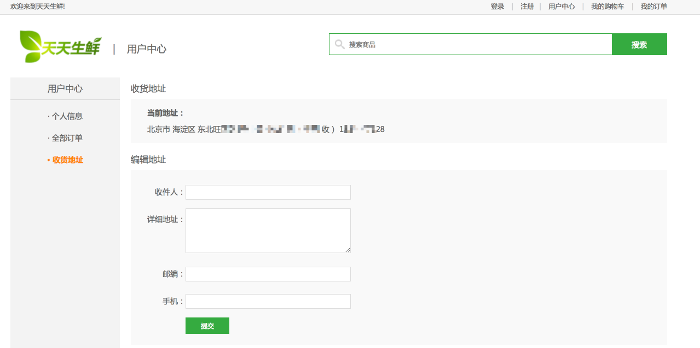

# 8、用户中心页——地址页



上图为前端工程师提供的用户中心地址页的静态页面。可以看到，为了显示该页面，我们需要显示用户账户名、查询地址表获取默认收货地址和所有地址、并且可以添加编辑地址。

很明显，地址页显示分为get和post请求两种：

- get请求在判断用户登录状态后查询数据库中的地址表，获取当前登录用户的默认地址和所有地址并返回给前端模板。
- post请求添加新地址，需要向数据库中的地址表增加新行
  - 若新增地址为默认地址`is_default`则需要将原先的地址修改为非默认地址
  - 若新增地址为普通地址则原先存在的地址不作变更。

## 8.1 URL配置

```python
# /user/address

url(r'^address$', AddressView.as_view(), name='address'),  # 用户中心-地址页
```

## 8.2 GET请求处理

处理逻辑：

- 登录校验
- 获取登录用户
- 查询地址表`df_address`获取默认地址和所有地址
- 组织上下文模板
- 返回响应

> 此处登录校验采用Django内置的认证系统来完成，即login_required。
>
> ```python
> from django.contrib.auth.decorators import login_required
> ```
>
> 源码直接继承与用户登录模块讲解的自定义类LoginRequiredMixin
>
> 注：此处使用login_required有几种方式：
>
> - 若视图处理为视图函数，则直接使用`login_required`装饰即可
>
> ```python
> @login_required
> def my_view(request):
>     ...
> ```
>
> - 若为类视图：
>
>   - 直接在urls文件中装饰类，如：
>
>   ```python
>   url(r'^$', login_required(UserInfoView.as_view()), name='user'), # 用户中心-信息页
>
>   # ——————————————————————
>   class UserInfoView(View):
>       pass
>   ```
>
>   - 自定义登录校验类，然后类视图继承该类和类View(本项目使用该方法)：
>
>   ```python
>   class UserInfoView(LoginRequiredMixin, View):
>   	pass
>
>   # 自定义登录校验类代码：
>   from django.contrib.auth.decorators import login_required
>   # 注意类的多继承时的父类方法调用顺序，代码中的as_view方法在实际的自定义类视图中其实会调用它的第二个父类View中的as_view方法，因此如下代码不会出错。父类方法调用顺序可使用魔法方法__mro__查看。
>   class LoginRequiredMixin(object):
>       @classmethod
>       def as_view(cls, **initkwargs):
>           # 使用super调用as_view
>           view = super().as_view(**initkwargs)
>
>           # 调用login_required装饰器函数
>           return login_required(view)
>   ```
>
>   - 自定义登录校验类视图，然后类视图继承该类视图：
>
>   ```python
>   class UserInfoView(View):
>       pass
>
>   # 自定义登录校验类视图代码：
>   from django.views.generic import View
>   from django.contrib.auth.decorators import login_required
>
>   class LoginRequiredView(View):
>       @classmethod
>       def as_view(cls, **initkwargs):
>           # 调用View类中as_view
>           view = super().as_view(**initkwargs)
>
>           # 调用login_required装饰器函数
>           return login_required(view)
>   ```

```python
    def get(self, request):
        """显示"""
        # 获取登录用户user
        user = request.user
		# 默认地址
        default_address = Address.objects.get_default_address(user)
		# 所有地址
        all_address = Address.objects.get_all_address(user)

        # 组织模板上下文
        context = {
            'address': default_address, 
            'have_address': all_address,
            'page': 'address' # 模板继承中的title区分
        }

        # 使用模板
        return render(request, 'user_center_site.html', context)
```

## 8.3 POST请求处理

处理逻辑：

- 获取用户输入的地址参数
- 校验参数是否合格（无论前端是否校验，后端视图处理都应该校验）
- 获取当前登录用户
- 添加地址
  - 进行默认地址判断
- 返回应答，并刷新页面

```python
    def post(self, request):
        """地址添加"""
        # 接收参数
        receiver = request.POST.get('receiver')
        addr = request.POST.get('addr')
        zip_code = request.POST.get('zip_code')
        phone = request.POST.get('phone')

        # 参数校验
        if not all([receiver, addr, phone]):
            return render(request, 'user_center_site.html', {'errmsg': '数据不完整'})

        # 校验手机号

        # 业务处理：添加收货地址
        # 如果用户已经有默认地址，新添加的地址作为非默认地址，否则作为默认地址
        # 获取登录用户user
        user = request.user
        # try:
        #     address = Address.objects.get(user=user, is_default=True)
        # except Address.DoesNotExist:
        #     address = None

        address = Address.objects.get_default_address(user)

        is_default = True
        if address is not None:
            is_default = False

        # 添加收货地址
        Address.objects.create(user=user,
                               receiver=receiver,
                               addr=addr,
                               zip_code=zip_code,
                               phone=phone,
                               is_default=is_default)

        # 返回应答，刷新地址页面
        return redirect(reverse('user:address'))
```

## 8.4 模板处理

1) 此页继承与模板`base_user_center.html`

```

```

2) 页面主题显示

```
收货地址
```

3）复写`right_content`块

- 默认地址显示

```html
				
                    <div class="site_con">
					<dl>
						<dt>当前默认地址信息：</dt>
						<dd>地 址: {{ address.addr }}</dd>
                        <dd>收件人: {{ address.receiver }}</dd>
                        <dd>收件电话: {{ address.phone }}</dd>
					</dl>
				</div>
                
				    <div class="site_con">
					<dl>
						<dt>默认地址：</dt>
						<dd>您目前暂无默认地址</dd>
					</dl>
				</div>
                
```

- 所有地址显示

```html
						
                            
                            <hr />
                            <dd>地 址: {{ every_address.addr }}</dd>
                            <dd>收件人: {{ every_address.receiver }}</dd>
                            <dd>收件电话: {{ every_address.phone }}</dd>
                            
                        
                            <dd>您目前暂无收货地址</dd>
                        
```

- 添加地址表单提交路径配置

```Html
<form action="" method="post">
     
    {# 前端表单代码所在位置 #}
</form>
```

- 其他：`左侧收货地址`显示橘红色，需要修改`base_user_center.html`

```html
<ul>
				<li><a href="" class="active">· 个人信息</a></li>
				<li><a href="" class="active">· 全部订单</a></li>
				<li><a href="" class="active">· 收货地址</a></li>
			</ul>
```

## 8.5 效果展示


