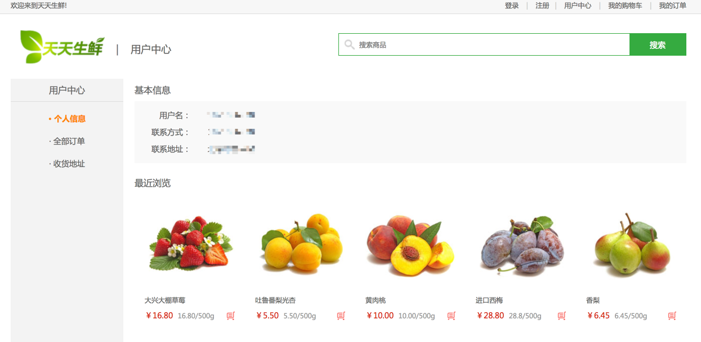

# 9、用户中心页——个人信息与浏览记录



可以看到，本页包含两部分，第一部分为用户的基本信息，第二部分为用户最近浏览的五个产品。除此之外，本页只有get请求。

## 9.1 URL配置

```python
url(r'^$', UserInfoView.as_view(), name='user'),  # 用户中心-信息页
```

## 9.2 类视图代码实现

```python
class UserInfoView(LoginRequiredMixin, View): #父类参见用户中心页-地址页讲解
    """用户中心-信息页"""

    def get(self, request):
    	# do something
```

### 1、用户基本信息获取

```python
		# 获取登录用户
        user = request.user

        # 获取用户的默认收货地址
        address = Address.objects.get_default_address(user)
```

### 2、获取用户最近浏览的商品信息

我们在设计时是这样存储用户浏览记录的：

- 当用户点击**商品详情**时，向redis中的**List类型**数据键为用户id的数据写入此**商品id**，持续保证redis里面存储的为最新浏览的五个商品。具体代码见**商品详情页的详情页视图处理**。
  - key: `history_用户id`
  - value：列表[商品id1、商品id2、商品id3、...]
  - 示例：`history_1:[1,2,3,4,5]`

当用户访问用户中心个人信息页面时，需要展示浏览记录，即需要在个人信息视图处理中进行数据获取并处理显示。一般可浏览记录可以存储在文件、mysql、redis中，这里选择redis（用户浏览记录时频繁操作的数据，建议放在redis这种内存型数据库）。

在用户信息视图处理中的获取浏览逻辑为：

- 连接redis

  > `django_redis`操作说明详见[点击链接](http://django-redis-chs.readthedocs.io/zh_CN/latest/)

```python
from django_redis import get_redis_connection

conn = get_redis_connection('default')
```

> ```PYTHON
> # 若采用redis第三包交互时
> from redis import StrictRedis
> conn = StrictRedis(host='172.16.179.142', port=6379, db=5)
> ```

- 获取最新浏览的商品id

  > 我们约定redis里关于浏览记录的键名为`history_用户id`

```python
# 拼接key
history_key = 'history_%d' % user.id

# lrange(key, start, stop) 返回是列表
# 获取用户最新浏览的5个商品的id
sku_ids = conn.lrange(history_key, 0, 4) # [1, 3, 5, 2]
```

- 根据商品id查询数据库，并将相应的商品数据存入一个列表

```python
skus = []
for sku_id in sku_ids:
   # 根据商品的id查询商品的信息
   sku = GoodsSKU.objects.get(id=sku_id)
   # 追加到skus列表中
   skus.append(sku)
```

- 将数据返回给模板

```python
# 组织模板上下文
        context = {
            'address': address,
            'skus': skus,
            'page': 'user' 
        }
```

- 返回响应

```python
 return render(request, 'user_center_info.html', context)
```

