# 10、分布式存储商品图片

正如在网站服务器部署方案发展中提到的那样，一般将上传文件进行分布式存储。我们这里示例将网站内所有商品图片通过FastDFS上传至分布式存储。

> 为了方便操作，笔者将数据库要插入的数据和上传至FastDFS中的图片文件已放置github，若读者的数据表和实例完全吻合，可直接导入插入数据。图片文件请直接拷贝复制到自己相应的路径。

## 10.1 什么是FastDFS

FastDFS 是用 c 语言编写的一款开源的分布式文件系统。FastDFS 为互联网量身定制， 充分考虑了冗余备份、负载均衡、线性扩容等机制，并注重高可用、高性能等指标，使用 FastDFS很容易搭建一套高性能的文件服务器集群提供文件上传、下载等服务。

FastDFS架构包括 Tracker server 和 Storage server。客户端请求Tracker server 进行文件上传、下载，通过Tracker server 调度最终由Storage server 完成文件上传和下载。

**Tracker server 作用**是负载均衡和调度，通过 Tracker server 在文件上传时可以根据一些 策略找到 Storage server 提供文件上传服务。可以将 tracker 称为追踪服务器或调度服务器。 

**Storage server 作用**是文件存储，客户端上传的文件最终存储在 Storage 服务器上， Storageserver 没有实现自己的文件系统而是利用操作系统 的文件系统来管理文件。可以将storage称为存储服务器。

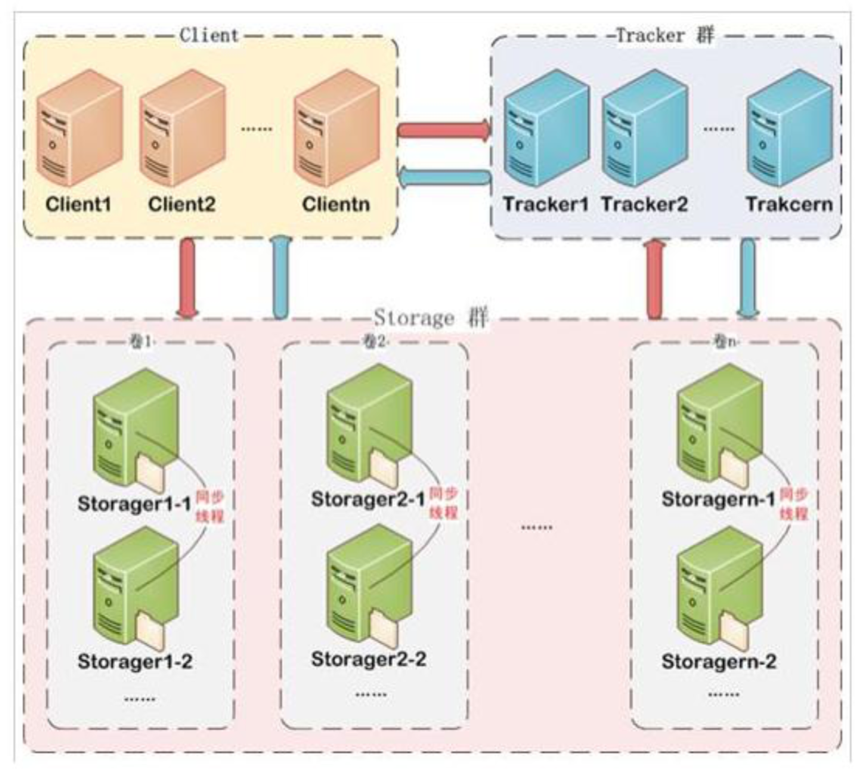

服务端两个角色: 

- Tracker:管理集群，tracker 也可以实现集群。每个tracker节点地位平等。收集 Storage 集群的状态。 


- Storage:实际保存文件 。Storage 分为多个组，每个组之间保存的文件是不同的。每 个组内部可以有多个成员，组成员内部保存的内容是一样的，组成员的地位是一致的，没有主从的概念。

## 10.2 文件上传流程

客户端上传文件后存储服务器将文件 ID 返回给客户端，此文件 ID 用于以后访问该文件的索引信息。文件索引信息包括:组名，虚拟磁盘路径，数据两级目录，文件名。

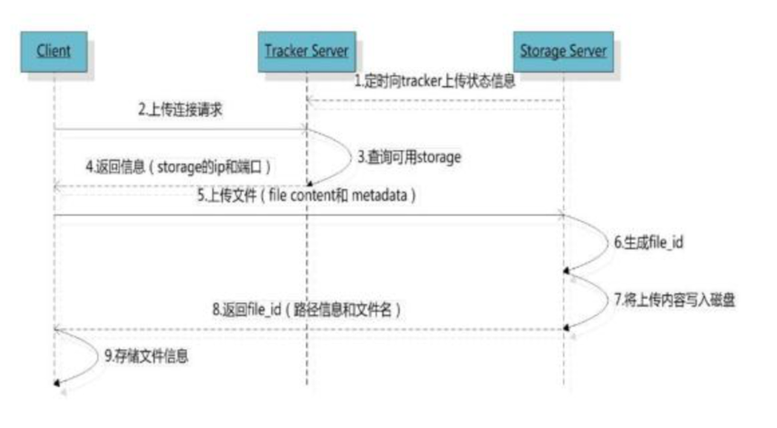


- 组名:`group1`
  - 文件上传后所在的 storage 组名称，在文件上传成功后有 storage 服务器返回， 需要客户端自行保存。 


- 虚拟磁盘路径:`/M00`
  - storage 配置的虚拟路径，与磁盘选项store_path*对应。如果配置了 store_path0 则是 M00，如果配置了 store_path1 则是 M01，以此类推。 


- 数据两级目录:`/02/44/`
  - storage 服务器在每个虚拟磁盘路径下创建的两级目录，用于存储数据文件。 


- 文件名:`wKgDrE34E8wAAAAAAAGkEIYJK42378.sh`
  - 与文件上传时不同。是由存储服务器根据特定信息生成，文件名包含:源存储 服务器 IP 地址、文件创建时间戳、文件大小、随机数和文件拓展名等信息。

## 10.3 文件下载流程

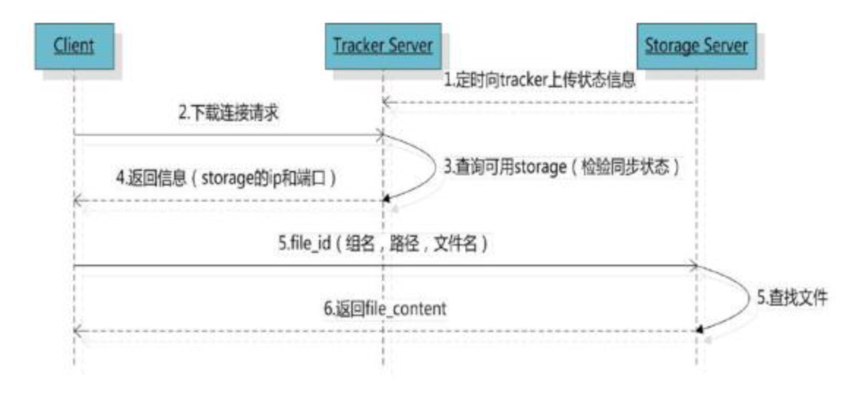

## 10.4 简易FastDFS系统

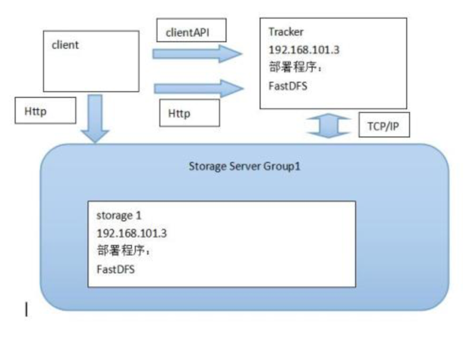


## 10.5 项目上传图片和使用图片流程

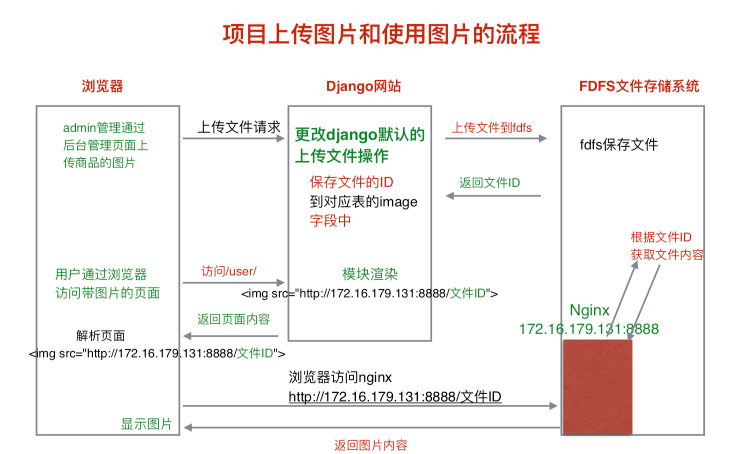

> 启动命令：
>
> ```
> sudoservice fdfs_trackerd start
> sudoservice fdfs_storaged start
> ```
>
> 上传文件：
>
> ```
> fdfs_upload_file /etc/fdfs/client.conf 要上传的图片文件 
> ```
>
> python上传：
>
> ```python
>  pip install fdfs_client-py-master
>  from fdfs_client.client import Fdfs_client
>  client = Fdfs_client('/etc/fdfs/client.conf')
>  ret = client.upload_by_filename('test')
> ```
>
> 具体配置以及所需要的nginx配置请读者自行查找资料操作。

## 10.6 Django自定义存储类

我们需要修改Django默认的admin管理中的上传文件操作，将其与我们搭建的FastDFS系统连接。

在自定义存储类前，我们先来了解下Django如何自定义存储类，点击链接查看官方文档——[编写自定义存储类](https://yiyibooks.cn/xx/django_182/howto/custom-file-storage.html)。

我们在这里简要的列出自定义存储类的一些要点。

### 自定义存储类要点

- 目的：

  - 如果需要提供自定义文件存储 ： 一个普遍的例子是在某个远程系统上储存文件，我们可以通过定义一个自定义的储存类来实现。

- 自定义存储类的要求：

  - 必须是`django.core.files.storage.Storage`的子类

  ```python
  from django.core.files.storage import Storage

  class MyStorage(Storage):
      ...
  ```

  - 必须能够被Django在不带任何参数时就可以实例化自定义的存储类，也就是说，远程文件系统的相关默认配置必须在`django.conf.settings`中设置并由自定义存储类在初始化时获取。

  ```python
  from django.conf import settings
  from django.core.files.storage import Storage

  class MyStorage(Storage):
      def __init__(self, option=None):
          if not option:
              option = settings.CUSTOM_STORAGE_OPTIONS
          ...
  ```

  - 自定义存储类必须实现`_open() `、`_save()`方法，以及其他适合的方法：
    - `_open(name, mode='rb')`
      - 被`Storage.open()`调用，这是储存类用于打开文件的实际工具。
    - `_save(name, content)`
      - 被`Storage.save()`调用。`name`必须事先通过`get_valid_name()` 和 `get_available_name()`过滤，并且`content`自己必须是一个`File`对象。
      - 应该`返回被保存文件的真实名称`（通常是传进来的`name`，但是如果储存需要修改文件名称，则返回新的名称来代替）。
    - `exists(name)`
      - 如果提供的名称所引用的文件在文件系统中存在，则返回`True`，否则如果这个名称可用于新文件，返回`False`。
    - `url(name)`
      - 返回URL，通过它可以访问到`name`所引用的文件。对于不支持通过URL访问的储存系统，抛出`NotImplementedError`异常。

## 项目中的admin上传文件自定义存储类实现

#### 1、settings配置参数：

指定FastDFS系统的客户端配置文件路径、保存文件的自定义存储类、FastDFS系统服务器Nginx的ip和port

```python
# 指定Django保存文件使用的文件存储类(自定义存储类的路径)
DEFAULT_FILE_STORAGE = 'utils.fdfs.storage.FDFSStorage'

# 指定FDFS客户端配置文件的路径
FDFS_CLIENT_CONF = os.path.join(BASE_DIR, 'utils/fdfs/client.conf')

# 指定FDFS系统中Nginx的ip和port(笔者在一台配置好FDFS的linux环境中实现该功能演示，如下为该环境Nginx服务器的配置ip以及配置的端口号)
FDFS_NGINX_URL = 'http://172.16.110.128:8888/'
```

其中`client.conf`中需要配置的选项为：

```python
# the base path to store log files 日志文件路径
base_path=/Users/xxx/Desktop/log

# tracker_server can ocur more than once, and tracker_server format is
#  "host:port", host can be hostname or ip address
# 自己tracker_server的ip地址:22122
tracker_server=172.16.110.128:22122
```

> 注：
>
> 所键自定义类文件夹目录如下：
>
> ```python
> utils  # utils包置于项目根目录
> ├── __init__.py
> ├── fdfs
> │   ├── __init__.py
> │   ├── client.conf #  fdfs客户端配置文件
> │   └── storage.py # 自定义存储类文件
> ```

#### 2、自定义存储类代码实现：

```
# Django默认保存文件时，会调用Storage类中的save方法
# Storage类中的save方法会调用DEFAULT_FILE_STORAGE配置项指定的类中_save方法
# _save方法的返回值最终会保存在表的image字段中

# Django保存文件之前，会调用DEFAULT_FILE_STORAGE配置项指定的类中exists方法
# 判断文件在系统中是否存在，防止同名的文件被覆盖
```

因此我们需要复写`_save`方法和`exists`方法，由于我们还需要图片地址，因此还需定义`url`方法

```python
from django.core.files.storage import Storage # 自定义存储类需继承于Storage
from django.conf import settings # 导入settings用于获取设置的一些配置参数
from fdfs_client.client import Fdfs_client  # 导入Fdfs_client用于存储操作

class FDFSStorage(Storage):
    """fast DFS文件存储类"""
    def __init__(self, client_conf=None, nginx_url=None):
        """初始化"""
        if client_conf is None:
            client_conf = settings.FDFS_CLIENT_CONF # 指向'utils/fdfs/client.conf'

        self.client_conf = client_conf

        if nginx_url is None:
            nginx_url = settings.FDFS_NGINX_URL  # 指向'http://172.16.110.128:8888/'

        self.nginx_url = nginx_url
    
    def _save(self, name, content):
        """保存文件时调用"""
        # name: 上传文件的名称 a.txt
        # content: File类的对象，包含了上传文件的内容

        # 上传文件到FDFS文件存储系统
        client = Fdfs_client(self.client_conf)
        # 获取上传文件内容
        file_content = content.read()
		# 上传文件
        response = client.upload_by_buffer(file_content)
        if response is None or response.get('Status') != 'Upload successed.':
            # 上传失败
            raise Exception('上传文件到fast dfs系统失败')

        # 获取保存文件id
        file_id = response.get('Remote file_id')

        # 返回file_id
        return file_id
    def exists(self, name):
        """判断文件是否存在"""
        return False  # 我们演示默认文件不存在。

    def url(self, name):
        """返回可访问到文件的url地址，此地址在模板中可被通过sku.images.url进行获取"""
        # return 'http://172.16.110.128:8888/' + name
        return self.nginx_url + name
```

#### 3、项目使用示例：

Fast DFS启动：

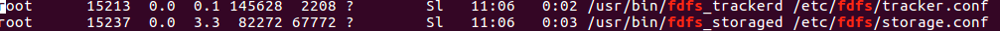

Fast DFS的Nginx服务器启动：

Nginx配置：

    server {
        listen       8888; # 图片路径的端口
        server_name  localhost;
        # 根据fdfs上传文件路径特点：group1/M00/00/00/XSXSXSXSXS
        location ~/group[0-9]/ { 
            ngx_fastdfs_module;
        }
        error_page  500 502 503 504 /50x.html;
        location = /50x.html {
            root html;
        }
    }


笔者已通过之前介绍的方式，提前将相关图片上传至Fast DFS系统，这里仅演示通过浏览器获取图片。笔者通过MAC的浏览器来按照以Fast DFS系统指定的方式来下载图片。

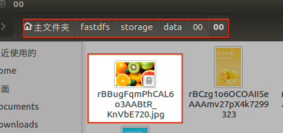

在浏览器中访问如下地址：

`http://172.16.110.128:8888/group1/M00/00/00/rBBugFqmPhCAL6o3AABtR_KnVbE720.jpg`

可以得到如下响应：

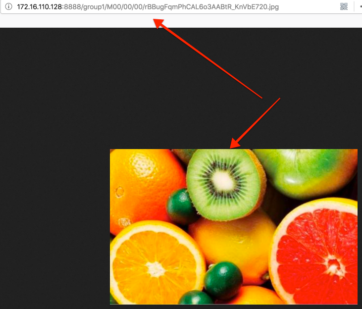

在admin中注册了相应模型类后均可通过自定义存储类将相关图片文件存储到笔者搭建的Fast DFS中，如下图所示：


至此，待图片全部上传完成后，通过将首页模板图片链接位置修改后均可远程获得相应的图片。具体见首页代码实现一章节。

```html

```

> 可能出现的问题：
>
> ```
> 导入Fdfs_client时如果提示缺少mutagen和requests模块，需要安装。
>   pip install mutagen
>   pip install requests
> ```

> <font color=blue>知识拓展：</font>【转载】
>
> # 2 典型DFS及其数据分布
>
> ## 2.1 Lustre
>
> ### 2.1.1系统架构
>
> ​         Lustre是个人最早接触的一个分布式文件系统，其给我留下最深刻的映象就是“无与伦比”的快，其存储速度是我见过用过的分布式文件系统中最快的。
>
> 先来张Lustre文件系统的架构图：
>
> 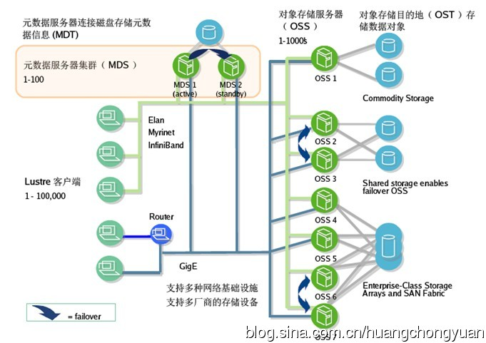
>
> 图2.1.1 Lustre架构图
>
> 从架构图中，我们可以看出Lustre是典型的元数据中心式的分布式文件系统，其元数据服务器为MDS，用于存储文件的元数据信息，OSS服务器用于存储实际的文件数据。Lustre支持常规以太网，也支持快速的IB网络。
>
> ​         从结构上看，MDS支持active-standy支持主备切换，OSS也支持failover，但实际上MDS的主备配置及OSS的故障恢复远没有想象中的好用。其主备配置也好，failover也好只是支持服务器级别的切换，其底层真正用于存储对象结构MDT及OST是不支持主备及故障恢复的。一般底层对象存储会采用共享存储的方式来支持MDS的active-standy、OSS的failover。但是这种配置不但会影响性能，配置起来复杂，安全性也没有想象中高，只要共享存储层出现故障，整个系统将无法正常使用。
>
> ### 2.1.2数据分布方式
>
> ​         Lustre支持两种数据分布方式，文件单个整体存储及文件分片(stripe)存储两种方式。
>
> ​         首先是文件整体存储，文件以单个文件的形式存储在OST中，不进行任何的数据分片、纠删码设置及checksum(校验)设置等操作，这是一种比较常见的数据分布方式。
>
> ​         Lustre还支持文件分片存储，也就是常说的stripe方式，很多DFS会提供这么一种数据分布方式。
>
> Lustre支持目录级的Stripe存储，即可以通过设置指定某个子目录的Stripe相关设置，包括Stripe_count、Stripe_size、Stripe_ost。Stripe_size指定子目录下的文件分片大小；Stripe_count指定选择OST个数，即分片分布在多少个OST上；Stripe_ost指定起始存储OST位置，系统默认为-1,即由MDS根据剩余容量及负载选择初始OST，否则从指定的OST开始分片存储。
>
> 具体设置如下：
>
> lfs setstripe -s Stripe_sizeM -c Stripe_count /mnt/SubDir
>
> //Stripe_size必须为page_size的整数据倍X*64KB
>
> //Stripe_count小于等于OST数
>
> 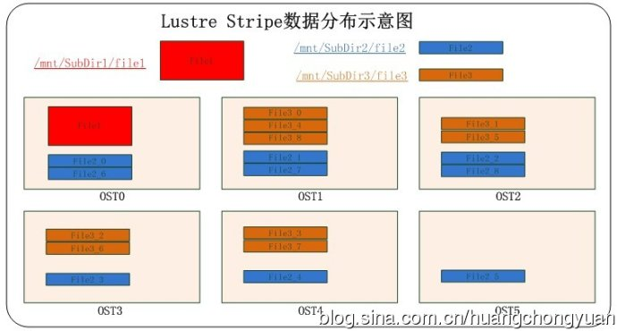
> 图2.1.2 Lustre Stripe数据分布示意图
>
> 如图示例：Lustre存储由6个OST提供对象存储空间。/mnt/SubDir1目录未进行Stripe处理，该目录下file1以文件的形式存储在单个OST中，例如存储在OST0中；/mnt/SubDir2目录设置Stripe_count=6，则如图所示，Stripe_size大小的数据分别在6个OST中分布，且按照数据顺序轮询合并；/mnt/SubDir3与SubDir2情形相似，Stripe_count=5。
>
> ### 2.1.3系统优缺点
>
> Lustre可以设置具体子目录的Stripe参数，这种方式比较灵活，可以根据文件大小进行合适的Stripe目录设置。并且Stripe的数据分布方式比文件整体存储高效，无论是文件读还是写。
>
> Lustre是基于内核级的分布式文件系统。其文件的读写性能在分布式文件系统是比较快的(目前个人使用过，测试过的DFS中是最快的，其他分布式文件系统拍马难及)。鉴于其性能及其强悍的扩展性，多数用于高性能计算中。高性能，这正是Lustre最大的亮点。
>
> 在某种角度上说，Lustre基本不提供数据的保护，无论是数据冗余保护，还是数据的纠删保护，还是数据校验保护等等；当然，同样，其元数据也存在单点问题。这是Lustre的一大弱点。
>
> ## 2.2 HDFS 
>
> ### 2.2.1系统架构
>
> ​         HDFS，或者说Hadoop大家会了解多些。其实对于hadoop，个人了解的并不是很多，只是接触过一些相关的培训及进行过相关的了解使用，并不是特别的熟悉(正在一步一步的研究他呢)。所以，要是有不对的地方，欢迎大家指正。
>
> ​         先给大家上个架构图：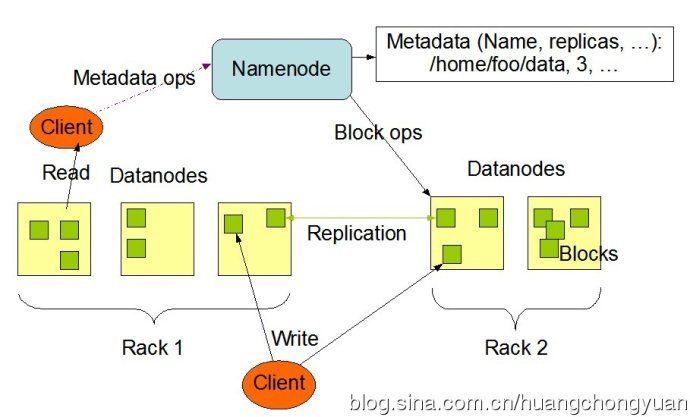
>  图2.2.1 HDFS架构图
>
> ​         相信很多人会很熟悉这张hdfs的架构图。如图所示，HDFS由两部分组成，一部分是负责元数据存储的Namenode，一部分是负责实际存储数据的Datanodes。Namenode是一个中心服务器，负责管理文件系统的名字空间、负责文件数据块的组织及处理客户端对数据的访问；而Datanode则是一般是一个节点一个，负责管理其所在节点的数据存储。
>
> ​         最新版本的HDFS会支持一个备用的Namenode，负责定时的备份Namenode上的持久化的元数据信息，但实际上HDFS依然存在单点问题(熟悉MFS架构的朋友会发现，这种架构方式与MFS是如此的相似，又是如此的没用)。
>
> ### 2.2.2数据分布方式
>
> ​         HDFS只支持数据分块的方式存储，默认的数据块大小为64MB。其与一般的Stripe存储方式不同(参考Lustre Stripe存储)，其会把文件分成一个个64MB大小的数据块，在Datanodes存储着一个个的64MB大小的数据块而不是数据块的集合。
>
> HDFS支持文件存储时创建副本，用于保证数据的安全性。并且系统保证文件的数据块的副本块不会出现在同一个Datanode上，避免某个Datanode失效时，文件无法访问。并且HDFS可以支持多个副本。
>
> 如下图所示：
>
> [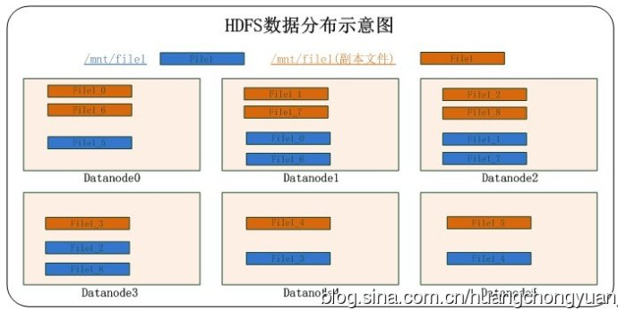
> 图2.2.2 HDFS数据分布图
>
> 副本数据块与原数据块不在同一个datanode中，这种方式保证了任何一个datanode失效，都有其他datanode上的副本数据块进行替换，从而保证了数据的安全性。
>
> 在HDFS的文件实际存储节点Datanodes中，数据块是以单独的文件块存在，而不是与Lustre那样将数据块轮询合并(对比Lustre数据分布图)。
>
> HDFS在数据分布中，最特别的是其对数据的校验。在存储文件时，HDFS会为每一个64MB的数据块创建一个对应的**checksum**，用于文件访问时对数据块的校验。这在分布式文件系统中是很不常见的。
>
> 文件在HDFS中是以私有格式存储的，只能通过系统的API进行访问。
>
> ### 2.2.3系统优缺点
>
> ​         HDFS作为存储本身来说，没有多少存储优势。例如其系统本身并不支持标准的POSIX接口，文件需要以专门的数据操作API进行文件数据操作，这在通用存储中是很不方便的方式；在性能上，其存储并没有显著的优势，其为每一个数据块创建一个checksum，虽然在数据安全性上提高了，在某种程度上说会降低其存储效率；其元数据处理方式，即将元数据加载在内存中，这种方式可以说是优点，即提高了客户端与元数据及存储节点与元数据的交互效率，但是由于内存的扩充限制，这会导致其规模扩充受阻(这点与MFS又是极其相似)。所以就目前来说，很少人会将HDFS单纯用于存储的。
>
> ​         然而，就目前研究热度来说，hadooop绝对是首屈一指的。HDFS其优势在于以其为基础的一系列衍生架构，就是大家所说的hadoop生态环境，包括Nosql数据库系统HBase，Sql操作化的Hive，及数据仓库Pig等等。Hadoop在批处理上有着无与伦比的优势，所以，配合其衍生架构，大多数人将其用于数据挖掘数据分析等。 
>
> ## 2.3 MooseFS
>
> ### 2.3.1系统架构
>
> ​         MFS主要由四部分组成，元数据服务器Master、元数据日志服务器Metalogger、数据存储服务器chunkservers、及挂载客户端client。
>
> 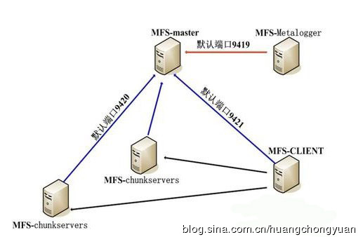
> 图2.3.1 MFS架构图
>
> 如图所示，其架构与一般的元数据中心化的分布式文件系统架构相似，多出来不同之处在于Metalogger即元数据日志服务器的增加(这是1.5.X版本之后添加的组件)。该部分组件用于定时备份Master上的元数据文件及Master使用期间产生的changelog文件。在元数据服务器当机的情况下，可以通过Metalogger上的元数据文件及changelog文件来恢复元数据，并且可以通过修复元数据及修改Metalogger的IP方式来替换当机的Master。
>
> ### 2.3.2数据分布方式
>
> ​         MFS支持两种数据分布方式，一种是常规的以文件为单位的存储；另一种就是分块存储。
>
> ​         MFS的分块存储与HDFS的分块相似，以64MB的数据块分别存储在不同的chunkserver中，并且不进行数据块再次合并存储。其实MFS与HDFS有很多相似的地方，之前所说的文件分块方式，其元数据在系统启动时置于内存的方式及添加日志服务器来备份元数据的方式等。但HDFS的数据是以私有格式存储，不支持POSIX标准协议的访问，这点是不同的，其次MFS的数据块不进行创建校验值(checksum)，这样做，降低了一定的数据安全性，但是提高了副本方式的存储效率。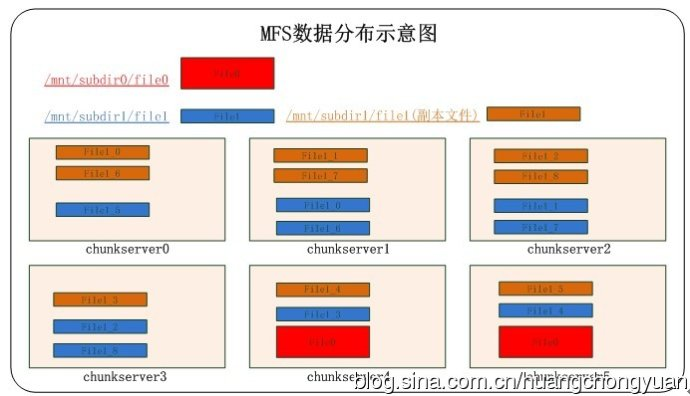
> 图2.3.2 MFS数据分布图
>
> ​         如图所示，可以看出MFS的两种数据存储方式，此外，MFS还支持多数据副本，其副本的设置是是根据目录进行设置的，即设置目录内的文件为副本方式存储。以目录为单位，设置比较灵活。单文件存储方式的副本存储在另一个chunkserver中，而以数据块存储的方式，在保证副本块不在同一个chunkserver中，如此，则能保证chunkserver不会出现单点问题。
>
> ### 2.3.3系统优缺点
>
> ​         由于MFS机制中，在系统启动时会将元数据缓存在内存中，这种方式在某种程度上提高了chunkserver与master的交互效率，但是，同样，由于内存扩充的局限性，这会导致MFS的扩展容易出现限制。根据官方说法，8G的内存能够存储2500KW的文件元数据信息，这样的话，存储海量的小文件就很容易达到文件个数的限制，而不是chunkserver的容量限制。其实HDFS也会面临同样的问题，只是HDFS在元数据结构进行了优化，减少了单个文件的元数据SIZE。
>
> ​         此外，就目前版本的MFS，依然存在单点问题，虽然1.6版本之后添加了Metalogger组件，但是并不能很好的解决元数据的单点问题。实际上，系统至今仍然无法达到故障切换的目的，添加了日志服务器之后，只是在某些情况下出现故障后能够根据日志服务器进行元数据恢复。
>
> ​         在小规模存储上MFS还是比较有优势的，目前已经有不少公司在使用他进行相关的存储业务，或者在此基础上进行相关的二次开发。 
>
> ## 2.4 GlusterFS
>
> ### 2.4.1系统架构
>
> ​         GlusterFS是个人研究时间最长一个分布式文件系统，总体来说对其还是比较熟悉，无论是从架构还是从他的一些系统机制来说。
>
> ​         GlusterFS架构相对于其他分布式文件系统是最简单的架构，如图所示，除去网络层、外挂Samba及NFS相关东西，就只剩下client及Storage Brick，其实真正的存储核心就是Storage Brick。
>
> [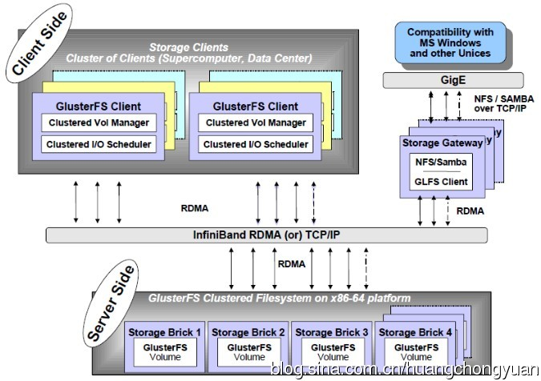
> 图2.4.1 GlusterFS架构图
>
> ​         GlusterFS的架构是去中心式架构，即没有元数据中心结构，也就意味着其没有存储元数据的结构，这正是其异于Lustre、HDFS及MooseFS的地方，这也是其架构的最大特色。
>
> 那么其究竟是如何完成文件数据读写定位的呢？这就是去中心式的分布式文件系统的特色，GlusterFS通过内部的hash算法实现文件的定位，通过这种方法代替元数据组件产生的作用。就目前来说，去中心式的分布式文件系统就个人所知，只有GlusterFS。
>
> ### 2.4.2数据分布方式
>
> ​         GlusterFS是一个比较全面的分布式文件系统，包括其数据的分布方式。GlusterFS支持三种数据分布，即其可以创建三种卷：分布式卷(Distributed)、条带卷(Stripe)及副本卷(Replicated)。
>
> ​         分布式卷(Distributed)，系统在存储文件时，根据文件路径及brick进行hash计算，根据计算结果决定其将存储于哪个brick之上，并且在brick中是以单个文件的形式而存在的。这种hash计算会做到尽可能的负载均衡。同样，在读取文件时，也会根据hash计算定位文件的位置。
>
> ​         条带卷(Stripe)，这种数据分布方式是大部分常见的分布式文件系统所支持的。GlusterFS的条带化数据分布与Lustre的条带化数据分布很相似。系统根据Stripe count进行轮询分块，并且在单个brick中再进行数据块合并。并且其Stripe size大小默认为128KB。
>
> ​         副本卷(Replicated)，文件在brick中会存储文件副本，并且副本数可以自由设置，但是会根据brick数进行相关的限制。系统还针对副本卷设计了文件自动修复机制，以保持副本文件的正确性。
>
> ​         GlusterFS是数据分布最灵活的分布式文件系统，以上三种数据分布方式可以任意的搭配使用。
>
> 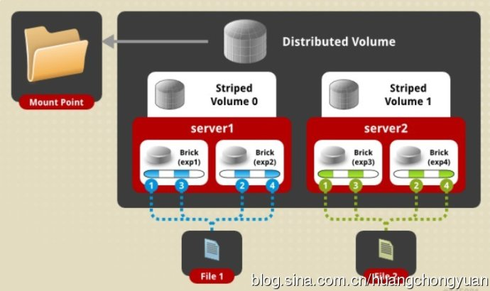
>
>  
>
> 图2.4.2-1 GlusterFS Distributed-Striped Volume
>
> 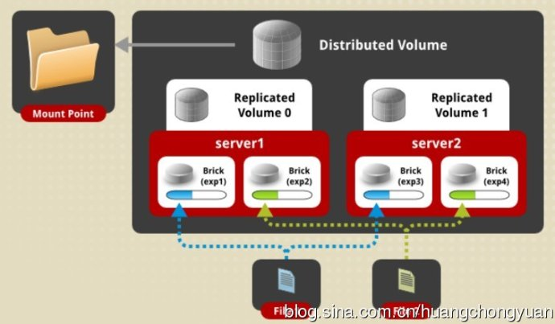
> 图2.4.2-2 GlusterFS Distributed-Replicated Volume
>
> 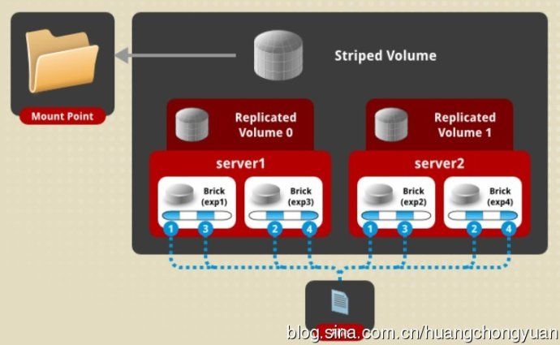
> 图2.4.2-3 GlusterFS Replicated-Striped Volume
>
> ​         如图2.4.2-1所示，底层一共两个server，每个server上做两个brick，供四个brick做成2x2的Distributed-Striped卷。File1/2是以分布式方式，即hash方式存储在不同的brick上；而从单个文件的角度看，如File1，其内部是通过Stripe的方式进行条带化存储的，其Stripe count为2，通过文件分块编号，可以看出其数据是Stripe之后再组合成两个文件存储在两个brick上。
>
> ​         如图2.4.2-2所示，同样是4个brick，做成2x2的Distributed-Replicated卷。File1/2分别以单个文件为单位hash存储在不同的brick上，并且保证每个文件都会一个副本文件在其brick之外，从而保证了数据的安全。
>
> ​         如图2.4.2-3所示，系统是2x2的Replicated-Striped卷。File在两个brick上Stripe切片存储，且在另外两个brick上保存了所有切片的对应副本。
>
> ​         在最新的GlusterFS3.3.X上，系统还是支持Distributed-Replicated-Stripe卷，即三种数据分布方式组成的系统卷，其数据具体分布方式由上面三个图就很容易推断出来了。GlusterFS其卷的数据分布设置与其brick数目有很大的关系。
>
> ​         就目前所知的情况，Stripe卷一般较少的人使用，其性能有待于提高，而最常使用的数据分布组合方式就是Distributed-Replicated。总体上说，GlusterFS提供了多种数据分布方式，并提供了灵活多变的组合方式，让我们在使用方便了许多。
>
> ### 2.4.3系统优缺点
>
> ​         GlusterFS最大的特点在于其无元数据的整体架构，但这只能说是他的一大特色，算不上其优点。据其官网上所说的无中心结构使其存储扩展近似线性，这也只是理论上的线性扩展，实际上GlusterFS的扩展性能比能达到70%-80%就很不错了。这可能会比其他分布式文件系统扩展性能损耗上好一点点(中心化的分布式文件系统随着存储节点的增加，并行量上升，元数据负载会越来越大，导致其性能会损耗很大)，但随之而来的问题是，文件遍历时的效率呈直线下降，特别是在存储了大批量文件时。由于其是无元数据结构，导致文件遍历需要遍历需要实际遍历整个系统卷，而不是如其他分布式文件系统那样直接从元数据服务器中获取。这是其一大缺点。
>
> ​         GlusterFS提供了比较多的功能，其多种卷的组合是一个，他还提供了文件修复机制、远程地域备份、在线扩容缩容、存储节点在线替换等等。此外，个人认为其最大的优点在于其具有一个完善的命令行管理接口，在众多分布式文件系统中，GlusterFS管理起来是最方便的，所有操作都可以通过命令行工具进行管理，而不是像很多文件系统那样通过修改配置文件进行操作等等。


