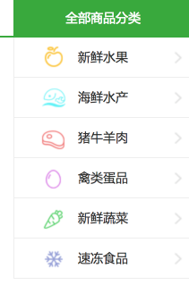
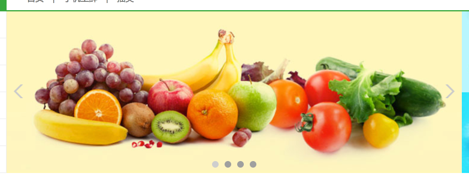
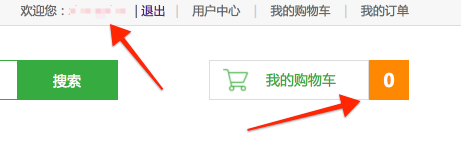

# 11、 首页代码实现

由于所有图片均存放在分布式存储系统，因此，首页展示图片需要从该系统中获取，而不是Django中的静态文件目录。

很明显，首页只有get请求：除了要显示以下内容外：

- 商品分类信息获取并显示
- 首页轮播图片及相关信息获取并显示
- 首页促销图片及相关信息获取并显示
- 所有种类首页展示商品的信息
  - 文字展示信息
  - 图片展示信息

还要进行如下判断：

- 用户未登陆
  - 顶部显示为登陆注册
  - 购物车数量为0
- 用户已登陆
  - 顶部显示为登陆用户
  - 购物车数量显示为用户购物车数量

因此，我们需要视图函数向模板提供上下文数据如下：

```python
# http://127.0.0.1:8000
# /
class IndexView(View):
    """首页"""

    def get(self, request):
    	# do something
        context = {
            'types': types,  # 所有商品种类对象
            'index_banner': index_banner, # 轮播对象
            'promotion_banner': promotion_banner, # 促销对象
            'cart_count': 0 # 购物车商品数
        }
```

## 11.1 商品分类信息

- 视图函数部分

```python
from apps.goods.models import GoodsType


# 获取商品的分类信息
types = GoodsType.objects.all()
```

- 左侧商品分类栏模板显示部分

```html
<ul class="subnav fl">
        {# 遍历展示商品种类的信息 #}
            
				<li><a href="#model0{{ forloop.counter }}" class="{{ category.logo }}">{{ category.name }}</a></li>
            
</ul>
```



## 11.2 首页轮播图片及相关信息

- 视图函数部分：

```python
from apps.goods.models import IndexGoodsBanner,

# 获取首页的轮播商品的信息
        index_banner = IndexGoodsBanner.objects.all().order_by('index')
```

- 轮播图片模板显示部分：
  - `image.url`是指在分布式系统中相应图片的访问路径

```html
<ul class="slide_pics">
        {# 遍历展示首页轮播商品的信息 #}
        
			<li><a href="#"></a></li>
		
</ul>
```




## 11.3 首页促销图片及相关信息

- 视图函数部分：

```python
from apps.goods.models import IndexPromotionBanner,

# 获取首页的促销活动的信息
        promotion_banner = IndexPromotionBanner.objects.all().order_by('index')
```

- 轮播图片模板显示部分：
  - `image.url`是指在分布式系统中相应图片的访问路径

```html
<div class="adv fl">
			{# 遍历显示首页的促销活动信息 #}
            
			<a href="{{ banner.url }}"></a>
		    
</div>
```


## 11.4 所有种类首页展示商品的信息

- 视图函数部分：

```python
from apps.goods.models import IndexTypeGoodsBanner

# 获取首页分类商品的展示信息
        for category in types:
            # 获取type种类在首页展示的图片商品的信息和文字商品的信息
            image_banner = IndexTypeGoodsBanner.objects.filter(category=category, display_type=1)
            title_banner = IndexTypeGoodsBanner.objects.filter(category=category, display_type=0)

            # 给category对象增加属性title_banner,image_banner
            # 分别保存category种类在首页展示的文字商品和图片商品的信息
            category.title_banner = title_banner
            category.image_banner = image_banner
```

- 模板显示部分：

```html

	<div class="list_model">
		<div class="list_title clearfix">
			<h3 class="fl" id="model01">{{ category.name }}</h3>
			<div class="subtitle fl">
				<span>|</span>
				{# 遍历展示type种类在首页展示的文字商品的信息 #}
                
				<a href="">{{ banner.sku.name }}</a>
				
			</div>
			<a href="" class="goods_more fr" id="fruit_more">查看更多 ></a>
		</div>

		<div class="goods_con clearfix">
			<div class="goods_banner fl"></div>
			<ul class="goods_list fl">
				{# 遍历展示type种类在首页展示的图片商品的信息 #}
                
				<li>
					<h4><a href="">{{ banner.sku.name }}</a></h4>
					<a href=""></a>
					<div class="prize">¥ {{ banner.sku.price }}</div>
				</li>
				
			</ul>
		</div>
	</div>

```


## 11.5 用户登录判断

- 视图函数部分：主要处理购物车数量问题

```python
# 判断用户是否已登录
        cart_count = 0
        if request.user.is_authenticated():
            # 获取redis链接
            conn = get_redis_connection('default')

            print(request.user.id)
            # 拼接key
            cart_key = 'cart_%s' % request.user.id

            # 获取用户购物车中商品的条目数
            # hlen(key)-> 返回属性的数目
            cart_count = conn.hlen(cart_key)

        # 组织模板上下文
        context.update(cart_count=cart_count)
```

- 模板显示部分：顶部栏判断在base模板内、购物车显示在base模板。

> ```
> 每个请求到达Django框架后，request对象都会有一个user属性。
> 1）如果用户已登录，request.user是一个认证系统用户模型类(User)的对象，包含登录用户的信息。
> 2）如果用户未登录，request.user是一个匿名用户类(AnonymousUser)的对象。
>
> User类和AnonymousUser类对象都有一个方法is_authenticated方法。
> User类这个方法返回的是True, AnonymousUser类这个方法返回的是False。
> 通过reqeust.user.is_authenticated()可以判断用户是否登录。
>
> 注意:
> 1) 在模板文件中可以直接使用一个模板变量user，其实就是request.user。
> ```

```python

    <div class="login_info fl">
    欢迎您：<em>{{ user.username }}</em>
    <span>|</span>
    <a href="">退出</a>
    </div>

    <div class="login_btn fl">
    <a href="">登录</a>
    <span>|</span>
    <a href="">注册</a>
    </div>


#---------------------------------------------------------------
<div class="guest_cart fr">
			<a href="" class="cart_name fl">我的购物车</a>
			<div class="goods_count fl" id="show_count">{{ cart_count }}</div>
</div>
```



