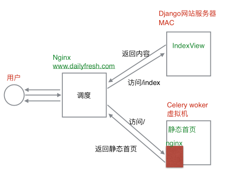
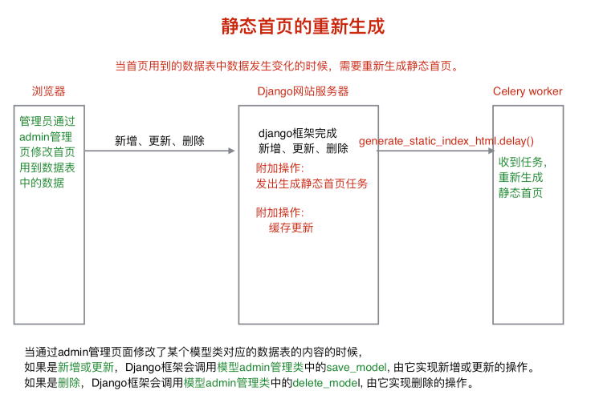

# 12、 网站性能优化——页面静态化与缓存


由于首页是每个网站都会被用户首先访问到的页面，无论是否为注册用户，因此其访问量是最大且最频繁的。若像上一章那样，每个用户访问首页我们都需要查询数据库并访问Fast FDS系统获取相关资源，那岂不是很浪费，毕竟请求的资源信息完全相同。这是不允许的。怎么办呢？

​	在网站服务器部署发展那一块，我们提到过两种常见的软件层次改善网站性能方式：1、利用缓存；2、动态转静态来利用页面静态化。本章就来以首页页面为例实现这两种方式的优化。

## 12.1 利用缓存

在用户登录那一章已经讲述Redis缓存的基本配置，这里不再叙述。读者可以参考[官方文档](https://yiyibooks.cn/xx/django_182/topics/cache.html)。

```python
CACHES = {
    "default": {
        "BACKEND": "django_redis.cache.RedisCache",
        # 设置django缓存的数据保存在redis数据库中
        "LOCATION": "redis://127.0.0.1:6379/5",  # 选用本地的redis的5号数据库
        "OPTIONS": {
            "CLIENT_CLASS": "django_redis.client.DefaultClient",
        }
    }
}

```

利用缓存意思就是从数据库中查询出数据之后，把数据放在缓存中，再次使用的时候直接从缓存中获取数据，其优化本质就是减少数据库的查询。用一段伪代码描述就是：

```python
given a URL, try finding that page in the cache
if the page is in the cache:
    return the cached page
else:
    generate the page
    save the generated page in the cache (for next time)
    return the generated page
```

Django自带了一个健壮的缓存系统来让我们保存动态页面这样避免对于每次请求都重新计算。方便起见，Django提供了不同级别的缓存粒度：可以缓存特定视图的输出、可以仅仅缓存那些很难生产出来的部分、或者可以缓存整个网站。接下来详细说明这几种类型，以便我们队首页缓存选择合适的缓存粒度。

### 站点级缓存

一旦高速缓存设置，最简单的方法是使用缓存缓存整个网站。要缓存整个网站，首先添加两个中间件：

```
MIDDLEWARE_CLASSES = (
    'django.middleware.cache.UpdateCacheMiddleware',
    'django.middleware.common.CommonMiddleware',
    'django.middleware.cache.FetchFromCacheMiddleware',
)
```

> 注意update中间件要放在首位，fetch中间件放在最后。
>
> - FetchFromCacheMiddleware中间件
>   - 用来缓存通过GET和HEAD方法获取的状态码为200的响应。同一个url，带有不同的查询字符串，会当做不同的页面分别缓存。
>
>
> - UpdateCacheMiddleware中间件
>   - 在响应HttpResponse中设置几个headers：
>     - 设置Last-Modified为页面最新的刷新时间，设置Expires为过期时间(现在时间加CACHE_MIDDLEWARE_SECONDS)，设置Cache-Control页面最大有效期(CACHE_MIDDLEWARE_SECONDS)。
>     - views逻辑函数也可以自己设置过期时间：
>       - 使用django.views.decorators.cache.cache_control()设置缓存过期时间，使用django.views.decorators.cache.never_cache()禁止缓存。

然后在settings中添加以下值：

CACHE_MIDDLEWARE_ALIAS：存储用的缓存别名
CACHE_MIDDLEWARE_SECONDS：页面被缓存的时间
CACHE_MIDDLEWARE_KEY_PREFIX：当缓存被不同的站点使用时，用来防止缓存key值冲突的，一般设为站点名字。

### 单个VIEW(页面)缓存

使用`django.views.decorators.cache.cache_page()`来缓存某个页面：

```python
from django.views.decorators.cache import cache_page
 
@cache_page(60 * 15)
def my_view(request):
    ...
```

`cache_page`接受一个参数：timeout，秒为单位。在上面代码中，“`my_view()`”视图的结果将被缓存 15 分钟。

​	和站点缓存一样，视图缓存与 URL 无关。如果多个 URL 指向同一视图，每个URL将会分别缓存。如下面代码所示，发送到 `/foo/1/` and `/foo/23/` 会被分别缓存。但是一旦一个明确的 URL (e.g., `/foo/23/`) 已经被请求过了, 之后再度发出的指向该 URL 的请求将使用缓存。

```
urlpatterns = [
    url(r'^foo/([0-9]{1,2})/$', my_view),
]
```

除此之外，还有一些参数设置可选：

- cache参数可以设置使用CACHES中的哪一个cache系统，默认是default：

```
@cache_page(60 * 15, cache="special_cache")
def my_view(request):
    ...
```

- key_prefix参数和CACHE_MIDDLEWARE_KEY_PREFIX设置起得作用相同：

```
@cache_page(60 * 15, key_prefix="site1")
def my_view(request):
    ...
```

- 其他用法——可以在url中使用此方法：

```python
from django.views.decorators.cache import cache_page
 
urlpatterns = [
    url(r'^foo/([0-9]{1,2})/$', cache_page(60 * 15)(my_view)),
]
```

### 模板片段缓存

``模板标签会缓存block内容，至少包括两个参数：缓存时间和缓存片段的name。

```


    .. sidebar ..

```

也可以根据变化的动态数据为一个片段缓存不同的copies：

```


    .. sidebar for logged in user ..

```

### CACHE API

有时，以上缓存方式均不合适一些场景。对于这个情况 Django提供了一个底层的 cache API. 我们可以用这个 API来储存在缓存中的对象，并且控制粒度随开发者设置。我们可以缓存可以安全pickle的任何Python对象：模型对象的字符串，字典，列表等等。 （最常见的Python对象可以Pickle;参考Python文档有关pickle更多信息。）

我们可以通过 类字典对象`django.core.cache.caches`.访问配置在[`CACHES`](https://yiyibooks.cn/__trs__/xx/django_182/ref/settings.html#std:setting-CACHES) 设置中的字典类对象。对同一线程相同的别名重复请求将返回相同的对象。

```
>>> from django.core.cache import caches
>>> cache1 = caches['myalias']
>>> cache2 = caches['myalias']
>>> cache1 is cache2
True
```

> - 如果key不存在，就会引发一个 `InvalidCacheBackendError` 。
>
>
> - 获取默认的caches：
>
>   - ```
>     from django.core.cache import cache
>     ```
>
> - 基本用法set(key, value, timeout) 和get(key)：
>
>   - ```
>     >>> cache.set('my_key', 'hello, world!', 30)
>     >>> cache.get('my_key')
>     'hello, world!'
>     ```
>
>   - key为字符串，value为 picklable的python对象。timeout设置为None时，缓存永不过时，设置为0时不缓存。

### 首页缓存代码实现

我们的首页主要是为了缓存首页页面供用户访问，那么站点级缓存不合适；除此之外，我们的首页若只供非登录用户使用时，那么完全可以使用单个View缓存，但是我们首页还要显示每个用户的信息和购物车信息，因此也不合适；模板片段很明显更不合适。那我们只能通过CACHE API来自行设置缓存。

根据本节开始时关于动态利用缓存的伪代码，我们的首页缓存处理逻辑为：

- 尝试获取本地缓存`index_page_data`
- 若缓存不存在，则从数据库查询获取相应的数据，然后设置缓存
  - 若缓存存在，则直接读取缓存数据
- 用户登录判断，获取购物车Redis缓存数据，并组织模板所需上下文
- 响应首页

完整代码如下：

```python
    def get(self, request):
        """显示"""
        # 尝试从缓存中获取数据
        context = cache.get('index_page_data')  # None pickle

        if context is None:
            # 获取商品的分类信息
            print('设置首页缓存')
            types = GoodsType.objects.all()

            # 获取首页的轮播商品的信息
            index_banner = IndexGoodsBanner.objects.all().order_by('index')

            # 获取首页的促销活动的信息
            promotion_banner = IndexPromotionBanner.objects.all().order_by('index')

            # 获取首页分类商品的展示信息
            for category in types:
                # 获取type种类在首页展示的图片商品的信息和文字商品的信息
                # QuerySet
                image_banner = IndexTypeGoodsBanner.objects.filter(category=category, display_type=1)
                title_banner = IndexTypeGoodsBanner.objects.filter(category=category, display_type=0)

                # 给type对象增加属性title_banner,image_banner
                # 分别保存type种类在首页展示的文字商品和图片商品的信息
                category.title_banner = title_banner
                category.image_banner = image_banner

            # 缓存数据
            context = {
                'types': types,
                'index_banner': index_banner,
                'promotion_banner': promotion_banner,
                'cart_count': 0
            }

            # 设置首页缓存
            # from django.core.cache import cache
            # cache.set('缓存名称', '缓存数据', '缓存有效时间'} pickle
            cache.set('index_page_data', context, 3600)

        # 判断用户用户是否已登录
        cart_count = 0
        if request.user.is_authenticated():
            # 获取redis链接
            conn = get_redis_connection('default')

            print(request.user.id)
            # 拼接key
            cart_key = 'cart_%s' % request.user.id

            # 获取用户购物车中商品的条目数
            # hlen(key)-> 返回属性的数目
            cart_count = conn.hlen(cart_key)

        # 组织模板上下文
        context.update(cart_count=cart_count)

        # 使用模板
        return render(request, 'index.html', context)
```

> 还应当注意后台数据库数据发生变化时应当进行缓存更新操作，见12.3节。

## 12.2 页面静态化

页面静态化把原本动态的页面处理结果保存成html文件，让用户直接访问这个生成出来的静态的html页面。在我们这里该怎么使用呢？

我们可以这样设计：

- 当接收到的请求URL为`/`时，我们设计这是普通的第一次未登录访问网站，直接将静态首页响应给请求。
- 当接收到的请求URL为`/index`时。我们设计这是用户在登录后访问首页的过程，则访问Django的视图函数——即动态缓存（12.1节）响应。

> 其中，我们通过Nginx服务器调度这两种响应：
>
> - 路径为/时交给一个专门进行页面静态化的服务器进行处理，由于静态化比较耗时，我们在后台将其通过Celery来传递任务，完成静态化操作。
> - 路径为/index时交给Django网站应用服务器进行处理



Celery所用nginx配置：

```
server {
          listen       80;
          server_name  host_ip; # Celery所在服务器ip

          # 静态首页访问配置
          location / {
              # root 指定web服务器的根目录，即通过Celery生成的静态文件所在路径
              root 静态首页路径;
              # 如果直接通过ip和端口号来访问服务器时，
              # 默认显示的是root指定目录下的index指定的文件index.html
              index  index.html index.htm;
          }
        }
```

调度nginx配置：

```
server {
          listen       80;
          server_name  host_ip; # 网站ip
          # 静态首页所用静态资源css、js
          location /static {
              alias 静态资源路径;
          }
          # 静态首页访问配置
          location / {
          		# <celery_ip>为配置是celery所在虚拟机的ip，用于将该请求转发给Celery所用nginx
              proxy_pass http://<celery_ip>/ 
          }
          # 动态缓存首页访问配置
          location /index {
          		# localhost:8000为Django服务器的地址和ip
              proxy_pass http://localhost:8000/ 
          }
        }
```

静态页面Celery任务代码实现：

- 与动态查询时相同的操作
- 待所有数据查询获取后，加载模板，并将模板保存到指定位置（Ngnix中设置的位置）
  - 加载模板
  - 模板渲染
  - 保存模板

```python
from django.core.mail import send_mail
# 设置django配置依赖的环境变量
import os
import sys
sys.path.insert(0, './')
import django
os.environ.setdefault("DJANGO_SETTINGS_MODULE", "dailyfresh.settings")
django.setup()

from apps.goods.models import GoodsType, IndexGoodsBanner, IndexPromotionBanner, IndexTypeGoodsBanner
from celery_tasks.celery import app as app

@app.task
def generate_static_index_html():
    """使用celery生成静态首页文件"""
    # 获取商品的分类信息
    types = GoodsType.objects.all()

    # 获取首页的轮播商品的信息
    index_banner = IndexGoodsBanner.objects.all().order_by('index')

    # 获取首页的促销活动的信息
    promotion_banner = IndexPromotionBanner.objects.all().order_by('index')

    # 获取首页分类商品的展示信息
    for category in types:
        # 获取type种类在首页展示的图片商品的信息和文字商品的信息
        image_banner = IndexTypeGoodsBanner.objects.filter(category=category, display_type=1)
        title_banner = IndexTypeGoodsBanner.objects.filter(category=category, display_type=0)

        # 给category对象增加属性title_banner,image_banner
        # 分别保存category种类在首页展示的文字商品和图片商品的信息
        category.title_banner = title_banner
        category.image_banner = image_banner

    cart_count = 0

    # 组织模板上下文
    context = {
        'types': types,
        'index_banner': index_banner,
        'promotion_banner': promotion_banner,
        'cart_count': cart_count,
    }

    # 使用模板

    # 1.加载模板文件
    from django.template import loader
    temp = loader.get_template('static_index.html')
    # 2.模板渲染
    static_html = temp.render(context)
    # 3.生成静态首页文件
    save_path = os.path.join(settings.BASE_DIR, 'static/index.html')
    with open(save_path, 'w') as f:
        f.write(static_html)
```

> 在数据库信息变化时更新静态首页详见12.3 。

## 12.3 缓存更新、静态首页生成更新

前面两节讲述了如何设置缓存、以及静态网页如何通过配置和Celery生成。但是，常常我们数据库里的商品等信息会修改，因此应当在数据库信息变动后，后台自动清除原先的缓存和生成最新的静态首页来保证用户访问数据的实时有效性。

主要流程如下图所示：



因此，我们需要自定义首页所涉及的动态数据对应的模型类的管理类。完整代码如下：

```python
from django.contrib import admin
from django.core.cache import cache
from apps.goods.models import GoodsType, IndexPromotionBanner, IndexGoodsBanner,  IndexTypeGoodsBanner
# Register your models here.


class BaseModelAdmin(admin.ModelAdmin):
    def save_model(self, request, obj, form, change):
        """新增或更新时调用"""
        # 调用ModelAdmin中save_model来实现更新或新增
        super().save_model(request, obj, form, change)

        # 附加操作：发出生成静态首页的任务
        from celery_tasks.tasks import generate_static_index_html
        print('发出重新生成静态首页的任务')
        generate_static_index_html.delay()

        # 附加操作: 清除首页缓存
        cache.delete('index_page_data')

    def delete_model(self, request, obj):
        """删除数据时调用"""
        # 调用ModelAdmin中delete_model来实现删除操作
        super().delete_model(request, obj)

        # 附加操作：发出生成静态首页的任务
        from celery_tasks.tasks import generate_static_index_html
        generate_static_index_html.delay()

        # 附加操作: 清除首页缓存
        cache.delete('index_page_data')


class GoodsTypeAdmin(BaseModelAdmin):
    """商品种类模型admin管理类"""
    pass


class IndexGoodsBannerAdmin(BaseModelAdmin):
    """首页轮播商品模型admin管理类"""
    pass


class IndexTypeGoodsBannerAdmin(BaseModelAdmin):
    """首页分类商品展示模型admi管理类"""
    pass


class IndexPromotionBannerAdmin(BaseModelAdmin):
    """首页促销活动admin管理类"""
    pass

admin.site.register(GoodsType, GoodsTypeAdmin)
admin.site.register(IndexGoodsBanner, IndexGoodsBannerAdmin)
admin.site.register(IndexPromotionBanner, IndexPromotionBannerAdmin)
admin.site.register(IndexTypeGoodsBanner, IndexTypeGoodsBannerAdmin)
```

> 关于ModelAdmin methods的详细中文文档见https://yiyibooks.cn/xx/django_182/ref/contrib/admin/index.html
>
> 主要内容有：
>
> ```
> ModelAdmin.save_model(request, obj, form, change)
> save_model方法被赋予HttpRequest，模型实例，ModelForm实例和布尔值，基于它是添加还是更改对象。在这里您可以执行任何预保存或后保存操作。
>
>
> ModelAdmin.delete_model(request, obj)
> delete_model方法给出了HttpRequest和模型实例。使用此方法执行预删除或后删除操作。
> ```