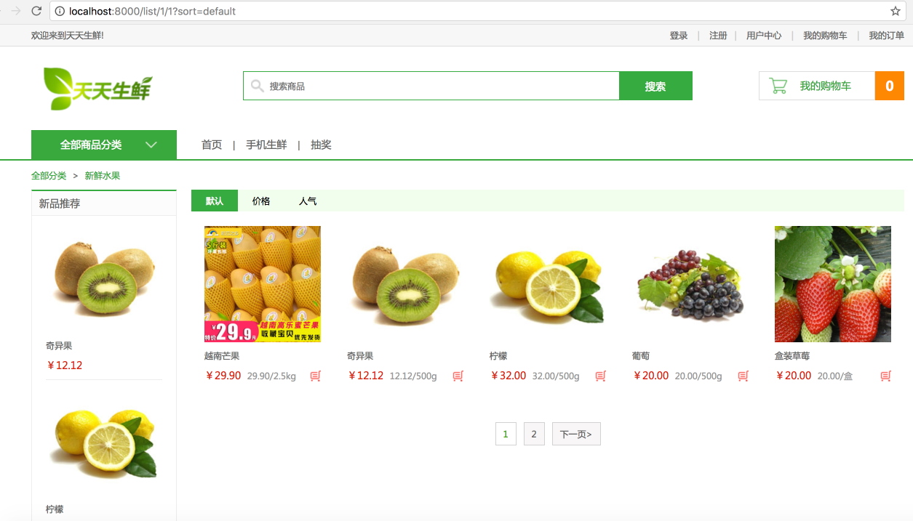

# 14、商品显示列表页代码实现




可以看出，商品列表页除了展示新品推荐(与商品详情页相同)外仅需展示某个种类的所有商品信息，商品信息通过分页进行显示。

很明显，我们类视图所需要的新内容与详情页相比，仅仅多一个分页查询操作。

## 14.1 URL设计

根据商品列表页，我们希望URL能够反馈商品种类id、显示排序方式、显示页码。

```python
url(r'^list/(?P<type_id>\d+)/(?P<page>\d+)$', ListView.as_view(), name='list'), # 列表页
```

## 14.2 分页查询

Django提供了数据分页的类，这些类被定义在django/core/paginator.py中。 [类Paginator](https://yiyibooks.cn/xx/django_182/topics/pagination.html)用于对列进行一页n条数据的分页运算。类Page用于表示第m页的数据。

#### Paginator类实例对象

- 方法`__init__`(列表,int)：返回分页对象，第一个参数为列表数据，第二个参数为每页数据的条数。
- 属性`count`：返回对象总数。
- 属性`num_pages`：返回页面总数。
- 属性`page_range`：返回页码列表，从1开始，例如[1, 2, 3, 4]。
- 方法`page(m)`：返回Page类实例对象，表示第m页的数据，下标以1开始。

#### Page类实例对象

- 调用Paginator对象的page()方法返回Page对象，不需要手动构造。
- 属性`object_list`：返回当前页对象的列表。
- 属性`number`：返回当前是第几页，从1开始。
- 属性`paginator`：当前页对应的Paginator对象。
- 方法`has_next()`：如果有下一页返回True。
- 方法`has_previous()`：如果有上一页返回True。
- 方法`len()`：返回当前页面对象的个数。

示例：

假设我们拥有一个已经导入的`Contacts`模型类。视图函数看起来像是这样：

```python
from django.core.paginator import Paginator, EmptyPage, PageNotAnInteger

def listing(request):
    contact_list = Contacts.objects.all()
    paginator = Paginator(contact_list, 25) # Show 25 contacts per page

    page = request.GET.get('page')
    try:
        contacts = paginator.page(page)
    except PageNotAnInteger:
        # If page is not an integer, deliver first page.
        contacts = paginator.page(1)
    except EmptyPage:
        # If page is out of range (e.g. 9999), deliver last page of results.
        contacts = paginator.page(paginator.num_pages)

    return render_to_response('list.html', {"contacts": contacts})
```

在对应的`list.html`模板中，我们可以包含页面之间的导航，以及来自对象本身的任何有趣的信息：

```html
<div class="pagination">
    <span class="step-links">
        
        <span class="current">
            Page  of .
        </span>
       
    </span>
</div>
```

## 14.3 视图业务实现

获取URL参数，从数据库获取商品信息：

```python
from apps.goods.models import GoodsType, GoodsSKU
from django.core.urlresolvers import reverse

# 前端传递的参数：种类id(type_id) 页码(page) 排序方式(sort)
# 商品列表页的url地址: '/list/种类id/页码?sort=排序方式'

class ListView(View):
    def get(self, request, type_id, page):
        """type_id 为种类id， page为页码"""
        # 获取种类id对应的商品种类信息,判断是否合法存在
        try:
            category = GoodsType.objects.get(id=type_id)
        except GoodsType.DoesNotExist:
            # 种类不存在时，直接跳转首页
            return redirect(reverse('goods:index'))
        # 获取所有种类
        types = GoodsType.objects.all()

        # 获取排序顺序
        # sort=price: 按照商品的价格(price)从低到高排序
        # sort=hot: 按照商品的人气(sales)从高到低排序
        # sort=default: 按照默认排序方式(id)从高到低排序
        sort = request.GET.get('sort')

        # 获取type种类的商品信息并排序
        if sort == 'price':
            skus = GoodsSKU.objects.filter(category=category).order_by('price')
        elif sort == 'hot':
            skus = GoodsSKU.objects.filter(category=category).order_by('-sales')
        else:
            # 按照默认顺序来排序
            sort = 'default'
            skus = GoodsSKU.objects.filter(category=category).order_by('-id')
```

将获取到的商品信息进行分页显示：

> 此飞马端可用于任意的分页显示中，其中的skus为上文查询到的所有商品信息

```python
# 分页操作
        from django.core.paginator import Paginator
        paginator = Paginator(skus, 5)

        # 处理页码
        page = int(page)

        if page > paginator.num_pages:
            # 默认获取第1页的内容
            page = 1

        # 获取第page页内容, 返回Page类的实例对象
        skus_page = paginator.page(page)

        # 页码处理
        # 如果分页之后页码超过5页，最多在页面上只显示5个页码：当前页前2页，当前页，当前页后2页
        # 1) 分页页码小于5页，显示全部页码
        # 2）当前页属于1-3页，显示1-5页
        # 3) 当前页属于后3页，显示后5页
        # 4) 其他请求，显示当前页前2页，当前页，当前页后2页
        num_pages = paginator.num_pages
        if num_pages < 5:
            # 1-num_pages
            pages = range(1, num_pages + 1)
        elif page <= 3:
            pages = range(1, 6)
        elif num_pages - page <= 2:
            # num_pages-4, num_pages
            pages = range(num_pages - 4, num_pages + 1)
        else:
            # page-2, page+2
            pages = range(page - 2, page + 3)

```

新品信息：

```python
        # 获取type种类的2个新品信息
        new_skus = GoodsSKU.objects.filter(category=category).order_by('-create_time')[:2]
```

购物车信息：

```python
        # 如果用户登录，获取用户购物车中商品的条目数
        cart_count = 0
        if request.user.is_authenticated():
            # 获取redis链接
            conn = get_redis_connection('default')

            # 拼接key
            cart_key = 'cart_%s' % request.user.id

            # 获取用户购物车中商品的条目数
            # hlen(key)-> 返回属性的数目
            cart_count = conn.hlen(cart_key)
```

模板上下文：

```python
# 组织模板上下文数据
        context = {
            'type': category,
            'types': types,
            'skus_page': skus_page,
            'new_skus': new_skus,
            'cart_count': cart_count,
            'sort': sort,
            'pages': pages
        }
```

响应：

```python
		# 使用模板
        return render(request, 'list.html', context)
```

14.4 前端模板实现

我们需要将视图逻辑获取到的模板上下文数据合适的配置到`list.html`中。

新品推荐代码段与商品详情页相关代码类似：

```html
			<h3>新品推荐</h3>
				<ul>
				    
					<li>
						<a href=""></a>
						<h4><a href="">{{ sku.name }}</a></h4>
						<div class="prize">￥{{ sku.price }}</div>
					</li>
					
				</ul>
```

排序方式链接处代码段：均默认为各排序显示第一页

```html
<div class="sort_bar">
				<a href="" class="active">默认</a>
				<a href="?sort=price" class="active">价格</a>
				<a href="?sort=hot" class="active">人气</a>
			</div>
```

当前页商品显示：

```html
			<ul class="goods_type_list clearfix">
                {# 遍历显示当前页面上的商品的信息 #}
                
				<li>
					<a href=""></a>
					<h4><a href="">{{ sku.name }}</a></h4>
					<div class="operate">
						<span class="prize">￥{{ sku.price }}</span>
						<span class="unit">{{ sku.price }}/{{ sku.unite }}</span>
						<a href="#" class="add_goods" title="加入购物车"></a>
					</div>
				</li>
                
			</ul>
```

页码导航部分：

```html
<div class="pagenation">
                
				<a href="?sort={{ sort }}">&lt;上一页</a>
                
                
				<a href="?sort={{ sort }}" class="active">{{ pindex }}</a>
				
                
				<a href="?sort={{ sort }}">下一页&gt;</a>
                
			</div>
```

