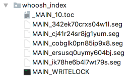
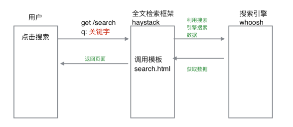

# 15、商品搜索实现

网站众多的产品不可能一页就展示完全，或者用户并非知道自己想买商品的具体名称，因此往往需要用户通过搜索来查找相关产品。本章就介绍一种Django中搜索的实现方式：全文检索。

## 15.1 全文检索配置

全文检索不同于特定字段的模糊查询，使用全文检索的效率更高，并且能够对于中文进行分词处理。

- haystack：全文检索的框架，支持whoosh、solr、Xapian、Elasticsearc四种全文检索引擎，点击查看[官方网站](http://haystacksearch.org/)。
- whoosh：纯Python编写的全文搜索引擎，虽然性能比不上sphinx、xapian、Elasticsearc等，但是无二进制包，程序不会莫名其妙的崩溃，对于小型的站点，whoosh已经足够使用，点击查看[whoosh文档](https://whoosh.readthedocs.io/en/latest/)。
- jieba：一款免费的中文分词包。

### 1）安装：

```
pip install django-haystack==2.6.1 # 安装全文检索框架
pip install whoosh==2.7.4 # 安装whoosh搜索引擎
```

### 2）配置：

```python
在settings.py文件中添加如下配置:
INSTALLED_APPS = (
  # ...
  'haystack', # 全文检索框架
  # ...
)

# 全文检索框架配置
HAYSTACK_CONNECTIONS = {
    'default': {
        # 使用whoosh引擎
        'ENGINE': 'haystack.backends.whoosh_backend.WhooshEngine',
        # 索引文件路径
        'PATH': os.path.join(BASE_DIR, 'whoosh_index'),
    }
}

# 当添加、修改、删除数据时，自动生成索引
HAYSTACK_SIGNAL_PROCESSOR = 'haystack.signals.RealtimeSignalProcessor'
```

### 3) 索引文件生成：

- 1.在goods应用目录下新建一个search_indexes.py文件，在其中定义一个商品索引类。

```python
from haystack import indexes
from apps.goods.models import GoodsSKU

#指定对于某个类的某些数据建立索引

class GoodsSKUIndex(indexes.SearchIndex, indexes.Indexable):
    text = indexes.CharField(document=True, use_template=True)

    def get_model(self):
        return GoodsSKU

    def index_queryset(self, using=None):
        return  self.get_model().objects.all()

```

- 2.在templates下面新建目录search/indexes/goods。


- 3.在商品的目录下创建goodssku_text.txt。
- 4.在goodssku_text.txt中指定根据哪些字段建立索引。

```
{{ object.name }} # 根据商品的名字j建立索引
{{ object.desc }} # 根据商品的简介建立索引
{{ object.goods.detail }} # 根据商品的详情建立索引
```

- 5.在终端执行如下命令生成索引文件。

```
python manage.py rebuild_index
```

### 4）中文配置：

由于whoosh本身的分析词对中文支持较差，所以我们可以使用jieba来替换其本身的分析器。

主要替换方法：

```python
1.安装jieba分词包。
pip install jieba

2.进入haystack目录。
/python安装路径/python3.6/site-packages/haystack/backends/

3.在上面的目录中创建ChineseAnalyzer.py文件。
import jieba
from whoosh.analysis import Tokenizer, Token

class ChineseTokenizer(Tokenizer):
    def __call__(self, value, positions=False, chars=False,
                 keeporiginal=False, removestops=True,
                 start_pos=0, start_char=0, mode='', **kwargs):
        t = Token(positions, chars, removestops=removestops, mode=mode, **kwargs)
        seglist = jieba.cut(value, cut_all=True)
        for w in seglist:
            t.original = t.text = w
            t.boost = 1.0
            if positions:
                t.pos = start_pos + value.find(w)
            if chars:
                t.startchar = start_char + value.find(w)
                t.endchar = start_char + value.find(w) + len(w)
            yield t

def ChineseAnalyzer():
    return ChineseTokenizer()

4.复制whoosh_backend.py文件并更改为如下名称。
  whoosh_cn_backend.py
    
5.打开whoosh_cn_backend.py，引入中文分析类，内部采用jieba分词。
from .ChineseAnalyzer import ChineseAnalyzer

6.更改whoosh_cn_backend.py文件中使用的词语分析类。
查找
analyzer=StemmingAnalyzer()
改为
analyzer=ChineseAnalyzer()

7.修改settings.py文件中的配置项。
# 全文检索框架配置
HAYSTACK_CONNECTIONS = {
    'default': {
        # 使用whoosh引擎
        'ENGINE': 'haystack.backends.whoosh_cn_backend.WhooshEngine',
        # 索引文件路径
        'PATH': os.path.join(BASE_DIR, 'whoosh_index'),
    }
}

8.重新创建索引数据。
python manage.py rebuild_index
```

> 生成后的索引文件会存放在`whoosh_index`目录中。如：
>
> 


## 15.2 全文检索使用

### 1）模板文件中搜索表单设计

```html
		<div class="search_con fl">
            <form method="get" action="/search">
                <input type="text" class="input_text fl" name="q" placeholder="搜索商品">
                <input type="button" class="input_btn fr" name="" value="搜索">
            </form>
		</div>
```

可以看到，我们将表单数据提交到`/search`中，其中用户输入的信息为`name=q`的参数。

### 2）项目搜索URL配置：

```python
url(r'^search', include('haystack.urls')), # 全文检索框架
```

### 3）搜索数据使用

#### haystack搜索数据说明：

```
1）搜索结果：
  搜索出结果后，haystack会使用templates/search目录下的search.html来展示搜索结果页面。因此我们需要设计search.html文件。
  
2）传递的上下文包括：
  2.1 query：搜索关键字
  2.2 page：当前页的page对象
    遍历page对象，获取到的是SearchResult类的实例对象，对象的属性object才是模型类的对象。
  2.3 paginator：分页paginator对象
```



#### 项目search.html文件设计

文件存储路径：`/templates/search/search.html`

URL配置：`/search?q={{ query }}&page={{ pindex }}`

```html

天天生鲜-商品搜索结果列表

	<div class="breadcrumb">
		<a href="#">{{ query }}</a>
		<span>></span>
		<a href="#">搜索结果如下：</a>
	</div>

	<div class="main_wrap clearfix">
        <ul class="goods_type_list clearfix">
            {# 遍历显示搜索的商品的信息 #}
            
            <li>
                <a href=""></a>
                <h4><a href="">{{ item.object.name }}</a></h4>
                <div class="operate">
                    <span class="prize">￥{{ item.object.price }}</span>
                    <span class="unit">{{ item.object.price }}/{{ item.object.unite }}</span>
                    <a href="#" class="add_goods" title="加入购物车"></a>
                </div>
            </li>
            
        </ul>

        <div class="pagenation">
                
				<a href="/search?q={{ query }}&page={{ page.previous_page_number }}">&lt;上一页</a>
                
                
				<a href="/search?q={{ query }}&page={{ pindex }}" class="active">{{ pindex }}</a>
				
                
				<a href="/search?q={{ query }}&page={{ page.next_page_number }}">下一页&gt;</a>
                
			</div>
	</div>

```

