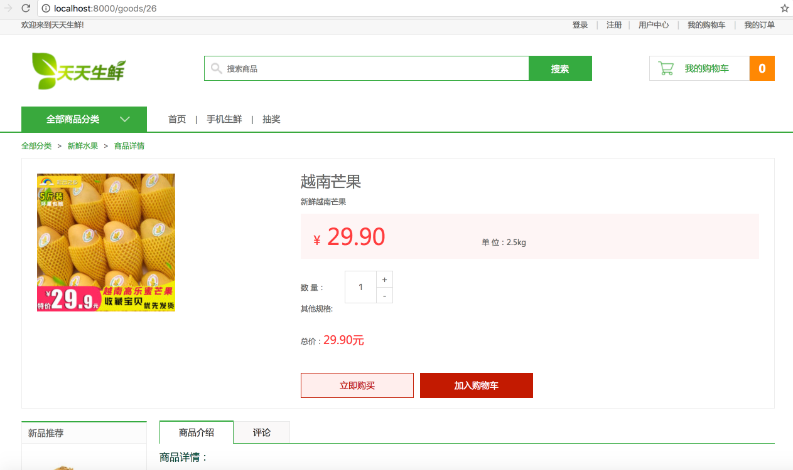

# 16、购物车记录实现

在首页代码（11）那一章，我们提到了购物车商品条目的获取。以及数据库设计时，将购物车有关的一些数据设计在Redis中。本文将实现除了购物车商品条目数显示以外的其他功能，若遇到Redis等相关问题，将不再叙述。

我们要实现的内容有：

- 在商品详情页点击加入购物车时，购物车里的相关操作
- 购物车页面的显示
- 购物车记录更新
- 购物车记录删除

## 16.1 商品详情页加入购物车功能

我们通过前端进行异步请求操作完成该功能，即使用AJAX的post请求来完成将购物车加入操作来请求到后端，并实现后端数据更新和响应的局部页面刷新。

从商品详情页上我们可以看到，前端涉及该操作的地方有右上角`购物车商品条目数`、中间商品购买数量的`加减操作`按钮、点击`“加入购物车”`按钮。




### 1） 前端涉及的局部网页源码

右上角购物车商品条目数处网页源码：

```html
		<div class="guest_cart fr">
			<a href="/cart/" class="cart_name fl">我的购物车</a>
			<div class="goods_count fl" id="show_count">0</div>
		</div>
```

中间商品购买数量的加减操作处网页源码：

```html
			<div class="goods_num clearfix">
				<div class="num_name fl">数 量：</div>
				<div class="num_add fl">
					<input type="text" class="num_show fl" value="1">
					<a href="javascript:;" class="add fr">+</a>
					<a href="javascript:;" class="minus fr">-</a>	
				</div> 
			</div>
```

加入购物车按钮处网页源码：

```html
<div class="total">总价：<em>29.90元</em></div>
<div class="operate_btn">
				<a href="javascript:;" class="buy_btn">立即购买</a>
                <input type='hidden' name='csrfmiddlewaretoken' value='0FgWqbK00CmRd9whAFJ1d0gct10ANu' />
				<a href="javascript:;" class="add_cart" sku_id="26" id="add_cart">加入购物车</a>
			</div>
```

> 注：此处的input隐藏域csrf为django中国的post请求时的csrf保护，对应模板源码为：
>
> ```html
> <div class="operate_btn">
> 				<a href="javascript:;" class="buy_btn">立即购买</a>
>                 { % csrf_token % }
> 				<a href="javascript:;" class="add_cart" sku_id="{{ sku.id }}" id="add_cart">加入购物车</a>
> 			</div>
> ```

### 2）前端js代码实现：

商品总价计算函数：

```javascript
 // 计算商品总价
        function update_sku_amount() {
            // 获取商品的价格
            var price = $('.show_pirze').children('em').text();
            // 获取商品的数量
            var count = $('.num_show').val();
            // 计算商品的价格
            var amount = parseInt(count)*parseFloat(price);
            // 设置商品总价
            $('.total').children('em').text(amount.toFixed(2)+'元');
        }
```

点击`+`操作：

```javascript
// 商品数目的增加
        $('.add').click(function () {
            // 获取商品的数目
            var count = $('.num_show').val();
            // 加1
            count = parseInt(count) + 1;
            // 重新设置
            $('.num_show').val(count);
            // 更新商品总价
            update_sku_amount();
        });
```

点击`-`操作：

```javascript
// 商品数目的减少
        $('.minus').click(function () {
            // 获取商品的数目
            var count = $('.num_show').val();
            // 减1
            count = parseInt(count) - 1;
            if (count <= 0) {
                count = 1;
            }
            // 重新设置
            $('.num_show').val(count);
            // 更新商品总价
            update_sku_amout();
        });
```

手动输入商品数量更新操作：

```javascript
// 商品数目手动输入
        $('.num_show').blur(function () {
            // 获取用户输入的商品的数目
            var count = $('.num_show').val();
            // 校验数据
            if (isNaN(count) || count.trim().length==0 || parseInt(count) <= 0){
                count = 1;
            }
            // 重新设置
            // 1.5
            count = parseInt(count);
            $('.num_show').val(count);
            // 更新商品总价
            update_sku_amount();
        })
```

加入购物车动画及后端post请求操作：

> 注意后端对应的添加操作请求路径配置为：
>
> ```
> # 前端传递的参数: 商品id(sku_id) 商品数量(count)
> # ajax post 请求
> # /cart/add
> ```
>
> ```python
> url(r'^add$', CartAddView.as_view(), name='add'), # 购物车记录添加
> ```

```javascript
		var $add_x = $('#add_cart').offset().top;
		var $add_y = $('#add_cart').offset().left;

		var $to_x = $('#show_count').offset().top;
		var $to_y = $('#show_count').offset().left;


		$('#add_cart').click(function(){
            // 获取商品id和商品数量
            var sku_id = $(this).attr('sku_id');
            var count = $('.num_show').val();

            // 发起ajax post请求，访问/cart/add, 传递参数: sku_id count
            // 组织参数，post请求需要csrf保护，即除了商品id和数量外，还需传递csrf信息
            var csrf = $('input[name="csrfmiddlewaretoken"]').val();
            var params = {
                'sku_id': sku_id,
                'count': count,
                'csrfmiddlewaretoken': csrf
            };
            $.post('/cart/add', params, function (data) {
                if (data.res == 5) {
                    // 购物车记录添加成功，与后端约定res=5代表添加成功
{#                    // alert('添加成功')#}
                    $(".add_jump").css({'left':$add_y+80,'top':$add_x+10,'display':'block'})
                    $(".add_jump").stop().animate({
                        'left': $to_y+7,
                        'top': $to_x+7},
                        "fast", function() {
                            $(".add_jump").fadeOut('fast',function(){
                                // 重新设置用户购物车商品的条目数，此处数目一定需要从后端获取
                                $('#show_count').html(data.cart_count);
                            });

                    });
                }
                else {
                    // 添加失败
                    alert(data.errmsg);
                }
            })
```

### 3）后端视图函数

业务处理逻辑：

- 判断是否登录
- 获取前端传递的参数
- 校验前端参数是否合理
  - 若不合理，则返回`{'res': 1, 'errmsg': '参数不完整'}`
- 校验商品信息
  - 若不合理，则返回`'res': 2, 'errmsg': '商品信息错误'}`
- 校验商品购买数量是否为有效数字
  - 若不合理，则返回`{'res': 3, 'errmsg': '商品数量必须为有效数字'}`
- 购物车记录添加至Redis
  - 需要校验库存量，若不够，则返回`{'res': 4, 'errmsg': '商品库存不足'}`
- 查询获取前端需要的购物车商品条目数`cart_count`
- 返回添加成功应答，并返回数据`{'res': 5, 'cart_count': cart_count, 'errmsg': '添加购物车记录成功'}`

完整源码如下：

```python
from django.views.generic import View
from django.http import JsonResponse

from django_redis import get_redis_connection
from apps.goods.models import GoodsSKU


# /cart/add
class CartAddView(View):
    """购物车记录添加"""

    def post(self, request):
        # 判断用户是否登录
        user = request.user
        if not user.is_authenticated():
            return JsonResponse({'res': 0, 'errmsg': '请先登录'})

        # 获取参数
        sku_id = request.POST.get('sku_id')
        count = request.POST.get('count')  # 数字

        # 参数校验
        if not all([sku_id, count]):
            return JsonResponse({'res': 1, 'errmsg': '参数不完整'})

        # 校验商品id requests urllib
        try:
            sku = GoodsSKU.objects.get(id=sku_id)
        except GoodsSKU.DoesNotExist:
            return JsonResponse({'res': 2, 'errmsg': '商品信息错误'})

        # 校验商品数量count
        try:
            count = int(count)
        except Exception as e:
            return JsonResponse({'res': 3, 'errmsg': '商品数量必须为有效数字'})

        # 业务处理: 购物车记录添加
        # 获取redis链接
        conn = get_redis_connection('default')
        # 拼接key
        cart_key = 'cart_%d' % user.id
        # cart_1 : {'1':'3', '2':'5'}
        # hget(key, field)
        cart_count = conn.hget(cart_key, sku_id)

        if cart_count:
            # 如果用户的购物车中已经添加过sku_id商品, 购物车中对应商品的数目需要进行累加
            count += int(cart_count)

        # 校验商品的库存
        if count > sku.stock:
            return JsonResponse({'res': 4, 'errmsg': '商品库存不足'})

        # 设置用户购物车中sku_id商品的数量
        # hset(key, field, value)   存在就是修改，不存在就是新增
        conn.hset(cart_key, sku_id, count)

        # 获取用户购物车中商品的条目数
        cart_count = conn.hlen(cart_key)

        # 返回应答
        return JsonResponse({'res': 5, 'cart_count': cart_count, 'errmsg': '添加购物车记录成功'})
```

## 16.2 购物车页面的显示


以上为前端涉及的购物车显示页面，可以看到，后端需要做的工作为根据购物车中存储的商品id和数量依次显示各自的商品名称、单位、商品价格、数量、小计金额还有最后的总金额及商品数量。

### 1）后端类视图

根据要显示的内容，类视图的业务逻辑如下：

- 登录校验——可以继承在用户中心页实现时，所设计的`LoginRequiredMixin`
- 从Redis中获取购物车记录
- 根据购物车记录信息查询数据库获取各商品的信息，并计算相应的一些如小计等数据
- 组织模板上下文
- 返回模板响应

```python
from django_redis import get_redis_connection
from utils.mixin import LoginRequiredMixin
from django.views.generic import View

from django.shortcuts import render


# get /cart/
class CartInfoView(LoginRequiredMixin, View):
    """购物车页面显示"""

    def get(self, request):
        # 获取登录用户
        user = request.user

        # 从redis中获取用户的购物车记录信息
        conn = get_redis_connection('default')

        # 拼接key
        cart_key = 'cart_%d' % user.id

        # cart_1 : {'1':'2', '3':'1', '5':'2'}
        # hgetall(key) -> 返回是一个字典，字典键是商品id, 键对应值是添加的数目
        cart_dict = conn.hgetall(cart_key)

        total_count = 0
        total_amount = 0
        # 遍历获取购物车中商品的详细信息
        skus = []
        for sku_id, count in cart_dict.items():
            # 根据sku_id获取商品的信息
            sku = GoodsSKU.objects.get(id=sku_id)

            # 计算商品的小计
            amount = sku.price * int(count)

            # 给sku对象增加属性amout和count, 分别保存用户购物车中商品的小计和数量
            sku.count = count
            sku.amount = amount

            # 追加商品的信息
            skus.append(sku)

            # 累加计算用户购物车中商品的总数目和总价格
            total_count += int(count)
            total_amount += amount

        # 组织模板上下文
        context = {
            'total_count': total_count,
            'total_amount': total_amount,
            'skus': skus
        }

        # 使用模板
        return render(request, 'cart.html', context)
```

### 2）此功能对应的模板文件局部源码

```html
{# 遍历显示用户购物车中商品的记录 #}
    
	<ul class="cart_list_td clearfix">
		<li class="col01"><input type="checkbox" name="sku_ids" value="{{ sku.id }}" checked></li>
		<li class="col02"></li>
		<li class="col03">{{ sku.name }}<br><em>{{ sku.price }}元/{{ sku.unite }}</em></li>
		<li class="col04">{{ sku.unite }}</li>
		<li class="col05">{{ sku.price }}元</li>
		<li class="col06">
			<div class="num_add">
				<a href="javascript:;" class="add fl">+</a>
				<input type="text" sku_id="{{ sku.id }}" class="num_show fl" value="{{ sku.count }}">
				<a href="javascript:;" class="minus fl">-</a>	
			</div>
		</li>
		<li class="col07">{{ sku.amount }}元</li>
		<li class="col08"><a href="javascript:;">删除</a></li>
	</ul>
	
```

## 16.3 购物车记录更新

除了16.2节的页面显示外，可以看到，和商品详情页一样，有加减更新购物车操作、删除更新购物车操作以及最左侧的可选按钮操作。这一节我们实现除了删除操作外的其他操作。

我们通过AJAX post请求`/cart/update`来完成前后端之间的更新操作。

### 1）后端更新操作类视图

#### URL配置：

```python
url(r'^update$', CartUpdateView.as_view(), name='update'), # 购物车记录更新
```

#### 类视图业务处理：

**业务逻辑**：

- 登录判断与认证
  - 若未登陆，则返回：`{'res': 0, 'errmsg': '请先登录'}`
- 接收参数商品id和数量
- 参数校验
  - 若不完整，则返回`{'res': 1, 'errmsg': '参数不完整'}`
- 商品id校验
  - 若id有问题，则返回`{'res': 2, 'errmsg': '商品信息错误'}`
- 校验商品购买数量
  - 若数字无效，则返回`{'res': 3, 'errmsg': '商品数量必须为有效数字'}`
- 校验库存
  - 若购买数量大于库存量，则返回`{'res': 4, 'errmsg': '商品库存不足'}`
- 更新购物车中对应商品的数量
- 返回响应`{'res': 5, 'errmsg': '更新购物车记录成功'}`

完整代码：

```python
# ajax post请求
# /cart/update
class CartUpdateView(View):
    """购物车记录更新"""

    def post(self, request):
        # 判断用户是否登录
        user = request.user
        if not user.is_authenticated():
            return JsonResponse({'res': 0, 'errmsg': '请先登录'})

        # 接收参数
        sku_id = request.POST.get('sku_id')
        count = request.POST.get('count')

        # 参数校验
        if not all([sku_id, count]):
            return JsonResponse({'res': 1, 'errmsg': '参数不完整'})

        # 校验商品id requests urllib
        try:
            sku = GoodsSKU.objects.get(id=sku_id)
        except GoodsSKU.DoesNotExist:
            return JsonResponse({'res': 2, 'errmsg': '商品信息错误'})

        # 校验商品数量count
        try:
            count = int(count)
        except Exception as e:
            return JsonResponse({'res': 3, 'errmsg': '商品数量必须为有效数字'})

        # 业务处理: 购物车记录更新
        # 获取链接
        conn = get_redis_connection('default')

        # 拼接key
        cart_key = 'cart_%d' % user.id

        # 校验商品的库存量
        if count > sku.stock:
            return JsonResponse({'res': 4, 'errmsg': '商品库存不足'})

        # 更新用户购物车中商品数量
        # hset(key, field, value)
        conn.hset(cart_key, sku_id, count)

        # 返回应答
        return JsonResponse({'res': 5, 'errmsg': '更新购物车记录成功'})
```

### 2）前端AJAX实现更新页面请求和页面局部刷新

加减操作、选择商品均包含前端页面数字刷新和后端信息更新的操作，因此我们先设计出这几个函数。

> 对应的前端网页源码见16.2节的模板文件源码

- 计算页面上被选中的商品的总数目和总价格

```javascript
//计算页面上被选中的商品的总数目和总价格
        function update_page_info() {
            var total_count = 0;
            var total_amount = 0;
            // 获取所有被选中的商品所在的ul元素
            $('.cart_list_td').find(':checked').parents('ul').each(function () {
                // $(this): 被选中的商品的ul元素
                var count = $(this).find('.num_show').val();
                var amount = $(this).children('.col07').text();

                // 累加计算被选中的商品的总数目和总价格
                total_count += parseInt(count);
                total_amount += parseFloat(amount);
            })
            // 重新设置页面上被选中的商品的总数目和总价格
            $('.settlements').find('em').text(total_amount.toFixed(2));
            $('.settlements').find('b').text(total_count);
        }
```

- 商品小计更新

```javascript
// 计算商品的小计
        function update_sku_amount(sku_ul) {
            // 获取商品的价格和数量
            var price = sku_ul.children('.col05').text();
            var count = sku_ul.find('.num_show').val();
            // 计算商品的小计
            var amount = parseInt(count)*parseFloat(price);
            // 设置商品的小计
            sku_ul.children('.col07').text(amount.toFixed(2)+'元');
        }
```

- 向后端发起请求更新redis中对应的购物车记录

处理逻辑：

```
			1) 获取更新的商品id和更新数目
            2) 更新redis中对应的购物车记录，
            // 发起ajax post请求，访问/cart/update, 传递参数: sku_id count
            3) 根据更新的结果进行操作
            3.1 更新成功
                a) 重新设置页面上对应购物车中商品的数目
                b) 重新计算对应商品的小计
                c) 判断商品是否被选中，如果选中，更新页面上被选中的商品的总数目和总价格
                d) 更新页面上用户购物车中商品的总件数
            3.2 更新失败
                a) 提示错误的信息
```

js源码：

```javascript
// 更新redis中对应的购物车记录
        var update_error = false; // false代表更新成功
        var cart_count = 0; // 保存用户购物车中商品的总件数
        function update_remote_cart_info(sku_id, count) {
            // 组织参数
            var csrf = $('input[name="csrfmiddlewaretoken"]').val();
            var params = {
                'sku_id': sku_id,
                'count': count,
                'csrfmiddlewaretoken': csrf
            };
            // 设置ajax请求为同步请求
            $.ajaxSettings.async = false;
            // 发起ajax post请求，访问/cart/update, 传递参数: sku_id count
            $.post('/cart/update', params, function (data) {
                // alert('3');
                if (data.res == 5) {
                    // 更新成功
                    update_error = false;
                    cart_count = data.total_count;
                }
                else {
                    // 更新失败
                    update_error = true;
                    alert(data.errmsg);
                }
            });
            // 设置ajax请求为异步请求
            $.ajaxSettings.async = true;
        }
```

- 点击`+`操作：

```javascript
$('.add').click(function () {
            // 获取更新的商品id和更新数目
            var sku_id = $(this).next().attr('sku_id');
            var count = $(this).next().val();
            // 更新redis中对应的购物车记录
            count = parseInt(count) + 1;
            update_remote_cart_info(sku_id, count); //更新后端购物车记录
            // 根据更新的结果进行操作
            if (update_error == false) {
                // 更新成功
                // a) 重新设置页面上对应购物车中商品的数目
                $(this).next().val(count);
                // b) 重新计算对应商品的小计
                var sku_ul = $(this).parents('ul'); // 获取商品所在的ul元素
                update_sku_amount(sku_ul); //商品小计计算
                // c) 判断商品是否被选中，如果选中，更新页面上被选中的商品的总数目和总价格
                var is_checked = sku_ul.find(':checkbox').prop('checked');
                if (is_checked) {
                    update_page_info();  //计算最新的商品总额
                }
                // d) 更新页面上用户购物车中商品的总件数
                $('.total_count').children('em').text(cart_count);
            }
        })
```

- 点击`-`操作：

```javascript
$('.minus').click(function () {
            // 获取更新的商品id和更新数目
            var sku_id = $(this).prev().attr('sku_id');
            var count = $(this).prev().val();
            // 更新redis中对应的购物车记录
            count = parseInt(count) - 1;
            if (count == 0) {
                return;
            }
            // alert('1');
            update_remote_cart_info(sku_id, count);
            // alert('2');
            // 根据更新的结果进行操作
            if (update_error == false) {
                // 更新成功
                // a) 重新设置页面上对应购物车中商品的数目
                $(this).prev().val(count);
                // b) 重新计算对应商品的小计
                var sku_ul = $(this).parents('ul'); // 获取商品所在的ul元素
                update_sku_amount(sku_ul);
                // c) 判断商品是否被选中，如果选中，更新页面上被选中的商品的总数目和总价格
                var is_checked = sku_ul.find(':checkbox').prop('checked');
                if (is_checked) {
                    update_page_info();
                }
                // d) 更新页面上用户购物车中商品的总件数
                $('.total_count').children('em').text(cart_count);
            }
        })
```

- 手动输入商品购买数量操作：
  - 在点击输入时，先保存之前的购物数量记录
  - 在鼠标离开时，校验更新购物记录
    - 若校验更新成功，显示并更新为新数据
    - 若校验更新不成功，则显示并更新为之前输入前保存的数量

```javascript
// 购物车商品数目手动输入
        var pre_count = 0;
        $('.num_show').focus(function () {
            // 保存用户输入之前购物车中商品的数目
            pre_count = $(this).val();
        });

        $('.num_show').blur(function () {
            // 获取更新的商品id和更新数目
            var sku_id = $(this).attr('sku_id');
            var count = $(this).val();
            // 校验用户输入的商品的数量
            if (isNaN(count) || count.trim().length==0 || parseInt(count)<=0){
                // 设置购物车中对应商品的数目为用户输入之前的数目
                $(this).val(pre_count);
                return;
            }
            // 更新redis中对应的购物车记录
            // alert('1');
            count = parseInt(count);
            update_remote_cart_info(sku_id, count);
            // alert('2');
            // 根据更新的结果进行操作
            if (update_error == false) {
                // 更新成功
                // a) 重新设置页面上对应购物车中商品的数目
                $(this).val(count);
                // b) 重新计算对应商品的小计
                var sku_ul = $(this).parents('ul'); // 获取商品所在的ul元素
                update_sku_amount(sku_ul);
                // c) 判断商品是否被选中，如果选中，更新页面上被选中的商品的总数目和总价格
                var is_checked = sku_ul.find(':checkbox').prop('checked');
                if (is_checked) {
                    update_page_info();
                }
                // d) 更新页面上用户购物车中商品的总件数
                $('.total_count').children('em').text(cart_count);
            }
            else {
                // 更新失败
                // 设置购物车中对应商品的数目为用户输入之前的数目
                $(this).val(pre_count);
            }
        })
```

除了以上更新操作外，我们还需要在前端单独实现点选操作，被选中的商品会在提交订单时生成订单，但是此时点选操作不更新后端购物车记录，仅更新前端显示的总额变化。

- 全选和全部选实现

```javascript
// 全选和全不选
        $('.settlements').find(':checkbox').change(function () {
            // 获取全选checkbox选中状态
            var is_checked = $(this).prop('checked');
            // 设置商品对应的checkbox的选中状态
            // 和全选checkbox的选中状态保持一致
            $('.cart_list_td').find(':checkbox').each(function () {
                // $(this):每个商品的checkbox
                $(this).prop('checked', is_checked);
            });

            // 更新页面上被选中的商品的总数目和总价格
            update_page_info();
        })
```

- 点选实现

```javascript
// 当商品的checkbox状态发生改变的时候，全选checkbox状态也改变
        $('.cart_list_td').find(':checkbox').change(function () {
            // $(this):每个商品的checkbox
            // 获取所有商品checkbox的数目
            var all_len = $('.cart_list_td').find(':checkbox').length;
            // 获取被选中商品checkbox的数目
            var checked_len = $('.cart_list_td').find(':checked').length;
            var is_checked = true;
            if (checked_len < all_len) {
                is_checked = false;
            }
            // 设置全选checkbox的选中状态
            $('.settlements').find(':checkbox').prop('checked', is_checked);

            // 更新页面上被选中的商品的总数目和总价格
            update_page_info();

        })
```

此时我们便完成了购物车页面更新的操作，就剩购物车记录删除操作了。

## 16.4 购物车记录删除

购物车记录删除发生在用户点击删除按钮时，从前端页面上分析，可以看出，在点击删除按钮时，需将删除的商品id回传给后端，以便后端删除相应购物车记录，待删除成功后，购物车页面前端局部刷新删除掉该商品的显示。

根据以上分析，我们设计通过AJAX来进行post请求`/cart/delete`实现这一功能。

### 1）URL配置

```python
#  /cart/delet
url(r'^delete$', CartDeleteView.as_view(), name='delete'), # 购物车记录删除
```

### 2）前端js实现

处理逻辑：

```
1) 获取购物车记录中删除商品的id
2) 删除redis中对应的购物车记录
// 发起ajax post请求，访问/cart/delete, 传递参数: sku_id
3) 根据删除结果进行操作
3.1 删除成功
    a）移除页面上商品所在的ul
    b) 判断商品是否被选中，如果选中，更新页面上被选中的商品的总数目和总价格
    c) 重新设置页面上用户购物车中商品的总件数
3.2 删除失败
    a) 提示错误信息
```

源码实现：

```javascript
$('.cart_list_td').children('.col08').children('a').click(function () {
            // 1) 获取购物车记录中删除商品的id
            var sku_id = $(this).attr('sku_id');
            // 2) 删除redis中对应的购物车记录
            // 获取csrf
            var csrf = $('input[name="csrfmiddlewaretoken"]').val();
            var params = {
                'sku_id': sku_id,
                'csrfmiddlewaretoken': csrf
            };
            // 获取商品所在的ul
            var sku_ul = $(this).parents('ul');
            // 发起ajax post请求，访问/cart/delete, 传递参数: sku_id
            $.post('/cart/delete', params, function (data) {
                if (data.res == 3) {
                    // 删除成功
                    // a）移除页面上商品所在的ul
                    sku_ul.remove(); // 移除自身以及子元素
                    // b) 判断商品是否被选中，如果选中，更新页面上被选中的商品的总数目和总价格
                    var is_checked = sku_ul.find(':checkbox').prop('checked');
                    if (is_checked) {
                        update_page_info();
                    }
                    // c) 重新设置页面上用户购物车中商品的总件数
                    $('.total_count').children('em').text(data.total_count);
                }
                else {
                    // 删除失败
                    alert(data.errmsg);
                }
            })
        })
```

### 3）后端类视图实现

业务逻辑：

- 登录判断与认证
  - 若未登陆，则返回：`{'res': 0, 'errmsg': '请先登录'}`
- 接收参数商品id和数量
- 参数校验
  - 若不完整，则返回`{'res': 1, 'errmsg': '参数不完整'}`
- 商品id校验
  - 若id有问题，则返回`{'res': 2, 'errmsg': '商品信息错误'}`
- 删除Redis中的购物车对应记录
- 返回响应`{'res': 3, 'errmsg': '删除购物车记录成功'}`

```python
from django.views.generic import View
from django.http import JsonResponse

from django_redis import get_redis_connection

from apps.goods.models import GoodsSKU

# 购物车记录删除
# 前端传递的参数: 商品id(sku_id)
# /cart/delete
# ajax post请求
class CartDeleteView(View):
    """购物车记录删除"""

    def post(self, request):
        # 判断用户是否登录
        user = request.user
        if not user.is_authenticated():
            return JsonResponse({'res': 0, 'errmsg': '请先登录'})

        # 接收参数
        sku_id = request.POST.get('sku_id')

        # 参数校验
        if not all([sku_id]):
            return JsonResponse({'res': 1, 'errmsg': '参数不完整'})

        # 校验商品id requests urllib
        try:
            sku = GoodsSKU.objects.get(id=sku_id)
        except GoodsSKU.DoesNotExist:
            return JsonResponse({'res': 2, 'errmsg': '商品信息错误'})

        # 业务处理: 删除用户的购物车记录
        # 获取链接
        conn = get_redis_connection('default')

        # 拼接key
        cart_key = 'cart_%d' % user.id

        # 删除记录
        # hdel(key, *fields)
        conn.hdel(cart_key, sku_id)

        # 返回应答
        return JsonResponse({'res': 3, 'errmsg': '删除购物车记录成功'})
```

