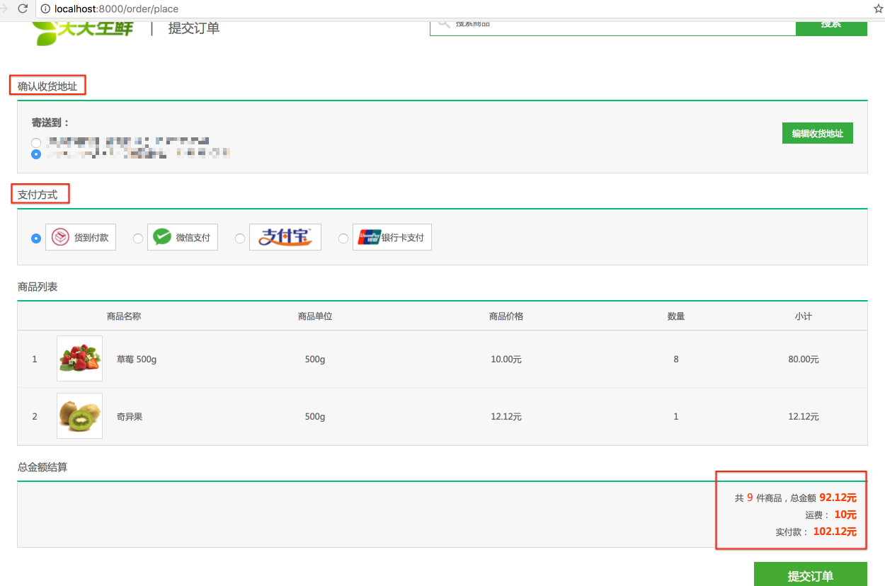

# 17、 订单提交与创建实现


在上一章的购物车页面功能实现中我们还没有实现提交订单(点击`去结算`)这一功能，这一章我们来实现此功能，并实现创建订单功能。

## 17.1 订单提交

我们在设计购物流程时是这么考虑的：在用户点击去结算后，跳转至订单确认页面，确认完地址、支付方式等信息后，再点击提交订单来创建订单。如下图所示：



### 1）订单提交URL配置

```python
# /order/place
from django.conf.urls import url
from apps.order.views import OrderPlaceView

url(r'^place$', OrderPlaceView.as_view(), name='place'), # 提交订单页面
```

### 2）购物车页面的去结算按钮功能实现提交订单

从购物车页面中可以看到，我们需要传递给创建订单页面功能的信息有被选中的商品信息。仅此而已。

​	那么我们可以在前端将购物车页面中的购物车商品显示部分的所有`ul`标签内容全部放入一个表单`form`中，然后将每个`ul`标签里的input标签状态进行获取，凡是被选中的均获取其对应的`商品id`。待后端获取到所有选中的`商品id`后，通过查询购物车记录来生成其他信息。

```html
{# 将要购买的商品列表放置在表单中，其请求方式为post，请求路径为/order/place #}
<form method="post" action="">
    
	<ul class="cart_list_td clearfix">
        {# input标签的名称为sku_ids，值为当前商品id(sku.id) #}
		<li class="col01"><input type="checkbox" name="sku_ids" value="{{ sku.id }}" checked></li>
		<li class="col02"></li>
		<li class="col03">{{ sku.name }}<br><em>{{ sku.price }}元/{{ sku.unite }}</em></li>
		<li class="col04">{{ sku.unite }}</li>
		<li class="col05">{{ sku.price }}元</li>
		<li class="col06">
			<div class="num_add">
				<a href="javascript:;" class="add fl">+</a>
				<input type="text" sku_id="{{ sku.id }}" class="num_show fl" value="{{ sku.count }}">
				<a href="javascript:;" class="minus fl">-</a>	
			</div>
		</li>
		<li class="col07">{{ sku.amount }}元</li>
		<li class="col08"><a href="javascript:;">删除</a></li>
	</ul>
	

	<ul class="settlements">
        { % csrf_token % }
		<li class="col01"><input type="checkbox" name="" checked=""></li>
		<li class="col02">全选</li>
		<li class="col03">合计(不含运费)：<span>¥</span><em>{{ total_amount }}</em><br>共计<b>{{ total_count }}</b>件商品</li>
        {# submit input标签 #}
		<li class="col04"><input type="submit" value="去结算" style="width: 150px; height: 50px; background-color: #37ab40; font-size: 20px; color: #fff"></li>
	</ul>
    </form>
```

### 3）后端类视图

可以从2）中看到，前端发给后方的是一个sku_ids参数，里面包含了将要床架内的订单包含的所有商品id信息。我们此时仅需解析出这些商品id信息，然后获取各自的购物信息；再通过获取地址信息，然后就可实现订单创建页面`place_order.html`的显示。

业务逻辑：

- 用户校验——`LoginRequiredMixin`
- 解析提交时被选中的商品id，并进行商品id校验
- 获取所有收货地址
- 获取商品购物车信息
- 运费、总金额等计算
- 模板渲染，并返回响应

```python
from django.shortcuts import render,redirect
from django.views.generic import View
from utils.mixin import LoginRequiredMixin
from django.core.urlresolvers import reverse

from apps.user.models import Address
from apps.goods.models import GoodsSKU

from django_redis import get_redis_connection
# 提交订单页面视图
# /order/place
class OrderPlaceView(LoginRequiredMixin, View):
    """提交订单页面"""
    def post(self, request):
        # 获取用户
        user = request.user

        # 获取提交时被选中的商品id
        sku_ids = request.POST.getlist('sku_ids')

        # 若没有商品，则直接跳回首页
        if len(sku_ids) == 0:
            return redirect(reverse('goods:index'))

        # 获取收货地址

        addrs = Address.objects.filter(user=user)

        # 拼接key
        cart_key = 'cart_%d' % user.id

        # 连接redis
        conn = get_redis_connection('default')
        # 遍历sku_ids获取用户所要购买的商品的信息
        skus = []
        total_count = 0
        total_amount = 0
        for sku_id in sku_ids:
            # 根据id查找商品的信息
            sku = GoodsSKU.objects.get(id=sku_id)

            # 从redis中获取用户所要购买的商品的数量
            count = conn.hget(cart_key, sku_id)

            # 计算商品的小计
            amount = sku.price * int(count)

            # 给sku对象增加属性count和amount
            # 分别保存用户要购买的商品的数目和小计
            sku.count = count
            sku.amount = amount

            # 追加商品的信息
            skus.append(sku)

            # 累加计算用户要购买的商品的总件数和总金额
            total_count += int(count)
            total_amount += amount

        # 运费: 运费表: 100-200  假设为10
        transit_price = 10

        # 实付款
        total_pay = total_amount + transit_price

        # 组织模板上下文
        context = {
            'addrs': addrs,
            'skus': skus,
            'total_count': total_count,
            'total_amount': total_amount,
            'transit_price': transit_price,
            'total_pay': total_pay,
            'sku_ids': ','.join(sku_ids)
        }

        # 使用模板
        return render(request, 'place_order.html', context)
```

### 4）`place_order.html`模板

地址信息显示：显示所有地址信息，默认地址在显示时默认选中

```html
<div class="common_list_con clearfix">
		<dl>
			<dt>寄送到：</dt>
            
			<dd><input type="radio" name="addr_id" value="{{ addr.id }}" checked="">{{ addr.addr }}（{{ addr.receiver }} 收） {{ addr.phone }}</dd>
		    
        </dl>
		<a href="" class="edit_site">编辑收货地址</a>

	</div>
```

订单商品列表显示：

```html
	
		<ul class="goods_list_td clearfix">
			<li class="col01">{{ forloop.counter }}</li>
			<li class="col02"></li>
			<li class="col03">{{ sku.name }}</li>
			<li class="col04">{{ sku.unite }}</li>
			<li class="col05">{{ sku.price }}元</li>
			<li class="col06">{{ sku.count }}</li>
			<li class="col07">{{ sku.amount }}元</li>
		</ul>
    
```

总金额部分显示：

```html
<div class="common_list_con clearfix">
		<div class="settle_con">
			<div class="total_goods_count">共<em>{{ total_count }}</em>件商品，总金额<b>{{ total_amount }}元</b></div>
			<div class="transit">运费：<b>{{ transit_price }}元</b></div>
			<div class="total_pay">实付款：<b>{{ total_pay }}元</b></div>
		</div>
	</div>
```

## 17.2 创建订单

在完成订单确认页面的显示后，我们需要完成点击`提交订单`来实现创建订单的功能模块。

我们这么来实现此功能：

- 通过点击操作进行AJAX来post请求将相关数据（地址、支付方式、商品id）通过创建订单路径`/order/commit`发送给后端

- 后端对数据进行校验后，**向订单信息表`df_order_info`添加订单信息数据，向订单商品表`df_order_goods`**

  **添加订单包含的商品数据**

  - 若数据校验失败，则返回约定好的json数据，然后前端执行相应的错误操作

- 订单相关信息保存成功后，删除购物车中对应商品的记录数据

- 向前端传递创建成功json数据`{'res': 5, 'errmsg': '订单创建成功'}`

- 前端接收到成功信号，弹出床架你成功框，然后待用户点击确定后跳转至用户中心（全部订单）页面，随后便是支付操作。

> 注：全部订单页面在下一章（18章）实现，支付则在第20章实现。

### 1）前端模板代码

我们通过将点击操作关联到一个表单提交操作，该表单包含要创建的订单中的所有商品id`sku_ids`，我们仅需在后台查询购物数据即可。

```html
<div class="order_submit clearfix">
        { % csrf_token % }
		<a href="javascript:;" sku_ids="{{ sku_ids }}" id="order_btn">提交订单</a>
</div>	
```

### 2）前端js代码

```javascript
$('#order_btn').click(function() {
            // 获取用户选择的收件地址id, 支付方式，用户所要购买的全部商品的id
            var addr_id = $('input[name="addr_id"]:checked').val();
            var pay_method = $('input[name="pay_style"]:checked').val();
            var sku_ids = $(this).attr('sku_ids');

            // 组织参数
            var csrf = $('input[name="csrfmiddlewaretoken"]').val();
            var params = {
                'addr_id': addr_id,
                'pay_method': pay_method,
                'sku_ids': sku_ids,
                'csrfmiddlewaretoken': csrf
            }
            // 发起ajax post请求，访问/order/commit
            // 传递参数：addr_id pay_method sku_ids
            $.post('/order/commit', params, function (data) {
                if (data.res == 5) {
                    // alert('订单创建成功');
                    localStorage.setItem('order_finish',2);

                    $('.popup_con').fadeIn('fast', function() {

                        setTimeout(function(){
                            $('.popup_con').fadeOut('fast',function(){
                                // 成功后跳转至全部订单页去支付
                                window.location.href = "";
                            });
                        },3000)

                    });
                }
                else {
                    alert(data.errmsg);
                }
            });

		});
```

### 3）后端类视图代码实现

```python
from django.http import JsonResponse
from django.views.generic import View

from apps.goods.models import GoodsSKU
from apps.order.models import OrderInfo, OrderGoods

from django_redis import get_redis_connection


class OrderCommitView(View):

    """订单创建"""
    def post(self, request):
        # 判断用户是否登录
        user = request.user
        if not user.is_authenticated():
            return JsonResponse({'res': 0, 'errmsg': '用户未登录'})

        # 接收参数
        addr_id = request.POST.get('addr_id')
        pay_method = request.POST.get('pay_method')
        # 以,分隔的字符串 3,4，对应于订单提交类视图中的设计约定
        sku_ids = request.POST.get('sku_ids')

        # 参数校验
        if not all([addr_id, pay_method, sku_ids]):
            return JsonResponse({'res': 1, 'errmsg': '参数不完整'})

        # 校验地址id
        try:
            addr = Address.objects.get(id=addr_id)
        except Address.DoesNotExist:
            return JsonResponse({'res': 2, 'errmsg': '地址信息错误'})

        # 校验支付方式
        if pay_method not in OrderInfo.PAY_METHODS.keys():
            return JsonResponse({'res': 3, 'errmsg': '非法的支付方式'})

        # 组织订单信息
        # 组织订单id: 20180316115930+用户id
        from datetime import datetime
        order_id = datetime.now().strftime("%Y%m%d%H%M%S") + str(user.id)

        # 运费，假设为固定10元运费
        transit_price = 10

        # 总数目和总价格
        total_count = 0
        total_price = 0

        # 向df_order_info中添加一条订单信息记录
        order = OrderInfo.objects.create(
            order_id=order_id,
            user=user,
            addr=addr,
            pay_method=pay_method,
            total_count=total_count,
            total_price=total_price,
            transit_price=transit_price
        )

        # 订单中包含几个商品需要向df_order_goods中添加几条记录
        # 获取redis链接
        conn = get_redis_connection('default')
        # 拼接key
        cart_key = 'cart_%d' % user.id

        # 将sku_ids分割成一个列表
        # 以,分隔的字符串 3,4，对应于订单提交类视图中的设计约定
        sku_ids = sku_ids.split(',') # [3,4]

        # 遍历sku_ids，向df_order_goods中添加记录
        for sku_id in sku_ids:
            # 根据id获取商品的信息
            try:
                sku = GoodsSKU.objects.get(id=sku_id)
            except GoodsSKU.DoesNotExist:
                return JsonResponse({'res': 4, 'errmsg': '商品信息错误'})

            # 从redis中获取用户要购买的商品的数量
            count = conn.hget(cart_key, sku_id)

            # 向df_order_goods中添加订单单个商品记录
            OrderGoods.objects.create(
                order=order,
                sku=sku,
                count=count,
                price=sku.price
            )

            # 减少商品库存，增加销量
            sku.stock -= int(count)
            sku.sales += int(count)
            sku.save()

            # 累加计算订单中商品的总数目和总价格
            total_count += int(count)
            total_price += sku.price*int(count)

        # 更新保存订单信息表中的商品总数目和总价格
        order.total_count = total_count
        order.total_price = total_price
        order.save()

        # 删除购物车中对应的记录
        # hdel(key, *args)
        conn.hdel(cart_key, *sku_ids)

        # 返回应答
        return JsonResponse({'res': 5, 'errmsg': '订单创建成功'})
```

