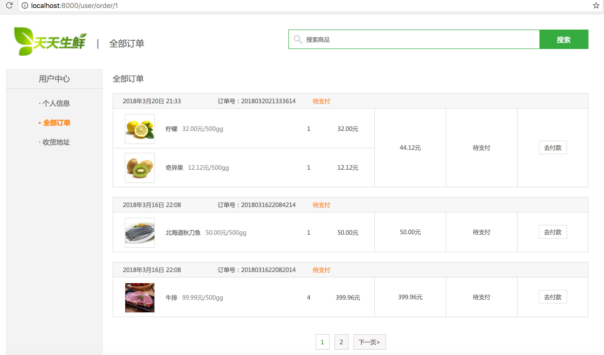

# 18、用户中心页——全部订单



如上图所示，为全部订单页的显示内容，可以看出和用户中心地址页和用户中心个人信息页不同的是右边显示的为所有的订单信息。

- URL配置：

  - ```python
    url(r'^order/(?P<page>(\d)*)$', UserOrderView.as_view(), name='order'),  # 用户中心-订单页
    ```

  - URL中传递当前页码信息


- 每条订单信息来自数据库中订单信息表`df_order_info`中查询的结果，并且以分页的形式按照订单创建时间顺序由近到远的方式排列。


- 每条订单内的商品下单时的信息来自数据库中订单商品表`df_order_goods`中查询的结果。

## 18.1 后端类视图

业务逻辑：

- 用户校验——LoginRequiredMixin
- 查询所有订单
- 分页查询操作
- 模板渲染并响应

```python
from django.views.generic import View
from utils.mixin import LoginRequiredMixin

from apps.order.models import OrderInfo, OrderGoods
from django.shortcuts import render


# /user/order
class UserOrderView(LoginRequiredMixin, View):
    """用户中心-订单页"""

    def get(self, request, page):
        """显示"""
        # 获取登录用户
        user = request.user
        # 查询所有订单
        info_msg = 1   # 若有订单则为1
        try:
            order_infos = OrderInfo.objects.filter(user=user).order_by('-create_time')
        except OrderInfo.DoesNotExist :
            info_msg = 0

        for order_info in order_infos:
            order_goods = OrderGoods.objects.filter(order=order_info)
            for order_good in order_goods:
                # 商品小计
                amount = order_good.price * order_good.count
                order_good.amount = amount
            order_info.order_goods = order_goods
            order_info.status = order_info.ORDER_STATUS_CHOICES[order_info.order_status-1][1]

        # 分页操作
        from django.core.paginator import Paginator
        paginator = Paginator(order_infos, 3)

        # 处理页码
        page = int(page)

        if page > paginator.num_pages:
            # 默认获取第1页的内容
            page = 1

        # 获取第page页内容, 返回Page类的实例对象
        order_infos_page = paginator.page(page)

        # 页码处理
        # 如果分页之后页码超过5页，最多在页面上只显示5个页码：当前页前2页，当前页，当前页后2页
        # 1) 分页页码小于5页，显示全部页码
        # 2）当前页属于1-3页，显示1-5页
        # 3) 当前页属于后3页，显示后5页
        # 4) 其他请求，显示当前页前2页，当前页，当前页后2页
        num_pages = paginator.num_pages
        if num_pages < 5:
            # 1-num_pages
            pages = range(1, num_pages + 1)
        elif page <= 3:
            pages = range(1, 6)
        elif num_pages - page <= 2:
            # num_pages-4, num_pages
            pages = range(num_pages - 4, num_pages + 1)
        else:
            # page-2, page+2
            pages = range(page - 2, page + 3)

        context = {
            'page': 'order',
            'order_infos': order_infos,
            'info_msg': info_msg,
            'pages' : pages,
            'order_infos_page': order_infos_page
        }
        return render(request, 'user_center_order.html', context)
```

## 18.2 前端模板

所有订单显示部分：

```html
<h3 class="common_title2">全部订单</h3>
                {#  查询df_order_info 数据表，列出所有订单信息  #}
                
                    
                        {# 显示订单 #}
                        <ul class="order_list_th w978 clearfix">
                            <li class="col01">{{ order_info.create_time }}</li>
                            <li class="col02">订单号：{{ order_info.order_id }}</li>
                            <li class="col02 stress">{{ order_info.status }}</li>
                        </ul>

                        <table class="order_list_table w980">
                            <tbody>
                                <tr>
                                    <td width="55%">
                                        
                                            {# 显示订单商品 #}
                                            <ul class="order_goods_list clearfix">
                                            <li class="col01"></li>
                                            <li class="col02">{{ order_good.sku.name }}<em>{{ order_good.sku.price }}元/{{ order_good.sku.unite }}g</em></li>
                                            <li class="col03">{{ order_good.count }}</li>
                                            <li class="col04">{{ order_good.amount }}元</li>
                                        </ul>
                                        


                                    </td>
                                    <td width="15%">{{ order_info.total_price }}元</td>
                                    <td width="15%">{{ order_info.status }}</td>
                                    <td width="15%"><a href="#" class="oper_btn">去付款</a></td>
                                </tr>
                            </tbody>
                        </table>
                    
                
                    您暂无订单
                
```

底部分页导航栏部分：

```html
<div class="pagenation">
                
				<a href="">&lt;上一页</a>
                
                
				<a href="" class="active">{{ pindex }}</a>
				
                
				<a href="">下一页&gt;</a>
                
			    </div>
```

