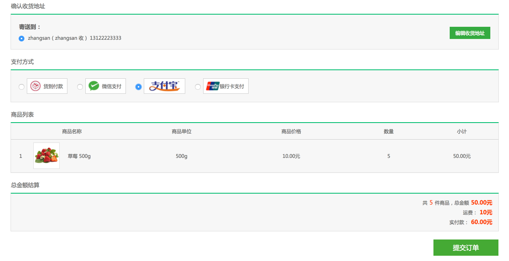
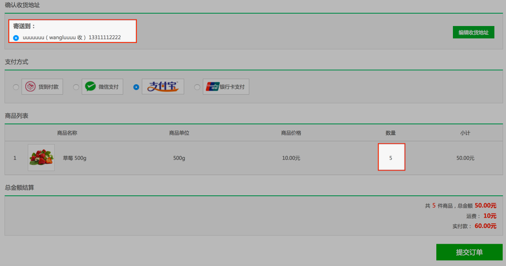
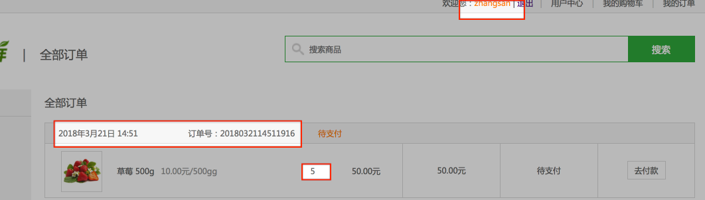
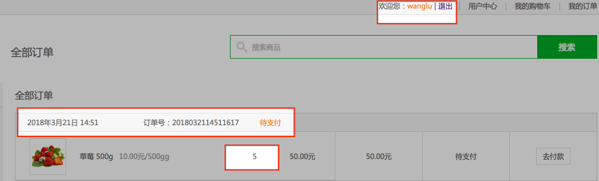
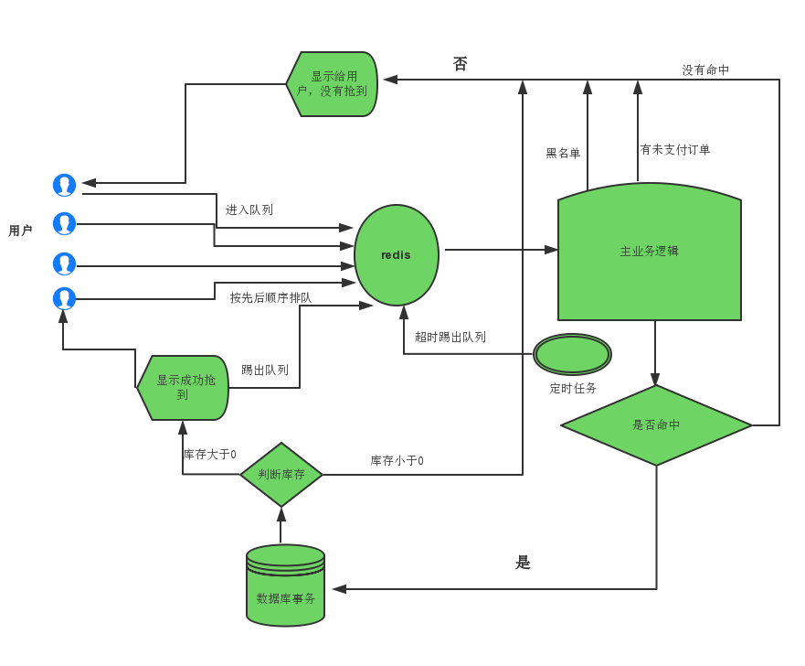

# 19、Django数据库事务——用户并发下单问题

第17章里我们完成了创建订单的功能，但它并没有考虑多个用户同时对同一个商品下单时库存的问题。

假如，商品的库存还有10件，2人同时下订单，每人买5件，2人下单都成功后商品库存可能还有5件；或者三个人同时下订单，每人买五件，每个人都下单成功，但库存是负的。

我们为了模拟2人同时下单的情况，修改第17章创建订单的视图函数`OrderCommitView`：

在其中要进行向订单信息表增加一段延时代码片段，这样可以保证两个订单在向`df_order_goods`中添加一条记录时为并发：

```python
			# 从redis中获取用户要购买的商品的数量
            count = conn.hget(cart_key, sku_id)
            # 模拟订单并发问题
            print('user: %d' % user.id)   # 打印创建订单的用户ID
            import time
            time.sleep(10)
            
            
            # 向df_order_goods中添加一条记录
            OrderGoods.objects.create(
                order=order,
                sku=sku,
                count=count,
                price=sku.price
            )
```

这时修改后台数据库，将商品id为1的草莓商品库存设置为10：

```
mysql> update df_goods_sku set stock=10 where id=1;
Query OK, 1 row affected (0.00 sec)
Rows matched: 1  Changed: 1  Warnings: 0

mysql> select * from df_goods_sku where id=1 \G;
*************************** 1. row ***************************
         id: 1
create_time: 2017-11-15 03:10:14.045538
update_time: 2018-03-21 06:40:31.013426
  is_delete: 0
       name: 草莓 500g
       desc: 草莓简介
      price: 10.00
      unite: 500g
      image: group1/M00/00/00/rBCzg1oKqFGAR2tjAAAljHPuXJg4272079
      stock: 10
      sales: 25
     status: 1
   goods_id: 1
category_id: 1
1 row in set (0.00 sec)
```

然后同时用`zhangsan`、`wanglu`两个用户账号各下5件草莓商品的订单：





同时点击提交，两个账户订单均提交成功并返回到全部订单页面:

- 在服务器运行终端窗口也可看到我们打印显示的用户账户ID。
- 在订单页面也可以分别看到两个订单为同时创建的。

```
# 终端显示信息截取片段：

user: 17 
user: 16
Building prefix dict from the default dictionary ...
Loading model from cache /var/folders/6y/kjgmpy6n1kl93r4tykvrcj1h0000gn/T/jieba.cache
Loading model cost 0.738 seconds.
Prefix dict has been built succesfully.
[21/Mar/2018 14:51:27]"POST /order/commit HTTP/1.1" 200 60
[21/Mar/2018 14:51:29]"POST /order/commit HTTP/1.1" 200 60
[21/Mar/2018 14:51:31]"GET /user/order/1 HTTP/1.1" 200 7429
[21/Mar/2018 14:51:32]"GET /user/order/1 HTTP/1.1" 200 7431

# 通过数据库查询，可以看到，17和16两个用户id对应的正是wanglu和zhangsan
---------------------------------
mysql> select username,id from df_user where id=16 or id=17;
+----------+----+
| username | id |
+----------+----+
| wanglu   | 17 |
| zhangsan | 16 |
+----------+----+
```





接下来我们查询一下后台该商品的库存量：

```
mysql> select * from df_goods_sku where id=1 \G;
*************************** 1. row ***************************
         id: 1
create_time: 2017-11-15 03:10:14.045538
update_time: 2018-03-21 06:51:29.130470
  is_delete: 0
       name: 草莓 500g
       desc: 草莓简介
      price: 10.00
      unite: 500g
      image: group1/M00/00/00/rBCzg1oKqFGAR2tjAAAljHPuXJg4272079
      stock: 5
      sales: 30
     status: 1
   goods_id: 1
category_id: 1
1 row in set (0.00 sec)
```

还有5件库存。明明两个订单消耗了10件商品，此时应该库存为0呀。这肯定是不允许的。这就涉及到应用系统和数据库对事件并发的处理了。那么我们先看看数据库MYSQL中是如何处理并发问题的？

## 19.1 MYSQL事务并处理

> 关于mysql事务的基本概念请查看数据库部分的mysql基础中的mysql高级了解章节，这里不再叙述

### 1）事务的并发问题

- **脏读**：事务A读取了事务B更新的数据，然后B回滚操作，那么A读取到的数据是脏数据


- **不可重复读**：事务 A 多次读取同一数据，事务 B 在事务A多次读取的过程中，对数据作了更新并提交，导致事务A多次读取同一数据时，结果 不一致。


- **幻读**：系统管理员A将数据库中所有学生的成绩从具体分数改为ABCDE等级，但是系统管理员B就在这个时候插入了一条具体分数的记录，当系统管理员A改结束后发现还有一条记录没有改过来，就好像发生了幻觉一样，这就叫幻读。

### 2）事务隔离级别

MYSQL为了解决并发问题，其数据库底层设计了几种隔离级别来解决存在的事务并发问题。

| 事务隔离级别                 | 脏读 | 不可重复读 | 幻读 |
| ---------------------------- | ---- | ---------- | ---- |
| 读未提交（read-uncommitted） | 是   | 是         | 是   |
| 不可重复读（read-committed） | 否   | 是         | 是   |
| 可重复读（repeatable-read）  | 否   | 否         | 是   |
| 串行化（serializable）       | 否   | 否         | 否   |

> mysql默认的事务隔离级别为`repeatable-read`
>
> ```
> mysql> select @@tx_isolation;
> +-----------------+
> | @@tx_isolation  |
> +-----------------+
> | REPEATABLE-READ |
> +-----------------+
> ```

### 3）实例分析几种隔离级别的含义

在实例分析前，我们创建了一个名为`money`的数据表，如下：

```
mysql> select * from money;
+----+--------+--------+
| id | name   | number |
+----+--------+--------+
|  1 | 张三   |    500 |
|  2 | 李四   |   1000 |
|  3 | 王无   |   1200 |
+----+--------+--------+
```

#### 1、`read-uncommitted`

- 打开两个客户端A和B，并设置其当前事务模式为`read uncommitted`，然后查询该表，可以看到二者查询到的数据和原始数据相同。

```
mysql> set session transaction isolation level read uncommitted;
Query OK, 0 rows affected (0.00 sec)

mysql> start transaction;
Query OK, 0 rows affected (0.00 sec)

mysql> select * from money;
+----+--------+--------+
| id | name   | number |
+----+--------+--------+
|  1 | 张三   |    500 |
|  2 | 李四   |   1000 |
|  3 | 王无   |   1200 |
+----+--------+--------+
3 rows in set (0.00 sec)
```

- 然后通过客户端B来更改张三的钱为400

```
mysql> update money set number = 400 where id = 1;
Query OK, 1 row affected (0.00 sec)
Rows matched: 1  Changed: 1  Warnings: 0

mysql> select * from money;
+----+--------+--------+
| id | name   | number |
+----+--------+--------+
|  1 | 张三   |    400 |
|  2 | 李四   |   1000 |
|  3 | 王无   |   1200 |
+----+--------+--------+
3 rows in set (0.00 sec)
```

- 此时，客户端B的事务还未提交，由客户端A再来查询一下表数据，可以看到从客户端A中立马就可以查询到客户端B所做的修改。

```
mysql> select * from money;
+----+--------+--------+
| id | name   | number |
+----+--------+--------+
|  1 | 张三   |    500 |
|  2 | 李四   |   1000 |
|  3 | 王无   |   1200 |
+----+--------+--------+
3 rows in set (0.00 sec)
-----------------------------------
mysql> select * from money;
+----+--------+--------+
| id | name   | number |
+----+--------+--------+
|  1 | 张三   |    400 |
|  2 | 李四   |   1000 |
|  3 | 王无   |   1200 |
+----+--------+--------+
3 rows in set (0.00 sec)
```

- 此时，我们回滚客户端B中的操作

```
mysql> select * from money;
+----+--------+--------+
| id | name   | number |
+----+--------+--------+
|  1 | 张三   |    400 |
|  2 | 李四   |   1000 |
|  3 | 王无   |   1200 |
+----+--------+--------+
3 rows in set (0.00 sec)

mysql> rollback;
Query OK, 0 rows affected (0.00 sec)

mysql> select * from money;
+----+--------+--------+
| id | name   | number |
+----+--------+--------+
|  1 | 张三   |    500 |
|  2 | 李四   |   1000 |
|  3 | 王无   |   1200 |
+----+--------+--------+
3 rows in set (0.00 sec)
```

- 再在客户端A中查询，数据又恢复为500。此时客户端A的用户肯定会疑惑的，自己并未修改此数据，怎么发生了变化。

```
mysql> select * from money;
+----+--------+--------+
| id | name   | number |
+----+--------+--------+
|  1 | 张三   |    400 |
|  2 | 李四   |   1000 |
|  3 | 王无   |   1200 |
+----+--------+--------+
3 rows in set (0.00 sec)

mysql> select * from money;
+----+--------+--------+
| id | name   | number |
+----+--------+--------+
|  1 | 张三   |    500 |
|  2 | 李四   |   1000 |
|  3 | 王无   |   1200 |
+----+--------+--------+
3 rows in set (0.00 sec)
```

我们称这一例子中客户端A所获取到的数据`400`为`脏数据`。要想解决这一问题，我们必须保证其他客户端正在修改但并未提交的数据不应该被本客户端获取，这就需要上升事务隔离级别为`read-committed`。

#### 2、`read-committed`

- 同样，打开两个客户端A和B，并设置其当前事务模式为`read committed`，然后查询该表，可以看到二者查询到的数据和原始数据相同。

```
mysql> set session transaction isolation level read committed;
Query OK, 0 rows affected (0.00 sec)

mysql> start transaction;
Query OK, 0 rows affected (0.00 sec)

mysql> select * from money;
+----+--------+--------+
| id | name   | number |
+----+--------+--------+
|  1 | 张三   |    500 |
|  2 | 李四   |   1000 |
|  3 | 王无   |   1200 |
+----+--------+--------+
3 rows in set (0.00 sec)
```

- 然后通过客户端B来更改张三的钱为400

```
mysql> update money set number = 400 where id = 1;
Query OK, 1 row affected (0.00 sec)
Rows matched: 1  Changed: 1  Warnings: 0

mysql> select * from money;
+----+--------+--------+
| id | name   | number |
+----+--------+--------+
|  1 | 张三   |    400 |
|  2 | 李四   |   1000 |
|  3 | 王无   |   1200 |
+----+--------+--------+
3 rows in set (0.00 sec)
```

- 此时，客户端B的事务还未提交，由客户端A再来查询一下表数据，可以看到从客户端A中没有看到客户端B中的修改，解决了`脏数据读取`问题

```
mysql> select * from money;
+----+--------+--------+
| id | name   | number |
+----+--------+--------+
|  1 | 张三   |    500 |
|  2 | 李四   |   1000 |
|  3 | 王无   |   1200 |
+----+--------+--------+
3 rows in set (0.00 sec)

mysql> select * from money;
+----+--------+--------+
| id | name   | number |
+----+--------+--------+
|  1 | 张三   |    500 |
|  2 | 李四   |   1000 |
|  3 | 王无   |   1200 |
+----+--------+--------+
3 rows in set (0.01 sec)
```

- 然后从客户端B中提交刚才的事务

```
mysql> update money set number = 400 where id = 1;
Query OK, 1 row affected (0.00 sec)
Rows matched: 1  Changed: 1  Warnings: 0

mysql> select * from money;
+----+--------+--------+
| id | name   | number |
+----+--------+--------+
|  1 | 张三   |    400 |
|  2 | 李四   |   1000 |
|  3 | 王无   |   1200 |
+----+--------+--------+
3 rows in set (0.00 sec)

mysql> commit;
Query OK, 0 rows affected (0.00 sec)

mysql> select * from money;
+----+--------+--------+
| id | name   | number |
+----+--------+--------+
|  1 | 张三   |    400 |
|  2 | 李四   |   1000 |
|  3 | 王无   |   1200 |
+----+--------+--------+
3 rows in set (0.00 sec)
```

- 再在客户端A的当前事务中查询表数据，发现数据发生了变化，但客户端A的用户未在当前事务中修改该数据为400 。这就引发了同一事务中的数据重复读取不一致问题，即`不可重复读`的问题。

```
mysql> select * from money;
+----+--------+--------+
| id | name   | number |
+----+--------+--------+
|  1 | 张三   |    500 |
|  2 | 李四   |   1000 |
|  3 | 王无   |   1200 |
+----+--------+--------+
3 rows in set (0.01 sec)

mysql> select * from money;
+----+--------+--------+
| id | name   | number |
+----+--------+--------+
|  1 | 张三   |    400 |
|  2 | 李四   |   1000 |
|  3 | 王无   |   1200 |
+----+--------+--------+
3 rows in set (0.00 sec)
```

如何解决事务并发时的`不可重复读`问题呢？我们需要把事务隔离级别进一步上升为MYSQL默认的事务隔离级别`repeatable read`。

#### 3、`repeatable-read`

- 同样，打开两个客户端A和B，并设置其当前事务模式为`repeatable-read`，然后查询该表，可以看到二者查询到的数据和原始数据相同。

```
mysql> set session transaction isolation level repeatable read;
Query OK, 0 rows affected (0.00 sec)

mysql> start transaction;
Query OK, 0 rows affected (0.00 sec)

mysql> select * from money;
+----+--------+--------+
| id | name   | number |
+----+--------+--------+
|  1 | 张三   |    400 |
|  2 | 李四   |   1000 |
|  3 | 王无   |   1200 |
+----+--------+--------+
3 rows in set (0.00 sec)
```

- 然后通过客户端B来更改张三的钱为450

```
mysql> update money set number = 450 where id = 1;
Query OK, 1 row affected (0.01 sec)
Rows matched: 1  Changed: 1  Warnings: 0

mysql> select * from money;
+----+--------+--------+
| id | name   | number |
+----+--------+--------+
|  1 | 张三   |    450 |
|  2 | 李四   |   1000 |
|  3 | 王无   |   1200 |
+----+--------+--------+
```

- 此时，客户端B的事务还未提交，由客户端A再来查询一下表数据，仍为400

```
mysql> select * from money;
+----+--------+--------+
| id | name   | number |
+----+--------+--------+
|  1 | 张三   |    400 |
|  2 | 李四   |   1000 |
|  3 | 王无   |   1200 |
+----+--------+--------+
3 rows in set (0.00 sec)
```

- 然后从客户端B中提交刚才的事务

```
mysql> update money set number = 450 where id = 1;
Query OK, 1 row affected (0.01 sec)
Rows matched: 1  Changed: 1  Warnings: 0

mysql> select * from money;
+----+--------+--------+
| id | name   | number |
+----+--------+--------+
|  1 | 张三   |    450 |
|  2 | 李四   |   1000 |
|  3 | 王无   |   1200 |
+----+--------+--------+
3 rows in set (0.00 sec)

mysql> commit;
Query OK, 0 rows affected (0.01 sec)

mysql> select * from money;
+----+--------+--------+
| id | name   | number |
+----+--------+--------+
|  1 | 张三   |    450 |
|  2 | 李四   |   1000 |
|  3 | 王无   |   1200 |
+----+--------+--------+
3 rows in set (0.00 sec)
```

- 再在客户端A的当前事务中查询表数据，仍旧为400 。解决了同一事务的数据`不可重复读`问题。

```
mysql> select * from money;
+----+--------+--------+
| id | name   | number |
+----+--------+--------+
|  1 | 张三   |    400 |
|  2 | 李四   |   1000 |
|  3 | 王无   |   1200 |
+----+--------+--------+
3 rows in set (0.00 sec)
```

- 从客户端A提交当前事务，并查询表数据，会发现张三的钱变成了450 。这会让客户端A的用户认为刚才事务中操作时读取的数据不对，即产生幻觉。我们称之为`幻读`。

```
mysql> select * from money;
+----+--------+--------+
| id | name   | number |
+----+--------+--------+
|  1 | 张三   |    400 |
|  2 | 李四   |   1000 |
|  3 | 王无   |   1200 |
+----+--------+--------+
3 rows in set (0.00 sec)

mysql> commit;
Query OK, 0 rows affected (0.00 sec)

mysql> select * from money;
+----+--------+--------+
| id | name   | number |
+----+--------+--------+
|  1 | 张三   |    450 |
|  2 | 李四   |   1000 |
|  3 | 王无   |   1200 |
+----+--------+--------+
3 rows in set (0.00 sec)
```

如何解决事件并发的`幻读`问题呢？那就需要进一步提升事件隔离级别为`serializable`。

#### 4、`serializable`

- 同样，打开两个客户端A和B，并设置其当前事务模式为`serializable`，然后查询该表，可以看到二者查询到的数据和原始数据相同。

```
mysql> set session transaction isolation level serializable;
Query OK, 0 rows affected (0.00 sec)

mysql> start transaction;
Query OK, 0 rows affected (0.00 sec)

mysql> select * from money;
+----+--------+--------+
| id | name   | number |
+----+--------+--------+
|  1 | 张三   |    450 |
|  2 | 李四   |   1000 |
|  3 | 王无   |   1200 |
+----+--------+--------+
3 rows in set (0.00 sec)
```

- 然后通过客户端B来更改张三的钱为500

```
mysql> select * from money;
+----+--------+--------+
| id | name   | number |
+----+--------+--------+
|  1 | 张三   |    450 |
|  2 | 李四   |   1000 |
|  3 | 王无   |   1200 |
+----+--------+--------+
3 rows in set (0.00 sec)

mysql> update money set number = 500 where id = 1;
Query OK, 1 row affected (47.01 sec)
Rows matched: 1  Changed: 1  Warnings: 0

mysql> select * from money;
+----+--------+--------+
| id | name   | number |
+----+--------+--------+
|  1 | 张三   |    500 |
|  2 | 李四   |   1000 |
|  3 | 王无   |   1200 |
+----+--------+--------+
3 rows in set (0.00 sec)
```

- 再在客户端A中修改数据，会报错，提示表被锁，无法插入

```
mysql> update money set number = 600 where id = 1;
ERROR 1205 (HY000): Lock wait timeout exceeded; try restarting transaction
```

这就可以解决数据读取重复性的问题了。

### 4）总结：

- 　mysql中默认事务隔离级别是可重复读时并不会锁住读取到的行


- 　事务隔离级别为读提交时，写数据只会锁住相应的行


- 　事务隔离级别为可重复读时，写数据会锁住整张表


- 　事务隔离级别为串行化时，读写数据都会锁住整张表


- 　隔离级别越高，越能保证数据的完整性和一致性，但是对并发性能的影响也越大，鱼和熊掌不可兼得。


​	对于多数应用程序，可以优先考虑把数据库系统的隔离级别设为`Read Committed`，它能够避免脏读取，而且具有较好的并发性能。但是它会导致不可重复读、幻读这些并发问题。这些问题我们可以由应用程序等采用悲观锁或乐观锁来控制。接下来我们介绍悲观锁和乐观锁。

> 数据库系统的自定义隔离级别配置：
>
> linux：
>
> ```
> 打开mysql配置文件: sudo vi /etc/mysql/mysql.conf.d/mysqld.cnf,
> 增加：
> transaction-isolation = READ-COMMITTED
>
> 例如：
>  # The MySQL server   
>  [mysqld]
>  # 设置隔离级别
>  transaction-isolation = READ-COMMITTED
>  
>  default-storage-engine=INNODB
>  character-set-server=utf8
>  collation-server=utf8_general_ci
>  port        = 3306
>  pid-file    = /var/run/mysqld/mysqld.pid
>  socket      = /var/run/mysqld/mysqld.sock
>
> ```
>
> mac：
>
> ```
> As of MySQL 5.7.18, my-default.ini is no longer included in or installed by distribution packages
> ```
>
> 所以需要在`/etc/`目录下自建名为`my.cnf`的 文件，配置内容与linux相同。
>
> 配置成功后需查看事务隔离级别是否修改ok：
>
> ```
> mysql> select @@tx_isolation;
> +----------------+
> | @@tx_isolation |
> +----------------+
> | READ-COMMITTED |
> +----------------+
> ```


## 19.2 悲观锁与乐观锁

### 1) 悲观锁

​	正如其名，它指的是对数据被外界（包括本系统当前的其他事务，以及来自外部系统的事务处理）修改持保守态度，因此，在整个数据处理过程中，将数据处于锁定状态。悲观锁的实现，往往依靠数据库提供的锁机制（也只有数据库层提供的锁机制才能真正保证数据访问的排他性，否则，即使在本系统中实现了加锁机制，也无法保证外部系统不会修改数据）。

#### 悲观锁实例

- 首先，将事务隔离级别设置为`READ-COMMITTED`，然后通过客户端A和客户端B进入事务，查询数据

```
mysql> begin;
Query OK, 0 rows affected (0.00 sec)

mysql> select * from money;
+----+--------+--------+
| id | name   | number |
+----+--------+--------+
|  1 | 张三   |    500 |
|  2 | 李四   |   1000 |
|  3 | 王无   |   1200 |
+----+--------+--------+
3 rows in set (0.00 sec)
```

- 在客户端A中对数据张三进行查询。
  - 此次采用数据库本身的悲观锁命令 `for update`

```
mysql> select number from money where id=1 for update;
+--------+
| number |
+--------+
|    500 |
+--------+
1 row in set (0.00 sec)
```

- 在客户端B中对数据张三进行修改300操作，可以看到被锁了，修改失败。这和`serializable`的效果完全一样。

```
mysql> update money set number = 300 where id = 1;
ERROR 1205 (HY000): Lock wait timeout exceeded; try restarting transaction
```

- 在客户端A中提交事务

```
mysql> select number from money where id=1 for update;
+--------+
| number |
+--------+
|    500 |
+--------+
1 row in set (0.00 sec)

mysql> commit;
Query OK, 0 rows affected (0.00 sec)
```

- 再在客户端B中对数据张三进行修改300操作，操作成功

```
mysql> update money set number = 300 where id = 1;
Query OK, 1 row affected (0.00 sec)
Rows matched: 1  Changed: 1  Warnings: 0

mysql> select * from money;
+----+--------+--------+
| id | name   | number |
+----+--------+--------+
|  1 | 张三   |    300 |
|  2 | 李四   |   1000 |
|  3 | 王无   |   1200 |
+----+--------+--------+
3 rows in set (0.00 sec)
```

​	通过实例可以看出，悲观锁大多数情况下依靠数据库的锁机制实现，以保证操作最大程度的独占性。但是如果加锁的时间过长，其他用户长时间无法访问，影响了程序的并发访问性，同时这样对数据库性能开销影响也很大，特别是对长事务而言，这样的开销往往无法承受。因此便产生了乐观锁。

#### Django中的模型管理器悲观锁方法：

```
select_for_update(nowait=False, skip_locked=False, of=())
等价于： SELECT ... FOR UPDATE 

例如：entries = Entry.objects.select_for_update().filter(author=request.user)
```


### 2）乐观锁

乐观锁（ Optimistic Locking ） 相对悲观锁而言，乐观锁假设认为数据一般情况下不会造成冲突，所以在数据进行提交更新的时候，才会正式对数据的冲突与否进行检测，如果发现冲突了，则返回用户错误的信息，让用户决定如何去做。那么我们如何实现乐观锁呢，一般来说有以下2种方式：

1. 使用数据版本（Version）记录机制实现，这是乐观锁最常用的一种实现方式。何谓数据版本？即为数据增加一个版本标识，一般是通过为数据库表增加一个数字类型的 “version” 字段来实现。当读取数据时，将version字段的值一同读出，数据每更新一次，对此version值加一。当我们提交更新的时候，判断数据库表对应记录的当前版本信息与第一次取出来的version值进行比对，如果数据库表当前版本号与第一次取出来的version值相等，则予以更新，否则认为是过期数据。用下面的一张图来说明：


​	如上图所示，如果更新操作顺序执行，则数据的版本（version）依次递增，不会产生冲突。但是如果发生有不同的业务操作对同一版本的数据进行修改，那么，先提交的操作（图中B）会把数据version更新为2，当A在B之后提交更新时发现数据的version已经被修改了，那么A的更新操作会失败。

2. 乐观锁定的第二种实现方式和第一种类似，同样是在需要乐观锁控制的table中增加一个字段，名称无所谓，字段类型使用时间戳（timestamp）, 和上面的version类似，也是在更新提交的时候检查当前数据库中数据的时间戳和自己更新前取到的时间戳进行对比，如果一致则OK，否则就是版本冲突。

#### 乐观锁实例

为了演示模拟乐观锁，我们向之前的`money`表中添加字段`version`，并定义初始值为1

```
mysql> select * from money where id=1;
+----+--------+--------+---------+
| id | name   | number | version |
+----+--------+--------+---------+
|  1 | 张三   |    300 |       1 |
+----+--------+--------+---------+
```

我们约定当事务对表进行修改时，将版本`version`设置自动加一`version+1`操作。

```mysql
update money set version=version+'1' where id=1 and version=操作前本客户端此时的版本号;
```

```
可以看到此更新命令可以完成我们的约定，那么我们就在修改数据时以此命令来操作数据。
mysql> select * from money;
+----+--------+--------+---------+
| id | name   | number | version |
+----+--------+--------+---------+
|  1 | 张三   |    300 |       1 |
|  2 | 李四   |   1000 |       1 |
|  3 | 王无   |   1200 |       1 |
+----+--------+--------+---------+
3 rows in set (0.00 sec)

mysql> update money set version=version+'1' where id=1 and version=1;
Query OK, 1 row affected (0.00 sec)
Rows matched: 1  Changed: 1  Warnings: 0

mysql> select * from money;
+----+--------+--------+---------+
| id | name   | number | version |
+----+--------+--------+---------+
|  1 | 张三   |    300 |       2 |
|  2 | 李四   |   1000 |       1 |
|  3 | 王无   |   1200 |       1 |
+----+--------+--------+---------+
3 rows in set (0.00 sec)
```

目前张三的数据版本为2，我们在客户端A、B分别修改：

在客户端B对该张三数据进行更新为500，其版本号变更为3 。

```
mysql> update money set number=500,version=version+'1' where id=1 and version=2;
Query OK, 1 row affected (0.01 sec)
Rows matched: 1  Changed: 1  Warnings: 0

mysql> select * from money;
+----+--------+--------+---------+
| id | name   | number | version |
+----+--------+--------+---------+
|  1 | 张三   |    500 |       3 |
|  2 | 李四   |   1000 |       1 |
|  3 | 王无   |   1200 |       1 |
+----+--------+--------+---------+
3 rows in set (0.00 sec)
```

在客户端A中对该张三数据进行更新为600（此时客户端A与客户端B同时操作，因此操作时的版本号为2），版本冲突（客户端B操作后将版本号修改为了3）导致不能更新。

```
mysql> update money set number=600,version=version+'1' where id=1 and version=2;
Query OK, 0 rows affected (0.00 sec)
Rows matched: 0  Changed: 0  Warnings: 0
```

当以版本号3进行更新时，客户端A就可以更新数据为600了。

```
mysql> update money set number=500,version=version+'1' where id=1 and version=2;
Query OK, 0 rows affected (0.00 sec)
Rows matched: 0  Changed: 0  Warnings: 0

mysql> update money set number=600,version=version+'1' where id=1 and version=3;
Query OK, 1 row affected (0.00 sec)
Rows matched: 1  Changed: 1  Warnings: 0

mysql> select * from money;
+----+--------+--------+---------+
| id | name   | number | version |
+----+--------+--------+---------+
|  1 | 张三   |    600 |       4 |
|  2 | 李四   |   1000 |       1 |
|  3 | 王无   |   1200 |       1 |
+----+--------+--------+---------+
3 rows in set (0.00 sec)
```

> 在库存问题上，我们可以以库存这一字段作为版本标记，直接进行乐观锁确认。

## 19.3 [Django数据库事务](https://yiyibooks.cn/xx/django_182/topics/db/transactions.html)

Django中默认的事务行为是运行在自动提交模式下的，与mysql数据库的默认行为一致。即任何一个查询都立即被提交到数据库中，除非激活一个事务。

### 1）把事务直接绑定到HTTP请求上

​	除此之外，Django在web上一种简单的将事务绑定到HTTP请求上的操作是将每个请求都用事务包装起来，即在数据库的配置中设置[`ATOMIC_REQUESTS`](https://yiyibooks.cn/__trs__/xx/django_182/ref/settings.html#std:setting-DATABASE-ATOMIC_REQUESTS)值为 `True`

> `ATOMIC_REQUESTS`默认值为 `False`

```python
DATABASES = {
    'default': {
        # 'ENGINE': 'django.db.backends.sqlite3',
        # 'NAME': os.path.join(BASE_DIR, 'db.sqlite3'),
        #  配置mysql
        'ENGINE': 'django.db.backends.mysql',
        'NAME': 'mydatabase',
        'USER': 'mydatabaseuser',
        'PASSWORD': 'mypassword',
        'HOST': '127.0.0.1',
        'PORT': '3306',
        'ATOMIC_REQUESTS' : True
    }
}
```

这样的话，在调用一个view里面的方法之前，django开始一个事务如果发出的响应没有问题,Django就会提交这个事务。如果在view这里产生一个异常，Django就会回滚这次事务。

但是我们可能会在视图代码中执行一部分提交并且回滚，（通常使用[`atomic()`](https://yiyibooks.cn/__trs__/xx/django_182/topics/db/transactions.html#django.db.transaction.atomic)context管理器）.但是最后这种直接绑定事务的方式，我们的视图，要么是所有改变都提交执行，要么是都不提交。

Django同时提供了一种装饰器使得这种设置（`ATOMIC_REQUESTS`=`True`）在某个被装饰的视图函数内失效：

```python
from django.db import transaction

@transaction.non_atomic_requests
def my_view(request):
    do_stuff()
```

### 2）Django数据库事务管理API

Django提供了单一的API来控制数据库事务，最常用的两个如下：。

- `atomic`(*using=None*, *savepoint=True*)

  -  `atomic`允许我们在执行代码块时，在数据库层面提供原子性保证。 如果代码块成功完成， 相应的变化会被提交到数据库进行commit；如果有异常，则更改将回滚。

  - `atomic`块可以嵌套。当一个内部块完成后，如果某个异常在外部块被抛出，内部块上的操作仍然可以回滚(前提是外部块也被atomic装饰过)。

    - 在底层，Django的事务管理代码：
      - 当进入到最外层的 `atomic` 代码块时会打开一个事务;
      - 当进入到内层`atomic`代码块时会创建一个保存点;
      - 当退出内部块时会释放或回滚保存点;
      - 当退出外部块时提交或回退事物。
    - 可以通过设置`savepoint` 参数为 `False`来使对内层的保存点失效。

  - `atomic` 可以被用作装饰器:

    - ```python
      from django.db import transaction

      @transaction.atomic
      def viewfunc(request):
          # This code executes inside a transaction.
          do_stuff()
      ```

    - 经过 `atomic`装饰的代码在一个 try/except 块内允许使用常见的完整性错误检测语法。

  - `atomic`可以被用作上下文管理器:

    - ```python
      from django.db import transaction

      def viewfunc(request):
          # This code executes in autocommit mode (Django's default).
          do_stuff()

          with transaction.atomic():
              # This code executes inside a transaction.
              do_more_stuff()
      ```

    - 避免在 `atomic`上下文里捕获异常

  - `atomic`使用的 `using` 参数必须是数据库的名字. 如果这个参数没提供, Django默认使用 `"default"` 数据库。

  - 为了确保原子性达成, `atomic`会 禁用一些 APIs.在`atomic`代码块内试图 commit, roll back,或者更改数据库autocommit的状态都会导致异常。

- `savepoint`

  - 保存点是在事务执行过程中的一个标记，它可以回滚事务的一部分 ，而不是整个事务。

  - `savepoint`(*using=None*)

    - 创建一个新的保存点。这将实现在事物里对“好”的状态做一个标记点。返回值是 savepoint ID (`sid`).

  - `savepoint_commit`(*sid*, *using=None*)

    - 释放保存点`sid`. 自创建保存点进行的更改将成为事务的一部分。

  - `savepoint_rollback`(*sid*, *using=None*)

    - 回滚事务保存点`sid`.

  - 示例：

    - ```python
      from django.db import transaction

      # open a transaction
      @transaction.atomic
      def viewfunc(request):

          a.save()
          # transaction now contains a.save()

          sid = transaction.savepoint()

          b.save()
          # transaction now contains a.save() and b.save()

          if want_to_keep_b:
              transaction.savepoint_commit(sid)
              # open transaction still contains a.save() and b.save()
          else:
              transaction.savepoint_rollback(sid)
              # open transaction now contains only a.save()
      ```


## 19.4 创建订单功能采用悲观锁

我们通过`atomic`装饰、悲观锁，并在视图函数内部设置`savepoint`来完成创建订单过程中数据库的一些事务操作来解决下单并发问题。

业务逻辑：

- 在向订单信息表`df_order_info`添加订单信息时，设置`savepoint`并记录sid

  - ```python
    # 设置事务保存点
    sid = transaction.savepoint()
    ```

  - 添加信息若出错，则直接直接回滚至`savepoint`，并返回`{'res': 7, 'errmsg': '下单失败1'}`

- 通过悲观锁的方式来向订单商品表中来查询并修改数据

  - ```python
     sku = GoodsSKU.objects.select_for_update().get(id=sku_id)
    ```

  - 若商品不存在，则直接回滚至`savepoint`，并返回`{'res': 4, 'errmsg': '商品信息错误'}`

  - 若库存不足，则直接回滚至`savepoint`，并返回`{'res': 6, 'errmsg': '商品库存不足'}`

- 创建订单成功后删除购物车相关数据，并返回`{'res': 5, 'errmsg': '订单创建成功'}`

```python
from django.http import JsonResponse
from django.views.generic import View

from apps.goods.models import GoodsSKU
from apps.order.models import OrderInfo, OrderGoods

from django_redis import get_redis_connection

from django.db import transaction

# 悲观锁处理创建订单
class OrderCommitView(View):
    """订单创建"""
    @ transaction.atomic
    def post(self, request):
        # 判断用户是否登录
        user = request.user
        if not user.is_authenticated():
            return JsonResponse({'res': 0, 'errmsg': '用户未登录'})

        # 接收参数
        addr_id = request.POST.get('addr_id')
        pay_method = request.POST.get('pay_method')
        sku_ids = request.POST.get('sku_ids')  # 以,分隔的字符串 3,4

        # 参数校验
        if not all([addr_id, pay_method, sku_ids]):
            return JsonResponse({'res': 1, 'errmsg': '参数不完整'})

        # 校验地址id
        try:
            addr = Address.objects.get(id=addr_id)
        except Address.DoesNotExist:
            return JsonResponse({'res': 2, 'errmsg': '地址信息错误'})

        # 校验支付方式
        if pay_method not in OrderInfo.PAY_METHODS.keys():
            return JsonResponse({'res': 3, 'errmsg': '非法的支付方式'})

        # 组织订单信息
        # 组织订单id: 20180316115930+用户id
        from datetime import datetime
        order_id = datetime.now().strftime("%Y%m%d%H%M%S") + str(user.id)

        # 运费
        transit_price = 10

        # 总数目和总价格
        total_count = 0
        total_price = 0

        # 设置事务保存点
        sid = transaction.savepoint()

        try:
            # 向df_order_info中添加一条记录
            order = OrderInfo.objects.create(
                order_id=order_id,
                user=user,
                addr=addr,
                pay_method=pay_method,
                total_count=total_count,
                total_price=total_price,
                transit_price=transit_price
            )

            # 订单中包含几个商品需要向df_order_goods中添加几条记录
            # 获取redis链接
            conn = get_redis_connection('default')
            # 拼接key
            cart_key = 'cart_%d' % user.id

            # 将sku_ids分割成一个列表
            sku_ids = sku_ids.split(',')  # [3,4]

            # 遍历sku_ids，向df_order_goods中添加记录
            for sku_id in sku_ids:
                # 根据id获取商品的信息
                try:
                    # select * from df_goods_sku where id=<sku_id> for update;
                    # sku = GoodsSKU.objects.get(id=sku_id)
                    print('user: %d try get lock' % user.id)
                    sku = GoodsSKU.objects.select_for_update().get(id=sku_id)
                    print('user: %d get locked' % user.id)
                except GoodsSKU.DoesNotExist:
                    # 回滚事务到sid保存点
                    transaction.savepoint_rollback(sid)
                    return JsonResponse({'res': 4, 'errmsg': '商品信息错误'})

                # 从redis中获取用户要购买的商品的数量
                count = conn.hget(cart_key, sku_id)

                # 判断商品的库存
                if int(count) > sku.stock:
                    # 回滚事务到sid保存点
                    transaction.savepoint_rollback(sid)
                    return JsonResponse({'res': 6, 'errmsg': '商品库存不足'})

                # 模拟订单并发问题
                # print('user: %d' % user.id)
                import time
                time.sleep(10)

                # 向df_order_goods中添加一条记录
                OrderGoods.objects.create(
                    order=order,
                    sku=sku,
                    count=count,
                    price=sku.price
                )

                # 减少商品库存，增加销量
                sku.stock -= int(count)
                sku.sales += int(count)
                sku.save()

                # 累加计算订单中商品的总数目和总价格
                total_count += int(count)
                total_price += sku.price * int(count)

            # 更新订单信息中商品的总数目和总价格
            order.total_count = total_count
            order.total_price = total_price
            order.save()
        except Exception as e:
            # 回滚事务到sid保存点
            transaction.savepoint_rollback(sid)
            return JsonResponse({'res': 7, 'errmsg': '下单失败1'})
        # 删除购物车中对应的记录
        # hdel(key, *args)
        conn.hdel(cart_key, *sku_ids)

        # 返回应答
        return JsonResponse({'res': 5, 'errmsg': '订单创建成功'})
```

## 19.5 创建订单功能采用乐观锁

我们通过atomic装饰、乐观锁，并在视图函数内部设置savepoint来完成创建订单过程中数据库的一些事务操作来解决下单并发问题。

业务逻辑：

- 在向订单信息表`df_order_info`添加订单信息时，设置`savepoint`并记录sid

  - ```python
    # 设置事务保存点
    sid = transaction.savepoint()
    ```

  - 添加信息若出错，则直接直接回滚至`savepoint`，并返回`{'res': 7, 'errmsg': '下单失败1'}`

- 向订单商品表中来查询数据

  - ```python
     sku = GoodsSKU.objects.get(id=sku_id)
    ```

  - 若商品不存在，则直接回滚至`savepoint`，并返回`{'res': 4, 'errmsg': '商品信息错误'}`

  - 若库存不足，则直接回滚至`savepoint`，并返回`{'res': 6, 'errmsg': '商品库存不足'}`

  - 记录此时的库存量、然后修改库存量和销售量

  - 在更新操作时以乐观锁的方式更新库存量和销售量

  ```python
  # update方法返回数字，代表更新的行数
                      res = GoodsSKU.objects.filter(id=sku_id, stock=orgin_stock).update(stock=new_stock, sales=new_sales)
  ```

  - 若遇到冲突，则最多循环查询三次，仍旧失败，则返回`{'res': 7, 'errmsg': '下单失败2'}`

- 创建订单成功后删除购物车相关数据，并返回`{'res': 5, 'errmsg': '订单创建成功'}`

```python
from django.http import JsonResponse
from django.views.generic import View

from apps.goods.models import GoodsSKU
from apps.order.models import OrderInfo, OrderGoods

from django_redis import get_redis_connection

from django.db import transaction
# 乐观锁处理创建订单
class OrderCommitView(View):
    """订单创建"""

    @ transaction.atomic
    def post(self, request):
        # 判断用户是否登录
        user = request.user
        if not user.is_authenticated():
            return JsonResponse({'res': 0, 'errmsg': '用户未登录'})

        # 接收参数
        addr_id = request.POST.get('addr_id')
        pay_method = request.POST.get('pay_method')
        sku_ids = request.POST.get('sku_ids')  # 以,分隔的字符串 3,4

        # 参数校验
        if not all([addr_id, pay_method, sku_ids]):
            return JsonResponse({'res': 1, 'errmsg': '参数不完整'})

        # 校验地址id
        try:
            addr = Address.objects.get(id=addr_id)
        except Address.DoesNotExist:
            return JsonResponse({'res': 2, 'errmsg': '地址信息错误'})

        # 校验支付方式
        if pay_method not in OrderInfo.PAY_METHODS.keys():
            return JsonResponse({'res': 3, 'errmsg': '非法的支付方式'})

        # 组织订单信息
        # 组织订单id: 20180316115930+用户id
        from datetime import datetime
        order_id = datetime.now().strftime("%Y%m%d%H%M%S") + str(user.id)

        # 运费
        transit_price = 10

        # 总数目和总价格
        total_count = 0
        total_price = 0

        # 设置事务保存点
        sid = transaction.savepoint()

        try:
            # 向df_order_info中添加一条记录
            order = OrderInfo.objects.create(
                order_id=order_id,
                user=user,
                addr=addr,
                pay_method=pay_method,
                total_count=total_count,
                total_price=total_price,
                transit_price=transit_price
            )

            # 订单中包含几个商品需要向df_order_goods中添加几条记录
            # 获取redis链接
            conn = get_redis_connection('default')
            # 拼接key
            cart_key = 'cart_%d' % user.id

            # 将sku_ids分割成一个列表
            sku_ids = sku_ids.split(',')  # [3,4]

            # 遍历sku_ids，向df_order_goods中添加记录
            for sku_id in sku_ids:
                for i in range(3):
                    # 根据id获取商品的信息
                    try:
                        # select * from df_goods_sku where id=<sku_id>;
                        sku = GoodsSKU.objects.get(id=sku_id)
                    except GoodsSKU.DoesNotExist:
                        # 回滚事务到sid保存点
                        transaction.savepoint_rollback(sid)
                        return JsonResponse({'res': 4, 'errmsg': '商品信息错误'})

                    # 从redis中获取用户要购买的商品的数量
                    count = conn.hget(cart_key, sku_id)

                    # 判断商品的库存
                    if int(count) > sku.stock:
                        # 回滚事务到sid保存点
                        transaction.savepoint_rollback(sid)
                        return JsonResponse({'res': 6, 'errmsg': '商品库存不足'})

                    # 减少商品库存，增加销量
                    orgin_stock = sku.stock
                    new_stock = orgin_stock - int(count)
                    new_sales = sku.sales + int(count)

                    # print('user:%d times:%d stock:%d' % (user.id, i, orgin_stock))
                    # import time
                    # time.sleep(10)

                    # update from df_goods_sku
                    # set stock=<new_stock>, sales=<new_sales>
                    # where id=<sku_id> and stock=<orgin_stock>
                    # update方法返回数字，代表更新的行数
                    res = GoodsSKU.objects.filter(id=sku_id, stock=orgin_stock).update(stock=new_stock, sales=new_sales)

                    if res == 0:
                        if i == 2:
                            # 回滚事务到sid保存点
                            transaction.savepoint_rollback(sid)
                            # 连续尝试了3次，仍然下单失败，下单失败
                            return JsonResponse({'res': 7, 'errmsg': '下单失败2'})
                        # 更新失败，重新进行尝试
                        continue

                    # 向df_order_goods中添加一条记录
                    OrderGoods.objects.create(
                        order=order,
                        sku=sku,
                        count=count,
                        price=sku.price
                    )

                    # 累加计算订单中商品的总数目和总价格
                    total_count += int(count)
                    total_price += sku.price * int(count)

                    # 更新成功，跳出循环
                    break

            # 更新订单信息中商品的总数目和总价格
            order.total_count = total_count
            order.total_price = total_price
            order.save()
        except Exception as e:
            # 回滚事务到sid保存点
            transaction.savepoint_rollback(sid)
            return JsonResponse({'res': 7, 'errmsg': '下单失败1'})

            # 删除购物车中对应的记录
        # hdel(key, *args)
        conn.hdel(cart_key, *sku_ids)

        # 返回应答
        return JsonResponse({'res': 5, 'errmsg': '订单创建成功'})
```

## 19.6 抢购场景流程

 本节我们拓展的给出抢购场景流程，但不再做具体代码实现说明。

抢购场景完全靠数据库来扛，压力是非常大的。我们的流程采用redis队列+mysql事务控制的方案。




