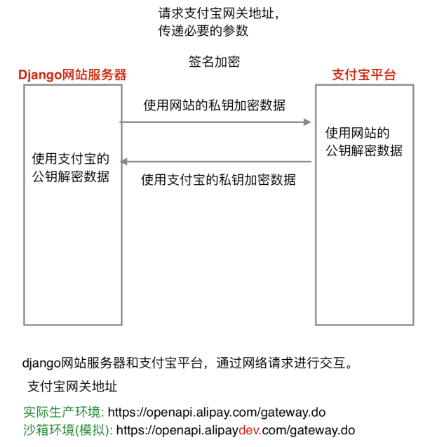
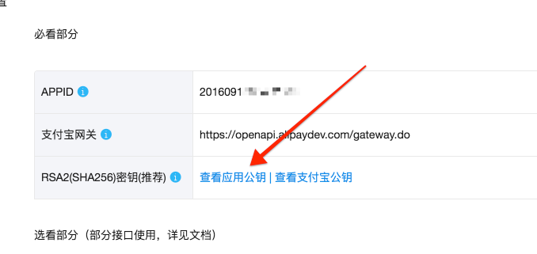
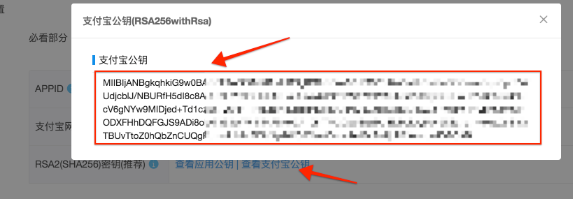
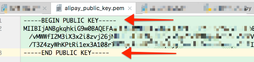
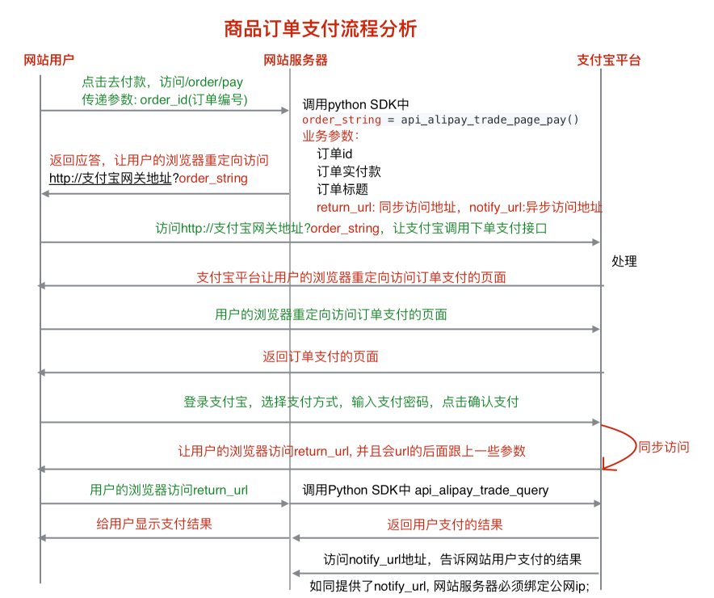

# 20、支付宝业务实现

## 20.1支付宝电脑网站支付接入简介

- 支付宝网关地址

  ```
  真实环境: https://openapi.alipay.com/gateway.do
  沙箱环境: https://openapi.alipaydev.com/gateway.do
  ```

### 1.创建应用

- 创建线上应用。

  [创建应用](https://openhome.alipay.com/platform/appManage.htm)

  ```
  注：开发阶段可以直接使用支付宝提供的沙箱环境(模拟环境)。
  ```

### 2.配置密钥

- 1.生成网站的私钥和公钥文件。

  ```
  openssl
  OpenSSL> genrsa -out app_private_key.pem   2048  # 私钥
  OpenSSL> rsa -in app_private_key.pem -pubout -out app_public_key.pem # 导出公钥
  OpenSSL> exit
  ```

- 2.进行沙箱环境配置应用公钥。 [沙箱环境](https://openhome.alipay.com/platform/appDaily.htm?tab=info)

### 3.配置开发环境

- 1.电脑支付api，详情请看如下链接，必须参数见下：

  **[支付宝电脑支付api]()**

  ```
  1）下单支付api。
    1.1 接口名称:
      alipay.trade.page.pay
    1.2 业务请求参数:
      out_trade_no: 商户订单号
      total_amount: 订单总金额
      subject: 订单标题
  2）交易结果查询api。
    2.1 alipay.trade.query
    2.2 业务请求参数:
      out_trade_no: 商户订单号
      trade_no: 支付宝交易号
      注意：两个参数至少选择一个。
  ```

- 2.python支付宝SDK。详情请看如下链接：

  **[python支付宝SDK](https://github.com/fzlee/alipay/blob/master/README.zh-hans.md)**

  ```python
  1）安装。
    # 安装python-alipay-sdk
    pip install python-alipay-sdk --upgrade
  2）接口基本命名规则。
    对于一个支付宝的接口，比如alipay.trade.page.pay，则一般可以这么调用接口：
      alipay.api_alipay_trade_page_pay().
    也就是说，我们做了这么一个转换:
      内部函数名 =  api_ + 支付宝接口名.replace(".", "_")
  3）初始化。
    from alipay import AliPay
    alipay = AliPay(
      appid="", # 应用APPID
      app_notify_url="",  # 默认回调url
      app_private_key_path=app_private_key_path, # 应用私钥文件路径
      # 支付宝的公钥文件，验证支付宝回传消息使用，不是你自己的公钥,
      alipay_public_key_path=alipay_public_key_path,  
      sign_type="RSA2" # RSA 或者 RSA2
      debug=False  # 默认False，False代表线上环境，True代表沙箱环境
    )
  4）根据需求调用SDK中封装的接口函数。
    4.1 电脑支付
      subject = "测试订单"
      # 电脑网站支付，需要跳转到https://openapi.alipay.com/gateway.do? + order_string
      order_string = alipay.api_alipay_trade_page_pay(
          out_trade_no="", # 商户订单号
          total_amount=0.01, # 订单总金额
          subject=subject, # 订单标题
          return_url="https://example.com",
          notify_url="https://example.com/notify" # 可选, 不填则使用默认notify url
      )
    4.2 交易结果查询
      response = alipay.api_alipay_trade_query(
          out_trade_no=None, # 商品订单号
          trade_no=None, # 支付宝交易号
      )
  ```

## 20.2 Django网站中的支付宝接口使用

### 1、Django与支付宝之间的通信加密解密流程：



所以我们必须将之前配置环境时我们的公钥交给支付宝(一般开发时使用沙箱环境）：



由于笔者之前已放入公钥，因此，这里显示为查看应用公钥，点击进去，可以进行修改。

公钥交给支付宝后，我们就可以获得支付宝的公钥：



将其按照本地公钥的格式存入我们settings中配置的路径下：

```
# 网站私钥文件路径
APP_PRIVATE_KEY_PATH = os.path.join(BASE_DIR, 'apps/order/app_private_key.pem')

# 支付宝公钥文件路径
ALIPAY_PUBLIC_KEY_PATH = os.path.join(BASE_DIR, 'apps/order/alipay_public_key.pem')
```



同时将本地网站私钥文件放在settings配置的目录下。

### 2、网站与支付宝交互流程



从分析的流程来看，我们需要实现`/order/pay`请求以获取支付URL、然后请求支付URL并支付成功后，设置`return_url`以便告知进行交易查询、进行交易结果查询`/order/check`请求、返回交易结果页面，最终跳转全部订单页面并更新该页面：

#### URL配置：

```python
url(r'^pay$', OrderPayView.as_view(), name='pay'), # 订单支付
url(r'^check$', OrderCheckView.as_view(), name='check'), # 订单交易结果
```

#### SETTINGS配置：

```python
# 支付宝沙箱APP_ID
ALIPAY_APP_ID = 'xxxxxxx'

# 支付宝网站回调url地址
ALIPAY_APP_NOTIFY_URL = None

# 支付宝同步return_url地址
ALIPAY_APP_RETURN_URL = 'http://127.0.0.1:8000/order/check'

# 网站私钥文件路径
APP_PRIVATE_KEY_PATH = os.path.join(BASE_DIR, 'apps/order/app_private_key.pem')

# 支付宝公钥文件路径
ALIPAY_PUBLIC_KEY_PATH = os.path.join(BASE_DIR, 'apps/order/alipay_public_key.pem')

# 支付宝支付的开发模式
ALIPAY_DEBUG = True

# 支付宝沙箱支付网关地址
ALIPAY_GATEWAY_URL = 'https://openapi.alipaydev.com/gateway.do?'
```

#### 全部订单页点击`去付款`操作js实现：

去付款按钮设计：其属性增加order_id为订单号，status为订单状态。

```html
<a href="#" order_id="{{ order_info.order_id }}" status="{{ order_info.order_status }}" class="oper_btn">去付款</a>
```

js实现：

业务逻辑：

- 获取订单状态和订单号

- 将订单号和csrf参数通过ajax的post请求发送给后端

- 获取回调数据，若成功`res=3`，则跳转请求支付URL

- 若res=4，则已完成支付到了待评价阶段，点击时应当跳转到订单评论页面`/order/comment/订单id`

  - > 订单评论页面本书不作讲述，可[github查看源码](https://github.com/ScrappyZhang/ecommerce_website_development)

```javascript

    <script src=""></script>
    <script>
    // 显示订单的状态
    $('.oper_btn').each(function () {
        // 定义订单状态字典
        var status_dict = {
            1: '去支付',
            2: '待发货',
            3: '查看物流',
            4: '待评论',
            5: '已完成'
        };
        // 获取订单的状态
        var status = $(this).attr('status');
        // 设置订单的状态信息
        $(this).text(status_dict[status]);
    });
    $('.oper_btn').click(function () {
        // 获取订单的状态
        var status = $(this).attr('status');
        // 获取用户支付的订单id
        var order_id = $(this).attr('order_id');
        if (status == 1) {
            // 去支付
            var csrf = $('input[name="csrfmiddlewaretoken"]').val();
            // 组织参数
            var params = {
                'order_id': order_id,
                'csrfmiddlewaretoken': csrf
            };
            // 发起ajax post请求，访问/order/pay
            // 传递参数: order_id
            $.post('/order/pay', params, function (data) {
                if (data.res == 3) {
                    // 成功
                    // window.open(data.pay_url);
                    location.href = data.pay_url;
                }
                else {
                    // 失败，提示错误信息
                    alert(data.errmsg);
                }
            })
        }
        else if (status == 4) {
            // 跳转到评价页面
            location.href = '/order/comment/' + order_id
        }
        else {
            // 其他处理
        }
    })
    </script>

```

#### 交易结果页面`pay_result.html`模板：

```html


    <div>
        <h1 style="font-size: 30px;">您的订单: {{ pay_result }}</h1>
        <a  style="font-size: 20px;" href="">点击去订单页面</a>
    </div>

```

#### `/order/pay`请求处理：

业务逻辑：

- 登录验证
- 获取订单号参数并校验
- 校验订单
- 调用支付宝SDK，向其传递沙箱应用id、回调URL、网站私钥路径、支付宝公钥路径、加密类型、以及是否为沙箱环境这几个参数
- 组织支付URL
  - 计算支付总额参数
  - 调用`api_alipay_trade_page_pay`形成支付URL后的支付字符串
    - 参数包括支付总额、订单号、订单标题、回调URL
  - 向前端回复支付URL和约定的成功数据信号`res=3`

```python
from django.conf import settings
from django.http import HttpResponse
from alipay import AliPay

# 订单支付
# 采用ajax post请求
# 前端需要传递的参数: order_id(订单id)
# /order/pay


class OrderPayView(View):
    """订单支付"""
    def post(self, request):
        # 登录验证
        user = request.user
        if not user.is_authenticated():
            return JsonResponse({'res': 0, 'errmsg': '用户未登录'})

        # 接收参数
        order_id = request.POST.get('order_id')

        # 参数校验
        if not all([order_id]):
            return JsonResponse({'res': 1, 'errmsg': '缺少参数'})

        # 校验订单id
        try:
            order = OrderInfo.objects.get(order_id=order_id,
                                          user=user,
                                          order_status=1, # 待支付
                                          pay_method=3, # 支付宝支付
                                          )
        except OrderInfo.DoesNotExist:
            return JsonResponse({'res': 2, 'errmsg': '无效订单id'})

        # 业务处理: 调用支付宝python SDK中的api_alipay_trade_page_pay函数
        # 初始化
        ali_pay = AliPay(
            appid=settings.ALIPAY_APP_ID,  # 应用APPID
            app_notify_url=settings.ALIPAY_APP_NOTIFY_URL,  # 默认回调url
            app_private_key_path=settings.APP_PRIVATE_KEY_PATH,  # 应用私钥文件路径
            # 支付宝的公钥文件，验证支付宝回传消息使用，不是网站的公钥,
            alipay_public_key_path=settings.ALIPAY_PUBLIC_KEY_PATH,
            sign_type="RSA2",  # RSA 或者 RSA2
            debug=settings.ALIPAY_DEBUG  # 默认False，False代表线上环境，True代表沙箱环境
        )

        # 调用支付宝pythonSDK中的api_alipay_trade_page_pay函数
        # 电脑网站支付，需要跳转到https://openapi.alipay.com/gateway.do? + order_string
        total_pay = order.total_price + order.transit_price # Decimal
        order_string = ali_pay.api_alipay_trade_page_pay(
            out_trade_no=order_id, # 订单id
            total_amount=str(total_pay), # 订单实付款
            subject='天天生鲜%s' % order_id, # 订单标题
            return_url='http://127.0.0.1:8000/order/check',
            notify_url=None  # 可选, 不填则使用默认notify url
        )

        pay_url = settings.ALIPAY_GATEWAY_URL + order_string
        # print(pay_url)
        return JsonResponse({'res': 3, 'pay_url': pay_url, 'errmsg': 'OK'})
```

#### `/order/check`请求处理：

业务逻辑：

- 登录验证
- 获取订单号参数并校验
- 校验订单
- 调用支付宝SDK，向其传递沙箱应用id、回调URL、网站私钥路径、支付宝公钥路径、加密类型、以及是否为沙箱环境这几个参数
- 组织支付URL
  - 计算支付总额参数
  - 调用`api_alipay_trade_query查询交易结果
    - 参数包括订单号
    - 支付宝网关返回码`"code": "10000"`,且支付状态`"trade_status": "TRADE_SUCCESS"`代表交易成功。
    - 交易成功，将订单状态设置为4，即待评价；并将交易号一起写入数据库
  - 响应返回订单交易结果页`pay_result.html`

```python
# /order/check
class OrderCheckView(LoginRequiredMixin, View):
    """订单支付结果查询"""

    def get(self, request):
        # 获取登录用户
        user = request.user

        # 获取用户订单id
        order_id = request.GET.get('out_trade_no')

        # 参数校验
        if not all([order_id]):
            return JsonResponse({'res': 1, 'errmsg': '缺少参数'})

        # 校验订单id
        try:
            order = OrderInfo.objects.get(order_id=order_id,
                                          user=user,
                                          order_status=1,  # 待支付
                                          pay_method=3,  # 支付宝支付
                                          )
        except OrderInfo.DoesNotExist:
            return HttpResponse('订单信息错误')

        # 业务处理: 调用Python SDK中的交易查询的接口
        # 初始化
        ali_pay = AliPay(
            appid=settings.ALIPAY_APP_ID,  # 应用APPID
            app_notify_url=settings.ALIPAY_APP_NOTIFY_URL,  # 默认回调url
            app_private_key_path=settings.APP_PRIVATE_KEY_PATH,  # 应用私钥文件路径
            # 支付宝的公钥文件，验证支付宝回传消息使用，不是你自己的公钥,
            alipay_public_key_path=settings.ALIPAY_PUBLIC_KEY_PATH,
            sign_type="RSA2",  # RSA 或者 RSA2
            debug=settings.ALIPAY_DEBUG  # 默认False，False代表线上环境，True代表沙箱环境
        )

        # 调用Python SDK 中api_alipay_trade_query参数说明：

        # {
        #     "trade_no": "2017032121001004070200176844", # 支付宝交易号
        #     "code": "10000", # 网关返回码
        #     "invoice_amount": "20.00",
        #     "open_id": "20880072506750308812798160715407",
        #     "fund_bill_list": [
        #         {
        #             "amount": "20.00",
        #             "fund_channel": "ALIPAYACCOUNT"
        #         }
        #     ],
        #     "buyer_logon_id": "csq***@sandbox.com",
        #     "send_pay_date": "2017-03-21 13:29:17",
        #     "receipt_amount": "20.00",
        #     "out_trade_no": "out_trade_no15",
        #     "buyer_pay_amount": "20.00",
        #     "buyer_user_id": "2088102169481075",
        #     "msg": "Success",
        #     "point_amount": "0.00",
        #     "trade_status": "TRADE_SUCCESS", # 支付状态
        #     "total_amount": "20.00"
        # }

        # 调用Python SDK 中api_alipay_trade_query 查询交易结果
        response = ali_pay.api_alipay_trade_query(out_trade_no=order_id)
        # 获取支付宝网关的返回码
        res_code = response.get('code')

        if res_code == '10000' and response.get('trade_status') == 'TRADE_SUCCESS':
            # 支付成功 10000
            # 更新订单的支付状态和支付宝交易号
            order.order_status = 4  # 待评价
            order.trade_no = response.get('trade_no')
            order.save()

            # 返回结果
            return render(request, 'pay_result.html', {'pay_result': '支付成功'})
        else:
            # 支付失败
            return render(request, 'pay_result.html', {'pay_result': '支付失败'})
```

