# 网站服务器架构部署方案发展

​	任何一个大型网站均是根据用户的积累以及随之而来的用户数量增长，从一台服务器到多台服务器逐步架构支撑起最终的大型网站数据、用户和页面请求等业务的。任何的大型网站的系统架构并不是一开始设计时就已经完全的考虑了与其业务高度吻合的高性能、高可用、安全等特性的。由于随着用户量增加，业务功能一般会逐步细化甚至发生较大的业务方向转变，所以一般在开发迭代过程中，总会发生大的开发模式、技术架构甚至设计思想的变化。最终，随着业务稳定的扩展和确定，成熟的系统架构才会出现，并符合其业务特征。例如，同样是web，淘宝要解决精准的商品信息搜索、下单、支付以及促销活动时的并发处理；腾讯则首先考虑同一时间完成数亿用户的消息实时精准传输；百度则持续高并发处理数亿人同时的海量搜索请求。不同的业务，由于侧重点不同，系统架构则会有差异。但是也有共性。例如，美国常见的创业案例，一两台电脑开始服务器，最终发展成现在的谷歌、Facebook等。本文将讲述网站服务器从一两台电脑到集群服务器的一些部署方案演化过程。

## 1、一台电脑的网站服务器架构

最初的架构就像我们每个人在学习时，将web应用程序、数据库、静态文件均部署在同一台服务器（例如个人电脑）上。

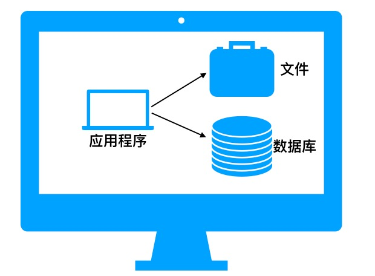

## 2、应用程序、文件、数据库三者分离

随着用户量增加，业务发展，一台服务器无法满足要求，需要分解压力。一般此时最常规的做法就是根据功能将相应的模块放置在不同服务器上——根据模块功能选择合适的硬件，然后将应用程序、文件和数据库三者分离部署在独立的服务器上来提升性能。

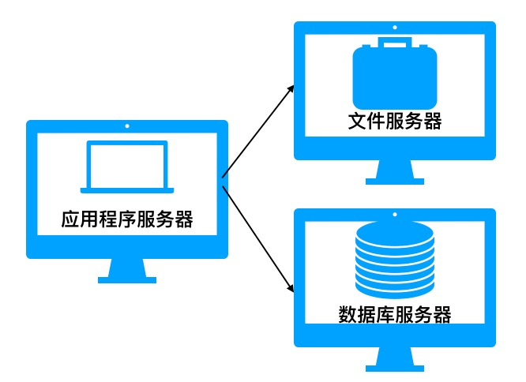

## 3、利用缓存改善网站性能

​	除了硬件上的优化，软件设计肯定也有办法改善网站服务器性能。我们都知道，访问静态页面要比动态页面快地多。为什么呢？一般很多动态页面都需要应用程序服务器去后台数据库服务器访问并查询数据结果，然后根据返回结果调用文件服务器或者自身应用服务器上的模板来生成动态页面然后返回给浏览器或者客户端。

​	假如我们将大多数用户经常访问的首页等一些访问量大但变动小的页面在动态生成后的页面缓存在应用程序服务器或者保存为静态页面供用户索取，那数据库的访问频次将大幅下降，网站性能得到提升，用户体验得到优化。常见的像微博一般将热点数据（热点话题）保存在redis中供用户快速访问。

> 两种常见的软件层次改善网站性能方式：
>
> 1、利用缓存
>
> 2、动态转静态

​	大多数网站设计时，都遵循访问28原则——80%的访问请求最终落在20%的数据上。这样可以减少数据库查询操作，提升用户体验，改善网站性能。

​	缓存实现的常见方式有本地缓存、分布式缓存。除此之外还有CDN、反向代理等。

- 本地缓存是指将数据缓存在应用服务器本地的内存或者文件中，它的特点是访问速度快，缺点是本地空间有限，仅能缓存部分数据。OSCache就是常用的本地缓存组件。
- 分布式缓存是指建立分布式缓存存储来解决本地空间有限的问题。它可以缓存海量的数据，且易扩展，但速度较本地缓存稍慢。常见的分布式缓存有Memcached、Redis。

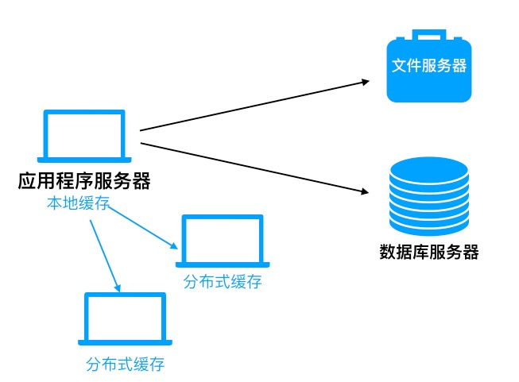

## 4、利用集群改善应用服务器性能——负载均衡服务器

尽管在后台我们分离了不同模块并部署独立的服务器，然后采用缓存的措施改善网站性能，但是随着用户数量达到一个级别，所有用户都去访问同一台应用程序服务器是不现实的，它会崩溃的。那怎么做呢？最直接的想法就是分解用户的访问。既然一台不行，我们搞N台来分担用户请求——即建立应用程序服务器集群来共同承担大量请求。那如何有效合适的将用户请求分担给不同的应用程序服务器呢，毕竟它们功能都一样？常见的做法是在应用程序服务器前面(即在用户请求和应用程序服务器之间)部署一个负载均衡服务器来调度用户请求，让它根据分发策略将用户请求合理的分发到应用程序服务器节点。

常见的负载均衡技术提供有：

- 硬件上：
  - F5
  - A10
  - 深信服等
- 软件上：
  - LVS
  - Nginx
  - HAProxy等

> [负载均衡概念普及](https://baike.baidu.com/item/%E8%B4%9F%E8%BD%BD%E5%9D%87%E8%A1%A1/932451?fr=aladdin#5)
>
> [三大主流软件负载均衡器对比(LVS、Nginx、HAproxy)](http://blog.csdn.net/mashuai720/article/details/78625678)

## 5、数据库读写分离

​	进一步随着用户数量的增加，数据库中的数据越来越庞大，网站性能自然而然的瓶颈便是数据库。我们知道，一般在大多数用户业务中，数据库中80%的操作都是在查询数据——读数据。那么改善性能的方向就一目了然——将数据库分离，一些数据库专门进行读数据业务，一些数据库专门进行写数据业务，然后通过主备功能实现各数据库同步。

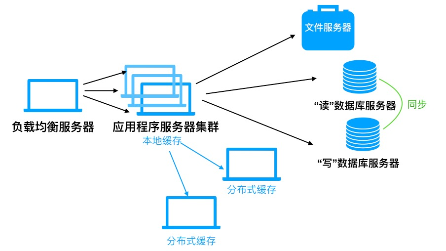

## 6、数据库分库分表

除了数据库在硬件上的读写分离能够改善web服务器性能外，随着用户量的增加，我们也常常采用**分库分表**来提高服务器的操作效率。

常见的分库分表有：

- 水平切分
  - 是指对数据库中的特大表根据一定的方式进行行切分。
    - 例如，几亿的用户信息表如果在一个数据库中的一个数据表中，如果查询起来，会非常慢（就算采用数据库的索引功能——并且它本身就降低了数据的性能）。此时我们可以采用水平切分——根据用户注册时间进行水平切分，增加数据表数量，但单个数据表行数减少，可以提高查询速度。
- 垂直切分
  - 是指根据业务模块来分别建立数据库及服务器，根据业务来切换查询。
    - 例如，一个大型电商网站，可以将用户业务相关的表建立数据库放在一个数据库服务器上；订单业务相关的表建立数据库放在一个数据库服务器上；商品业务相关的表建立数据库放在一个数据库服务器上。这样可以实现查询分离，其他模块也可以直接调用这些基础模块的数据库。

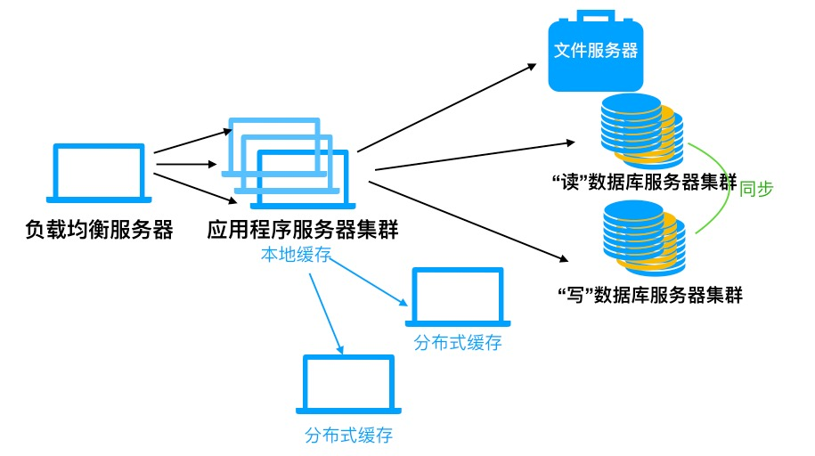

## 7、利用CDN和反向代理提高网站性能

试想一下，如果我们的服务器部署在贵州，对于哈尔滨的用户来说，要经过很多网关路由转发才可以获取信息。而对于贵州本地用户则很快。那我们的业务在哈尔滨拓展起来会非常困难，毕竟网站体验太差了。怎么办呢？常见的方式是CDN和网站自建反向代理。两者本质上均是在用户请求到达应用程序服务器之前做一些网络路径优化的事情——若有缓存数据则直接返回给用户，减短网络请求路径，降低应用程序服务器访问频次。

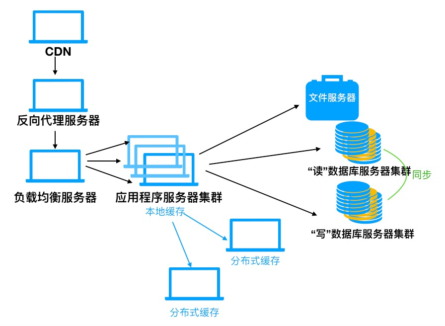

**CDN：**CDN的全称是Content Delivery Network，即内容分发网络。将一些缓存放在运营商的机房，这样用户访问时先从最近的运营商机房获取数据，若不存在，再访问我们的web服务器。这种方式可以大大减少网络访问路径，毕竟每个地区的用户总有一些共性习惯，他们经常访问的那些内容可以通过CDN缓存在他们所在地区运营商的机房，提高访问速度。这和本地缓存是一个道理，只不过是寄存到运营商那里。常见的CDN运营商有：网宿、阿里云、腾讯云、白山云、视界云。这些适合没有能力在各地建立本地服务器机房的网站。

> **目前CDN技术按照其侧重点可分为稳定派、全能派、性能派等“三大门派”：**
>
> **稳定派：**
>
> CDN服务应保持内容分发的稳定性，在一体化技术、弱网加速技术、服务质量性能波动监测、智能故障诊断等强化技术积累，而非刻意追求最新的功能特效，比如客户有防盗链更新时可以第一时间告知客户，并降低故障影响，对于赛事、演唱会等直播及短视频场景中较有吸引力，主要代表厂商是网宿
>
> **全能派：**
>
> 提供直播、点播的端到端的完整解决方案，除了CDN服务以外，还包括域名注册、网站开发、IDC、云通信、移动服务、云安全、监控与管理等综合化一站式服务，主要代表厂家就是阿里云、腾讯云等。
>
> **性能派：**
>
> 即通过自研核心、优化节点选择和网络部署，达到提升性能的目标，同时稳定性兼顾
>
> 实际上，哪怕网速整体提升0.1秒，就需要在提升核心Cache的响应速度、提升调度系统的响应速度、降低网络节点的延迟、提升下载速度、缩小网络节点距离用户的距离等方面进行研发和投入；而单一环节的性能提升可以满足直播和短视频平台对于CDN的苛刻需求，这方面的典型厂商是白山云、视界云。

**反向代理:**反向代理则是在自建机房里部署反向代理服务器(网站自身有能力建设本地化服务器机房等同于CDN)。在用户访问时，首先访问反向代理服务器，若请求数据有缓存数据，则直接将缓存数据返回给用户；若请求数据没有缓存数据，再去访问应用程序服务器。这样既加快了访问速度，也分担了应用程序服务器的访问压力。常见的反向代理有：Squid、Nginx等。

> | 软件名称  | 性能                                         | 功能                                                         | 过滤规则配置                                                 |
> | --------- | -------------------------------------------- | ------------------------------------------------------------ | ------------------------------------------------------------ |
> | Squid     | 不能多核是硬伤；磁盘缓存容量有优势；性能中等 | 多；支持ACL角色控制；支持ICP缓存协议                         | 支持外部文件读取及热加载；支持热启动                         |
> | Varnish   | 多核支持；内存缓存；性能强                   | 够用；支持集群，但不支持ICP集群；支持后端存活检查            | 不支持外部文件读取；需要转义；支持热启动                     |
> | Nginx     | 多核支持；支持代理插件；性能较强             | 多；支持集群，但不支持ICP集群；支持后端存活检查；通过插件可以充当多角色服务器 | 不支持外部文件读取；需要转义；支持热启动                     |
> | Apache TS | 多核支持；磁盘/内存缓存；性能强              | 够用；支持后端存活检查；支持ICP协议，Cluster不稳定；支持插件开发； | 支持外部规则文件读取及热加载；支持热启动                     |
> | HAProxy   | 多核支持；无缓存；支持HTTP头部解析；性能强   | 少，只专注HTTP头部解析和转发功能；支持ACL角色控制；支持后端存活检查 | 支持外部规则文件读取及热加载；支持热启动；支持会话粘滞和长连接 |

> - HTTP防御性能：HAProxy在应对大流量CC攻击时，做正则匹配及头部过滤时，CPU消耗只占10%~20%。其它软件均狂占CPU资源约90%以上，容易成瓶颈导致整个系统无响应。 
> - 反向代理性能：单纯转发效率以内存缓存型的Varnish性能最强，ATS和Nginx次之，考虑大容量缓存因素，ATS也是个不错的选择。Nginx是专门针对C10K的产物，性能不错，配合自己编写插件，业务可塑性很强。 
> - 过滤规则的可配置性：HAProxy，ATS，Squid均支持规则文件读取、ACL定制和热加载、热启动。Nginx则不支持外部文件正则匹配，略差一点，但可塑性强。

## 8、使用分布式存储系统

随着用户数量的增加，像微信等这类网站，用户每天都在发朋友圈，上传大量的照片，产生的文件越来越多。单台服务器肯定存储空间不足且性能会崩溃的。那怎么办呢？思路是一样的，分解压力，建立分布式文件系统。常见的分布式文件系统有：FastDFS、HDFS（hadoop）、NFS等。

> | **技术** | **优点**                                                     | **缺点**                                                     | **总结**                                                   |
> | -------- | ------------------------------------------------------------ | ------------------------------------------------------------ | ---------------------------------------------------------- |
> | HDFS     | 1、**大数据**批量读写，吞吐量高；2、一次写入，多次读取，顺序读写； | 1、交互式应用，低延迟很难满足；2、不支持多用户并发写相同文件。 | 如果是很多小文件，nameNode压力大                           |
> | googleFs | 1、成本低，运行在廉价的普通硬件上                            | 1、不开源                                                    | 不开源，使用困难                                           |
> | Tfs      | 1、淘宝开源                                                  | 1、小于1M的文件 2、TFS内部是没有任何数据的内存缓冲的         | 适合单个文件比较小的系统                                   |
> | Lustre   | 1、开源  2、  支持POSIX  3、  文件被分割成若干的Chunk，每个chunk是一般为1MB－4MB |                                                              |                                                            |
> | Ceph     | 1、支持POSIX 2、开源                                         |                                                              | 1、  在Linux主流内核中找到ceph 2、不成熟，处于测试推广阶段 |
> | MogileFs | 1、开源                                                      |                                                              | 比**FastDFS** 差                                           |
> | FastDFS  | 1、  开源 2、  适合以文件为载体的在线服务3、  FastDFS没有对文件做分块存储4、  不需要二次开发即可直接使用5、  比mogileFS更易维护和使用6、  直接使用socket通信方式，相对于MogileFS的HTTP方式，效率更高。 | 1、文件访问方式使用专有API，不支持POSIX                      |                                                            |
> | swiftfs  |                                                              |                                                              | 基于HDFS                                                   |
> | NFS      | 1、用户和程序可以象访问本地文件一样访问远端系统上的文件      |                                                              |                                                            |

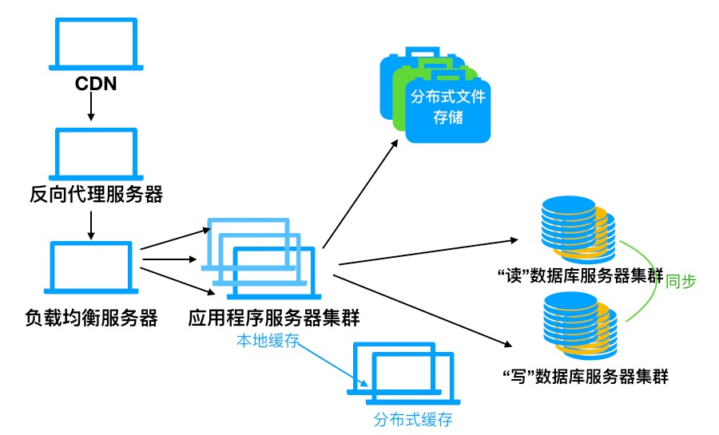

## 9、使用搜索引擎和NoSql

此时，我们已解决了用户上传的海量文件的存储。那我们还需要解决海量文件的查询。如果查询太慢，朋友圈刷不出来岂不是很尴尬。目前常见的方式是采用NoSql数据库加上搜索引擎来提高查询性能。一般将文件存放在分布式存储系统和服务器，而建立非关系型数据库来存储相应的一些路径等其他信息，然后再使用搜索引擎建立数据库的本地索引，这样可以极大的提高文件查询性能。常见的NoSQL有Mongodb和Redis，搜索引擎有lucene、whoosh等。

> 关系型数据库查询也需要搜索引擎提升查询性能

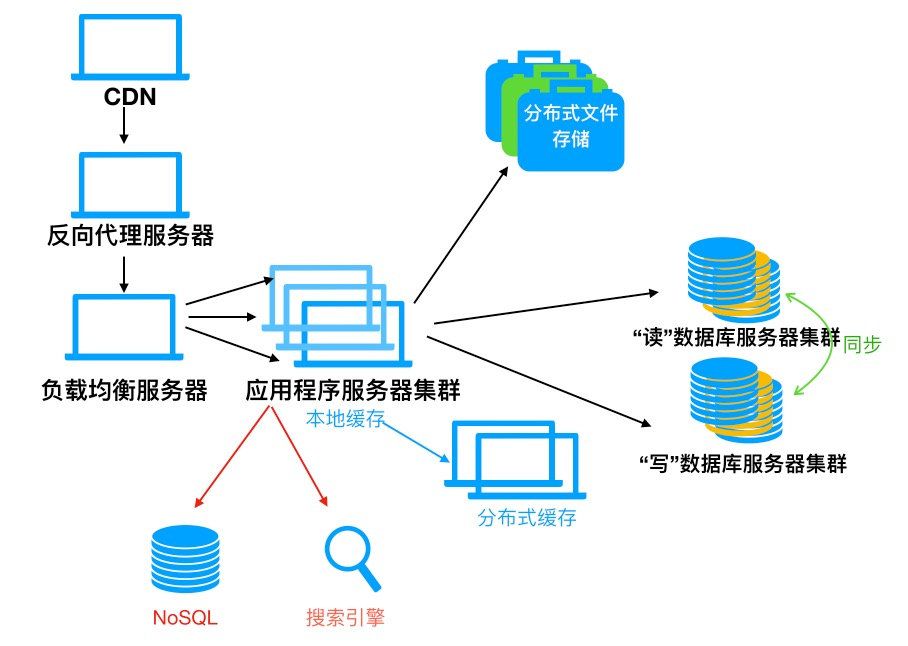

## 10、应用程序服务业务拆分

在第四节，我们通过多个相同的应用程序服务器来分担请求压力，这本质上是以硬件换性能的方式。为了提高请求处理效率，我们也可以像数据库读写分离那样，通过业务拆分来分担不同的应用请求。例如百度、腾讯将业务拆分为新闻、网页、图片、贴吧等，每个业务应用负责相对独立的业务运作，然后各业务之间可以进行通信或者数据库共享来实现整体的应用程序服务。

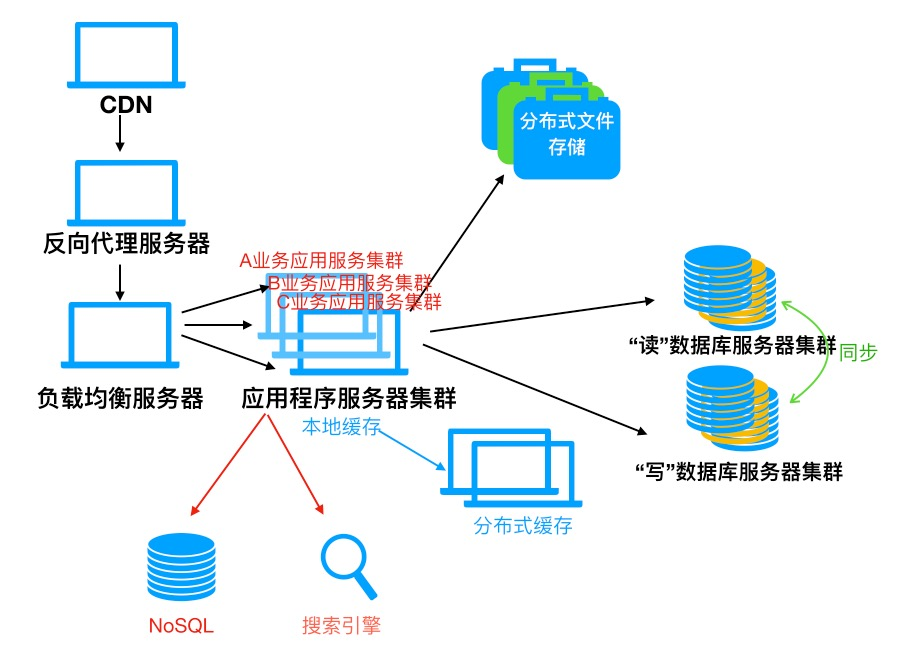

## 11、搭建分布式服务

除了业务拆分，就像代码复用一样，我们也可以将各业务都需要使用的基本业务服务抽取，以供所有应用来使用。这边是分布式服务。例如网站常见的用户服务、订单服务、支付服务、安全服务等服务常常是各业务应用的基本组成，我们便可以抽取搭建分布式服务；阿里的[Dubbo分布式服务框架](http://shiyanjun.cn/archives/325.html)便是这样。

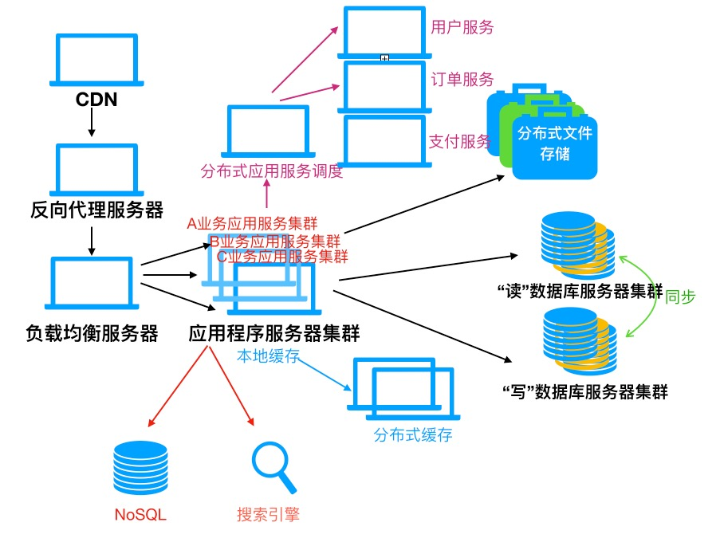

最后，随着业务继续增长，服务器根据各地业务特色，可以基于以上措施建立合适的本地服务器，最终由网站统一协调调度全球的服务器资源实现资源最大化利用。

> 本文参考了：
>
> [大型网站架构改进历程](http://www.cnblogs.com/elves/p/4259188.html)
>
> [Web网站架构设计与部署](https://wenku.baidu.com/view/be5cb506b52acfc789ebc9a4.html)
>
> [大型网站架构演化发展历程](http://blog.csdn.net/zhaoxuejie/article/details/46347063)

 

# [在首席架构师手里，应用架构如此设计](http://blog.csdn.net/boonya/article/details/51376451)

在上一章主要从硬件组成上介绍了服务器架构部署，接下来转载前1号店首席架构师王庆友的一篇博文来讲述应用架构的发展。

> ## 在首席架构师手里，应用架构如此设计
>
> 无架构，不系统，架构是大型系统的关键。从形上看，架构是系统的骨架，支撑和链接各个部分；从神上看，架构是系统的灵魂，深刻体现业务本质。
>
> 架构可细分为业务架构、应用架构、技术架构，业务架构是战略，应用架构是战术，技术架构是装备。其中应用架构承上启下，一方面承接业务架构的落地，另一方面影响技术选型。
>
> 如何针对当前需求，选择合适的应用架构，如何面向未来，保证架构平滑过渡，这个是软件开发者，特别是架构师，都需要深入思考的问题。本文基于作者在大型互联网系统的实践和思考，和大家一起探讨应用架构的选型。
>
> 本文主要内容包括：
>
> - 应用架构本质
> - 单体式
> - 分布式
> - SOA架构
> - SOA落地方式
> - 应用架构进化
>
> ## 应用架构本质
>
> 应用作为独立可部署的单元，为系统划分了明确的边界，深刻影响系统功能组织、代码开发、部署和运维等各方面，应用架构定义系统有哪些应用、以及应用之间如何分工和合作。
>
> 分有两种方式，一种是水平分，按照功能处理顺序划分应用，比如把系统分为web前端/中间服务/后台任务，这是面向业务深度的划分。另一种是垂直分，按照不同的业务类型划分应用，比如进销存系统可以划分为三个独立的应用，这是面向业务广度的划分。
>
> 应用的合反映应用之间如何协作，共同完成复杂的业务case，主要体现在应用之间的通讯机制和数据格式，通讯机制可以是同步调用/异步消息/共享DB访问等，数据格式可以是文本/XML/JSON/二进制等。
>
> 应用的分偏向于业务，反映业务架构，应用的合偏向于技术，影响技术架构。分降低了业务复杂度，系统更有序，合增加了技术复杂度，系统更无序。
>
> 应用架构的本质是**通过系统拆分，平衡业务和技术复杂性，保证系统形散神不散。**
>
> 系统采用什么样的应用架构，受业务复杂性影响，包括企业发展阶段和业务特点；同时受技术复杂性影响，包括IT技术发展阶段和内部技术人员水平。业务复杂性(包括业务量大)必然带来技术复杂性，应用架构目标是解决业务复杂性的同时，避免技术太复杂，确保业务架构落地。
>
> 常见的应用架构有多种，下面根据系统拆分方式，以及如何平衡业务与技术的角度进行分析，讨论各自的适用性，给企业应用架构选型提供参考。
>
> ## 单体式应用
>
> 1. 架构模型
>
> 系统只有一个应用，相应地，代码放在一个工程里管理；打包成一个应用；部署在一台机器；在一个DB里存储数据。单体式应用的架构如下图所示：
>
> 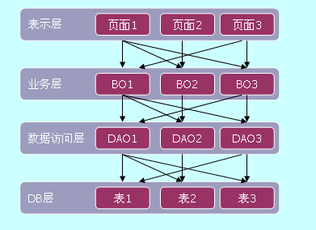
>
> 单体式应用采用分层架构，按照调用顺序，从上到下一般为表示层、业务层、数据访问层、DB层，表示层负责用户体验，业务层负责业务逻辑，数据访问层负责DB层的数据存取。
>
> 单体应用在水平方向上，上下层之间职责划分清晰；但垂直方向上缺乏清晰的边界，上下层模块之间是多对多的依赖关系，比如业务模块1 (图中BO1)可能调用数据层所有模块DAO1~3， DAO1也可能被业务层所有模块BO1~3调用。
>
> 单体应用通过水平分层，降低了业务复杂性；同时模块之间是进程内部调用，技术实现简单。
>
> 但单体应用对系统的切分不彻底，只有水平切分，并且是逻辑上，因此适合业务比较单一，但深度上比较复杂的系统，比如TCP/IP网络通讯，从应用层/传输层/网络层/链路层，层层推进，类似这样的系统可以方便地增加水平层次去适配。
>
> 对于广度上复杂的业务，由于缺乏垂直切分，强行把不同业务绑定在一起，整个系统神散形不散，带来一系列问题。比如OTA网站包含机票/酒店/旅游等多个垂直业务板块，每块都比较独立，就不适合放在一起开发维护。
>
> 1. 优缺点
>
> 单体式应用的优点和缺点都很鲜明，如下图所示。
>
> 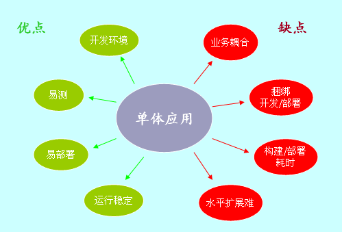
>
> 单体式应用的优点明显：
>
> - 现有IDE都是集成开发环境，非常适合单体式应用，开发、编译、调试一站式搞定。 
>   一个应用包含所有功能，容易测试和部署。
> - 运行在一个物理节点，环境单一，运行稳定，故障恢复简单。
>
> 单体式应用的缺点也明显：
>
> - 业务边界模糊，模块职责不清晰，当系统逐渐变大，代码依赖复杂，难以维护。
> - 所有人同时在一个工程上开发，容易发生代码修改冲突，依赖复杂导致项目协调困难，并且局部修改影响不可知，需要全覆盖测试，需要重新部署，难以支持大团队并行开发。
> - 当系统很大时，编译和部署耗时。
> - 应用水平扩展难，一方面状态在应用内部管理，无法透明路由；另一方面，不同模块对资源需求差异大，当业务量增大时，一视同仁地为所有模块增加机器导致硬件浪费。
>
> 作者之前曾在一家大型电商公司工作，当时整个网站是一个单体应用，有数百万行代码，有专门的团队负责代码合并，有专门的团队负责编译脚本开发，有一套复杂的火车模型协调不同团队，整套流程体系很精密很复杂，但这何尝不是单体应用的无奈和代价。
>
> 分布式架构应用
>
> 1. 架构模型
>
> 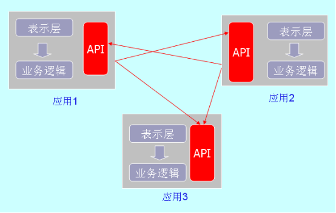
>
> 在分布式应用架构中，应用相互独立，每个应用代码独立开发，独立部署，应用通过有限的API接口互相关联。API接口属于应用一部分，一般和表示层处于同一层次，两者共享业务逻辑层，API和表示层采用同样的web端技术，通讯协议一般使用HTTP，数据格式是JSON，应用集成方式比较简化。
>
> 分布式架构首先对系统按照业务进行垂直切分，对广度上复杂的业务实现物理解耦，应用内部还是水平切分，对深度上复杂的业务实现逻辑解耦。分布式架构也可以解决业务量大的问题，对于某些高并发/大流量系统，把系统切分为不同应用，针对资源需求特点（比如CPU/IO/存储密集型），通过加强硬件配置满足不同应用的需求，避免一刀切方式带来的资源浪费。
>
> 技术上，API采用标准的HTTP/JSON进行通讯，调用双方实现难度都不大，但是API 
> 一般是“裸奔”的，在系统层面，调用依赖关系不透明，调用可靠性缺乏保障，因此只适用应用之间依赖链路少，调用量不大的系统，即应用之间耦合确实够松的系统。
>
> 1. 优缺点
>
> 分布式架构每个应用内部高内聚，独立开发、测试和部署，支持开发敏捷；同时应用之间松耦合，业务边界清晰，业务依赖明确，支持大项目并行开发，实现业务敏捷。
>
> 在分布式架构中，应用的表示层和API没有物理分离，需要同时满足自身业务需求和关联业务需求，相互影响，比如API接口会随着外部应用的需求经常变化，这会导致整个应用重新部署。
>
> 运行时，API以HTTP/REST方式通过网络对外提供接口，其通信可靠性和数据的封装性相对于进程内调用比较差，如果没有一些可靠的技术机制，如路由保障/失败重试/监控等， 裸奔的API方式将严重影响系统整体可用性。
>
> ## SOA架构
>
> 1. 架构模型
>
> 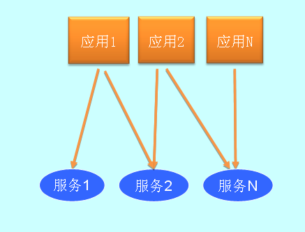
>
> 广义上，SOA也是分布式应用架构一种，但内涵不同。
>
> 这里有两种类型“应用”，应用1~N是前端应用，面向用户，服务1~N是service，只提供业务逻辑和数据。这些应用都是独立部署，前端应用不再通过API直接关联，而是通过后端服务共享业务逻辑。
>
> 此外相对于“裸奔”的API，SOA架构提供配套的服务治理，包括服务注册、服务路由、服务授权、服务降级、服务监控等等。这些功能通过专门的中间件支持，有中心化和去中心化两种方式，具体技术实现机制和适用场景，网上有很多专门介绍，这里就不展开了。
>
> SOA架构在分布式架构垂直切分的基础上，进一步把原来单体应用的业务逻辑层独立成service，做到物理上的彻底分离。
>
> 每个service专注于特定职责，实现系统核心业务逻辑，service之间通过互相调用，可以完成复杂业务逻辑，解决业务深度上的问题；同时service面向众多的应用，以共享的方式支持逻辑复用。所以，SOA架构既体现业务的分，又体现业务的合，更多地从业务整体上考虑系统拆分。
>
> 相比分布式应用架构，基于SOA的系统有大量的service应用，整个系统基于服务调用，所以对服务依赖的透明性和服务调用的可靠性提出很高要求，需要专门的SOA框架支持，还需要配套的监控体系和自动化的运维系统支持，技术复杂性高，SOA架构可以集中体现一个企业的IT技术能力。
>
> 1. 优缺点
>
> SOA架构优缺点如下图所示：
>
> 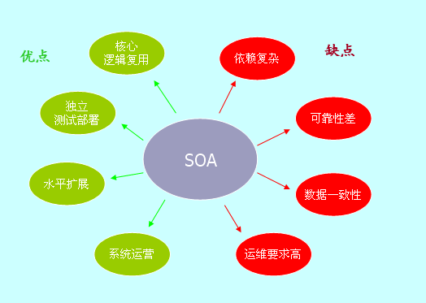
>
> 相比较普通API方式，SOA架构更进一步：
>
> 1)每个service都是浓缩的精华，聚焦某方面核心业务，同时以复用的方式供整个系统共享。 
> 2)服务作为独立的应用，独立部署，接口清晰，很容易做自动化测试和部署。 
> 3)服务是无状态的，很容易做水平扩展；通过容器虚拟化技术，实现故障隔离和资源高效利用，业务量大的时候，加机器即可。 
> 4)基于SOA的系统可以根据服务运行情况，灵活调控服务资源，包括服务上下架、服务升降级等，使系统真正具备可运营的能力。
>
> 当然天下没有免费的午餐，SOA也带来了额外复杂性和弊端：
>
> 1)系统依赖复杂，给开发/测试/部署带来一系列挑战。 
> 2)端到端的调用链路长，可靠性降低，依赖网络状况、服务框架及具体service的质量。 
> 3)分布式数据一致性和分布式事务支持困难，一般通过最终一致性简化解决。 
> 4)端到端的测试和排障复杂，SOA对运维提出更高要求。
>
> ## SOA落地方式
>
> 在实践中，SOA架构不断深入发展，具体落地形式也多种多样。
>
> 1)面向外部SOA
>
> SOA的前身是web service，web service初衷是企业之间通过Internet进行互联，如下图所示：
>
> 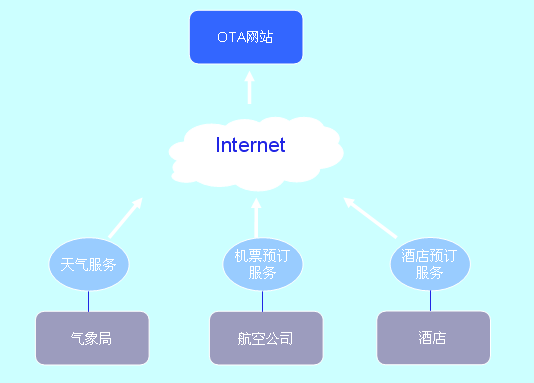
>
> 每个公司把自己的优势资源通过web service发布，如图中天气服务/机票服务/酒店预订服务来自不同公司，其他企业可以直接调用服务或整合多个服务，实现企业间资源共享。
>
> 2)面向应用SOA
>
> 面向应用SOA把原单体应用里的业务逻辑层剥离出来，作为单独的服务对外提供。 
> 举一个电商的例子，这里有两个应用，顾客使用的商品详情页，展示商品的信息、商品库存，商品价格；内部客服人员使用的客服系统，根据顾客来电要求，修改订单，同时也需要获取商品的基本信息、价格信息等。
>
> 经过SOA改造后，应用架构如下图所示：
>
> 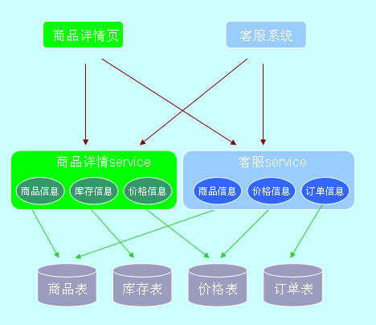
>
> 这里的service实现底层数据对于前端页面的透明化，表示层和业务逻辑各自独立维护，同时全部业务逻辑对其他应用开放，新应用可以自由整合来自多个服务的接口，快速支持业务创新。
>
> 面向应用的SOA架构对系统进行物理上的水平切分，结果是表示层单飞，逻辑层对外全开放。但每个service是原系统业务逻辑的封装，接口设计面向原应用的业务case，如果其它应用的需求有差异，则自己创建service访问底层数据。如此导致service职责不够聚焦，类似的接口分散化，同时底层数据表被多方访问，数据模型修改困难，数据一致性难以保障。
>
> 最终系统整体依赖复杂，容易形成网状结构，修改时，往往牵一发动全身。
>
> 3)微内核SOA 
> 每个企业都有自己的核心数据，比如对于电商系统来说，用户/商品/订单/库存/价格都是核心数据，称之为主数据。微内核SOA聚焦各类主数据，封装相关表的所有访问，架构示意如下：
>
> 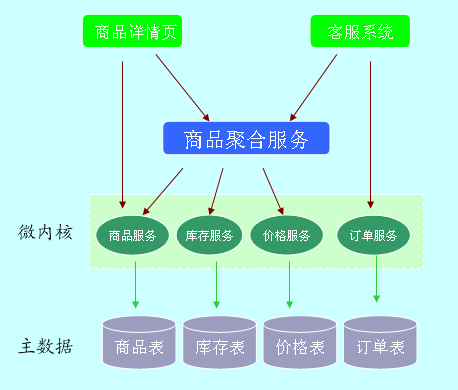
>
> 每个服务独占式地封装对应主数据表的访问，这些服务构成系统的基础服务，一起组成系统的微内核，供所有上层应用共享。
>
> 微内核服务是原子服务，接口粒度比较细，可以在其上构造聚合服务，为上层应用提供粗粒度服务。可以是信息聚合，比如图中商品聚合服务整合商品的基本信息/库存/价格；也可以是流程聚合，比如下单接口，调用来自多个服务的接口，共同完成复杂的下单操作。
>
> 这里服务是分层次的，聚合服务是上层，基础服务是底层，依赖规则如下：
>
> - 上层服务可以调用同层服务和基础服务
> - 基础服务是原子服务，不可相互调用
> - 前端应用可调用聚合服务和跨层调用基础服务
>
> 微内核的微表示服务数量有限，接口粒度细；内核表示这些基础服务处于调用底层，负责核心数据和业务，这和操作系统的内核概念上类似，主数据相当于核心的硬件，如cpu/内存/外存等，微内核的各个基础服务分别负责这些核心资源的管理，屏蔽底层的复杂性，对上层应用提供统一入口和透明化访问。
>
> 最近微服务很火，其特征是职责单一、接口粒度细、轻量级通讯协议等，微内核SOA架构有微服务的形，同时有业务内核的神，是架构形散神不散思想的很好体现，这个在淘宝、京东、一号店等大型电商系统都已有丰富实践。
>
> 4)方式比较
>
> 面向企业外部SOA，业务场景有特殊性，不深入分析，这里主要比较面向应用SOA和微内核SOA的区别，一个大型B2C电商系统，应用和主数据是多对多依赖关系，如下图所示：
>
> 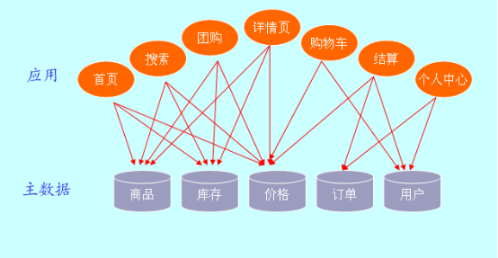
>
> 面向应用的服务从特定应用出发，整合应用对相关数据的访问需求；微内核服务从特定主数据为中心，收敛各个业务对数据的访问需求。
>
> 在面向应用的服务设计下，数据表的访问入口是发散的，来自多个应用，这带来一系列弊端： 
> 1)数据模型碎片化 
> 每个应用都会基于自己的需求，往表里加字段，很多电商的商品表/订单表有多达200个字段，都是野蛮增长，缺少控制的结果。 
> 2)数据模型修改困难 
> 类似的访问需求散布在多个服务，缺乏整合，同时表schema修改会影响很多服务和应用。 
> 3)连接资源利用率低 
> 多个服务直连数据库，并且每个服务会尽可能多地配置连接数，在应用数量多，业务并发量大的情况下，往往导致数据库连接数不够。
>
> 微内核SOA通过收敛对主数据的访问，保证数据模型一致性、优化接口和有效利用数据库连接资源。同时通过服务分层，简化系统依赖关系。更为重要的是，微内核服务保证了业务模型的一致性，比如电商系统的商品体系，包含单品/系列商品/组合商品/搭售商品/虚拟商品等一系列复杂概念，这些复杂逻辑在基础商品服务里处理，对上层业务透明一致。
>
> 如果业务模式简单，应用数量少，特定主数据的访问绝大多数(比如说80%)来自某个应用，则服务设计以应用为中心是可以的，不利影响比较小。
>
> 对于大型互联网系统，业务广度和深度都复杂，但无论多复杂的系统，主数据类型都是有限的，可以通过聚焦有限的基础业务，以此支持无限的应用业务，结果是底层业务模型稳定，上层业务可以灵活扩展。
>
> 面向应用的服务设计是SOA初级阶段，从具体业务着手，自底向上，难度小；微内核服务设计是SOA高级阶段，从全局着手，对业务和数据模型高度抽象，自顶向下，难度大。
>
> 值得注意的是，在提供基础服务同时，每个应用也可以创建自己需要的服务（但主数据的访问必须通过基础服务），所以微内核的服务和面向应用的服务可以有机结合在一起，当业务应用变得很多，并且不断增长，可以考虑逐步往基础服务过渡，整合特定主数据有关的业务逻辑。
>
> 顺便提一下，应用架构会影响组织架构，如果采用面向应用的服务设计，具体service一般由相关应用的团队负责；如果是微内核的服务设计，一般由单独的共享服务部门负责所有基础服务开发，和各个业务研发部门并列，保证设计的中立性和需求响应的及时性。
>
> ## 应用架构的进化
>
> 软件是人类活动的虚拟，业务架构是生产活动的体现，应用架构是具体分工合作关系的体现。 
> 单体应用类似原始氏族时代，氏族内部有简单分工，氏族之间没有联系；分布式架构类似封建社会，每个家庭自给自足，家庭之间有少量交换关系；SOA架构类似工业时代，企业提供各种成品服务，我为人人，人人为我，相互依赖。微内核的SOA架构类似后工业时代，有些企业聚焦提供水电煤等基础设施服务，其他企业在之上提供生活服务，依赖有层次。
>
> 业务架构是生产力，应用架构是生产关系，技术架构是生产工具。业务架构决定应用架构，应用架构需要适配业务架构，并随着业务架构不断进化，同时应用架构依托技术架构最终落地。
>
> 企业一开始业务比较简单，比如进销存，此时面向内部用户，提供简单的信息管理系统（MIS），支持数据增删改查即可，单体应用可以满足要求。
>
> 随着业务深入，进销存每块业务都变复杂，同时新增客户关系管理，以更好支持营销，业务的深度和广度都增加，这时需要对系统按照业务拆分，变成一个分布式系统。
>
> 更进一步，企业转向互联网+战略，拓展在线交易，线上系统和内部系统业务类似，没必要重做一套，此时把内部系统的逻辑做服务化改造，同时供线上线下系统使用，变成一个简单的SOA架构。
>
> 紧接着业务模式越来越复杂，订单、商品、库存、价格每块玩法都很深入，比如价格区分会员等级，访问渠道（无线还是PC），销售方式（团购还是普通）等，还有大量的价格促销，这些规则很复杂，容易相互冲突，需要把分散到各个业务的价格逻辑进行统一管理，以基础价格服务的方式透明地提供给上层应用，变成一个微内核的SOA架构。
>
> 同时不管是企业内部用户，还是外部顾客所需要的功能，都由很多细分的应用提供支持，需要提供portal，集成相关应用，为不同用户提供统一视图，顶层变成一个AOA的架构（application orientated architecture）。
>
> 随着业务和系统不断进化，最后一个比较完善的大型互联网应用架构如下图所示：
>
> 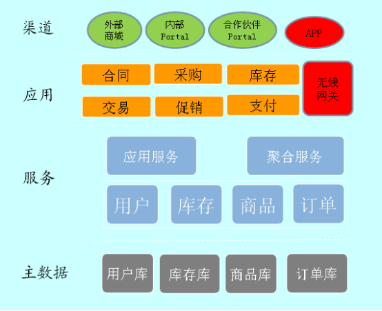
>
> 最终整个系统化整为零，形神兼备，支持积木式拼装，支持开发敏捷和业务敏捷。
>
> 应用架构，需要站在业务和技术中间，在正确的时间点做正确的架构选择，保证系统有序进化。