`HTML`即HyperText Markup Language——超文本标记语言，是标准通用标记语言下的一个应用。超文本的意思就是指页面内可以包含图片、链接，甚至音乐、程序等非文字元素。

网页文件本身是一种文本文件，通过在文本文件中添加标记符，可以告诉浏览器如何显示其中的内容；然后浏览器按照顺序阅读文件，根据标记解释和显示内容，实现特定的内容展示。所以说，网页的本质就是超级文本标记语言，通过结合使用其他web技术（脚本语言、网关接口、组件等），可以创造出丰富的、功能强大的网页。

超文本标记语言文档制作不是很复杂，但是功能很强大，支持不同数据格式的文件镶入。随着技术的发展，HTML也从1993年的第一版持续发展到2014年的HTML5 ，这当中伴随着web技术的巨大变迁，web技术也从1.0发展到了3.0 。目前web技术也在从web3.0中的知识有序共建向web4.0的知识分配发展，这种全民web共享知识创建财富的趋势促使普通人也需要了解HTML。在标记语言发展中，出现了各式各样的分类：`VML、UML、MML、CML、XHTML、XML`等。本文仅仅指最基础的网页`HTML5.0`。

# 1、HTML基础之HTML标签

## 什么是标签？

超文本标记语言之所以这么强大，主要在于编写时的标记和解释的标记，我们称之为标签。标签(tag)是HTML语言最基本的元素和组成部分，它使网页可以划分范围、内容区域、解释区域以及相应的引用。也就是说，==标签是一种符号，一种能够使网页内各种内容相互区分的符号、且使内容或数据更加有序的、特殊并约定俗称的符号==。

和一般的语言一样，一般我们都会以hello起步，如下面一段代码可以在浏览器上显示`hello html`，该段为`html`文件最基础的结构，涵盖了基础标签：
第2行`<!DOCTYPE html>`为文档类型声明标签；
第4行`<html></html>`为文档根标签；
第6行`<head></head>`标签内包含关于文档的信息；
第8-10行`<meta>` 元素内可提供有关页面的元信息（meta-information），比如针对搜索引擎和更新频度的描述和关键词等；
第12行`<title></title>`标签内定义文档的标题；
第15行`<body></body>`标签内定义文档的主体。其中包含文档的所有内容（比如文本、图像、颜色、图形等等）。

```HTML
<!-- 文档声明类型-->
<!DOCTYPE html>
<!-- html文档的根标签-->
<html lang="zh-cn">
<!-- 网页头部信息，用来做网页的基本配置 -->
<head>
    <!-- 网页字符编码 -->
    <meta charset="UTF-8">
    <meta name="viewport" content="width=device-width, initial-scale=1.0">
    <meta http-equiv="X-UA-Compatible" content="ie=edge">
    <!-- 网页在浏览器窗口中显示的标题 -->
    <title>HTML基本结构</title>
</head>
<!-- 此标签中写网页中显示的内容 -->
<body>
    hello html!
</body>

</html>
```

可以很清晰的看到，**除了个别标签外，几乎所有的标签均为成对出现，且由一对尖括号组成**，这个要牢记。由于标签众多，且目前学习资料及其丰富，本文仅粗略简单的介绍一些常用标签，具体的深入了解，笔者向大家推荐W3school的html参考手册和官方文档查询。

## HTML常用标签与分类

根据经常使用的功能，我们这里把常用的标签分为以下几类：

- 文章标签：h1~h6、p、br、span、bdo、pre、acronym、abbr、blockquote、q、ins等。
- 字体样式标签：i、b、strong、em、code、samp等。
- 列表标签:ul、ol、li、dl、dt、dd
- 超链接标签: a
- 多媒体标签：img、audio、video、map、area、object、param等
- 表格标签：table、td、tr、th、thead、tbody、tfoot、col、colgtoup、caption
- 表单标签：form、input、button、label、option、textarea、select、optgroup、fieldset、legend
- 布局标签：div
- 文档标签：html、head、body、title、meta、style、link、script、noscript、base等
- 特殊字符
- 其他标签

接下来我们介绍其中一些频繁使用的一些标签。

### 常见文档标签

| 标签名           | 描述                                  |
| ------------- | ----------------------------------- |
| style         | 定义文档中的样式。一般通过CSS来设置html元素样式         |
| link          | 定义两个连接文档之间的关系，如外链的css文件、js文件等       |
| script        | 定义一段脚本                              |
| noscript      | 用来定义在脚本未被执行时的替代内容（文本）。常用在浏览器不支持脚本时。 |
| base          | 规定页面中所有链接的基准 url                    |
| &lt;!--…—&gt; | 注释标签,用于在源文档中插入注释                    |

### h1-h6标题标签

h1-h6标签代表里面的元素默认样式相应的为一级标题到六级标题。此标签必须成对出现。`<h1>`定义最大的标题,`<h6>`定义最小的标题。由于 h 元素拥有确切的语义，因此应当慎重地选择恰当的标签层级来构建文档的结构，相反，我们应当使用层叠样式表CSS定义来达到漂亮的显示效果。

实例：

注：后面标签介绍一般仅仅为单个标签修改，所以除了一些案例，后续代码块默认不展示body标签外的内容以及结果展示。

```Html
<!DOCTYPE html>
<html lang="zh-cn">
<head>
    <meta charset="UTF-8">
    <meta name="viewport" content="width=device-width, initial-scale=1.0">
    <meta http-equiv="X-UA-Compatible" content="ie=edge">
    <title>02_标题标签</title>
</head>
<body>
    <h1>一级标题</h1>
    <h2>二级标题</h2>
    <h3>三级标题</h3>
    <h4>四级标题</h4>
    <h5>五级标题</h5>
    <h6>六级标题</h6>
</body>
</html>
```

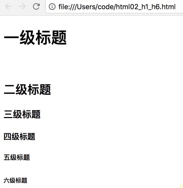

### p段落标签与br换行标签

p标签用来定义段落，成对出现。

```html
<p>&nbsp;&nbsp;&nbsp;&nbsp;&nbsp;&nbsp;人工智能（Artificial Intelligence）
  <br />
  英文缩写为AI
</p>
```

### 几种字体样式标签

```html
    <i>斜体</i>
    <b>粗体</b>
    <strong>重要的文本</strong>
    <code>代码样式文本</code>
```

### 超链接标签a

定义超链接，它用于从一个页面连接到另一个页面。

```Html
<a href="http://www.baidu.com" target="_blank">跳转百度</a>
```

上面这行代码中href是指链接的目标URL，target为在何处打开目标URL（_blank指在浏览器新标签页打开）。其他标签a的属性如下：

| 属性       | 描述                                       |
| -------- | ---------------------------------------- |
| href     | 链接的目标 URL                                |
| hreflang | 规定目标 URL 的基准语言。仅在 href 属性存在时使用。          |
| media    | 规定目标 URL 的媒介类型。默认值：all。仅在 href 属性存在时使用。  |
| ping     | 由空格分隔的 URL 列表，当用户点击该链接时，这些 URL 会获得通知。仅在 href 属性存在时使用。 |
| rel      | 规定当前文档与目标 URL 之间的关系。仅在 href 属性存在时使用。     |
| target   | 在何处打开目标 URL。仅在 href 属性存在时使用。             |
| type     | 规定目标 URL 的 MIME 类型。仅在 href 属性存在时使用。      |

### 图像标签img

```html

```

上面这行代码是指打开路径在`./images/banner.jpg`的图片，当图片不能加载显示时，网页显示人工智能。img标签的主要属性有：

| 属性     | 值    | 描述              |
| ------ | ---- | --------------- |
| alt    |      | 定义有关图片的短的描述     |
| src    |      | 要显示图像的url       |
| height | px、% | 定义图像高度          |
| ismap  | url  | 把图像定义为服务器端的图像映射 |
| usemap | url  | 把图像定义为客户端的图像映射  |
| width  | px、% | 定义图像宽度          |
| vspace | px   | 定义图像顶部、底部的空白    |

### 列表标签

ul标签用来定义无序列表；ol标签用来定义有序列表；li标签定义列表项。

```Html
<ul>
   <li>Coffee</li>
   <li>Tea</li>
</ul>
<ol>
   <li>Coffee</li>
   <li>Tea</li>
</ol>

<ol>
   <li value="8">Coffee</li>
   <li>Tea</li>
</ol>
```

其中，ol标签的属性有：

| 属性  | 值                                                | 描述                                                  |
| ----- | ------------------------------------------------- | ----------------------------------------------------- |
| type  | A、  a、  I、  i、  1、  disc、  square、  circle | 规定列表序号的类型。不赞成使用。一般使用CSS替代实现。 |
| value | number_of_list_item                               | 不赞成使用。一般使用CSS替代实现。                     |

### 表格标签

如下代码实现了一个最常见的简历表格。

```html
<table border="1px">
        <tr>
            <td  class="header" colspan="5">基本情况</td>
        </tr>
        <tr>
            <td width="15%">姓 名</td>
            <td width="25%"></td>
            <td width="15%">性 别</td>
            <td width="25%"></td>
            <td width="20%" rowspan="5"></td>
        </tr>
        <tr>
            <td>民 族</td>
            <td></td>
            <td>出生日期</td>
            <td></td>

        </tr>
        <tr>
            <td>政治面貌</td>
            <td></td>
            <td>健康情况</td>
            <td></td>

        </tr>
        <tr>
            <td>籍 贯</td>
            <td></td>
            <td>学 历</td>
            <td></td>
 
        </tr>
        <tr>
            <td>电子信箱</td>
            <td></td>
            <td>联系电话</td>
            <td></td>

        </tr>
    </table>
```

其中，table标签定义表格，在它定义的内部，可以放置表格的标题、表格行、表格列、表格单元以及其他的表格；tr标签定义表格中的行；td标签定义表格中的一个单元格，它有两个属性：

| td属性    | 值      | 描述     |
| ------- | ------ | ------ |
| rowspan | number | 跨行的单元格 |
| colspan | number | 跨列的单元格 |

### 表单标签

如下一段代码实现一个常用的网站注册表单。

```html
    <h3>注册表单</h3>
    <!-- action 为要将数据提交到哪个url -->
    <!-- method 为发送数据时的请求方式 get post等 -->
    <form action="" method="get">
        <p>
            <label for="">username</label>
            <!-- name 为在提交数据时的字段/键 -->
            <!-- placeholder 占位提示 -->
            <input type="text" name="username" placeholder="请输入用户名">
        </p>
        <p>
            <label for="">password</label>
            <input type="password" name="password">
        </p>
        <p>
            <label for="">gender</label>
            <!-- 单选 -->
            <!-- cheacked 为默认选择选项 -->
            <!-- value为要提交的值 -->
            <input type="radio" name='gender' checked value="0">男
            <input type="radio" name='gender' value="1">女

        </p>
        <p>
            <label for="">hobby</label>
            <!-- 多选 -->
            <input type="checkbox">人工智能
            <input type="checkbox">数据分析
            <input type="checkbox">计算数学
            <input type="checkbox">机器学习
            <input type="checkbox">软件开发
        </p>
        <p>
            <label for="">page_picture</label>
            <!-- 文件 -->
            <input type="file">
        </p>
        <p>
            <label for="">homeland</label>
            <!-- 文件 -->
            <select>
                <option value="">shannxi</option>
                <option value="">Beijing</option>
                <option value="">Shanghai</option>
                <option value="">guangzhou</option>
            </select>
        </p>
        <p>
            <label style="float:left" for="">Personal&nbsp;profile</label>
            <!-- 文本区域 -->
            <textarea cols="30" rows="5">请输入文字</textarea>
        </p>
        <p>
            <input type="submit" value="提 交">
            <input type="reset" value="重置">
            <input type="button" value="普通按钮">
        </p>
    </form>
```

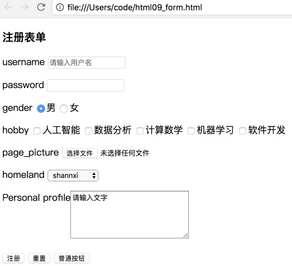

在这段代码中我们使用了form标签、label标签、input标签、select标签、option标签和textarea标签。这些标签含义如下表所示：

| 标签     | 描述                                                         |
| -------- | ------------------------------------------------------------ |
| form     | 创建供用户输入的表单。 表单可包含文本域，复选框，单选按钮等等。表单用于向指定的 URL 传递用户数据。 |
| label    | 定义控件的标注。 如果在 label 元素内点击文本，就会触发此控件。就是说，当用户选择该标签时，浏览器就会自动将焦点转到和标签相关的表单控件上。 |
| input    | 定义输入字段，用户可在其中输入数据。最常用它的type属性、name属性。 |
| select   | 创建下拉列表                                                 |
| option   | 定义下拉列表中的一个选项                                     |
| textarea | 定义一个文本区域 (text-area) （一个多行的文本输入区域）。用户可在此文本区域中写文本。在一个文本区中，您可输入无限数量的文本。文本区中的默认字体是等宽字体 (fixed pitch)。 |

form标签的常用属性有：

| form属性         | 描述                                   |
| -------------- | ------------------------------------ |
| action         | 定义一个 URL。当点击提交按钮时，向这个 URL 发送数据。      |
| data           | 供自动插入数据。                             |
| method         | 用于向 action URL 发送数据的 HTTP 方法。默认是 GET |
| target         | 在何处打开目标 URL。                         |
| replace        | 定义表单提交时所做的事情。                        |
| accept         | 处理该表单的服务器可正确处理的内容类型列表（用逗号分隔）         |
| accept-charset | 表单数据的可能的字符集列表（逗号分隔）。默认值是 "unknown"   |
| enctype        | 用于对表单内容进行编码的 MIME 类型                 |

<font color=blue>提示</font>: method最常见的两种方式为GET和POST，它们的区别如下：

|          | GET                                      | POST                                     |
| -------- | ---------------------------------------- | ---------------------------------------- |
| 后退按钮/刷新  | 无害                                       | 数据会被重新提交（浏览器应该告知用户数据会被重新提交）。             |
| 书签       | 可收藏为书签                                   | 不可收藏为书签                                  |
| 缓存       | 能被缓存                                     | 不能缓存                                     |
| 编码类型     | application/x-www-form-urlencoded        | application/x-www-form-urlencoded 或 multipart/form-data。为二进制数据使用多重编码。 |
| 历史       | 参数保留在浏览器历史中。                             | 参数不会保存在浏览器历史中。                           |
| 对数据长度的限制 | 是的。当发送数据时，GET 方法向 URL 添加数据；URL 的长度是受限制的（URL 的最大长度是 2048 个字符）。 | 无限制。                                     |
| 对数据类型的限制 | 只允许 ASCII 字符。                            | 没有限制。也允许二进制数据。                           |
| 安全性      | 与 POST 相比，GET 的安全性较差，因为所发送的数据是 URL 的一部分。在发送密码或其他敏感信息时绝不要使用 GET ！ | POST 比 GET 更安全，因为参数不会被保存在浏览器历史或 web 服务器日志中。 |
| 可见性      | 数据在 URL 中对所有人都是可见的。                      | 数据不会显示在 URL 中。                           |

label标签属性：

| label属性 | 值                   | 描述                             |
| ------- | ------------------- | ------------------------------ |
| for     | id_of_another_field | 定义 label 针对哪个表单元素。设置为表单元素的 id。 |

input标签常用属性有：

| input标签属性 | 值                                                           | 描述                                                         |
| ------------- | ------------------------------------------------------------ | ------------------------------------------------------------ |
| type          | button  checkbox  date  datetime  datetime-local  email  file  hidden  image  month  number  password  radio  range  reset  submit  text  time  url  week | 指示 input 元素的类型。默认值是 "text"                       |
| name          | field_name                                                   | 为 input 元素定义唯一的名称。一般用于字段识别                |
| autocomplete  |                                                              | 自动补全                                                     |
| checked       | 布尔值                                                       | 指示此 input 元素首次加载时应当被选中。注释：请与 type="checkbox" 及 type="radio" 配合使用。 |
| pattern       |                                                              | 正则表达式                                                   |
| required      | 布尔值                                                       | 定义输入字段的值是否是必需的。                               |
| value         |                                                              | 对于按钮、重置按钮和确认按钮：定义按钮上的文本。<br />对于图像按钮：定义传递向某个脚本的此域的符号结果。<br />对于复选框和单选按钮：定义 input 元素被点击时的结果。<br />对于隐藏域、密码域以及文本域：定义元素的默认值。<br />注：不能与 type="file" 一同使用。<br />注：与 type="checkbox" 和 type="radio" 一同使用时，此元素是必需的。 |
| maxlength     | number                                                       | 定义文本域中所允许的字符最大数目                             |
| placeholder   |                                                              | 定义输入框预显示的内容                                       |
| autofocus     | 布尔值                                                       | 当页面加载时，使输入字段获得焦点。                           |

select标签属性：

| select标签属性 | 值           | 描述                             |
| ---------- | ----------- | ------------------------------ |
| name       | unique_name | 定义下拉列表的唯一标识符                   |
| multiple   | 布尔值         | 多选选项， 当该属性为 true 时，规定可一次选定多个项目 |
| autofocus  | 布尔值         | 在页面加载时使这个 select 字段获得焦点        |
| data       | url         | 供自动插入数据                        |
| disabled   | 布尔值         | 当该属性为 true 时，会禁用该菜单            |
| form       | 布尔值         | 定义 select 字段所属的一个或多个表单         |

option标签属性：

| option标签属性 | 值        | 描述                             |
| ---------- | -------- | ------------------------------ |
| value      | text     | 定义送往服务器的选项值                    |
| selected   | selected | 规定选项（在首次显示在列表中时）表现为选中状态。       |
| disabled   | disabled | 规定此选项应在首次加载时被禁用                |
| label      | text     | 定义当使用 &lt;optgroup&gt; 时所使用的标注 |

textarea标签常见属性：

| textarea标签属性 | 值      | 描述                        |
| ------------ | ------ | ------------------------- |
| rows         | number | 规定了文本区内可见的行数              |
| cols         | number | 规定了文本区内可见的列数              |
| name         |        | 为此文本区规定的一个名称              |
| form         |        | 定义该 textarea 所属的一个或多个表单。  |
| autofocus    | 布尔值    | 在页面加载时，使这个 textarea 获得焦点。 |

### div标签与span标签

div标签为块标签，span标签为行内块标签。

### 特殊字符

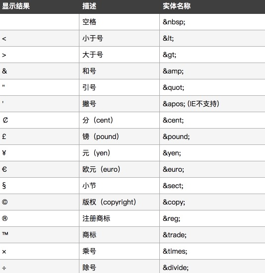

## HTML标签常见全局属性

一般我们通过标签来标记文本，通过CSS3来设置样式。不管采用何种方式来设置样式，均需要在设置前选中一些标签才能对其操作。所以，html5.0提供了标签的全局属性，基本如下表：

| 全局属性名           | 描述                         |
| --------------- | -------------------------- |
| class           | 规定元素的一个或多个类名（引用样式表中的类）     |
| id              | 规定元素的唯一 id                 |
| style           | 规定元素的行内 CSS 样式             |
| draggable       | 规定元素是否可拖动                  |
| dropzone        | 规定在拖动被拖动数据时是否进行复制、移动或链接    |
| dir             | 规定元素中内容的文本方向               |
| contextmenu     | 规定元素的上下文菜单。上下文菜单在用户点击元素时显示 |
| accesskey       | 规定激活元素的快捷键                 |
| hidden          | 规定元素仍未或不再相关                |
| lang            | 规定元素内容的语言                  |
| tabindex        | 规定元素的tab键次序                |
| title           | 规定有关元素的额外信息                |
| translate       | 规定是否应该翻译元素内容               |
| spellcheck      | 规定是否对元素进行拼写和语法检查           |
| contenteditable | 规定元素内容是否可编辑                |
| data-*          | 用于存储页面或应用程序的私有定制数据         |

# 2、HTML基础之CSS

## 什么是CSS？

层叠样式表(英文全称：Cascading Style Sheets)是一种用来表现HTML或XML等文件样式的计算机语言。CSS不仅可以静态地修饰网页，还可以配合各种脚本语言动态地对网页各元素进行格式化。CSS 能够对网页中元素位置的排版进行像素级精确控制，支持几乎所有的字体字号样式，拥有对网页对象和模型样式编辑的能力。

1990年，Tim Berners-Lee和Robert Cailliau共同发明了Web。1994年，Web真正走出实验室。从HTML被发明开始，样式就以各种形式存在。不同的浏览器结合它们各自的样式语言为用户提供页面效果的控制。最初的HTML只包含很少的显示属性。随着HTML的成长，为了满足页面设计者的要求，HTML添加了很多显示功能。但是随着这些功能的增加，HTML变的越来越杂乱，而且HTML页面也越来越臃肿。于是CSS便诞生了。

CSS有助于实现负责任的Web设计。CSS对开发者构建Web站点的影响很大，并且这种影响可能是无止境的。将网页的大部分甚至是全部的表示信息从（*X*）HTML文件中移出，并将它们保留在一个样式表中有诸多优点，如降低文件大小、节省网络带宽以及易于维护等。此外，==站点的表现信息和核心内容相分离==，使得站点的设计人员能够在短暂的时间内对整个网站进行各种各样的修改，大大减少了工作量。

总而言之，它的具体特征为：

- 样式定义*如何显示* HTML 元素
- 样式通常存储在*样式表*中
- 把样式添加到 HTML中，是为了*解决内容与表现分离的问题*
- *外部样式表*可以极大提高工作效率
- 外部样式表通常存储在 *CSS 文件*中
- 多个样式定义可*层叠*为一

CSS3是CSS技术的升级版本，CSS3语言开发是朝着模块化发展的。以前的规范作为一个模块实在是太庞大而且比较复杂，所以，把它分解为一些小的模块，更多新的模块也被加入进来。这些模块包括： 盒子模型、列表模块、超链接方式 、语言模块 、背景和边框 、文字特效 、多栏布局等。本章的学习便是基于CSS3 。

## CSS语法

### CSS语法规则

#### 基本语句规则

1、CSS语句语法规则如下，由选择器selector、属性property和属性值value组成。属性与属性值之间以冒号分开，不同的属性声明之间以分号隔开；最后使用花括号包围整个选择器的样式声明。

```css
selectorlist {
  property: value;
  [more property:value; pairs]
}
```

示例：


2、CSS注释语句：

**CSS注释**的开始使用`/*`,结束使用`*/`

```css
/* 注释内容 */
```

#### 常见三种使用方式

常见的将CSS应用到HTML中的方式有三种：行内式、嵌入式、外链式。

##### 行内式

即在指定HTML标签内进行style属性定义来改变指定HTML元素的表现样式。

```css
<div style="background-color:red"> /* 设置div的元素背景颜色为红色 */
```

嵌入式

即在html文件内部中，`<head>`部分使用`<style>`标签包裹的一段CSS代码。

```css
<head>

	<style>
	p{
	background-color:red;
	}
	</style>

</head>
```

##### 外链式

即与html文件分开，一个单独的css文件里面包含了相关的CSS代码，然后通过HTML的`<link>`标签调用。

```css
<head>

<link rel="stylesheets" herf:"./css/main.css">

</head>
```

<font color=blue>提示</font>:

- 临时设置某一个标签的样式，或测试等可以选择行内式
- 网站首页用嵌入式，渲染速度快，网页显示快
- 实际项目中常用外链式，实现HTML和CSS的分离和复用

#### 层叠次序

多种使用方式均可以在同一个html文件中采用，CSS主张多个样式定义可*层叠*为一。因此若同一个HTML文件的一个元素被使用相同的CSS代码(即选择器权值相同，后文会说明)同时用三种方式时总是有先后顺序的。

一般而言，所有的样式会根据下面的规则层叠于一个新的虚拟样式表中，其中数字 4 拥有最高的优先权。

1. 浏览器缺省设置
2. 外部样式表
3. 内部样式表（位于 `head` 标签内部）
4. 内联样式（在 HTML 元素内部）

## CSS选择器

从CSS语法规则中就可以看到CSS语句中重要的构成部分——CSS选择器，它主要是用来选择HTML元素。CSS提供了众多方式的选择器方式，大约有10种，笔者推荐本文中的前7种，后面3种不推荐（容易混乱出错）。

### 标签(元素)选择器

最常见的 CSS 选择器是标签选择器。换句话说，文档的标签就是最基本的选择器。如果设置 HTML 元素的样式，标签选择器通常将是某个 HTML 标签（比如 p、h1、em、a）选择。

```css
        /* 标签选择器 */
		p{
            color: red;
        }
```

### 类选择器

一般我们在编写HTML文档时，经常会在HTML标签上定义类class属性，以便更好的识别和定义。就像下面这段代码一样，定义了一个类名为p1的p标签形成的元素：

```html
    <p class="p1">
        我是段落p1
    </p>
```

除了上文中的标签选择器通过p来选择该元素，我们也可以通过类名来选择。主要的语法规则为在类名前加`.`来形成选择器。

```css
        /* 类选择器 */
        .p1{
            color: blue;
        }
```

### 层级选择器

层级选择器也叫后代选择器、包含选择器。在实际的HTML文件中，往往一个HTML元素中有很多嵌套的子元素，我们称其为该HTML元素的后代元素。在正常开发中，我们可以为了区分，向每个元素都定义一个类名等其他属性来使得CSS可以迅速找到它，也可以通过它的父类元素来找到它。这就是层级选择器的意义，这样在单纯CSS文件中，仅仅通过选择器就可以明白它定义的哪块的HTML元素。

例如如下HTML代码块，我们可以直接通过p标签选择器选择、也可以通过类选择器选择，同样可以通过层级选择器来选择。

```html
    <div>
        <p class="p1">
            我是div中的段落
        </p>
    </div>
```

层级选择器的语法规则就是父级元素选择器和子级元素选择器用空格隔开(==不包括id选择器==)。

```css
        /* 层级/后代选择器 */
        div p{
            color: aqua;
        }
```

### ID选择器

和类选择器类似，一般HTML标签定义时，为了区分也会通过id属性来标记标签用于识别分析。它的语法规则为在id名前加符号`#`。

```html
    <p class="p1" id="first">
        我是段落p1
    </p>
```

```Css
       /* id选择器 */
        #first{
            color: red;
        }
```

<font color=red>注意</font>:
与类不同，在一个 HTML 文档中，ID 选择器会使用一次，而且仅一次。
不同于类选择器，ID 选择器不能结合使用，因为 ID 属性不允许有以空格分隔的词列表。

### 组选择器

组选择器也叫并集选择器。从名字上就可以很清楚的看到，对一组元素样式进行定义。它的语法为不同选择之间用逗号`,`隔开。它主要是定义这些元素共同的属性，可以减少代码编写工作量。

假如我们有如下一段HTML代码的元素需要CSS定义样式，前面几种选择器的做法肯定是一个一个定义。

```html
<h1>标题</h1>
<h2>标题</h2>
<h3>标题</h3>
<h4>标题</h4>
<h5>标题</h5>
<h6>标题</h6>
```

```html
        /* 非组 */

        h1 {
            color: blue;
        }

        h2 {
            color: blue;
        }

        h3 {
            color: blue;
        }

        h4 {
            color: blue;
        }

        h5 {
            color: blue;
        }

        h6 {
            color: blue;
        }
```

若采用组选择器就不需要这么繁琐了：

```css
        /* 组选择器 */
        h1,h2,h3,h4,h5,h6 {
            color: blue;
        }
```

### 伪类选择器

CSS中样式和HTML文档中元素的连接通常基于元素在文档中的位置，这种方式满足于大部分需求。不过由于HTML文档结构的限制，一些效果无法实现，例如，某些用户行为引发的事件，下面是一些示例：

当用户鼠标移动到某个HTML元素上、离开HTML元素、点击HTML元素。

当我们在浏览新闻网站的新闻时，往往在新闻标题列表中会发现，当鼠标放置在上面时会自动文字变为红色，它就是通过:hover伪类实现。

```css
/* 伪类选择器 '作用在标签身上 改变状态 */
a:hover {
            color: red;
        }
```

伪类可以用于文档状态的改变、动态的事件等，例如用户的鼠标点击某个元素、未被访问的链接。伪类通过元素的名称、属性或内容三个特性对元素进行分类。原则上说是在HTML文档中无法获得的特性。

所以：

- CSS伪类是CSS选择符的一部分
- 伪类名称的大小写敏感敏感性依赖于文档的语言，在HTML文档中大小写不敏感，在xml文档中大小写敏感
- 伪类的英文为**Pseudo-Classes**

常用的伪类选择器有：

| 属性           | 描述                    |
| ------------ | --------------------- |
| :active      | 向被激活的元素添加样式。          |
| :focus       | 向拥有键盘输入焦点的元素添加样式。     |
| :hover       | 当鼠标悬浮在元素上方时，向元素添加样式。  |
| :link        | 向未被访问的链接添加样式。         |
| :visited     | 向已被访问的链接添加样式。         |
| :first-child | 向元素的第一个子元素添加样式。       |
| :lang        | 向带有指定 lang 属性的元素添加样式。 |

### 伪元素选择器

CSS 伪元素用于向某些选择器设置特殊效果。与伪类选择器不同，伪元素选择器主要用来改变内容的状态。

如下一段代码实现在a标签的元素内容之前和之后加上一些内容后再显示。往往它们在网页中鼠标不可选。

```css
	/* 伪元素  作用在元素'内容身上'*/
   a::before{
        content: "前面增加的内容";
   }

   a::after{
       content: "后面增加";
   }
```

常见的几个伪元素如下：

| 属性             | 描述               |
| -------------- | ---------------- |
| ::first-letter | 向文本的第一个字母添加特殊样式。 |
| ::first-line   | 向文本的首行添加特殊样式。    |
| ::before       | 在元素之前添加内容。       |
| ::after        | 在元素之后添加内容。       |

除以上七种选择器外，还有三种：属性选择器、子元素选择器、相邻兄弟选择器。笔者偏向于少用此类选择器，因此本文不作介绍，感兴趣读者可自行查阅学习。

## CSS常见样式

下面会列举一些常见的css样式，若读者需要深度学习一些其他属性和查看资料，笔者推荐由*飘零雾雨*制作的最新版CSS手册以及官方API文档。

### css尺寸

常用来确定块元素的长宽等尺寸。

| 属性名        | 描述     |
| ---------- | ------ |
| width      | 元素宽度   |
| height     | 元素高度   |
| min-width  | 元素最小宽度 |
| max-width  | 元素最大宽度 |
| min-height | 元素最小高度 |
| max-height | 元素最大高度 |

示例：定义一个宽300px高200px的div元素。

```Css
div{
  width: 300px;
  height: 200px;
}
```

### css字体

| 属性名       | 值                              | 描述                                   |
| ------------ | ------------------------------- | -------------------------------------- |
| font         |                                 | 字体设置：包括样式、大小、尺寸、行高等 |
| font-size    |                                 | 字体大小                               |
| font-family  | string                          | 字体名称                               |
| font-weight  | normal、bold、bolder、integer等 | 字体粗细                               |
| font-variant |                                 | 以小型大写字体或者正常字体显示文本。   |
| font-style   | normal、italic、oblique         | 字体样式：正常、斜体、倾斜             |

实例：实现20号大小、粗体、微软雅黑的斜体。

```html
<!DOCTYPE html>
<html lang="zh-cn">
<head>
    <meta charset="UTF-8">
    <title>字体设置</title>
    <style>
        /* 字体设置 */
        p{
            font-size: 20px;
            font-family: 'Microsoft YaHei';
            font-weight: bold;
            font-style: italic;
        }
    </style>
</head>
<body>
    <p>
        实现20号大小、粗体、微软雅黑的斜体
    </p>
</body>
</html> 
```

效果：

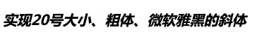

### css文本

CSS 文本属性可定义文本的外观。通过文本属性，您可以改变文本的颜色、字符间距，对齐文本，装饰文本，对文本进行缩进，等等。

| 属性              | 描述                           |
| --------------- | ---------------------------- |
| color           | 设置文本颜色                       |
| direction       | 设置文本方向。                      |
| line-height     | 设置行高。                        |
| letter-spacing  | 设置字符间距。                      |
| text-align      | 对齐元素中的文本。                    |
| text-decoration | 向文本添加修饰。                     |
| text-indent     | 缩进元素中文本的首行。                  |
| text-shadow     | 设置文本阴影。CSS3新增属性              |
| text-transform  | 控制元素中的字母。                    |
| unicode-bidi    | 设置文本方向。                      |
| white-space     | 设置元素中空白的处理方式。                |
| word-spacing    | 设置字间距。                       |
| word-wrap       | 允许文本强制文本进行换行， 即使这意味着会对单词进行拆分 |

其中文本修饰text-decoration有很多属性：

- text-decoration 简写修饰属性

- text-decoration-line :

  none：指定文字无装饰

  underline：指定文字的装饰是下划线

  overline：指定文字的装饰是上划线

  line-through：指定文字的装饰是贯穿线

  blink：指定文字的装饰是闪烁。

- text-decoration-color

- text-decoration-style

- text-decoration-skip

- text-underline-position

实例：实现一段文本的样式：字体大小为20px，颜色为blue、行高为30px、字符间距为1px、首行缩进2个文字；在“人工智能”四个字下加下划线和红色阴影。

```html
<!DOCTYPE html>
<html lang="zh-cn">

<head>
    <meta charset="UTF-8">
    <title>文本设置</title>
    <style>
        div{
            width: 300px;
            margin: 10px auto;
            border: 1px solid black;
        }

        p {
            font-size: 20px;
        }

        /* 文本设置 */

        p {
            color: blue;
            line-height: 30px;
            letter-spacing:1px;
            text-indent: 2em;
        }

        p span {
            text-decoration: underline;
            text-shadow: 2px 2px 2px red;
        }
    </style>
</head>

<body>
    <div>
        <p>
            <span>人工智能</span>（Artificial Intelligence），英文缩写为AI。它是研究、开发用于模拟、延伸和扩展人的智能的理论、方法、技术及应用系统的一门新的技术科学。 人工智能是计算机科学的一个分支，它企图了解智能的实质，并生产出一种新的能以人类智能相似的方式做出反应的智能机器，
            该领域的研究包括机器人、语言识别、图像识别、自然语言处理和专家系统等.
        </p>
    </div>
</body>

</html>
```

效果：

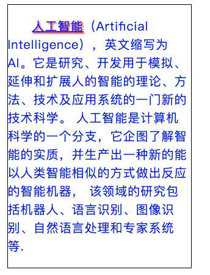

### css背景

CSS 允许应用纯色作为背景，也允许使用背景图像创建相当复杂的效果。常见的背景属性有：

| 属性                    | 描述                     |
| --------------------- | ---------------------- |
| background            | 简写属性，作用是将背景属性设置在一个声明中。 |
| background-attachment | 背景图像是否固定或者随着页面的其余部分滚动。 |
| background-color      | 设置元素的背景颜色。             |
| background-image      | 把图像设置为背景。              |
| background-position   | 设置背景图像的起始位置。           |
| background-repeat     | 设置背景图像是否及如何重复。         |
| background-clip       | 规定背景的绘制区域。             |
| background-origin     | 规定背景图片的定位区域。           |
| background-size       | 规定背景图片的尺寸。             |

实例：实现两个div元素:一个背景色为古董白，另一个以图片作为背景（背景不平铺，且从10px、20px位置开始作为背景）

```html
<!DOCTYPE html>
<html lang="zh-cn">
<head>
    <meta charset="UTF-8">
    <title>字体设置</title>
    <style>
        .box{
            width: 400px;
            margin: 10px auto;
            font-size: 20px;
            font-family: 'Microsoft YaHei';
            color: blue;
        }

        .div1, .div2{
            height: 100px;
            text-align: center;
            border: 1px solid black;
            line-height: 50px;
        }
        /* 背景设置 */
        .div1{
            background-color:antiquewhite;
        }
        .div2{
            background-image: url("./images/banner.jpg");
            background-repeat: no-repeat;
            background-position: 10px 20px;
        }
    </style>
</head>
<body>
    <div class="box">
        <div class="div1">
            古董白色背景
        </div>
        <div class="div2">
            图片背景，且不平铺，且从10px、20px位置开始作为背景
        </div>
    </div>
</body>
</html> 
```

效果：

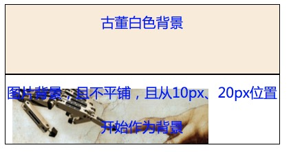

### css表格

CSS 表格属性可以帮助我们极大地改善表格的外观。

| 属性              | 描述                 |
| --------------- | ------------------ |
| border-collapse | 设置是否把表格边框合并为单一的边框。 |
| border-spacing  | 设置分隔单元格边框的距离。      |
| caption-side    | 设置表格标题的位置。         |
| empty-cells     | 设置是否显示表格中的空单元格。    |
| table-layout    | 设置显示单元、行和列的算法。     |

其中最常用的就是表格边框合并，一般HTML表格默认边框不合并，看起来为立体感，而实际应用中大多数表格均为2位视图。

实例：表格边框合并和不合并两种形式：

```css
/* 设置表格边框合并 */
border-collapse: collapse; 
```

实例完整代码：

```html
<!DOCTYPE html>
<html lang="zh-cn">

<head>
    <meta charset="UTF-8">
    <title>表格设置</title>
    <style>
        #customers {
            font-family: "Microsoft YaHei";
            width: 400px;
            margin: 20px auto;
            /* 设置表格边框合并 */
            border-collapse: collapse; 
            text-align: center;
        }

        #customers td, #customers th {
            font-size: 1em;
            border: 1px solid #98bf21;
            padding: 3px 7px 2px 7px;
        }

        #customers th {
            font-size: 1.1em;
            padding-top: 5px;
            padding-bottom: 4px;
            background-color: #A7C942;
            color: #ffffff;
        }

        #customers tr.alt td {
            color: #000000;
            background-color: #EAF2D3;
        }
    </style>
</head>

<body>
    <table id="customers">
        <tr>
            <th>Company</th>
            <th>Contact</th>
            <th>Country</th>
        </tr>

        <tr>
            <td>Apple</td>
            <td>Steven Jobs</td>
            <td>USA</td>
        </tr>

        <tr class="alt">
            <td>Baidu</td>
            <td>Li YanHong</td>
            <td>China</td>
        </tr>

        <tr>
            <td>Google</td>
            <td>Larry Page</td>
            <td>USA</td>
        </tr>

        <tr class="alt">
            <td>Lenovo</td>
            <td>Liu Chuanzhi</td>
            <td>China</td>
        </tr>

        <tr>
            <td>Microsoft</td>
            <td>Bill Gates</td>
            <td>USA</td>
        </tr>

        <tr class="alt">
            <td>Nokia</td>
            <td>Stephen Elop</td>
            <td>Finland</td>
        </tr>


    </table>
</body>

</html>
```

默认效果：


合并边框效果：

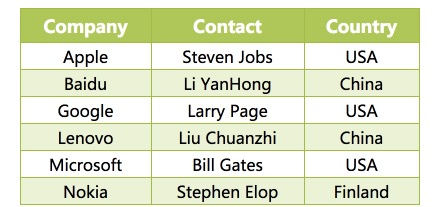

### css列表

CSS 列表属性允许放置、改变列表项标志，或者将图像作为列表项标志。

| 属性                  | 描述                         |
| ------------------- | -------------------------- |
| list-style          | 简写属性。用于把所有用于列表的属性设置于一个声明中。 |
| list-style-image    | 将图象设置为列表项标志。               |
| list-style-position | 设置列表中列表项标志的位置。             |
| list-style-type     | 设置列表项标志的类型。                |

实际上在PPT中我们总会用到各种各样的列表项标志和样式，然而CSS里的样式太少了，所以我们经常采用`list-style-image`来自定义图片式的列表项标志。

实例：实现不同的列表项标志(这串代码实现了所有的列表项标志，读者可通过取消相应的注释来查看)。

```html
<!DOCTYPE html>
<html lang="zh-cn">

<head>
    <meta charset="UTF-8">
    <title>列表设置</title>
    <style>
        ul.arrow {
            list-style-image: url("./images/li_arrow.jpg")
        }

        /* ul.none {list-style-type: none}
        ul.disc {list-style-type: disc}
        ul.circle {list-style-type: circle}
        ul.square {list-style-type: square} */

        ul.decimal {
            list-style-type: decimal
        }

        ul.decimal-leading-zero {
            list-style-type: decimal-leading-zero
        }

        ul.lower-roman {
            list-style-type: lower-roman
        }

        /* ul.upper-roman {list-style-type: upper-roman}
        ul.lower-alpha {list-style-type: lower-alpha}
        ul.upper-alpha {list-style-type: upper-alpha}
        ul.lower-greek {list-style-type: lower-greek}
        ul.lower-latin {list-style-type: lower-latin}
        ul.upper-latin {list-style-type: upper-latin}
        ul.hebrew {list-style-type: hebrew}
        ul.armenian {list-style-type: armenian}
        ul.georgian {list-style-type: georgian}
        ul.cjk-ideographic {list-style-type: cjk-ideographic}
        ul.hiragana {list-style-type: hiragana}
        ul.katakana {list-style-type: katakana}
        ul.hiragana-iroha {list-style-type: hiragana-iroha}
        ul.katakana-iroha {list-style-type: katakana-iroha} */
    </style>
</head>

<body>
    <ul class="arrow">
        <li>arrow 类型</li>
        <li>茶</li>
        <li>可口可乐</li>
    </ul>
    <!-- <ul class="none">
        <li>"none" 类型</li>
        <li>茶</li>
        <li>可口可乐</li>
    </ul>

    <ul class="disc">
        <li>Disc 类型</li>
        <li>茶</li>
        <li>可口可乐</li>
    </ul>

    <ul class="circle">
        <li>Circle 类型</li>
        <li>茶</li>
        <li>可口可乐</li>
    </ul>

    <ul class="square">
        <li>Square 类型</li>
        <li>茶</li>
        <li>可口可乐</li>
    </ul> -->

    <ul class="decimal">
        <li>Decimal 类型</li>
        <li>茶</li>
        <li>可口可乐</li>
    </ul>

    <ul class="decimal-leading-zero">
        <li>Decimal-leading-zero 类型</li>
        <li>茶</li>
        <li>可口可乐</li>
    </ul>

    <ul class="lower-roman">
        <li>Lower-roman 类型</li>
        <li>茶</li>
        <li>可口可乐</li>
    </ul>

    <!-- <ul class="upper-roman">
        <li>Upper-roman 类型</li>
        <li>茶</li>
        <li>可口可乐</li>
    </ul>

    <ul class="lower-alpha">
        <li>Lower-alpha 类型</li>
        <li>茶</li>
        <li>可口可乐</li>
    </ul>

    <ul class="upper-alpha">
        <li>Upper-alpha 类型</li>
        <li>茶</li>
        <li>可口可乐</li>
    </ul>

    <ul class="lower-greek">
        <li>Lower-greek 类型</li>
        <li>茶</li>
        <li>可口可乐</li>
    </ul>

    <ul class="lower-latin">
        <li>Lower-latin 类型</li>
        <li>茶</li>
        <li>可口可乐</li>
    </ul>

    <ul class="upper-latin">
        <li>Upper-latin 类型</li>
        <li>茶</li>
        <li>可口可乐</li>
    </ul>

    <ul class="hebrew">
        <li>Hebrew 类型</li>
        <li>茶</li>
        <li>可口可乐</li>
    </ul>

    <ul class="armenian">
        <li>Armenian 类型</li>
        <li>茶</li>
        <li>可口可乐</li>
    </ul>

    <ul class="georgian">
        <li>Georgian 类型</li>
        <li>茶</li>
        <li>可口可乐</li>
    </ul>

    <ul class="cjk-ideographic">
        <li>Cjk-ideographic 类型</li>
        <li>茶</li>
        <li>可口可乐</li>
    </ul>

    <ul class="hiragana">
        <li>Hiragana 类型</li>
        <li>茶</li>
        <li>可口可乐</li>
    </ul>

    <ul class="katakana">
        <li>Katakana 类型</li>
        <li>茶</li>
        <li>可口可乐</li>
    </ul>

    <ul class="hiragana-iroha">
        <li>Hiragana-iroha 类型</li>
        <li>茶</li>
        <li>可口可乐</li>
    </ul>

    <ul class="katakana-iroha">
        <li>Katakana-iroha 类型</li>
        <li>茶</li>
        <li>可口可乐</li>
    </ul> -->
</body>

</html>
```

效果：

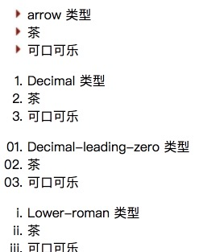


### CSS3多列

通过 CSS3，您能够创建多个列来对文本进行布局——就像报纸那样。它比表格简单多了。

| 属性                | 描述                                      |
| ----------------- | --------------------------------------- |
| column-count      | 规定元素应该被分隔的列数。                           |
| column-fill       | 规定如何填充列。                                |
| column-gap        | 规定列之间的间隔。                               |
| column-rule       | 设置所有 column-rule-* 属性的简写属性。             |
| column-rule-color | 规定列之间规则的颜色。                             |
| column-rule-style | 规定列之间规则的样式。                             |
| column-rule-width | 规定列之间规则的宽度。                             |
| column-span       | 规定元素应该横跨的列数。                            |
| column-width      | 规定列的宽度。                                 |
| columns           | 规定设置 column-width 和 column-count 的简写属性。 |

实例：一段文字实现报纸式的显示：三列，每列以红色、4px宽度隔开、间隔40px。

```html
<!DOCTYPE html>
<html lang="zh-cn">

<head>
    <meta charset="UTF-8">
    <title>margin外边距属性</title>
    <style>
        .newspaper {
            width: 800px;
            margin: 10px auto;
            border: 2px dotted black;
            text-indent: 2em;
            font-family: "Microsoft YaHei";
            font-size: 14px;
            line-height: 20px;
            padding: 10px;
            /* 多列属性设置 */
            column-count: 3;
            column-gap: 40px;
            column-rule: 4px outset #ff0000;
        }
    </style>
</head>

<body>
    <div class="newspaper">
        <p>
            看了正在热议中的《无问西东》。被电影里的一些“经典台词”深深拷问，久久不能忘怀。那些不时萦绕在耳畔的台词给人震撼，让人静思。
        </p>
        <p>
            “逝者已矣，生者如斯？”这句台词第一次出现是在陈鹏（1962年的清华大学生）用铁锹亲手埋葬小时候的三个小伙伴之一的女伙伴王敏佳，扭打另一个小伙伴李想时，从心底里吼出了这句话，给李想彻骨的震撼，使他深深地忏悔自己的不仁义、不道德。为达到“支边”的目的，不敢主动而勇敢地承认自己也是给“许老师”写信、攻击许老师夫人的人之一。第二次出现是在电影的结尾。张果果（当下清华大学生）被父母“挟持”去给李想扫墓的路上，张父在回忆李想支边最后时期，把生让给他们夫妻俩，自己不带任何干粮、空着肚子去寻“救兵”，用生命给张夫妇俩换来新生，留在世上最后的那句话还是“逝者已矣，生者如斯”，用生命的代价告诫活着的人，过去了的已经过去，不必太多纠缠，重要的是该弄明白当下怎么活，怎样让自己的生活更有意义、更有价值、更加快乐。
        </p>
        <p>
            “这个时代不缺完美的人，缺的是从心里给出真心、正义、无畏与同情。”这是另一句直抵心田的台词。第一次出现是在沈光耀（1938年的清华大学生）正犹豫不决是否投笔从戎时，被飞行员考官的这句话深深撼动，毅然决然地踏上了考飞行员的体检台。第二次出现是在沈光耀不停地单飞向灾民空投救济品，被教官训斥“不要命了”，沈同样以这句经典台词回敬教官。最终是“三代五将”的沈家后人沈光耀开着重伤的飞机，带着重伤的身体，撞击敌人的军舰，用生命释放出“无畏与正义”的伟大光芒。
        </p>
        <p>
            “不要被繁忙所迷惑，不要被世俗所引诱，活出真实的你自己。”这句经典台词也是贯穿全片的主题思想。第一次出现是清华大学学生吴岭澜正在人生路口彷徨不定，一个偶然的机会（1924年）听到泰戈尔的演讲——“我们必得证明我们存在的理由，有什么东西可以从家里拿出来算是你们给这新时期的敬意”，使吴岭澜茅塞顿开，明白了读书为什么，更明白了人生当怎样度过，不能辜负新时代，总得“拿出点自己的东西”，终成一代清华名师。第二次出现是在1938年吴教授在云南西南联大给学子们上课时，教育学子们要去发现自然界的美，要抛弃恶俗与成见，拿出自己的光亮来。当然，被世俗观念所左右的许老师与供他读大学的夫人痛苦地结婚，婚后同在一个屋檐下，没有半句话可讲，冷漠与蔑视将他夫人打得“心身俱疲”，最后她因诬告王敏佳，被王敏佳临危不惧所震慑而投井自杀。哀，莫如心死。这何尝不是用生命的代价，呼唤“沉睡”的人们，拿出勇气来，冲破恶俗的藩篱，活出真实的自己。
        </p>
        <p>
            这部影片中还有许多戮击人灵魂的“经典台词”，让人过目难忘。正如莎士比亚所言：一千个人的眼里，便有一千个哈姆雷特。每个人因为自己的生活环境和成长经历不同，看问题分析问题的角度就不同。这个世界不缺乏美，缺乏的是发现美的眼光。美无处不在，美其美，美人之美，各美其美，是为道也。
        </p>
    </div>

</body>

</html>
```

效果：


## CSS盒子模型

CSS盒子模型是指Box Model，规定了元素框处理元素内容、内边距、边框 和 外边距 的方式。

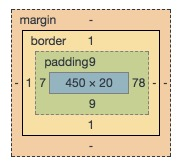

如图所示，为百度搜索框的输入div元素的设置，选中后通过浏览器中的检查->styles可以查看到其属性，这便是一个常见的盒子模型。它由内容(450×20)、内边距padding、边框border和外边距margin组成。

==一个盒子模型的长宽设置尺寸应该这样计算==：

```
真实的宽 = 左边框'border-left' + 右边框'border-right' + 内容宽'width' + 左边内边距'padding-left' + 右边内边距'padding-right';
真实的高 = 上边框'border-top' + 下边框'border-right' + 内容高'height' + 顶部内边距'padding-top' + 底部内边距'padding-bottom';
```

### css边框

在原生的HTML中，如果要使用边框border是非常困难的，CSS的边框属性提供了非常强劲的自定义设置。==每个边框有 3 个方面：宽度、样式，以及颜色==。

| 属性                  | 描述                                       |
| ------------------- | ---------------------------------------- |
| border              | 简写属性，用于把针对四个边的属性设置在一个声明。                 |
| border-style        | 用于设置元素所有边框的样式，或者单独地为各边设置边框样式。            |
| border-width        | 简写属性，用于为元素的所有边框设置宽度，或者单独地为各边边框设置宽度。      |
| border-color        | 简写属性，设置元素的所有边框中可见部分的颜色，或为 4 个边分别设置颜色。    |
| border-bottom       | 简写属性，用于把下边框的所有属性设置到一个声明中。                |
| border-bottom-color | 设置元素的下边框的颜色。                             |
| border-bottom-style | 设置元素的下边框的样式。                             |
| border-bottom-width | 设置元素的下边框的宽度。                             |
| border-left         | 简写属性，用于把左边框的所有属性设置到一个声明中。                |
| border-left-color   | 设置元素的左边框的颜色。                             |
| border-left-style   | 设置元素的左边框的样式。                             |
| border-left-width   | 设置元素的左边框的宽度。                             |
| border-right        | 简写属性，用于把右边框的所有属性设置到一个声明中。                |
| border-right-color  | 设置元素的右边框的颜色。                             |
| border-right-style  | 设置元素的右边框的样式。                             |
| border-right-width  | 设置元素的右边框的宽度。                             |
| border-top          | 简写属性，用于把上边框的所有属性设置到一个声明中。                |
| border-top-color    | 设置元素的上边框的颜色。                             |
| border-top-style    | 设置元素的上边框的样式。                             |
| border-top-width    | 设置元素的上边框的宽度。                             |
| border-radius       | 设置边框死角圆角半径。**一般可以简易的用来画圆**。设置所有四个 border-*-radius 属性的简写属性 |
| border-image        | 设置组成边框的图片。 设置所有 border-image-* 属性的简写属性   |
| box-shadow          | 向方框添加一个或多个阴影                             |

### CSS外边距

外边距就是在边框border外围的margin，主要用来设置外边距会在元素外创建额外的“空白”，一般用来控制不同元素之间的间距属性。

设置外边距的最简单的方法就是使用 margin 属性，这个属性接受auto、任何长度单位、百分数值甚至负值。

| 属性            | 描述                    |
| ------------- | --------------------- |
| margin        | 简写属性。在一个声明中设置所有外边距属性。 |
| margin-bottom | 设置元素的下外边距。            |
| margin-left   | 设置元素的左外边距。            |
| margin-right  | 设置元素的右外边距。            |
| margin-top    | 设置元素的上外边距。            |

其中，margin有几种设置四条边的方式：

```css
/* 1.四条边一致10px */
margin: 10px;
/* 2.上下10px   左右50px */
margin: 10px 50px;
/* 3.上10px   左右30px   下50px */
margin: 10px 30px 50px;
/* 4.上10px  右20px  下30px  左40px 顺时针 */
margin: 10px 20px 30px 40px;
/* 5.左右自动在父级元素中居中，上下0px */
margin: 0px auto;
```

<font color=red>注意:</font>

**垂直外边距：**取上边元素的底部外边距和下边元素顶部外边距的最大值来当两个元素得垂直间距,而不是累加。只有普通文档流中块框的垂直外边距才会发生外边距合并。行内框、浮动框或绝对定位之间的外边距不会合并。

**margin-top塌陷问题**：当设置子元素的margin-top时,没有作用到子元素自己身上,反而影响了父元素
解决塌陷问题的方式:

- 1.父元素设置相同背景色的边框 border

  ```css
  border-top: 1px solid aliceblue;
  ```

- 2.父元素设置内边距 padding

  ```css
  padding: 10px;
  ```

- 3.设置元素溢出

  ```
  overflow: hidden;
  ```

- 4.**通过伪元素** 。

  ```css
  /* 4.推荐的解决margin-top塌陷方式 */
          .clearfix::before{
              /* 添加空字符串内容 */
              content: '';
              /* 把空字符串转行成一个块类型的表格 */
              display: table;
  ```

### CSS内边距

内边距就是内容和边距之间的间距。控制该区域最简单的属性是 padding 属性。

| 属性             | 描述                         |
| -------------- | -------------------------- |
| padding        | 简写属性。作用是在一个声明中设置元素的所内边距属性。 |
| padding-bottom | 设置元素的下内边距。                 |
| padding-left   | 设置元素的左内边距。                 |
| padding-right  | 设置元素的右内边距。                 |
| padding-top    | 设置元素的上内边距。                 |

其中，padding有几种类似margin的设置四条边的方式：

```
padding: 10px;
/* 上下  左右 */
padding: 10px 20px;
/* 上  左右  下 */
/* 上 右  下 左 */
```

## CSS常见元素特点与样式重置

一般在开发中，为了更好的自定义样式，我们会重置HTML标签的原始样式，并定义适合自己业务的样式。为了便于布局我们会把带有默认样式的标签样式清除掉,这个做法就叫样式重置。

### CSS块元素特点与样式重置

块元素，也可以称为行元素，布局中常用的块标签如：div、p、ul、li、h1~h6等等都是块元素，它在布局中的行为特点:

- 独霸一行
- 宽度默认和父元素一样宽
- 支持所有样式如margin padding等

块元素样式重置：

```css
/* 清除标签默认的外边和内边距 */
body,p,h1,h2,h3,h4,h5,h6,ul{
    margin:0px;
    padding:0px;
}

/* 清除标签默认条目符号 */
ul{
    list-style:none;
}

/* 将h标签的文字大小设置为默认大小 */
h1,h2,h3,h4,h5,h6{
	/* 和父元素的字体一样大 默认16 */
    font-size:100%;
    /* 根据实际需求来加   */
    font-weight:normal;
}
```

### CSS行内元素特点与样式重置

内联元素，也可以称为行内元素，布局中常用的标签如：a、span等等都是内联元素，它们在布局中的行为:

- 宽高默认由内容决定
- 排列在一行,当遇到父元素的边界会自动换行
- 不支持宽高 margin上下， padding上下有问题
- 代码换行后行内元素之间有小间隙
- 行内元素设置文本水平对齐无效,但可以设置他们的父元素的text-align实现子元素水平对齐。

常见的行内元素默认样式：

a标签：含有的下划线以及文字颜色
em、i标签：文字默认为斜体
b、strong标签：文字默认加粗

```
1、<em> 标签 行内元素，表示语气中的强调词
2、<i> 标签 行内元素，表示专业词汇
3、<b> 标签 行内元素，表示文档中的关键字或者产品名
4、<strong> 标签 行内元素，表示非常重要的内容
```

样式重置：

```css
/* 去掉a标签默认的下划线 */
a{
    text-decoration:none;
}
/* 去掉标签默认的文字倾斜 */
em,i{
    font-style:normal;
}
/* 去掉标签默认的文字加粗(按实际需求) */
b,strong{
    font-weight:normal;
}
```

解决内联元素间隙的两种方法：

- 去掉内联元素之间的换行
- 将内联元素的父级设置font-size为0，内联元素自身再设置具体的font-size

### CSS行内块元素特点

内联块元素，也叫行内块元素，是新增的元素类型，现有元素没有归于此类别的，img和input元素的行为类似这种元素，但是也归类于内联元素，我们可以用display属性将块元素或者内联元素转化成这种元素。它们在布局中表现的行为：

1.元素排列一行
2.宽度默认由内容决定
3.元素间有默认间距
4.支持宽高 marign padding等所有样式
5.子元素是内联块元素，父元素可以用text-align属性设置子元素水平对齐方式。

display属性是用来设置元素的类型及隐藏的，属性的值有：

1、none 元素隐藏且不占位置
2、block 元素以块元素显示
3、inline 元素以内联元素显示
4、inline-block 元素以内联块元素显示

### 常见的样式重置代码块

```css
h1,h2,h3,p,ul,input,body{
    margin: 0px;
    padding: 0px;
}

h1,h2,h3{
    font-weight: normal;
    font-size: 100%
}

ul{
    list-style: none;
}

input{
    border: 0px;
}

a{
    text-decoration: none;
    color: black;
}

/* 清除浮动及解决塌陷问题 */
.clearfix::before,.clearfix::after{
    content: '';
    display: table;
}

.clearfix::after{
    clear: both;
}

.clearfix{
    zoom: 1;
}
```

## CSS位置

CSS 位置属性为定位和浮动提供了一些属性，利用这些属性，可以建立列式布局，将布局的一部分与另一部分重叠，还可以完成多年来通常需要使用多个表格才能完成的任务。

### CSS浮动

浮动是指一个元素直接漂浮在父级元素上。浮动的框可以向左或向右移动，直到它的外边缘碰到包含框或另一个浮动框的边框为止。由于浮动框不在文档的普通流中，所以文档的普通流中的块框表现得就像浮动框不存在一样。

不推荐大量使用，主要用于文字环绕图片的效果中。

请看下图，当把框 1 向右浮动时，它脱离文档流并且向右移动，直到它的右边缘碰到包含框的右边缘：


再请看下图，当框 1 向左浮动时，它脱离文档流并且向左移动，直到它的左边缘碰到包含框的左边缘。因为它不再处于文档流中，所以它不占据空间，实际上覆盖住了框 2，使框 2 从视图中消失。如果把所有三个框都向左移动，那么框 1 向左浮动直到碰到包含框，另外两个框向左浮动直到碰到前一个浮动框。


如下图所示，如果包含框太窄，无法容纳水平排列的三个浮动元素，那么其它浮动块向下移动，直到有足够的空间。如果浮动元素的高度不同，那么当它们向下移动时可能被其它浮动元素“卡住”：


<font color=red>注：</font>如果子元素有用浮动就最好全用浮动,不要单独对一个子元素用浮动除了文字绕图时,单独实现。

```css
div {
       float: left;
    }
```

**元素浮动后的特点:** 

​    1.float 它只有左或右浮动
​    2.元素浮动后会排列在一行,当遇到父元素边界,会自动换行
​    3.块元素浮动后也会排在一行,宽度默认由内容决定
​    4.浮动元素遇到父元素或其它元素都会停上
​    5.元素浮动后都会转换为带有浮动特性的行内块元素

**浮动可以解决的问题:**

​     1.可以让块元素也排在一行
​     2.解决margin-top塌陷问题
​     3.行内元素/行内块元素之间小间隙问题
​     4.解决一行中的内容以文字基线/底部对齐问题
​     5.浮动后垂直外边距不再合并
​     6.浮动可以实现文字绕图效果

**清除浮动**：

当父元素没有设置高度而子元素又全部浮动时,此时父元素的高度就无法通过子元素自动计算了,就要清除浮动来让父元素还能自动计算高度。

方法：

```css
第一种:父级上增加属性overflow：hidden

第二种:在最后一个子元素的后面加一个空的div，给它样式属性 clear:both（不推荐）

第三种:使用成熟的清浮动样式类，clearfix
.clearfix:after,.clearfix:before{ content: "";display: table;}
.clearfix:after{ clear:both;}
.clearfix{zoom:1;} /* IE下清除浮动及解决margin-top塌陷问题 */
```

### CSS定位

CSS定位允许定义元素框相对于其正常位置应该出现的位置，或者相对于父元素、另一个元素甚至浏览器窗口本身的位置。

- **文档流**
  - 文档流，是指盒子按照html标签编写的顺序依次从上到下，从左到右排列，块元素占一行，行内元素在一行之内从左到右排列，先写的先排列，后写的排在后面，每个盒子都占据自己的位置。


- 我们可以使用CSS的position属性来设置元素的定位类型，postion的设置项如下：

  - 1.relative 生成相对定位元素，元素所占据的文档流的位置保留，元素本身相对自身原位置进行偏移。

    -2.absolute 生成绝对定位元素，元素脱离文档流，不占据文档流的位置，可以理解为漂浮在文档流的上方，相对于上一个设置了定位的父级元素来进行定位，如果找不到，则相对于window元素进行定位。

    -3.fixed 生成固定定位元素，元素脱离文档流，不占据文档流的位置，可以理解为漂浮在文档流的上方，相对于浏览器窗口进行定位。

    -4.static 默认值，没有定位，元素出现在正常的文档流中，相当于取消定位属性或者不设置定位属性。

  -**定位元素的偏移**

  - 定位的元素还需要用left、right、top或者bottom来设置相对于参照元素的偏移值。

  -**定位元素层级**

  - 定位元素是浮动的正常的文档流之上的，可以用z-index属性来设置元素的层级

- **定位元素特性**

  - ==绝对定位和固定定位的块元素和行内元素会自动转化为行内块元素==

常见的属性有：

| 属性             | 描述                             |
| -------------- | ------------------------------ |
| position       | 把元素放置到一个静态的、相对的、绝对的、或固定的位置中。   |
| top            | 定义了一个定位元素的上外边距边界与其包含块上边界之间的偏移。 |
| right          | 定义了定位元素右外边距边界与其包含块右边界之间的偏移。    |
| bottom         | 定义了定位元素下外边距边界与其包含块下边界之间的偏移。    |
| left           | 定义了定位元素左外边距边界与其包含块左边界之间的偏移。    |
| overflow       | 设置当元素的内容溢出其区域时发生的事情。           |
| clip           | 设置元素的形状。元素被剪入这个形状之中，然后显示出来。    |
| vertical-align | 设置元素的垂直对齐方式。                   |
| z-index        | 设置元素的堆叠顺序。                     |

实例：电子购物网站的购物车右上角数字定位效果(第29至34行，设置span元素相对于div元素的位置为absolute，相对位置坐标为`left: 86px;top: -14px;`)

```html
<!DOCTYPE html>
<html lang="en">

<head>
    <meta charset="UTF-8">
    <meta name="viewport" content="width=device-width, initial-scale=1.0">
    <meta http-equiv="X-UA-Compatible" content="ie=edge">
    <title>购物车右上角数字位置设置</title>
    <style>
        .shop_car {
            width: 100px;
            height: 100px;
            background-color: antiquewhite;
            text-align: center;
            line-height: 100px;

            border-radius: 5px;
        }

        span {
            width: 28px;
            height: 28px;
            /* 颜色透明 */
            /* background-color: rgba(255, 0, 0, 0.5); */
            background-color: red;
            border-radius: 14px;
            line-height: 28px;
            color: white;
            /* 位置方式设置 */
            position: absolute;
            text-align: center;
            /* 位置坐标设置 */
            left: 86px;
            top: -14px;
            /* 是否透明 0~1 */
            opacity: 0.3;
            /* 兼容IE 0~100*/
            filter:alpha(opacity=30);

        }

        .box{
            position: relative;
            margin-top: 50px;
        }
    </style>
</head>

<body>
    <div class="box">
        <div class="shop_car">购物车</div>
        <span>5</span>
    </div>
</body>

</html>
```

效果：

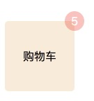

定位小结：

static 默认值,没有定位

- 使用场景:一般来说不用写，除非想要覆盖之前设置的定位 
  -relative 相对定位   
- 使用场景:和absolute一起使用，常用于logo的定位。
  -absolute 绝对定位  
- 使用场景:网页中的logo图片及一定移动动画
  -fixed 固定定位     
- 使用场景:悬浮在浏览器中的广告窗口

# 3、HTML之八个静态HTML案例

本章介绍介个静态HTML案例，以供读者实践前两章的内容。相关源代码在code文件夹中，由于源代码在主要位置已注释，因此不讲解。

## 今日头条案例

用div细分模块方便界面布局 样式设置及调整，实现如下图片要求的效果。

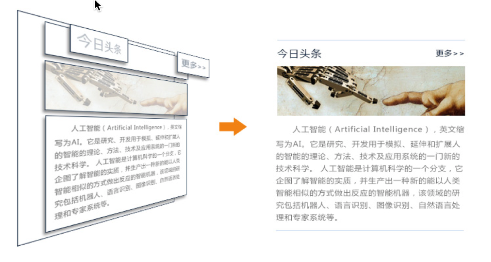

它的主要元素属性如下：

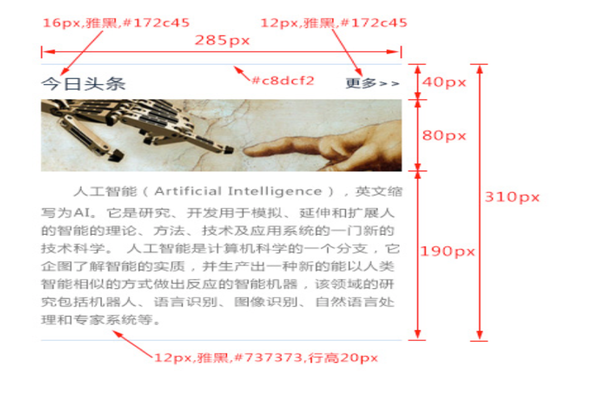

完整代码：case01_01today.html

```html
<!DOCTYPE html>
<html lang="zh-cn">

<head>
    <meta charset="UTF-8">
    <meta name="viewport" content="width=device-width, initial-scale=1.0">
    <meta http-equiv="X-UA-Compatible" content="ie=edge">
    <title>16_今日头条案例优化</title>

    <style>
        /* 整体大小 */
        .box{
            width: 285px;
            height: 310px;

            border-top: 1px solid #c8dcf2;
            border-bottom: 1px solid #c8dcf2;
            /* 设置margin的左右为auto时可以实现水平居中 */
            margin: 0px  auto;

        }

        .box h1{
            color: #172c45;
            font-size: 16px;
            font-family: "Microsoft Yahei";
            /* 设置文字是否加粗 加粗 bold normal */
            font-weight: normal;
            /* 浮动 只分左浮动 或右浮动 无论是块元素还是行内元素只要浮动之后都可以排在一行 */
            float: left;

        }

        .box a{
            color: #172c45;
            font-size: 12px;
            font-family: "Microsoft Yahei";
            /* 去掉下划线   underline  none */
            text-decoration: none;
            float: right;
            /* background-color: gold; */
            /* 设置行高  让文字垂直居中 */
            line-height: 40px;
        }
        /* 设置头部的高度 */
        .head{
            height: 40px;
        }

        .box p{
            color: #737373;
            font-size: 12px;
            font-family: "Microsoft Yahei";
            line-height: 20px;
        }
    </style>
</head>

<body>
    <!-- alt +shift + f 格式化 对齐 -->
    <!-- 整个今日头条的大框 -->
    <div class="box">
        <!-- 1.头部 -->
        <div class="head">
            <!-- 1.1 标题 -->
            <h1>今日头条</h1>
            <!-- 1.2 更多 -->
            <a href="#">更多&gt;&gt;</a>
        </div>

        <!-- 2.配图 -->
        

        <!-- 3.描述文字 -->
        <p>
                &nbsp;&nbsp;&nbsp;&nbsp;&nbsp;&nbsp;人工智能（Artificial Intelligence），英文缩写为AI。它是研究、开发用于模拟、延伸和扩展人的智能的理论、方法、技术及应用系统的一门新的技术科学。 人工智能是计算机科学的一个分支，它企图了解智能的实质，并生产出一种新的能以人类智能相似的方式做出反应的智能机器，该领域的研究包括机器人、语言识别、图像识别、自然语言处理和专家系统等.
        </p>
    </div>

</body>

</html>
```

## 文章配图布局案例

实现如下文章和配图。

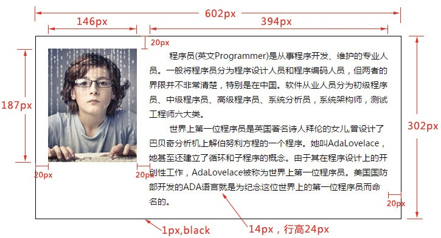

源代码：

```html
<!DOCTYPE html>
<html lang="zh">

<head>
    <meta charset="UTF-8">
    <meta name="viewport" content="width=device-width, initial-scale=1.0">
    <meta http-equiv="X-UA-Compatible" content="ie=edge">
    <title>文章配图布局案例</title>

    <style>
        .box {
            width: 600px;
            height: 300px;
            border: 1px solid black;
        }
        
        img {
            margin: 20px;
            /* 浮动实现图片处于最左侧 */
            float: left;
        }
        
        p {
            font-size: 14px;
            line-height: 24px;
            margin-top: 20px;
        }
        
        .text {
            width: 394px;
            height: 300px;
            margin-right: 20px;
            /* 浮动使得文本块处于最右侧 */
            float: right;
        }
    </style>
</head>

<body>
    <div class="box">
        
        <div class="text">
            <p>
                &nbsp;&nbsp;&nbsp;&nbsp;&nbsp;&nbsp;程序员(英文Programmer)是从事程序开发、维护的专业人员。一般将程序员分为程序设计人员和程序编码人员，但两者的界限并不非常清楚，特别是在中国。软件从业人员分为初级程序员、中级程序员、高级程序员、系统分析员，系统架构师，测试工程师六大类。
                <br /> &nbsp;&nbsp;&nbsp;&nbsp;&nbsp;&nbsp;世界上第一位程序员是英国著名诗人拜伦的女儿,曾设计了巴贝奇分析机上解伯努利方程的一个程序。她叫AdaLovelace，她甚至还建立了循环和子程序的概念。由于其在程序设计上的开创性工作，AdaLovelace被称为世界上第一位程序员。美国国防部开发的ADA语言就是为纪念这位世界上的第一位程序员而命名的。
            </p>
        </div>
    </div>
</body>

</html>
```

## 类似QQ新闻标题列表案例

实现如下所示的新闻标题列表，点击更多可跳转至超链接，鼠标放置在新闻标题上显示红色。使用外链式CSS(上一章提到的reset代码片段，源代码见code文件夹中的css文件夹)重置样式，内置式CSS编制样式，无序列表编写新闻标题列表。

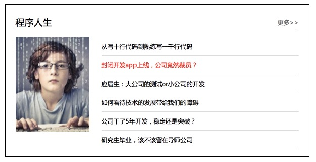

源代码：

```Html
<!DOCTYPE html>
<html lang="zh-cn">

<head>
    <meta charset="UTF-8">
    <meta name="viewport" content="width=device-width, initial-scale=1.0">
    <meta http-equiv="X-UA-Compatible" content="ie=edge">
    <title>QQ新闻标题列表</title>
    <link rel="stylesheet" href="./css/reset.css">
    <style>
        .box {
            width: 600px;
            height: 300px;
            border: 1px solid black;
            margin: 20px auto;
            font-size: 0;

            /* padding: 20px; */
        }

        .box .head_info {
            height: 28px;
            border-bottom: 1px solid black;
            margin: 20px 20px 0px 20px;
        }

        .head_info h3 {
            font-size: 18px;
            font-family: 'Microsoft YaHei';

            display: inline;

            line-height: 30px;
        }

        .head_info a {
            text-decoration: none;
            font-family: 'Microsoft YaHei';
            font-size: 12px;
            color: #666666;
            float: right;
            line-height: 30px;
        }
        .text_info{
            width: 560px;
            margin: 15px auto 0;
        }

        .box ul {
            font-size: 12px;
            font-family: 'Microsoft YaHei';
            width: 390px;
            float: right;

            margin-left: 20px;
        }

        .box li {
            border-bottom: 1px solid #dddddd;
            height: 36px;
            /* 设置行高可使文字自动垂直居中 */
            line-height: 36px;
        }


        .box li:hover {
            color: red;
        }
    </style>
</head>

<body>
    <div class="box">
        <!-- 头部信息 -->
        <div class="head_info">
            <h3>程序人生</h3>
            <a href="#">更多&gt;&gt;</a>
        </div>
        <!-- 列表信息 -->
        <div class="text_info">
            
            <!-- 无序列表实现新闻标题列表 -->
            <ul>
                <li>从写十行代码到熟练写一千行代码</li>
                <li>封闭开发app上线，公司竟然裁员？</li>
                <li>应届生：大公司的测试or小公司的开发</li>
                <li>如何看待技术的发展带给我们的障碍</li>
                <li>公司干了5年开发，稳定还是突破？</li>
                <li>研究生毕业，该不该留在导师公司</li>
            </ul>
        </div>
    </div>
</body>

</html>
```

## 商品图片列表展示案例

实现一个商品图片列表展示，每个图片为一个链接，点击可实现超链接。

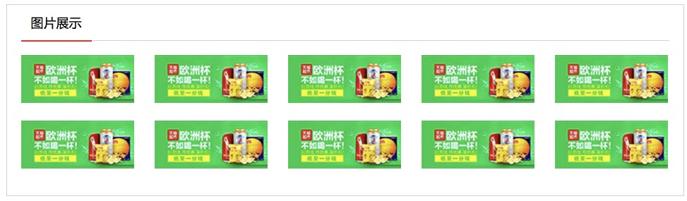

源代码：

```html
<!DOCTYPE html>
<html lang="zh-cn">
<head>
    <meta charset="UTF-8">
    <meta name="viewport" content="width=device-width, initial-scale=1.0">
    <meta http-equiv="X-UA-Compatible" content="ie=edge">
    <title>商品图片列表展示</title>
    <style>
        .box{
            width: 958px;
            height: 270px;
            border: 1px solid #d1d1d1;
            margin: 10px auto;
            /* 采用浮动实现图片列表，因此需要隐藏溢出的元素 */
            overflow: hidden;
        }
        .box .header{
            width: 918px;
            height: 50px;
            border-bottom: 1px solid #d1d1d1;
            margin: 0px auto;
        }
        .box .header div{
            font-size: 18px;
            font-family: 'Microsoft YaHei';
            color: #000;
            line-height: 50px;

            width: 100px;
            height: 50px;
            /* 红线设置 */
            border-bottom: 2px solid #fe0201;
            text-align: center;
        }
        .box .picture{
            list-style: none;
            width: 948px;
            height: 199px;
            /* 图片之间的间距设置 */
            margin: 20px 0 0 20px;
            /* ul标签的内边距清除 */
            padding: 0;
        }
        .picture li{
            width:160px;
            height:68px;
            /* 浮动实现图片列表分布布局 */
            float:left;
            /* 无序列表间距实现 */
            margin:0 29px 25px 0;
        }
    </style>
</head>
<body>
    <div class="box">
        <div class="header">
            <div>图片展示</div>
        </div>
        <ul class="picture">
            <li></li>
            <li></li>
            <li></li>
            <li></li>
            <li></li>
            <li></li>
            <li></li>
            <li></li>
            <li></li>
            <li></li>
        </ul>
    </div>
</body>
</html>
```

## 注册表单案例

实现下图的注册表单效果：

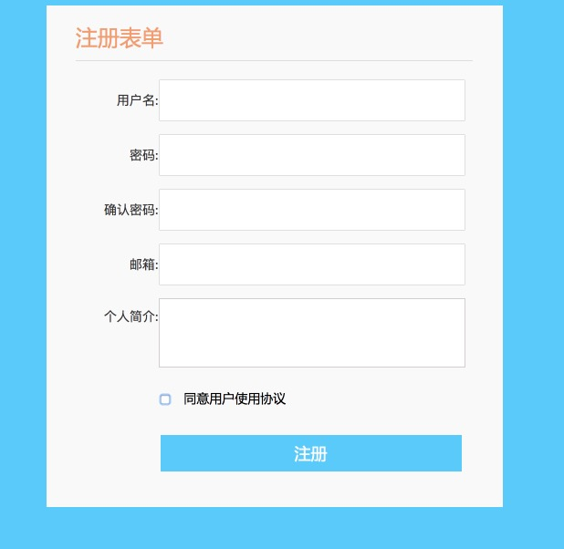


源代码：

```html
<!DOCTYPE html>
<html lang="zh-cn">

<head>
    <meta charset="UTF-8">
    <meta name="viewport" content="width=device-width, initial-scale=1.0">
    <meta http-equiv="X-UA-Compatible" content="ie=edge">
    <title>注册表单</title>
    <style>

        .clearfix:before{
            /* margin-top 塌陷修复 */
            content:"";
            display:table;
        }

        body{
            /* 网页背景色 */
            background-color: #00ccff;
        }

        .box{
            /* 注册表单总大小、背景色、左右居中 */
            width: 500px;
            height: 550px;
            background-color: #f9f9f9;
            margin: 10px auto;
        }
        .box h3{
            /* 注册表单四个字设置 */
            color: #ff9966;
            font-size: 24px;
            font-family: 'Microsoft YaHei';
            font-weight: normal;
            padding: 0px;
            line-height: 50px;

            width: 435px;
            margin: 10px auto 0px;
            border-bottom: 1px solid #dddddd;
        }

        .box form{
            width: 434px;
            margin: 0px auto;
            font-size: 0;
        }
        .box form p{
            width: 430px;
            height: 40px;
            padding: 0;
            margin: 20px auto 5px;
        }

        .box label{
            display: inline-block;
            width: 88px;
            /* background-color: #00cc00; */
            text-align: right;
            font-size: 14px;
            color: #333333;
            line-height: 40px;
        }

        .box .profile{
            height: 70px;
        }

        .box p .profile{
            width: 88px;
            height: 40px;
            text-align: right;
            font-size: 14px;
            line-height: 40px;
            float: left;
        }

        textarea {
            /* 个人简介输入框设置 */
            resize: none;
            width: 330px;
            height: 70px;
            border: 1px solid rgb(209, 206, 206);
        }

        .box input{
                 /* 输入框设置 */
            width: 330px;
            height: 40px;
        }

        .box .agree{
            /* 同意字体设置 */
            width:330px;
            height: 40px;
            font-size: 14px;
            font-family: 'Microsoft YaHei';
            line-height: 40px;
            margin-right: 15px;
        }
        .box .agree .agree{
            /* 同意按钮设置 */
            width: 10px;
            height: 34px;
            float: left;
        }

        .box .submit{
            /* 提交按钮和文字设置 */
            border: none;
            width: 330px;
            height: 40px;
            background-color: #00ccff;
            font-size: 18px;
            font-family: 'Microsoft YaHei';
            color: white;
            line-height: 36px;
            float: right;
            padding: 0;
            margin-right: 10px;
        }
    </style>
</head>

<body>
    <div class="box clearfix">
        <h3>注册表单</h3>
        <form class="clearfix" action="">
            <p>
                <label for="">用户名:</label>
                <input type="text" name="username">
            </p>
            <p>
                <label for="">密码:</label>
                <input type="password" name="pwd">
            </p>
            <p>
                <label for="">确认密码:</label>
                <input type="password" name="pwd_again">
            </p>
            <p>
                <label for="">邮箱:</label>
                <input type="email" name="email_address">
            </p>
            <p class="profile">
                <label class="profile" for="">个人简介:</label>
                <textarea name="profile"></textarea>
            </p>
            <p class="agree">
                    <input class="agree" type="checkbox" required="required">同意用户使用协议
            </p>
            <p>
                    <input class="submit" type="submit" value="注册">
                </p>
        </form>
    </div>

</body>

</html>
```

## 网站主页导航栏案例

采用列表标签实现网站主页导航栏(也可使用HTML5中的`<nav>`标签)：

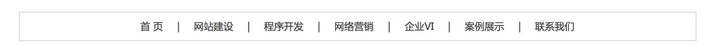

源代码：

```html
<!DOCTYPE html>
<html lang="zh-cn">
<head>
    <meta charset="UTF-8">
    <meta name="viewport" content="width=device-width, initial-scale=1.0">
    <meta http-equiv="X-UA-Compatible" content="ie=edge">
    <title>网站主页导航栏</title>
    <style>
        .box{
            list-style: none;
            padding: 0;

            width: 960px;
            height: 40px;
            border: 1px solid #d1d1d1;
            margin: 50px auto;
            /* 采用行内块，需要将父级元素字体大小设置为0，以便消除块间间隙 */
            font-size: 0;

            text-align: center;
        }
        .box li{
            /* 行内块让所有列在同一行 */
            display: inline-block;
            font-size: 14px;
            font-family: 'Microsoft YaHei';
            color: #3d3d3d;
            line-height: 40px;
            /* 各块左右相隔20px */
            margin: 0px 10px;
        }
    </style>
</head>
<body>
    <ul class="box">
        <li>首&nbsp;页</li>
        <li>|</li>
        <li>网站建设</li>
        <li>|</li>
        <li>程序开发</li>
        <li>|</li>
        <li>网络营销</li>
        <li>|</li>
        <li>企业VI</li>
        <li>|</li>
        <li>案例展示</li>
        <li>|</li>
        <li>联系我们</li>
    </ul>
</body>
</html>
```

## 搜索条案例

实现和百度搜索条一样的效果，如下图：

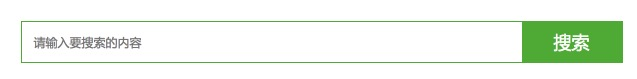

源代码：

```html
<!DOCTYPE html>
<html lang="zh-cn">
<head>
    <meta charset="UTF-8">
    <meta name="viewport" content="width=device-width, initial-scale=1.0">
    <meta http-equiv="X-UA-Compatible" content="ie=edge">
    <title>搜索条</title>
    <style>
        .searchbar{
            /* 搜索条大小设置 边框设置 左右居中 */
            width: 600px;
            height: 40px;
            border: 1px solid #10ad10;
            margin: 50px auto 0px;
        }
        .input_text{
            width: 500px;
            height: 40px;
            font-size: 12px;
            font-family: 'Microsoft YaHei';
            /* 文本输入框有默认边框和内边距 */
            border: 0;
            padding: 0;
            text-indent: 1em;
            /* 取消外边框高亮 */
            outline: none;
        }
        .submit_bon{
            width: 100px;
            height: 40px;
            background-color: #10ad10;
            color: white;
            font-family: 'Microsoft YaHei';
            font-size: 18px;
            /* 默认边框和内边距 */
            border: 0;
            padding: 0;
            /* 右浮动时为了去掉行内元素之间默认间隙问题 */
            float: right;
            /* 取消点击输入框时边框高亮 */
            outline: none;
            /* 鼠标放上去后显示为小手 */
            cursor: pointer
        }
    </style>
</head>
<body>
    <form class="searchbar" action="">
        <!-- 占位提示文字：请输入要搜索的内容 -->
        <input type="text" name="search_content" placeholder="请输入要搜索的内容" class="input_text">
        <input type="submit" value="搜索" class="submit_bon">
    </form>
</body>
</html>
```

## 精灵图实现电影排行案例

精灵图也叫雪碧图，雪碧图被运用在众多使用了很多小图标的网站上。相对于把每张小图标以.png格式文件的形式引用到页面上，使用雪碧图只需要引用一张图片，对内存和带宽更加友好。 

使用雪碧图的优点有以下几点：

1. 将多张图片合并到一张图片中，可以减小图片的总大小
2. 将多张图片合并到一张图片后，只需一次网络请求就可以将所需的资源全部下载，减小建立连接的消耗，在移动端尤为明显

雪碧图的制作与使用方法：

1. 使用图像编辑软件如Photoshop将多张图放到同一个图层并导出或使用自动化构建工具自动拼接合并后的图片
2. 引用图片时，图片地址为合并后的图片地址，通过background-position调整背景图的位置，并通过容器的宽高共同作用，来选出所需的图片。

本案例实现如下电影排行效果：


源代码：

```html
<!DOCTYPE html>
<html lang="zh-cn">
<head>
    <meta charset="UTF-8">
    <meta name="viewport" content="width=device-width, initial-scale=1.0">
    <meta http-equiv="X-UA-Compatible" content="ie=edge">
    <title>雪碧图电影排行案例</title>

    <style>
        .list{
            list-style: none;
            margin: 0px;
            padding: 0px;

            width: 300px;
            margin: 50px auto 0px;


        }

        .list li{
            height: 60px;
            border-bottom: 1px dotted black;
            text-indent: 60px;
            /* 雪碧图作为背景图片，不平铺 */
            background-image: url("./images/sprite_bg.png");
            background-repeat: no-repeat;
            background-position-y: 10px;
        }


        .list .icon1{
            /* 通过移动y向雪碧图作为背景的位置 来实现不同列显示不同的背景图片 */
            background-position-y: -70px;
        }
        .list .icon2{
            background-position-y: -153px;
        }
        .list .icon3{
            background-position-y: -233px;
        }
        .list .icon4{
            background-position-y: -314px;
        }


        .list a{
            text-decoration: none;
            color: black;
            line-height: 60px;
        }

        .list a:hover{
            color: red;
        }
    </style>
</head>
<body>
    <ul class="list">
        <li><a href="#">电影排列1</a></li>
        <li class="icon1"><a href="#">电影排列2</a></li>
        <li class="icon2"><a href="#">电影排列3</a></li>
        <li class="icon3"><a href="#">电影排列4</a></li>
        <li class="icon4"><a href="#">电影排列5</a></li>
    </ul>
</body>
</html>
```

