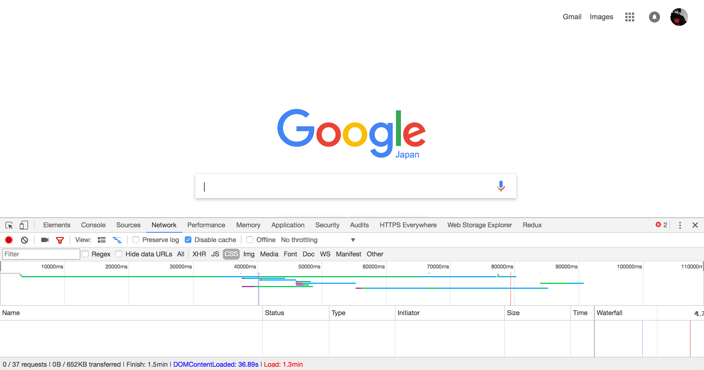
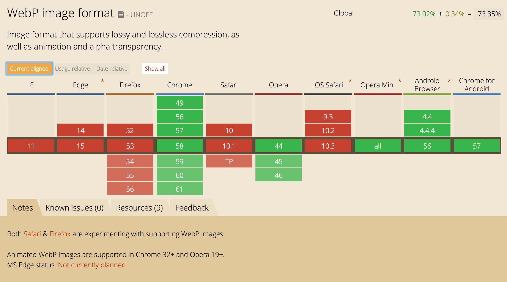
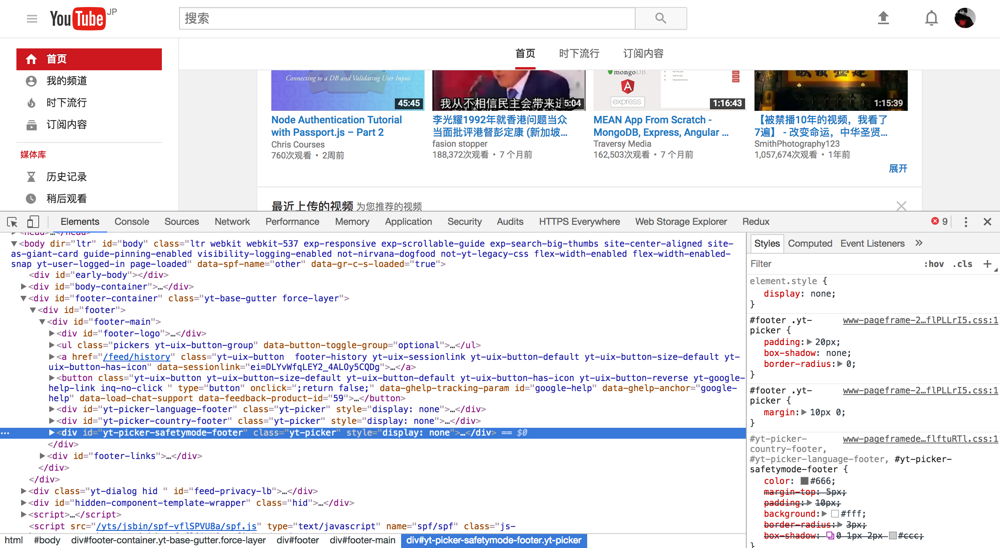

# [网站性能优化](http://www.cnblogs.com/puyongsong/p/5968935.html)

## 1、尽量减少HTTP请求次数

终端用户响应的时间中，有80%用于下载各项内容，这部分时间包括下载页面中的图像、样式表、脚本、Flash等。通过减少页面中的元素可以减少HTTP请求的次数，这是提高网页速度的关键步骤。

减少页面组件的方法其实就是简化页面设计。那么有没有一种方法既能保持页面内容的丰富性又能达到加快响应时间的目的呢？这里有几条减少HTTP请求次数同时又可能保持页面内容丰富的技术。

1、合并文件：合并文件是通过把所有的脚本放到一个文件中来减少HTTP请求的方法，例如可以简单地把所有的CSS文件都放入一个样式表中。当脚本 或者样式表在不同页面中使用时需要做不同的修改，这可能会相对比较麻烦，但即便如此也要把这个方法作为改善页面性能的重要一步；

2、CSS Sprites：CSS Sprites是减少图像请求的有效方法。把所有的背景图像都放到一个图片文件中，然后通过CSS的background-image和background-position属性来显示图片的不同部分;

3、图片地图：图片地图是把多张图片整合到一张图片中。虽然文件的总体大小不会改变，但是可以减少HTTP请求次数。图片地图只有在图片的所有组成 部分在页面中是紧挨在 一起的时候才能使用，如导航栏。确定图片的坐标和可能会比较繁琐且容易出错，同时使用图片地图导航也不具有可读性，因此不推荐这种方法；

4、内联图像：内联图像是使用data:URL scheme的方法把图像数据加载页面中，这可能会增加页面的大小。把内联图像放到样式表（可缓存）中可以减少HTTP请求同时又避免增加页面文件的大小，但是内联图像现在还没有得到主流浏览器的支持。

减少页面的HTTP请求次数是你优化网站性能首先要做的一步，这是改进首次访问用户等待时间的最重要的方法。如同Tenni Theurer的博文《Browser Cahe Usage – Exposed》中所说，HTTP请求在无缓存情况下占去了40%到60%的响应时间。改善HTTP请求，让那些初次访问你网站的人获得更加快速的体验 吧！

## 2、减少DNS查找次数

域名系统（DNS）提供了域名和IP的对应关系，就像电话本中人名和他们的电话号码的关系一样。当你在浏览器地址栏中输入 www.52maomao.info时，DNS解析服务器就会返回这个域名对应的IP地址。DNS解析的过程同样也是需要时间的，一般情况下返回给定域名 对应的IP地址会花费20到120毫秒的时间，而且在这个过程中浏览器什么都不会做直到DNS查找完毕。

缓存DNS查找可以改善页面性能。这种缓存需要一个特定的缓存服务器，这种服务器一般属于用户的ISP提供商或者本地局域网控制，但是它同样会在用 户使用的计算机上产生缓存。DNS信息会保留在操作系统的DNS缓存中（微软Windows系统中DNS Client Service），大多数浏览器有独立于操作系统以外的自己的缓存。由于浏览器有自己的缓存记录，因此在一次请求中它不会受到操作系统的影响。

Internet Explorer默认情况下对DNS查找记录的缓存时间为30分钟，它在注册表中的键值为DnsCacheTimeout。Firefox对DNS的查找 记录缓存时间为1分钟，它在配置文件中的选项为network.dnsCacheExpiration（Fasterfox把这个选项改为了1小时）。

当客户端中的DNS缓存都为空时（浏览器和操作系统都为空），DNS查找的次数和页面中主机名的数量相同，这其中包括页面中URL、图片、脚本文 件、样式表、Flash对象等包含的主机名。减少主机名的数量可以减少DNS查找次数。减少主机名的数量还可以减少页面中并行下载的数量。减少DNS查找 次数可以节省响应时间，但是减少并行下载却会增加响应时间。我的指导原则是把这些页面中的内容分割成至少两部分但不超过四部分，这种结果就是在减少DNS 查找次数和保持较高程度并行下载两者之间的权衡了。

## 3、避免跳转

跳转是使用301和302代码实现的。下面是一个响应代码为301的HTTP头：

　　　　HTTP/1.1 301 Moved Permanently

　　　　Location: http://52maomao.info/demo

　　　　Content-Type: text/html

浏览器会把用户指向到Location中指定的URL。头文件中的所有信息在一次跳转中都是必需的，内容部分可以为空。不管他们的名称，301和302 响应都不会被缓存，除非增加一个额外的头选项，如Expires或者Cache-Control来指定它缓存。

<meat />元素的刷新标签和JavaScript也可以实现URL的跳转，但是如果你必须要跳转的时候，最好的方法就是使用标准的3XXHTTP状态代 码，这主要是为了确保“后退”按钮可以正确地使用。

但是要记住跳转会降低用户体验。在用户和HTML文档中间增加一个跳转，会拖延页面中所有元素的显示，因为在HTML文件被加载前任何文件（图像、 Flash等）都不会被下载。

有一种经常被网页开发者忽略却往往十分浪费响应时间的跳转现象。这种现象发生在当URL本该有斜杠（/）却被忽略掉时。例如，当我们要访问 http: //astrology.yahoo.com/astrology 时，实际上返回的是一个包含301代码的跳转，它指向的是http://astrology.yahoo.com/astrology/ （注意末尾的斜杠）。在Apache服务器中可以使用Alias 或者 mod_rewrite或者the DirectorySlash来避免。

连接新网站和旧网站是跳转功能经常被用到的另一种情况。这种情况下往往要连接网站的不同内容然后根据用户的不同类型（如浏览器类型、用户账号所属类 型）来进行跳转。使用跳转来实现两个网站的切换十分简单，需要的代码量也不多。尽管使用这种方法对于开发者来说可以降低复杂程度，但是它同样降低用户体 验。

一个可替代方法就是如果两者在同一台服务器上时使用Alias和mod_rewrite和实现。如果是因为域名的不同而采用跳转，那么可以通过使用 Alias或者mod_rewirte建立CNAME（保存一个域名和另外一个域名之间关系的DNS记录）来替代。

## 4、可缓存的AJAX

Ajax经常被提及的一个好处就是由于其从后台服务器传输信息的异步性而为用户带来的反馈的即时性。但是，使用Ajax并不能保证用户不会在等待异步的JavaScript和XML响应上花费时间。

在很多应用中，用户是否需要等待响应取决于Ajax如何来使用。例如，在一个基于Web的Email客户端中，用户必须等待Ajax返回符合他们条件的邮件查询结果。记住一点，“异步”并不异味着“即时”，这很重要。

为了提高性能，优化Ajax响应是很重要的。提高Ajxa性能的措施中最重要的方法就是使响应具有可缓存性，具体的讨论可以查看《Add an Expires or a Cache-Control Header》。其它的几条规则也同样适用于Ajax：

1、Gizp压缩文件；

2、减少DNS查找次数；

3、精简JavaScript；

4、避免跳转；

5、配置ETags。

让我们来看一个例子：一个Web2.0的Email客户端会使用Ajax来自动完成对用户地址薄的下载。如果用户在上次使用过Email web应用程序后没有对地址薄作任何的修改，而且Ajax响应通过Expire或者Cacke-Control头来实现缓存，那么就可以直接从上一次的缓 存中读取地址薄了。必须告知浏览器是使用缓存中的地址薄还是发送一个新的请求。这可以通过为读取地址薄的Ajax URL增加一个含有上次编辑时间的时间戳来实现，例如，&t=11900241612等。如果地址薄在上次下载后没有被编辑过，时间戳就不变，则 从浏览器的缓存中加载从而减少了一次HTTP请求过程。如果用户修改过地址薄，时间戳就会用来确定新的URL和缓存响应并不匹配，浏览器就会重要请求更新 地址薄。

即使你的Ajxa响应是动态生成的，哪怕它只适用于一个用户，那么它也应该被缓存起来，这样做可以使你的Web2.0应用程序更加快捷。

## 5、推迟加载内容

你可以仔细看一下你的网页，问问自己“哪些内容是页面呈现时所必需首先加载的？哪些内容和结构可以稍后再加载？

把整个过程按照onload事件分隔成两部分，JavaScript是一个理想的选择。例如，如果你有用于实现拖放和动画的JavaScript， 那么它 就以等待稍后加载，因为页面上的拖放元素是在初始化呈现之后才发生的。其它的例如隐藏部分的内容（用户操作之后才显现的内容）和处于折叠部分的图像也可以 推迟加载

工具可以节省你的工作量：YUI Image Loader可以帮你推迟加载折叠部分的图片，YUI Get utility是包含JS和CSS的便捷方法，比如你可以打开Firebug的Net选项卡看一下Yahoo的首页。

当性能目标和其它网站开发实践一致时就会相得益彰。这种情况下，通过程序提高网站性能的方法告诉我们，在支持JavaScript的情况下，可以先 去除用户体验，不过这要保证你的网站在没有JavaScript也可以正常运行。在确定页面运行正常后，再加载脚本来实现如拖放和动画等更加花哨的效果。

## 6、预加载

预加载和后加载看起来似乎恰恰相反，但实际上预加载是为了实现另外一种目标。预加载是在浏览器空闲时请求将来可能会用到的页面内容（如图像、样式表和脚本）。使用这种方法，当用户要访问下一个页面时，页面中的内容大部分已经加载到缓存中了，因此可以大大改善访问速度。

下面提供了几种预加载方法：

无条件加载：触发onload事件时，直接加载额外的页面内容。以Google.com为例，你可以看一下它的spirit image图像是怎样在onload中加载的。这个spirit image图像在google.com主页中是不需要的，但是却可以在搜索结果页面中用到它。

有条件加载：根据用户的操作来有根据地判断用户下面可能去往的页面并相应的预加载页面内容。在search.yahoo.com中你可以看到如何在你输入内容时加载额外的页面内容。

有预期的加载：载入重新设计过的页面时使用预加载。这种情况经常出现在页面经过重新设计后用户抱怨“新的页面看起来很酷，但是却比以前慢”。问题可 能出在用户对于你的旧站点建立了完整的缓存，而对于新站点却没有任何缓存内容。因此你可以在访问新站之前就加载一部内容来避免这种结果的出现。在你的旧站 中利用浏览器的空余时间加载新站中用到的图像的和脚本来提高访问速度。

## 7、减少DOM元素数量

一个复杂的页面意味着需要下载更多数据，同时也意味着JavaScript遍历DOM的效率越慢。比如当你增加一个事件句柄时在500和5000个DOM元素中循环效果肯定是不一样的。

大量的DOM元素的存在意味着页面中有可以不用移除内容只需要替换元素标签就可以精简的部分。你在页面布局中使用表格了吗？你有没有仅仅为了布局而引入更多的<div>元素呢？也许会存在一个适合或者在语意是更贴切的标签可以供你使用。

YUI CSS utilities可以给你的布局带来巨大帮助：grids.css可以帮你实现整体布局，font.css和reset.css可以帮助你移除浏览器默 认格式。它提供了一个重新审视你页面中标签的机会，比如只有在语意上有意义时才使用<div>，而不是因为它具有换行效果才使用它。

DOM元素数量很容易计算出来，只需要在Firebug的控制台内输入：

document.getElementsByTagName(‘*’).length

那么多少个DOM元素算是多呢？这可以对照有很好标记使用的类似页面。比如Yahoo!主页是一个内容非常多的页面，但是它只使用了700个元素（HTML标签）。

## 8、根据域名划分页面内容

把页面内容划分成若干部分可以使你最大限度地实现平行下载。由于DNS查找带来的影响你首先要确保你使用的域名数量在2个到4个之间。例如，你可以 把用到的HTML内容和动态内容放在www.52maomao.info上，而把页面各种组件（图片、脚本、CSS)分别存放在 statics1.52maomao.info和statics.52maomao.info上。

你可在Tenni Theurer和Patty Chi合写的文章《Maximizing Parallel Downloads in the Carpool Lane》找到更多相关信息。

## 9、使iframe的数量最小

ifrmae元素可以在父文档中插入一个新的HTML文档。了解iframe的工作理然后才能更加有效地使用它，这一点很重要。

<iframe>优点：

1、解决加载缓慢的第三方内容如图标和广告等的加载问题；

2、Security sandbox；

3、并行加载脚本。

<iframe>的缺点：

1、即时内容为空，加载也需要时间；

2、会阻止页面加载；

3、没有语意。

## 10、不要出现404错误

　　HTTP请求时间消耗是很大的，因此使用HTTP请求来获得一个没有用处的响应（例如404没有找到页面）是完全没有必要的，它只会降低用户体验而不会有一点好处。有些站点把404错误响应页面改为“你是不是要找***”，这虽然改进了用户体验但是同样也会浪费服务器资源（如数据库等）。最糟糕的情况是指向外部 JavaScript的链接出现问题并返回404代码。首先，这种加载会破坏并行加载；其次浏览器会把试图在返回的404响应内容中找到可能有用的部分当 作JavaScript代码来执行。

## 11、使用内容分发网络

用户与你网站服务器的接近程度会影响响应时间的长短。把你的网站内容分散到多个、处于不同地域位置的服务器上可以加快下载速度。但是首先我们应该做些什么呢？

按地域布置网站内容的第一步并不是要尝试重新架构你的网站让他们在分发服务器上正常运行。根据应用的需求来改变网站结构，这可能会包括一些比较复杂 的任务，如在服务器间同步Session状态和合并数据库更新等。要想缩短用户和内容服务器的距离，这些架构步骤可能是不可避免的。

要记住，在终端用户的响应时间中有80%到90%的响应时间用于下载图像、样式表、脚本、Flash等页面内容。这就是网站性能黄金守则。和重新设 计你的应用程序架构这样比较困难的任务相比，首先来分布静态内容会更好一点。这不仅会缩短响应时间，而且对于内容分发网络来说它更容易实现。

内容分发网络（Content Delivery Network，CDN）是由一系列分散到各个不同地理位置上的Web服务器组成的，它提高了网站内容的传输速度。用于向用户传输内容的服务器主要是根据 和用户在网络上的靠近程度来指定的。例如，拥有最少网络跳数（network hops）和响应速度最快的服务器会被选定。

一些大型的网络公司拥有自己的CDN，但是使用像Akamai Technologies，Mirror Image Internet， 或者Limelight Networks这样的CDN服务成本却非常高。对于刚刚起步的企业和个人网站来说，可能没有使用CDN的成本预算，但是随着目标用户群的不断扩大和更加 全球化，CDN就是实现快速响应所必需的了。以Yahoo来说，他们转移到CDN上的网站程序静态内容节省了终端用户20%以上的响应时间。使用CDN是 一个只需要相对简单地修改代码实现显著改善网站访问速度的方法。

## 12、为文件头指定Expires或Cache-Control

这条守则包括两方面的内容：

对于静态内容：设置文件头过期时间Expires的值为“Never expire”（永不过期）；

对于动态内容：使用恰当的Cache-Control文件头来帮助浏览器进行有条件的请求。

网页内容设计现在越来越丰富，这就意味着页面中要包含更多的脚本、样式表、图片和Flash。第一次访问你页面的用户就意味着进行多次的HTTP请 求，但是通过使用Expires文件头就可以使这样内容具有缓存性。它避免了接下来的页面访问中不必要的HTTP请求。Expires文件头经常用于图像 文件， 但是应该在所有的内容都使用他，包括脚本、样式表和Flash等。

浏览器（和代理）使用缓存来减少HTTP请求的大小和次数以加快页面访问速度。Web服务器在HTTP响应中使用Expires文件头来告诉客户端 内容需 要缓存多长时间。下面这个例子是一个较长时间的Expires文件头，它告诉浏览器这个响应直到2010年4月15日才过期。

Expires: Thu, 15 Apr 2010 20:00:00 GMT

如果你使用的是Apache服务器，可以使用ExpiresDefault来设定相对当前日期的过期时间。

下面这个例子是使用 ExpiresDefault来设定请求时间后10年过期的文件头：

ExpiresDefault “access plus 10 years”

要切记，如果使用了Expires文件头，当页面内容改变时就必须改变内容的文件名。依Yahoo!来说我们经常使用这样的步骤：在内容的文件名中加上版本号，yahoo_2.0.6.js。

使用Expires文件头只有会在用户已经访问过你的网站后才会起作用。当用户首次访问你的网站时这对减少HTTP请求次数来说是无效的，因为浏览 器的缓存是空的。因此这种方法对于你网站性能的改进情况要依据他们“预缓存”存在时对你页面的点击频率（“预缓存”中已经包含了页面中的所有内容）。 Yahoo!建立了一套测量方法，我们发现所有的页面浏览量中有75~85%都有“预缓存”。通过使用Expires文件头，增加了缓存在浏览器中内容的 数量，并且可以在用户接下来的请求中再次使用这些内容，这甚至都不需要通过用户发送一个字节的请求。

## 13、Gzip压缩文件内容

网络传输中的HTTP请求和应答时间可以通过前端机制得到显著改善。的确，终端用户的带宽、互联网提供者、与对等交换点的靠近程度等都不是网站开发者所能决定的。但是还有其他因素影响着响应时间。通过减小HTTP响应的大小可以节省HTTP响应时间。

从HTTP/1.1开始，web客户端都默认支持HTTP请求中有Accept-Encoding文件头的压缩格式：

Accept-Encoding: gzip, deflate

如果web服务器在请求的文件头中检测到上面的代码，就会以客户端列出的方式压缩响应内容。Web服务器把压缩方式通过响应文件头中的Content- Encoding来返回给浏览器。

Content-Encoding: gzip

Gzip是目前最流行也是最有效的压缩方式。这是由GNU项目开发并通过RFC 1952来标准化的。另外仅有的一个压缩格式是deflate，但是它的使用范围有限效果也稍稍逊色。

Gzip大概可以减少70%的响应规模。目前大约有90%通过浏览器传输的互联网交换支持gzip格式。如果你使用的是Apache，gzip模块配置和你的版本有关：Apache 1.3使用mod_zip，而Apache 2.x使用moflate。

浏览器和代理都会存在这样的问题：浏览器期望收到的和实际接收到的内容会存在不匹配的现象。幸好，这种特殊情况随着旧式浏览器使用量的减少在减少。 Apache模块会通过自动添加适当的Vary响应文件头来避免这种状况的出现。

服务器根据文件类型来选择需要进行gzip压缩的文件，但是这过于限制了可压缩的文件。大多数web服务器会压缩HTML文档。对脚本和样式表进行 压缩同 样也是值得做的事情，但是很多web服务器都没有这个功能。实际上，压缩任何一个文本类型的响应，包括XML和JSON，都值得的。图像和PDF文件由于 已经压缩过了所以不能再进行gzip压缩。如果试图gizp压缩这些文件的话不但会浪费CPU资源还会增加文件的大小。

Gzip压缩所有可能的文件类型是减少文件体积增加用户体验的简单方法。

## 14、配置ETag

Entity tags（ETags）（实体标签）是web服务器和浏览器用于判断浏览器缓存中的内容和服务器中的原始内容是否匹配的一种机制（“实体”就是所说的“内 容”，包括图片、脚本、样式表等）。增加ETag为实体的验证提供了一个比使用“last-modified date（上次编辑时间）”更加灵活的机制。Etag是一个识别内容版本号的唯一字符串。唯一的格式限制就是它必须包含在双引号内。原始服务器通过含有 ETag文件头的响应指定页面内容的ETag。

HTTP/1.1 200 OK

Last-Modified: Tue, 12 Dec 2006 03:03:59 GMT

ETag: “10c24bc-4ab-457e1c1f”

Content-Length: 12195

稍后，如果浏览器要验证一个文件，它会使用If-None-Match文件头来把ETag传回给原始服务器。在这个例子中，如果ETag匹配，就会返回一 个304状态码，这就节省了12195字节的响应。

GET /i/yahoo.gif HTTP/1.1

Host: love.52maomao.info

If-Modified-Since: Tue, 12 Dec 2006 03:03:59 GMT

If-None-Match: “10c24bc-4ab-457e1c1f”

HTTP/1.1 304 Not Modified

ETag的问题在于，它是根据可以辨别网站所在的服务器的具有唯一性的属性来生成的。当浏览器从一台服务器上获得页面内容后到另外一台服务器上进行 验证时ETag就会不匹配，这种情况对于使用服务器组和处理请求的网站来说是非常常见的。默认情况下，Apache和IIS都会把数据嵌入ETag中，这 会显著减少多服务器间的文件验证冲突。

Apache 1.3和2.x中的ETag格式为inode-size-timestamp，即使某个文件在不同的服务器上会处于相同的目录下，文件大小、权限、时间戳等都完全相同，但是在不同服务器上他们的内码也是不同的。

IIS 5.0和IIS 6.0处理ETag的机制相似。IIS中的ETag格式为Filetimestamp:ChangeNumber。用ChangeNumber来跟踪 IIS配置的改变。网站所用的不同IIS服务器间ChangeNumber也不相同。 不同的服务器上的Apache和IIS即使对于完全相同的内容产生的ETag在也不相同，用户并不会接收到一个小而快的304响应；相反他们会接收一个正 常的200响应并下载全部内容。

如果你的网站只放在一台服务器上，就不会存在这个问题。但是如果你的网站是架设在多个服务器上，并且使用Apache和IIS产生默认的ETag配 置，你的用户获得页面就会相对慢一点，服务器会传输更多的内容，占用更多的带宽，代理也不会有效地缓存你的网站内容。即使你的内容拥有Expires文件 头，无论用户什么时候点击“刷新”或者“重载”按钮都会发送相应的GET请求。

如果你没有使用ETag提供的灵活的验证模式，那么干脆把所有的ETag都去掉会更好。Last-Modified文件头验证是基于内容的时间戳 的。去掉 ETag文件头会减少响应和下次请求中文件的大小。微软的这篇支持文稿讲述了如何去掉ETag。在Apache中，只需要在配置文件中简单添加下面一行代 码就可以了：FileETag none。

## 15、尽早刷新输出缓冲

当用户请求一个页面时，无论如何都会花费200到500毫秒用于后台组织HTML文件。在这期间，浏览器会一直空闲等待数据返回。在PHP中，你可 以使用flush()方法，它允许你把已经编译的好的部分HTML响应文件先发送给浏览器，这时浏览器就会可以下载文件中的内容（脚本等）而后台同时处理 剩余的 HTML页面。这样做的效果会在后台烦恼或者前台较空闲时更加明显。

输出缓冲应用最好的一个地方就是紧跟在<head />之后，因为HTML的头部分容易生成而且头部往往包含CSS和JavaScript文件，这样浏览器就可以在后台编译剩余HTML的同时并行下载它们。 例子：

… <!– css, js –>

</head> 

<body>

… <!– content –>

## 16、使用GET来完成AJAX请求

Yahoo! Mail团队发现，当使用XMLHttpRequest时，浏览器中的POST方法是一个“两步走”的过程：首先发送文件头，然后才发送数据。因此使用 GET最为恰当，因为它只需发送一个TCP包（除非你有很多cookie）。IE中URL的最大长度为2K，因此如果你要发送一个超过2K的数据时就不能 使用GET了。

一个有趣的不同就是POST并不像GET那样实际发送数据。根据HTTP规范，GET意味着“获取”数据，因此当你仅仅获取数据时使用GET更加有意义（从语意上讲也是如此），相反，发送并在服务端保存数据时使用POST。

## 17、把样式表置于顶部

　　在研究Yahoo!的性能表现时，我们发现把样式表放到文档的<head />内部似乎会加快页面的下载速度。这是因为把样式表放到<head />内会使页面有步骤的加载显示。

　　注重性能的前端服务器往往希望页面有秩序地加载。同时，我们也希望浏览器把已经接收到内容尽可能显示出来。这对于拥有较多内容的页面和网速较慢的用户来说 特别重要。向用户返回可视化的反馈，比如进程指针，已经有了较好的研究并形成了正式文档。在我　　们的研究中HTML页面就是进程指针。当浏览器有序地加载文 件头、导航栏、顶部的logo等对于等待页面加载的用户来说都可以作为可视化的反馈。这从整体上改善了用户体验。

把样式表放在文档底部的问题是在包括Internet Explorer在内的很多浏览器中这会中止内容的有序呈现。浏览器中止呈现是为了避免样式改变引起的页面元素重绘，用户不得不面对一个空白页面。

HTML规范清楚指出样式表要放包含在页面的<head />区域内：“和<a />不同，<link />只能出现在文档的<head />区域内，尽管它可以多次使用它”。无论是引起白屏还是出现没有样式化的内容都不值得去尝试。最好的方案就是按照HTML规范在文 档<head />内加载你的样式表。

## 18、避免使用CSS表达式（Expression）

CSS表达式是动态设置CSS属性的强大（但危险）方法。Internet Explorer从第5个版本开始支持CSS表达式。下面的例子中，使用CSS表达式可以实现隔一个小时切换一次背景颜色：

background-color: expression( (new Date()).getHours()%2 ? “#B8D4FF” : “#F08A00″ );

如上所示，expression中使用了JavaScript表达式。CSS属性根据JavaScript表达式的计算结果来设置。 expression方法在其它浏览器中不起作用，因此在跨浏览器的设计中单独针对Internet Explorer设置时会比较有用。

表达式的问题就在于它的计算频率要比我们想象的多。不仅仅是在页面显示和缩放时，就是在页面滚动、乃至移动鼠标时都会要重新计算一次。给CSS表达式增加一个计数器可以跟踪表达式的计算频率。在页面中随便移动鼠标都可以轻松达到10000次以上的计算量。

一个减少CSS表达式计算次数的方法就是使用一次性的表达式，它在第一次运行时将结果赋给指定的样式属性，并用这个属性来代替CSS表达式。如果样 式属性必须在页面周期内动态地改变，使用事件句柄来代替CSS表达式是一个可行办法。如果必须使用CSS表达式，一定要记住它们要计算成千上万次并且可能 会对你页面的性能产生影响。

## 19、使用外部JavaScript和CSS

很多性能规则都是关于如何处理外部文件的。但是，在你采取这些措施前你可能会问到一个更基本的问题：JavaScript和CSS是应该放在外部文件中呢还是把它们放在页面本身之内呢？

在实际应用中使用外部文件可以提高页面速度，因为JavaScript和CSS文件都能在浏览器中产生缓存。内置在HTML文档中的 JavaScript和CSS则会在每次请求中随HTML文档重新下载。这虽然减少了HTTP请求的次数，却增加了HTML文档的大小。从另一方面来说， 如果外部文件中的JavaScript和CSS被浏览器缓存，在没有增加HTTP请求次数的同时可以减少HTML文档的大小。

关键问题是，外部JavaScript和CSS文件缓存的频率和请求HTML文档的次数有关。虽然有一定的难度，但是仍然有一些指标可以一测量它。 如果一个会话中用户会浏览你网站中的多个页面，并且这些页面中会重复使用相同的脚本和样式表，缓存外部文件就会带来更大的益处。

许多网站没有功能建立这些指标。对于这些网站来说，最好的坚决方法就是把JavaScript和CSS作为外部文件引用。比较适合使用内置代码的例 外就是网站的主页，如Yahoo!主页和My Yahoo!。主页在一次会话中拥有较少（可能只有一次）的浏览量，你可以发现内置JavaScript和CSS对于终端用户来说会加快响应时间。

对于拥有较大浏览量的首页来说，有一种技术可以平衡内置代码带来的HTTP请求减少与通过使用外部文件进行缓存带来的好处。其中一个就是在首页中内 置 JavaScript和CSS，但是在页面下载完成后动态下载外部文件，在子页面中使用到这些文件时，它们已经缓存到浏览器了。

## 20、削减JavaScript和CSS

精简是指从去除代码不必要的字符减少文件大小从而节省下载时间。消减代码时，所有的注释、不需要的空白字符（空格、换行、tab缩进）等都要去掉。 在 JavaScript中，由于需要下载的文件体积变小了从而节省了响应时间。精简JavaScript中目前用到的最广泛的两个工具是JSMin和YUI Compressor。YUI Compressor还可用于精简CSS。

混淆是另外一种可用于源代码优化的方法。这种方法要比精简复杂一些并且在混淆的过程更易产生问题。在对美国前10大网站的调查中发现，精简也可以缩 小原来代码体积的21%，而混淆可以达到25%。尽管混淆法可以更好地缩减代码，但是对于JavaScript来说精简的风险更小。

除消减外部的脚本和样式表文件外，<script>和<style>代码块也可以并且应该进行消减。即使你用Gzip压缩 过脚本和样式表，精简这些文件仍然可以节省5%以上的空间。由于JavaScript和CSS的功能和体积的增加，消减代码将会获得益处。

## 21、用<link>代替@import

　　前面的最佳实现中提到CSS应该放置在顶端以利于有序加载呈现。

　　在IE中，页面底部@import和使用<link>作用是一样的，因此最好不要使用它。

​       　　LESS、SASS例外！

## 22、避免使用滤镜

IE独有属性AlphaImageLoader用于修正7.0以下版本中显示PNG图片的半透明效果。这个滤镜的问题在于浏览器加载图片时它会终止内容的呈现并且冻结浏览器。在每一个元素（不仅仅是图片）它都会运算一次，增加了内存开支，因此它的问题是多方面的。

完全避免使用AlphaImageLoader的最好方法就是使用PNG8格式来代替，这种格式能在IE中很好地工作。如果你确实需要使用 AlphaImageLoader，请使用下划线_filter又使之对IE7以上版本的用户无效。

### 23、把脚本置于页面底部

脚本带来的问题就是它阻止了页面的平行下载。HTTP/1.1 规范建议，浏览器每个主机名的并行下载内容不超过两个。如果你的图片放在多个主机名上，你可以在每个并行下载中同时下载2个以上的文件。但是当下载脚本 时，浏览器就不会同时下载其它文件了，即便是主机名不相同。

在某些情况下把脚本移到页面底部可能不太容易。比如说，如果脚本中使用了document.write来插入页面内容，它就不能被往下移动了。这里可能还会有作用域的问题。很多情况下，都会遇到这方面的问题。

一个经常用到的替代方法就是使用延迟脚本。DEFER属性表明脚本中没有包含document.write，它告诉浏览器继续显示。不幸的 是，Firefox并不支持DEFER属性。在Internet Explorer中，脚本可能会被延迟但效果也不会像我们所期望的那样。如果脚本可以被延迟，那么它就可以移到页面的底部，这会让你的页面加载的快一点。

## 24、剔除重复脚本

在同一个页面中重复引用JavaScript文件会影响页面的性能。你可能会认为这种情况并不多见。对于美国前10大网站的调查显示其中有两家存在 重复引用脚本的情况。有两种主要因素导致一个脚本被重复引用的奇怪现象发生：团队规模和脚本数量。如果真的存在这种情况，重复脚本会引起不必要的HTTP 请求和无用的JavaScript运算，这降低了网站性能。

在Internet Explorer中会产生不必要的HTTP请求，而在Firefox却不会。在Internet Explorer中，如果一个脚本被引用两次而且它又不可缓存，它就会在页面加载过程中产生两次HTTP请求。即时脚本可以缓存，当用户重载页面时也会产 生额外的HTTP请求。

除增加额外的HTTP请求外，多次运算脚本也会浪费时间。在Internet Explorer和Firefox中不管脚本是否可缓存，它们都存在重复运算JavaScript的问题。

一个避免偶尔发生的两次引用同一脚本的方法是在模板中使用脚本管理模块引用脚本。在HTML页面中使用<script />标签引用脚本的最常见方法就是：

<script type=”text/javascript” src=”menu_1.0.17.js”></script>

在PHP中可以通过创建名为insertScript的方法来替代：

为了防止多次重复引用脚本，这个方法中还应该使用其它机制来处理脚本，如检查所属目录和为脚本文件名中增加版本号以用于Expire文件头等。

## 25、减少DOM访问

使用JavaScript访问DOM元素比较慢，因此为了获得更多的应该页面，应该做到：

1、缓存已经访问过的有关元素；

2、线下更新完节点之后再将它们添加到文档树中；

3、避免使用JavaScript来修改页面布局。

有关此方面的更多信息请查看Julien Lecomte在YUI专题中的文章《高性能Ajax程序》。

## 26、开发智能事件处理程序

有时候我们会感觉到页面反应迟钝，这是因为DOM树元素中附加了过多的事件句柄并且些事件句病被频繁地触发。这就是为什么说使用event delegation（事件代理）是一种好方法了。如果你在一个div中有10个按钮，你只需要在div上附加一次事件句柄就可以了，而不用去为每一个按 钮增加一个句柄。事件冒泡时你可以捕捉到事件并判断出是哪个事件发出的。

你同样也不用为了操作DOM树而等待onload事件的发生。你需要做的就是等待树结构中你要访问的元素出现。你也不用等待所有图像都加载完毕。

你可能会希望用DOMContentLoaded事件来代替事件应用程序中的onAvailable方法。

## 27、减小Cookie体积,最好使用*localStorage*

HTTP coockie可以用于权限验证和个性化身份等多种用途。coockie内的有关信息是通过HTTP文件头来在web服务器和浏览器之间进行交流的。因此保持coockie尽可能的小以减少用户的响应时间十分重要。

有关更多信息可以查看Tenni Theurer和Patty Chi的文章《When the Cookie Crumbles》。这们研究中主要包括：

1、去除不必要的coockie；

2、使coockie体积尽量小以减少对用户响应的影响；

3、注意在适应级别的域名上设置coockie以便使子域名不受影响。

设置合理的过期时间，较早地Expire时间和不要过早去清除coockie，都会改善用户的响应时间。

## 28、对于页面内容使用无coockie域名

当浏览器在请求中同时请求一张静态的图片和发送coockie时，服务器对于这些coockie不会做任何地使用。因此他们只是因为某些负面因素而创建的 网络传输。所有你应该确定对于静态内容的请求是无coockie的请求。创建一个子域名并用他来存放所有静态内容。

如果你的域名是www.52maomao.info，你可以在static.52maomao.info上存在静态内容。但是，如果你不是在 www.52maomao.info 上而是在顶级域名52maomao.info设置了coockie，那么所有对于static.52maomao.info的请求都包含coockie。 在这种情 况下，你可以再重新购买一个新的域名来存在静态内容，并且要保持这个域名是无coockie的。Yahoo!使用的是ymig.com，YouTube使 用的是ytimg.com，Amazon使用的是images-anazon.com等等。

使用无coockie域名存在静态内容的另外一个好处就是一些代理（服务器）可能会拒绝对coockie的内容请求进行缓存。一个相关的建议就是， 如果你想确定应该使用52maomao.info还是www.52maomao.info 作为你的一主页，你要考虑到coockie带来的影响。忽略掉www会使你除了把coockie设置到*.example.org（*是泛域名解析，代表 了所有子域名）外没有其它选择，因此出于性能方面的考虑最好是使用带有www的子域名并且在它上面设置coockie。

## 29、优化图像

设计人员完成对页面的设计之后，不要急于将它们上传到web服务器，这里还需要做几件事：

你可以检查一下你的GIF图片中图像颜色的数量是否和调色板规格一致。 使用imagemagick中下面的命令行很容易检查：identify-verbose image.gif。

如果你发现图片中只用到了4种颜色，而在调色板的中显示的256色的颜色槽，那么这张图片就还有压缩的空间。

尝试把GIF格式转换成PNG格式，看看是否节省空间。大多数情况下是可以压缩的。由于浏览器支持有限，设计者们往往不太乐意使用PNG格式的图 片，不过这 都是过去的事情了。现在只有一个问题就是在真彩PNG格式中的alpha通道半透明问题，不过同样的，GIF也不是真彩格式也不支持半透明。因此GIF能 做到的，PNG（PNG8）同样也能做到（除了动画）。下面这条简单的命令可以安全地把GIF格式转换为PNG格式：

convert image.gif image.png

“我们要说的是：给PNG一个施展身手的机会吧！”

在所有的PNG图片上运行pngcrush（或者其它PNG优化工具）。例如：

pngcrush image.png -rem alla -reduce -brute result.png

在所有的 JPEG图片上运行jpegtran。这个工具可以对图片中的出现的锯齿等做无损操作，同时它还可以用于优化和清除图片中的注释以及其它无用信息（如 EXIF信息）：

jpegtran -copy none -optimize -perfect src.jpg dest.jpg

## 30、优化CSS Spirite

在Spirite中水平排列你的图片，垂直排列会稍稍增加文件大小；

Spirite 中把颜色较近的组合在一起可以降低颜色数，理想状况是低于256色以便适用PNG8格式；

便于移动，不要在Spirite的图像中间留有较大空隙。这虽然不大会增加文件大小但对于用户代理来说它需要更少的内存来把图片解压为像素地图。100×100的图片为1万像素，而 1000×1000就是100万像素。

## 31、不要在HTML中缩放图像

　　不要为了在HTML中设置长宽而使用比实际需要大的图片。如果你需要：

　　

　　那么你的图片（mycat.jpg）就应该是100×100像素而不是把一个500×500像素的图片缩小使用。

## 32、favicon.ico要小而且可缓存

favicon.ico是位于服务器根目录下的一个图片文件。它是必定存在的，因为即使你不关心它是否有用，浏览器也会对它发出请求，因此最好不要 返回一 个404 Not Found的响应。由于是在同一台服务器上，它每被请求一次coockie就会被发送一次。这个图片文件还会影响下载顺序，例如在IE中当你在 onload中请求额外的文件时，favicon会在这些额外内容被加载前下载。

因此，为了减少favicon.ico带来的弊端，要做到：文件尽量地小，最好小于1K。

在适当的时候（也就是你不要打算再换 favicon.ico的时候，因为更换新文件时不能对它进行重命名）为它设置Expires文件头。你可以很安全地把Expires文件头设置为未来的几个月。你可以通过核对当前favicon.ico的上次编辑时间来作出判断。

Imagemagick可以帮你创建小巧的favicon。

## 33、保持单个内容小于25K

这条限制主要是因为iPhone不能缓存大于25K的文件。注意这里指的是解压缩后的大小。由于单纯gizp压缩可能达不要求，因此精简文件就显得十分重要。

查看更多信息，请参阅Wayne Shea和Tenni Theurer的文件《Performance Research, Part 5: iPhone Cacheability – Making it Stick》。

## 34、打包组件成复合文本

把页面内容打包成复合文本就如同带有多附件的Email，它能够使你在一个HTTP请求中取得多个组件（切记：HTTP请求是很奢侈的）。当你使用这条规则时，首先要确定用户代理是否支持（iPhone就不支持）。


# [网站性能优化你需知道的东西](http://www.cnblogs.com/jiaoyu121/p/7045829.html)

本文提到的网站性能指网站的响应速度，这也符合绝大部分人对于网站性能的理解：访问快速的网站性能好，反之，访问速度越慢，则网站性能越差。本文总结的优化方法是宏观的工程层面的方法，并不包含微观的语言语法层面的方法，例如，JS、CSS的语法优化，这一部分同样影响网站的性能，但语言语法层面的优化更多的是取决于开发人员的编程水平。

什么样的网站响应速度快呢？其实很容易想到，网站加载资源的速度越快，网站响应速度越快；网站需要加载的资源越少，网站响应速度越快。这就分别对应网站性能优化的两大方向：资源缓存、资源合并压缩。当浏览器完成资源的加载后，需要进一步解析资源，才能渲染出最终的网页，所以，浏览器的解析机制也是网站性能优化的一个方向。各种优化方法都可以归类到这三个大方向中。

### 1.资源缓存

#### 1.1 使用CDN

将网站的静态资源分离，如静态HTML、图片Image、样式CSS、脚本JS等，把静态资源部署到CDN中，可以明显加快这部分资源的加载速度。

#### 1.2 利用HTTP缓存机制

HTTP缓存会把浏览器加载过的资源缓存到本地，下次加载时，只要缓存的资源没有过期，就可以直接使用本地的资源，减少了HTTP请求次数，加快了资源加载速度。具体做法是设置HTTP Header 中的Cache-Control参数。HTTP 1.0 中使用Pragma和Expires两个参数进行缓存，不过早已不推荐使用。

### 2. 资源的合并压缩

#### 2.1 减少HTTP请求

用一个HTTP请求去加载一个10M的文件，和把这个文件拆分成1M的10个文件，用10个HTTP请求并行去加载，哪一种方式能更快完成加载？既然提到减少HTTP请求可以提高网站响应速度，那么结论貌似应该是用一个HTTP请求的方式更快。其实正确的答案是：不一定！

我做了一个小实验：有两个html文件，index1.html和index2.html，index1.html中用1个<script>标签加载一个2M的js文件bundle.js，index2.html中用6个<script>标签分别加载bundle1.js, bundle2.js …… bundle6.js，这6个js文件由bundle.js平均拆分得到。分别请求index1.html和index2.html 10次，得到加载bundle.js的时间和加载bundle1.js 到 bundle6.js的时间（以最后一个js文件加载完成为结束时间），计算平均加载时间分别为：1.07s 和 1.87s。

实验结论证明了，一个HTTTP请求加载一个合并后的资源文件，比多个HTTTP请求并发加载多个资源文件效率高。但结论只是针对平均加载时间而言，对于单次的比较，完全可能出现相反的结论，例如我的实验过程中，单一HTTTP请求加载时间的最大值为2.36s，超过了第二种加载方式的平均时间1.87s。可能有些人会比较疑惑，为什么并行的效率反而比串行的要低呢？其实，HTTP请求加载资源的瓶颈在带宽，而不是请求的数量，在一个请求已经利用带宽很充分的情况下，增加新的请求并不能减少整体的资源加载时间。

其实，减少HTTP请求来提高网站性能主要是基于以下2个原因：

1) HTTP连接的建立是比较耗时的，一般需要上百ms，每个HTTP请求还有一定的网络延时，需要的HTTP请求越多，这两部分产生的耗时也就越多。当然，HTTP 1.1 对keep-alive的默认支持，可以实现连接的复用，很大程度上优化了这个问题。

2）每个HTTP请求都需要附带额外的数据，比如请求和响应中的头信息，Cookie信息。当请求的资源很小时，附带的额外数据可能比实际的资源还大。

#### 2.2 JS文件

合并压缩JS文件，一方面JS文件数量减少，需要的HTTP请求数也就减少了；另一方面，压缩JS文件可以极大地减小文件体积。可以使用webpack等Web构建工具对JS文件进行压缩合并。

要注意，压缩合并JS文件并不是要把所有的JS文件都打包到一个JS文件中。一般的做法是按照“基础代码”+“页面代码”分别打包。“基础代码”指各个页面或路由（对单页面而言）都要用到的通用代码，“页面代码”是只在某个具体页面或路由中才会用到的代码。这样就可以实现JS代码按需加载，避免页面首屏加载时，因为单一JS文件过大，而影响首屏显示时间。对单页面应用来说，还可以有一个vendor.js的文件，这个文件中的内容是一些用到频率比较高的第三方库（如ECharts等），但这些库并不是每个路由都会用到的，所以并不会被打包到“基础代码”中。将这样的第三方库从各个路由页面对应的JS文件中拆分，一是可以减少所有JS文件的整体大小，因为本来可能是A、B等多个文件都会包含的代码，现在则只需要一份；二是vendor.js只需要被加载一次，后续打开其他路由时，就可以不需要再次加载这部分代码了，起到了资源预加载的作用。

#### 2.3 CSS文件

对CSS文件进行合并压缩，基本原理和做法同JS文件。

#### 2.4 图片

1) 使用WebP格式的图片。WebP是一种支持有损压缩和无损压缩的图片文件格式，派生自图像编码格式 VP8。根据 Google 的测试，无损压缩后的 WebP 比 PNG 文件少了 45％ 的文件大小，即使这些 PNG 文件经过其他压缩工具压缩之后，WebP 还是可以减少 28％ 的文件大小。

2）使用字体图标IconFont。可以任意设置Icon图形的大小和颜色（只能是单色，因为本质上是给字体设置颜色）。

3）使用CSS Sprites将多张图片合并成一张，从而减少HTTP请求数量。

4）使用Base64直接把图片编码成字符串写入CSS文件，也是从减少HTTP请求数量考虑。但需要注意，Base64编码的图片最好是小图片（最好几十字节级别的），因为图片经过Base64编码后，一般会比原文件更大些。而且太长的Base64编码字符串也会影响CSS的整体可读性。

5）对于需要大量图片的网站，应该把图片资源单独部署，并使用不同的域名来访问。因为图片资源占带宽很大，如果把图片和其他资源部署到一台服务器或一个集群中，服务器端的出口带宽会受到很大影响。使用不同的域名加载图片资源，可以更好的利用浏览器并行下载的特性，因为浏览器对于一个域名下的最大并行请求数是有限制的。

#### 2.5 服务器端开启gzip

服务端开启gzip压缩，可以减少资源文件在网络传输过程中的体积大小。

### 3.浏览器加载、解析、渲染机制

浏览器的工作原理非常繁琐和复杂，要想仔细了解，可以参考这篇经典的文章[How browers work](http://taligarsiel.com/Projects/howbrowserswork1.htm)。

结合文章和我自己实验验证，简单来说的话，当浏览器载入一个HTML文件后，

1）会先将加载HTML中引用的所有外部资源（JS、CSS文件等）的请求放到一个队列中，然后浏览器通过多个线程（具体由浏览器设置决定）并发加载这些资源。

2）紧接着对HTML进行自上而下的解析。

3）当解析到<script>标签时，如果标签内是内嵌到HTML中的JS代码，会直接执行这部分代码；如果标签引用了外部的JS文件，且这个文件此时还没有下载完成，解析过程会被阻塞，直到JS文件下载完成，然后解析执行JS代码，之后才会继续HTML的解析过程；如果标签引用了外部的JS文件，但此时这个JS文件已经下载完成，则会直接执行这部分JS代码，并不会阻塞HTML的解析（可以理解成此时JS代码的执行本就属于HTML解析这个<script>标签的过程）。

4) 当解析到<link>标签时，不管<link>中引用的外部CSS资源是否加载完成，都不会阻塞HTML继续向下解析。

这里有2个需要注意的地方：

1）因为JS的加载会阻塞HTML向下解析，所以多个JS文件中代码的执行顺序，是和他们在HTML中的位置顺序保持一致的。例如HTML中，从上向下依次引入a.js, b.js, a.js的文件大小远大于b.js，这样b.js文件很可能先完成加载，但是并不会先于a.js中的代码执行，因为在a.js加载、解析、并执行完成前，HTML的解析是处于阻塞的，b.js所在的<script>标签自然也不会被解析执行。如果不希望加载外部JS文件阻塞HTML的解析，可以使用script标签的defer或async属性，这里就不再展开。

2）所有引用的外部脚本或样式文件，在HTML开始解析前，就已经加入到浏览器的请求队列中，所以多个外部资源开始加载的起始时间一般不会相差很大，除非请求的外部资源数量很多，超过了浏览器的并发请求数。

基于浏览器工作原理的常用优化性能的方法有2个：

1）引用外部CSS文件的link标签，一般会写在<head>内，这是为了能尽早的使<body>内的元素获取样式，优化视觉显示效果。

2）引用外部JS文件的script标签，一般会写在<body>底部，这是为了避免HTML的解析被阻塞，从而使页面元素更快的显示出来。需要注意，虽然script写在<body>底部，但这不意味着<body>内的其他元素都解析完成后才开始加载这些JS文件，这些JS文件依然会在HTML开始解析前，就被加入到请求队列中。

以上就是从资源缓存、资源合并压缩和浏览器解析原理三个维度出发，常用的优化网站性能的实践方法


# 前后端性能优化

性能优化是老生常谈了，从雅虎的N条军规，前端各种优化准则，到2010年Google IO上 Steven 提出的高性能建站指南，都在告诉开发者，一个站点的性能非常重要，如何在有限的带宽条件下，达到极限的访问性能，如何让访问者，无论是从响应速度，视觉感官，操作流畅度都达到最佳体验, 是目前Web技术上的一个至关重要的挑战.

相较于前端， 后端的性能优化手段非常多。 这里前端的放在后面讨论，先从Back-End开始.

## Back-End 后端工程

### 1. 使用Nginx做转发

Nginx作为一个开源的高性能负载均衡的HTTP和反向代理服务器， 是开源界的业界标杆之作， 一般来说，通过后台程序启动的服务， 通过Nginx作转发可以轻松的做到：

- 负载均衡
- 限制对于资源路径的访问
- 对静态资源自动开启Gzip压缩
- 配合分布式服务器架构

### 2. Redis , Varnish 做缓存

使用缓存中间层可以极大程度上的减少对于数据库的重复读写操作次数，减小服务器的压力。极限配置过的Varnish缓存层面可以自动检测到已经修改的文件，没有改变的文件则告诉客户端使用缓存，而改变过的文件会自动返回新的文件，这种技术详情请见 Github IO 站点， 非常适合静态资源

- 减少对于数据库层面的读写操作
- 缓存静态数据，配置，资源
- 并发量大时, 减小服务器压力

### 3. 字段加密，字段压缩

从后端的开发角度来说，直接读写数据库之后，原样返回数据库对应字段作为响应数据是一种极其懒惰愚蠢的行为，这样的做法不单是告诉攻击者数据库的字段就是这样的， 更是让有经验的人容易的揣测到数据库的表结构。所以字段的加密， 字段的压缩，就变得极其的重要.

字段的加密, 压缩意思是指，从数据库中拿出的对应数据自动转化成非逻辑形态数据

```css
id: 201293                   a : 201293
name: "Sam"      ->          z : 88
score: 88                    n : "U2Ft"
```

配合前端的filter的层面，将数据转化成视图对应所需要的平行话格式

### 4. 静态资源分离，发布自动化

运维当然是必不可少的，将静态资源自动抽离，通过Python，或者Shell脚本自动化将静态资源分布到CDN服务器，替换对应的文本等操作， 内存监控等一系列的task，当然，中小公司很少有这么专业的干活。

## Front-End 前端工程

### 1. JS CSS极简化, 减少文件大小

从带宽能力的角度上来说，一个站点的访问速度，最直观的其实是从文件的大小入手，而不是执行效率。 当并发量变得极其庞大时（Google首页，百度首页），减少css和js的文件大小就变得相当的重要，假设每秒一个访问者每次访问该站点可以少加载 2KB 大小的资源的加载， 那么100个访问者会怎么样？ 1000个访问者， 1000万个访问者呢？这就是为什么 腾讯QQ空间项目组，减少CSS JS文件大小10KB就有丰厚的年终奖的原因了.

至于减少字节的各种奇技淫巧我就不展示那么详细了，举个几个例子

Css

```
// 减少1字节
font-weight: bold  ->  font-weight:700

// 组合写法
// 减少n字节
margin-top:**
margin-left: **
margin-right: **
margin-bottom: **

->  margin : ** ** ** **;

```

Javascript

```
var str = "abcd"

if(str.indexOf("d") === -1)
    ...


// 使用取反运算
// 减少3字节
if(!~str.indexOf("d"))
    ...

```

### 2. 真正意义上将样式，配置逻辑embed到页面中，从而减少http请求

CSS放在头部加载，JS放在尾部加载 这种调调听的太多了，人云亦云，123456789，跟着一起喊，实际情况并不是这样，现代浏览器越来越快，多线程并行加载CSS的能力得到了巨幅提升，很多人没有真正去理解Steven在2010年Google IO大会上论述的：“减少http请求”

通过观察 Google的首页我们发现，居然没有CSS请求？ 查看页面源码时发现， Google将样式embed到了页面中一起加载过来 。



这样的做法有4个好处

- 浏览器预先加载CSS 不会执行并行加载CSS文件，减少http请求
- 随页面享受Gzip压缩，并且随时可以解决缓存问题
- embed在页面中，浏览器预解析，不会造成并行下载css同时解析html时出现的回流或者重绘等问题
- 让观察者无法轻松调试，定位，甚至修改。

### 3. 图片的压缩, 静态资源 CDN化

主要是将图片，CSS， JS 等资源，CDN化，从而很大程度上减少主服务器的压力. 图片压缩，WebP 格式可以说是Web图片格式的未来趋势，压缩算法真心屌, 不过只有Chrome和Opera支持的最好， 其他浏览器都不太Care，希望Chrome赶紧一统江湖吧.



一般的JPG其实只需要70%的质量就差不多了. 但是，它仍然不是最理想的状态， 图片的除了压缩质量以外，还需要移除掉图片的其他信息，压缩最好是在后端完成，而不是用前端的Canvas（需要考虑Base64码比原图片要大的问题）

### 4. 视图层使用js模版，或者完整的View框架（React），以Lazyload的形式分块加载

看看淘宝和天猫首页是怎么做的就知道了，将视图模版化，访问者滚动时才加载对应的数据，从而很大程度上减少一次性数据的传输量.

### 5. CSS JS选择器ID化

这一点可能很多人不相信，而一段时间的总结和实践后我发现，ID选择器是最快的， 主业务逻辑的元素绑定ID是一种非常不错的做法，而给ID写样式，也不是一种糟糕的实践，而可以一定程度上加快解析，渲染的速度。详情可以参见Google首页的样式 ， 非常多的ID写法.

YouTube 作为全球最大的视频网站，每天都承载了数亿级别的PV，自然YouTube的前端必须要做到极致，为了加快渲染速度，除了Embed CSS和 JS之外， CSS大部分使用了ID的写法, 更多细节请科学上网:

### 6. PC站点和移动端完全分开，拒绝响应式

2011年前后掀起的响应式站点浪潮，其中最著名的CSS框架相信大家绝对不会陌生，BootStrap, 也是Github 上少有的可以突破10万Star的项目， 一个站点，多屏幕，多设备适配，通过编写不同的Media Query CSS就可以做到，但是从性能角度来讲确是一个非常糟糕的实践. 所以基本上没有大公司搞响应式（国内)

其缺点如下:

- 多余的HTML结构和CSS样式，在media query下不同屏幕要对css进行重写或者增强
- 同样的图片可能需要两套 （小屏幕，大屏幕)
- Sprite IMG 无法得到充分的利用， Background Size ， Position微小像素差等问题
- 其实根本没有人会闲的蛋疼的去不停的缩放屏幕
- 两套事件绑定（Click，Tap） 偷懒的话只用Click事件，导致点击触控方面体验极差
- 资源文件体积过大， 不利于优化, 手机加载解析速度慢

### 7. 活用LocalStorage, 存储用户状态, 组件状态，而非JS或者模板

之前看到有文章说“利用LocalStorage存储JS”， 当然这种做法是错误的，极其不靠谱，问题就在于把JS存在LocalStorage中很容易遭到XSS攻击，另外，存储模板也不靠谱，模板最好是直接输出在页面后直接进行编译，不要存储在LocalStorage中，会涉及到模板缓存，占用空间， 暴露视图逻辑等问题. 同时，存储时最好进行加密（关键字段）

经过长时间的实践， LocalStorage最适合存储用户状态， 组件状态（和业务逻辑，数据逻辑无半毛钱关系的状态），等不涉及到业务数据存储的字段 比如：

- 用户的搜索记录
- 用户的名称，ID，上一次访问的URL地址
- 组件的使用记录（状态）
- 用户的UA
- 后台输出的固定数据，需要在请求时带回去的字段

### 8. 给视图根元素定义固定的Height和Width

一直以来，重绘和回流都是前端很讨厌的问题， 很多网站，加载之后，布局样式会出现 “抖” 一下的情况，甚至整个页面“闪一下“，”跳一下” ？ 其实都是出现了严重的重绘，为了防止出现这种情况，我们给每一个可以预测板式的元素都定义固定的高度和宽度，保证内部的元素在懒加载（LazyLoad) 或者直接渲染时, 不会造成视图根元素的抖动，从而间接的影响到周围元素的排版，详情你可以参考一下天猫首页样式

### 9. DNS 网络解析加速, 并且利用好站长工具

此优化属于网络层面，当然也是值得一提的，具体这里不阐述，提一下.

利用好站长工具，这里不是指提高访问量或者SEO。

# 大型网站性能优化方案

**基本概念**　　

1、网站吞吐量：TPS/每秒的事务数，QPS/每秒的查询数，HPS/每秒的HTTP请求数　　

2、服务器性能指标：系统负载，内存使用，CPU使用，磁盘使用以及网络I/O等

## **前端优化方法**　　

1、减少HTTP请求：通过将多个前端资源合并成一个实现减少HTTP请求提高性能。　　
2、设置响应头字段是部分及时性要求不高的静态资源在缓存在前端浏览器中。　　
3、启用传输压缩。例如gzip。　　
4、合理的布局前端代码结构，css，html，js代码的顺寻由上至下。　　
5、对于一些可公开访问的资源，可以通过设置其他的域名的方式减少传输过程中的cookie。　　
6、使用CDN分发，将静态资源部署在各大网络运营商的机房中，这样子用户就可以非常快的就近获得资源。　　7、使用反向代理将热门内容，静态资源或者一些可被缓存的计算结果缓存在代理服务器中。通过配置代理服务器可以实现代理服务器直接转发被缓存的资源。

## **后端优化方法**

1、使应用服务器实现无状态，将会话信息存储在缓存服务器集群中，这样每台应用服务器之间就可以被相同的对待。就可以通过增加服务器数量的方法水平扩展整个系统的吞吐量。

2、选择合理的缓存策略，只缓存对于业务而言及时性要求不高，且访问量大的数据，选取合适的缓存命中算法，减少增加服务器或者服务器宕机对于应用的影响。

3、缓存防御策略，将可预见的但是并不存在的数据缓存下来，防止恶意攻击连续对缓存发起该资源的请求导致最终请求压在数据库上面。

4、使用消息队列实现网站的异步处理。对于某些接口调用需要花费很长的时间，可以通过一个消息队列来实现生产者消费者模式，每一个模块既可以是消费者也可以是生产者。但是消息队列也有一定的确定，需要增加额外的机制来保证事务性，例如通过一张表来记录消息的消费记录和消费结果来实现事务最终的一致。

5、对各种资源费复用来减少创建资源时的时间和性能开销，例如使用数据库连接池和线程池。

6、提高代码逻辑和代码中数据的数据结构的合理性以及优化算法提高应用程序的处理时间。

7、硬件上采用更加优秀（快）的硬件。