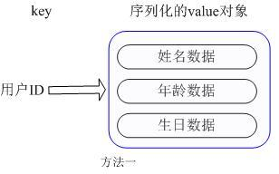
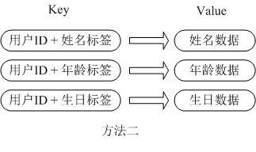
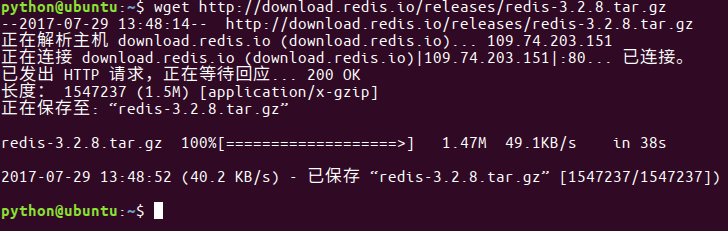
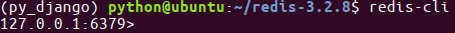
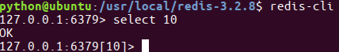

# 1. Redis简介

## [什么是Redis](http://redis.cn/)

​	Redis 是一个基于内存的高性能key-value数据库。

- Redis是一个开源的使用ANSI C语言编写、支持网络、可基于内存亦可持久化的日志型、Key-Value数据库，并提供多种语言的API。从2010年3月15日起，Redis的开发工作由VMware主持。从2013年5月开始，Redis的开发由Pivotal赞助。
- Redis是 NoSQL技术阵营中的一员，它通过多种键值数据类型来适应不同场景下的存储需求，借助一些高层级的接口使用其可以胜任，如缓存、队列系统的不同角色。
- 分布式缓存框架 可以 看成是nosql的一种。

## Redis的特点

​	Redis本质上是一个Key-Value类型的内存数据库，很像memcached，**整个数据库统统加载在内存当中进行操作，定期通过异步操作把数据库数据flush到硬盘上进行保存**。因为是纯内存操作，Redis的性能非常出色，每秒可以处理超过 10万次读写操作，是已知性能最快的Key-Value DB。
​	Redis的**出色之处**不仅仅是性能，Redis最大的魅力是支持保存多种数据结构，且单个value的最大限制是1GB，不像 memcached只能保存1MB的数据。因此，Redis可以用来实现很多有用的功能，比方说用他的List来做**FIFO双向链表**，实现一个轻量级的高性 能消息队列服务；用他的Set可以做高性能的tag系统等等。另外Redis也可以对存入的Key-Value设置expire时间，因此也可以被当作一 个功能加强版的memcached来用。

**Redis 与其他 key - value 缓存产品有以下三个特点：**

- Redis支持数据的持久化，可以将内存中的数据保存在磁盘中，重启的时候可以再次加载进行使用。
- Redis不仅仅支持简单的key-value类型的数据，同时还提供list，set，zset，hash等数据结构的存储。
- Redis支持数据的备份，即master-slave模式的数据备份。

**Redis其他优势**

- 性能极高 – Redis能读的速度是110000次/s,写的速度是81000次/s 。
- 丰富的数据类型 – Redis支持二进制案例的 Strings, Lists, Hashes, Sets 及 Ordered Sets 数据类型操作。
- 原子 – Redis的所有操作都是原子性的，同时Redis还支持对几个操作全并后的原子性执行。
- 丰富的特性 – Redis还支持 publish/subscribe, 通知, key 过期等等特性。

		Redis的**主要缺点**是数据库容量受到物理内存的限制，不能用作海量数据的高性能读写，因此Redis适合的场景主要局限在较小数据量的高性能操作和运算上。

## Redis支持的数据类型

​	Redis通过Key-Value的单值不同类型来区分, 以下是支持的类型:

- Strings
- Lists
- Sets 求交集、并集
- Sorted Set 
- hashes

## 为什么redis需要把所有数据放到内存中？

​	Redis为了达到最快的读写速度将数据都读到内存中，并通过异步的方式将数据写入磁盘。所以redis具有快速和数据持久化的特征。如果不将数据放在内存中，磁盘I/O速度为严重影响redis的性能。

​	如果设置了最大使用的内存，则数据已有记录数达到内存限值后不能继续插入新值。

## Redis是单进程单线程的

​	redis利用队列技术将并发访问变为串行访问，消除了传统数据库串行控制的开销。

## 虚拟内存

​	当你的key很小而value很大时,使用VM的效果会比较好.因为这样节约的内存比较大.
​	当你的key不小时,可以考虑使用一些非常方法将很大的key变成很大的value,比如你可以考虑将key,value组合成一个新的value.
​	vm-max-threads这个参数,可以设置访问swap文件的线程数,设置最好不要超过机器的核数,如果设置为0,那么所有对swap文件的操作都是串行的.可能会造成比较长时间的延迟,但是对数据完整性有很好的保证.

## 分布式

​	redis支持主从的模式。原则：Master会将数据同步到slave，而slave不会将数据同步到master。Slave启动时会连接master来同步数据。

​	这是一个典型的分布式读写分离模型。我们可以利用master来插入数据，slave提供检索服务。这样可以有效减少单个机器的并发访问数量。

### 读写分离模型

​	通过增加Slave DB的数量，读的性能可以线性增长。为了避免Master DB的单点故障，集群一般都会采用两台Master DB做**双机热备**，所以整个集群的读和写的可用性都非常高。
​	读写分离架构的**缺陷**在于，不管是Master还是Slave，每个节点都必须保存完整的数据，如果在数据量很大的情况下，集群的扩展能力还是受限于单个节点的存储能力，而且对于Write-intensive类型的应用，读写分离架构并不适合。

### 数据分片模型

​	为了解决读写分离模型的缺陷，可以将数据分片模型应用进来。可以将每个节点看成都是独立的master，然后通过业务实现数据分片。结合上面两种模型，可以将每个master设计成由一个master和多个slave组成的模型。

## Redis的回收策略

- volatile-lru：从已设置过期时间的数据集（server.db[i].expires）中挑选最近最少使用的数据淘汰；
- volatile-ttl：从已设置过期时间的数据集（server.db[i].expires）中挑选将要过期的数据淘汰；
- volatile-random：从已设置过期时间的数据集（server.db[i].expires）中任意选择数据淘汰；
- allkeys-lru：从数据集（server.db[i].dict）中挑选最近最少使用的数据淘汰；
- allkeys-random：从数据集（server.db[i].dict）中任意选择数据淘汰；
- no-enviction（驱逐）：禁止驱逐数据。

# 2. Redis常用数据类型详解

​	如第一章所述，Redis最为常用的数据类型主要有五种：	String、Hash、List、Set、Sorted set。在具体描述这几种数据类型之前，我们先通过一张图了解下Redis内部内存管理中是如何描述这些不同数据类型的。


​	首先Redis内部使用一个`redisObject`对象来表示所有的key和value，redisObject最主要的信息如上图所示：

- type 代表一个value对象具体是何种数据类型，
- encoding是不同数据类型在redis内部的存储方式，比如：type=string代表value存储的是一个普通字符串，那么对应的encoding可以是raw或者是int；如果是int则代表实际redis内部是按数值类型存储和表示这个字符串的，当然前提是这个字符串本身可以用数值表示，比如:"123" "456"这样的字符串。
- vm字段，只有打开了Redis的虚拟内存功能，此字段才会真正的分配内存，该功能默认是关闭状态的。

## 五种数据类型的使用和内部实现方式

### String

**常用命令：**

set,get,decr,incr,mget 等。

**应用场景：**

String是最常用的一种数据类型，普通的key/ value 存储都可以归为此类.即 可以完全实现目前 Memcached 的功能，并且效率更高。还可以享受Redis的定时持久化，操作日志及 Replication等功能。除了提供与 Memcached 一样的get、set、incr、decr 等操作外，Redis还提供了一些操作：获取字符串长度、往字符串append内容、设置和获取字符串的某一段内容、设置及获取字符串的某一位（bit）。

**实现方式：**

String在redis内部存储默认就是一个字符串，被redisObject所引用，当遇到incr,decr等操作时会转成数值型进行计算，此时redisObject的encoding字段为int。

### Hash

**常用命令：**

hget,hset,hgetall 等。

**应用场景：**

​	我们简单举个实例来描述下Hash的应用场景，比如我们要存储一个用户信息对象数据，包含以下信息：

用户ID为查找的key，存储的value用户对象包含姓名，年龄，生日等信息，如果用普通的key/value结构来存储，主要有以下2种存储方式：



​	第一种方式将用户ID作为查找key,把其他信息封装成一个对象以序列化的方式存储，这种方式的缺点是，增加了序列化/反序列化的开销，并且在需要修改其中一项信息时，需要把整个对象取回，并且修改操作需要对并发进行保护，引入CAS等复杂问题。



​	第二种方法是这个用户信息对象有多少成员就存成多少个key-value对儿，用用户ID+对应属性的名称作为唯一标识来取得对应属性的值，虽然省去了序列化开销和并发问题，但是用户ID为重复存储，如果存在大量这样的数据，内存浪费还是非常可观的。

​	那么Redis提供的Hash很好的解决了这个问题，Redis的Hash实际是内部存储的Value为一个HashMap，并提供了直接存取这个Map成员的接口，如下图：


​	也就是说，Key仍然是用户ID, value是一个Map，这个Map的key是成员的属性名，value是属性值，这样对数据的修改和存取都可以直接通过其内部Map的 Key(Redis里称内部Map的key为field), 也就是通过 key(用户ID) + field(属性标签) 就可以操作对应属性数据了，既不需要重复存储数据，也不会带来序列化和并发修改控制的问题。很好的解决了问题。

​	<font color=red>这里同时需要注意</font>，Redis提供了接口(hgetall)可以直接取到全部的属性数据,但是如果内部Map的成员很多，那么涉及到遍历整个内部 Map的操作，由于Redis单线程模型的缘故，这个遍历操作可能会比较耗时，而另其它客户端的请求完全不响应，这点需要格外注意。

**实现方式：**

​	上面已经说到Redis Hash对应Value内部实际就是一个HashMap，实际这里会有2种不同实现，这个Hash的成员比较少时Redis为了节省内存会采用类似一维数 组的方式来紧凑存储，而不会采用真正的HashMap结构，对应的value redisObject的encoding为zipmap,当成员数量增大时会自动转成真正的HashMap,此时encoding为ht。

### List

**常用命令：**

lpush,rpush,lpop,rpop,lrange等。

**应用场景：**

Redis list的应用场景非常多，也是Redis最重要的数据结构之一，比如twitter的关注列表，粉丝列表等都可以用Redis的list结构来实现。

​	Lists 就是链表，相信略有数据结构知识的人都应该能理解其结构。使用Lists结构，我们可以轻松地实现最新消息排行等功能。Lists的另一个应用就是消息队列， 可以利用Lists的PUSH操作，将任务存在Lists中，然后工作线程再用POP操作将任务取出进行执行。Redis还提供了操作Lists中某一段的api，你可以直接查询，删除Lists中某一段的元素。

**实现方式：**

​	Redis list的实现为一个双向链表，即可以支持反向查找和遍历，更方便操作，不过带来了部分额外的内存开销，Redis内部的很多实现，包括发送缓冲队列等也都是用的这个数据结构。

### Set

**常用命令：**

sadd,spop,smembers,sunion 等。

**应用场景：**

​	Redis set对外提供的功能与list类似是一个列表的功能，特殊之处在于set是**可以自动排重的**，当你需要存储一个列表数据，又不希望出现重复数据时，set 是一个很好的选择，并且set提供了判断某个成员是否在一个set集合内的重要接口，这个也是list所不能提供的。

​	Sets 集合的概念就是**一堆不重复值的组合**。利用Redis提供的Sets数据结构，可以存储一些集合性的数据，比如在微博应用中，可以将一个用户所有的关注人存在一个集合中，将其所有粉丝存在一个集合。Redis还为集合提供了求交集、并集、差集等操作，可以非常方便的实现如共同关注、共同喜好、二度好友等功能，对上面的所有集合操作，你还可以使用不同的命令选择将结果返回给客户端还是存集到一个新的集合中。

**实现方式：**

​	set 的内部实现是一个 value永远为null的HashMap，实际就是通过计算hash的方式来快速排重的，这也是set能提供判断一个成员是否在集合内的原因。

### Sorted set

**常用命令：**

zadd,zrange,zrem,zcard等

**使用场景：**

Redis sorted set的使用场景与set类似，区别是set不是自动有序的，而sorted set可以通过用户额外提供一个优先级(score)的参数来为成员排序，并且是插入有序的，即自动排序。当你需要一个有序的并且不重复的集合列表，那么 可以选择sorted set数据结构，比如twitter 的public timeline可以以发表时间作为score来存储，这样获取时就是自动按时间排好序的。

**实现方式：**

Redis sorted set的内部使用HashMap和跳跃表(SkipList)来保证数据的存储和有序，HashMap里放的是成员到score的映射，而跳跃表里存放的 是所有的成员，排序依据是HashMap里存的score,使用跳跃表的结构可以获得比较高的查找效率，并且在实现上比较简单。

# 3. Redis应用

> ​	Redis开创了一种新的数据存储思路，使用Redis，我们不用在面对功能单调的数据库时，把精力放在如何把大象放进冰箱这样的问题上，而是利用Redis灵活多变的数据结构和数据操作，为不同的大象构建不同的冰箱。希望你喜欢这个比喻。——Redis作者antirez

## Redis作者谈Redis应用场景

### 取最新N个数据的操作

比如典型的取网站的最新文章，通过下面方式，我们可以将最新的5000条评论的ID放在Redis的List集合中，并将超出集合部分从数据库获取

- 使用`LPUSH latest.comments<ID>`命令，向list集合中插入数据
- 插入完成后再用`LTRIM latest.comments 0 5000`命令使其永远只保存最近5000个ID
- 然后我们在客户端获取某一页评论时可以用下面的逻辑（伪代码）

```
FUNCTION get_latest_comments(start,num_items):
    id_list = redis.lrange("latest.comments",start,start+num_items-1)
    IF id_list.length < num_items
        id_list = SQL_DB("SELECT ... ORDER BY time LIMIT ...")
    END
    RETURN id_list
END
```

​	如果还有不同的筛选维度，比如某个分类的最新N条，那么我们可以再建一个按此分类的List，只存ID的话，Redis是非常高效的。

### 排行榜应用，取TOP N操作

​	这个需求与上面需求的不同之处在于，前面操作以时间为权重，这个是以某个条件为权重，比如按顶的次数排序，这时候就需要我们的`sorted set`出马了，将我们要排序的值设置成s`orted set`的`score`，将具体的数据设置成相应的`value`，每次只需要执行一条`ZADD`命令即可。

### 需要精准设定过期时间的应用

​	比如可以把上面说到的sorted set的score值设置成过期时间的时间戳，那么就可以简单地通过过期时间排序，定时清除过期数据了，不仅是清除Redis中的过期数据，我们完全可以把Redis里这个过期时间当成是对数据库中数据的索引，用Redis来找出哪些数据需要过期删除，然后再精准地从数据库中删除相应的记录。

### 计数器应用

​	Redis的命令都是原子性的，你可以轻松地利用INCR，DECR命令来构建计数器系统。

### Uniq操作，获取某段时间所有数据排重值

​	这个使用Redis的set数据结构最合适了，只需要不断地将数据往set中扔就行了，set意为集合，所以会自动排重。

### 实时系统，反垃圾系统

​	通过上面说到的set功能，可以知道一个终端用户是否进行了某个操作，可以找到其操作的集合并进行分析统计对比等。没有做不到，只有想不到。

### 构建队列系统

​	使用list可以构建队列系统，使用sorted set甚至可以构建**有优先级**的队列系统。

### Pub/Sub

​	Pub/Sub 从字面上理解就是发布（Publish）与订阅（Subscribe），在Redis中，你可以设定对某一个key值进行消息发布及消息订阅，当一个key值上进行了消息发布后，所有订阅它的客户端都会收到相应的消息。这一功能最明显的用法就是用作实时消息系统，比如普通的即时聊天，群聊等功能。

### 缓存

性能优于Memcached，数据结构更多样化。

## 现实中的Redis应用

 ITeye（JavaEye）的防火墙用了Redis

CSDN的用户数据库缓存用了Redis

 Yupoo.com在好友动态，访问统计，图片访问控制这些功能上使用了Redis。

新浪微博：18TB+ Memory Redis集群，计数、微薄热点反向cache等。

# 4.Redis安装配置与启动命令

## 下载

- 当前redis最新版本是4.0，它是一个测试版本，稳定版本是3.2版本。

- 当前ubuntu虚拟机中已经安装好了redis，以下步骤可以跳过 最新稳定版本下载链接：<http://download.redis.io/releases/redis-3.2.8.tar.gz>

- step1:下载

  > wget <http://download.redis.io/releases/redis-3.2.8.tar.gz>

  

- step2:解压

  > tar -zxvf redis-3.2.8.tar.gz

- step3:复制，放到usr/local⽬录下

  > sudo mv ./redis-3.2.8 /usr/local/redis

- step4:进⼊redis⽬录

  > cd /usr/local/redis/

- step5:生成

  > sudo make

- step6:测试,这段运⾏时间会较⻓

  > sudo make test

- step7:安装,将redis的命令安装到/usr/local/bin/⽬录

  > sudo make install

- step8:安装完成后，我们进入目录/usr/local/bin中查看

  > cd /usr/local/bin
  > ls -all

  

  > - redis-server redis服务器
  > - redis-cli redis命令行客户端
  > - redis-benchmark redis性能测试工具
  > - redis-check-aof AOF文件修复工具
  > - redis-check-rdb RDB文件检索工具

- step9:配置⽂件，移动到/etc/redis⽬录下

- 配置⽂件⽬录为/usr/local/redis/redis.conf

  > sudo cp /usr/local/redis/redis.conf /etc/redis/redis.conf

## 配置

- Redis的配置信息在/etc/redis/redis.conf下。

- 查看

  > sudo vi /etc/redis/redis.conf

### 核心配置选项

- 绑定ip：如果需要远程访问，可将此⾏注释，或绑定⼀个真实ip

  > bind 127.0.0.1

- 端⼝，默认为6379

  > port 6379

- 是否以守护进程运⾏

  - 如果以守护进程运⾏，则不会在命令⾏阻塞，类似于服务
  - 如果以⾮守护进程运⾏，则当前终端被阻塞
  - 设置为yes表示守护进程，设置为no表示⾮守护进程
  - 推荐设置为yes

  > daemonize yes

- 数据⽂件

  > dbfilename dump.rdb

- 数据⽂件存储路径

  > dir /var/lib/redis

- ⽇志⽂件

  > logfile /var/log/redis/redis-server.log

- 数据库，默认有16个

  > databases 16

- 主从复制，类似于双机备份。

  > slaveof

### 参考资料

redis配置信息<http://blog.csdn.net/ljphilp/article/details/52934933>

mac配置方法:https://www.cnblogs.com/feijl/p/6879929.html

## 服务器端命令

- 服务器端的命令为redis-server

- 可以使⽤help查看帮助⽂档

  > redis-server --help

- 启动

  > sudo service redis start

- 停⽌

  > sudo service redis stop

- 重启 sudo service redis restart

- 个人习惯

  > ps -ef|grep redis 查看redis服务器进程
  > sudo kill -9 pid 杀死redis服务器
  > sudo redis-server /etc/redis/redis.conf 指定加载的配置文件

## 客户端命令

- 客户端的命令为redis-cli

- 可以使⽤help查看帮助⽂档

  > redis-cli --help

- 连接redis

  > redis-cli

  

- 运⾏测试命令

  > ping

  

- 切换数据库

- 数据库没有名称，默认有16个，通过0-15来标识，连接redis默认选择第一个数据库

  > select n

  

# 5. 数据操作常用命令

## string

​	字符串类型作为Redis中最为基础的数据存储类型，它在Redis中是二进制安全的，这便意味着该类型可以接受任何格式的数据，如JPEG图像数据或Json对象描述信息等。在Redis中字符串类型的Value最多可以容纳的数据长度是512M。

### 保存

如果设置的键不存在则为添加，如果设置的键已经存在则修改

- 设置键值

  > set key value

- 例1：设置键为name值为itcast的数据

  > set name itcast

  

- 设置键值及过期时间，以秒为单位

  > setex key seconds value

- 例2：设置键为aa值为aa过期时间为3秒的数据

  > setex aa 3 aa

  

- 设置多个键值

  > mset key1 value1 key2 value2 ...

- 例3：设置键为'a1'值为'python'、键为'a2'值为'java'、键为'a3'值为'c'

  > mset a1 python a2 java a3 c

  

- 追加值

  > append key value

- 例4：向键为a1中追加值' haha'

  > append 'a1' 'haha'

  

### 获取

- 获取：根据键获取值，如果不存在此键则返回nil

  > get key

- 例5：获取键'name'的值

  > get 'name'

- 根据多个键获取多个值

  > mget key1 key2 ...

- 例6：获取键a1、a2、a3'的值

  > mget a1 a2 a3

### 删除

详⻅下节键的操作，删除键时会将值删除。

## 键命令

- 查找键，参数⽀持正则表达式

  > keys pattern

- 例1：查看所有键

  > keys *

  

- 例2：查看名称中包含a的键

  > keys 'a*'

  

- 判断键是否存在，如果存在返回1，不存在返回0

  > exists key1

- 例3：判断键a1是否存在

  > exists a1

  

- 查看键对应的value的类型

  > type key

- 例4：查看键a1的值类型，为redis⽀持的五种类型中的⼀种

  > type a1

  

- 删除键及对应的值

  > del key1 key2 ...

- 例5：删除键a2、a3

  > del a2 a3

  

- 设置过期时间，以秒为单位

- 如果没有指定过期时间则⼀直存在，直到使⽤DEL移除

  > expire key seconds

- 例6：设置键'a1'的过期时间为3秒

  > expire 'a1' 3

  

- 查看有效时间，以秒为单位

  > ttl key

- 例7：查看键'bb'的有效时间

  > ttl bb

  

## hash类型

### 增加、修改

- 设置单个属性

  > hset key field value


- 设置多个属性

  > hmset key field1 value1 field2 value2 ...

- 例：设置键u2的属性name为itcast、属性age为11

  > hmset u2 name itcast age 11

  

### 获取

- 获取指定键所有的属性

  > hkeys key

- 例：获取键u2的所有属性

  > hkeys u2

  

- 获取⼀个属性的值

  > hget key field

- 例：获取键u2属性'name'的值

  > hget u2 'name'

  

- 获取多个属性的值

  > hmget key field1 field2 ...

- 例：获取键u2属性'name'、'age的值

  > hmget u2 name age

  

- 获取所有属性的值

  > hvals key

- 例：获取键'u2'所有属性的值

  > hvals u2

  

### 删除

- 删除整个hash键及值，使⽤del命令

- 删除属性，属性对应的值会被⼀起删除

  > hdel key field1 field2 ...

- 例：删除键'u2'的属性'age'

  > hdel u2 age

  

## list类型

### 增加

- 在左侧插⼊数据

  > lpush key value1 value2 ...

- 例：从键为'a1'的列表左侧加⼊数据a 、 b 、c

  > lpush a1 a b c

  

  


- 在右侧插⼊数据

  > rpush key value1 value2 ...

- 例：从键为'a1'的列表右侧加⼊数据0 1

  > rpush a1 0 1

  

  

- 在指定元素的前或后插⼊新元素

  > linsert key before或after 现有元素 新元素

- 例：在键为'a1'的列表中元素'b'前加⼊'3'

  > linsert a1 before b 3

  

### 获取

- 返回列表⾥指定范围内的元素

  - start、stop为元素的下标索引
  - 索引从左侧开始，第⼀个元素为0
  - 索引可以是负数，表示从尾部开始计数，如-1表示最后⼀个元素

  > lrange key start stop

- 例：获取键为'a1'的列表所有元素

  > lrange a1 0 -1

  

### 设置指定索引位置的元素值

- 索引从左侧开始，第⼀个元素为0

- 索引可以是负数，表示尾部开始计数，如-1表示最后⼀个元素

  > lset key index value

- 例：修改键为'a1'的列表中下标为1的元素值为'z'

  > lset a 1 z

  

### 删除

- 删除指定元素

  - 将列表中前count次出现的值为value的元素移除
  - count > 0: 从头往尾移除
  - count < 0: 从尾往头移除
  - count = 0: 移除所有

  > lrem key count value

- 例：向列表'a2'中加⼊元素'a'、'b'、'a'、'b'、'a'、'b'

  > lpush a2 a b a b a b

  

- 例：从'a2'列表右侧开始删除2个'b'

  > lrem a2 -2 b

- 例：查看列表'py12'的所有元素

  > lrange a2 0 -1

  

## set类型

- ⽆序集合
- 元素为string类型
- 元素具有唯⼀性，不重复
- <font color=red>说明：对于集合没有修改操作</font>

### 增加

- 添加元素

  > sadd key member1 member2 ...

- 例：向键'a3'的集合中添加元素'zhangsan'、'lisi'、'wangwu'

  > sadd a3 zhangsan sili wangwu

  

### 获取

- 返回所有的元素

  > smembers key

- 例：获取键'a3'的集合中所有元素

  > smembers a3

  

### 删除

- 删除指定元素

  > srem key member1 member2 ...

- 例：删除键'a3'的集合中元素'wangwu'

  > srem a3 wangwu

  

## zset类型

- sorted set，有序集合
- 元素为string类型
- 元素具有唯⼀性，不重复
- 每个元素都会关联⼀个double类型的score，表示权重，通过权重将元素从⼩到⼤排序
- <font color=red>说明：没有修改操作</font>

### 增加

- 添加

  > zadd key score1 member1 score2 member2 ...

- 例：向键'a4'的集合中添加元素'lisi'、'wangwu'、'zhaoliu'、'zhangsan'，权重分别为4、5、6、3

  > zadd a4 4 lisi 5 wangwu 6 zhaoliu 3 zhangsan

### 获取

- 返回指定范围内的元素

- start、stop为元素的下标索引

- 索引从左侧开始，第⼀个元素为0

- 索引可以是负数，表示从尾部开始计数，如-1表示最后⼀个元素

  > zrange key start stop

- 例：获取键'a4'的集合中所有元素

  > zrange a4 0 -1

  

- 返回score值在min和max之间的成员

  > zrangebyscore key min max

- 例：获取键'a4'的集合中权限值在5和6之间的成员

  > zrangebyscore a4 5 6

  

- 返回成员member的score值

  > zscore key member

- 例：获取键'a4'的集合中元素'zhangsan'的权重

  > zscore a4 zhangsan

  

### 删除

- 删除指定元素

  > zrem key member1 member2 ...

- 例：删除集合'a4'中元素'zhangsan'

  > zrem a4 zhangsan

  

- 删除权重在指定范围的元素

  > zremrangebyscore key min max

- 例6：删除集合'a4'中权限在5、6之间的元素

  > zremrangebyscore a4 5 6

  

# 6. python与Redis交互之redis

- 安装：`pip install redis`
- 调用：`from redis import StrictRedis`这个模块中提供了StrictRedis对象(Strict严格)，⽤于连接redis服务器，并按照不同类型提供 了不同⽅法，进⾏交互操作。

## StrictRedis对象⽅法

### 连接Redis服务器

- 通过创建对象，指定参数host、port与指定的服务器和端⼝连接，host默认为localhost，port默认为6379，db默认为0。

```python
sr = StrictRedis(host='localhost', port=6379, db=0)
```

### 数据操作方法

​	根据不同的类型，拥有不同的实例⽅法可以调⽤，与前⾯学的redis命令对应，⽅法需要的参数与命令的参数⼀致：

```
string
	set、setex、mset、append、get、mget、key

keys
	exists、type、delete、expire、getrange、ttl
	
hash
	hset、hmset、hkeys、hget、hmget、hvals、hdel

list
	lpush、rpush、linsert、lrange、lset、lrem

set
	sadd、smembers、srem

zset
	zadd、zrange、zrangebyscore、zscore、zrem、zremrangebyscore
```

### 恶意登录限制实例

```python
"""用列表实现:列表中每个元素代表登陆时间,只要最后的第5次登陆时间和现在时间差不超过1小时就禁止登陆"""
"""
请用Redis和任意语言实现一段恶意登录保护的代码，限制1小时内每用户Id最多只能登录5次
"""
import redis
import sys
import time

r = redis.StrictRedis(host='127.0.0.1', port=6379, db=1)
try:
    id = sys.argv[1]
except:
    print('input argument error')
    sys.exit(0)
# 将每次登陆的时间存入redis的名为login_item列表中，判断列表元素个数是否已达到5并且和第一次登录时间比较是否在一个小时以内。
if r.llen('login_item') >= 5 and (time.time() - float(r.lindex('login_item', 4)) <= 3600):
    print('you are forbidden logining')
else:
    print('you are allowed to login')
    r.lpush('login_item', time.time())
```

# 7. 搭建主从

## 主从概念

- ⼀个master可以拥有多个slave，⼀个slave⼜可以拥有多个slave，如此下去，形成了强⼤的多级服务器集群架构

- master用来写数据，slave用来读数据，经统计：网站的读写比率是10:1

- 通过主从配置可以实现读写分离

  

- master和slave都是一个redis实例(redis服务)

## 主从配置

### 配置主

- 查看当前主机的ip地址

  > ifconfig

  

- 修改etc/redis/redis.conf文件

  > sudo vi redis.conf
  > bind 192.168.26.128

- 重启redis服务

  > sudo service redis stop
  > redis-server redis.conf

### 配置从

- 复制etc/redis/redis.conf文件

  > sudo cp redis.conf ./slave.conf

- 修改redis/slave.conf文件

  > sudo vi slave.conf

- 编辑内容

  > bind 192.168.26.128
  > slaveof 192.168.26.128 6379
  > port 6378

- redis服务

  > sudo redis-server slave.conf

- 查看主从关系

  > redis-cli -h 192.168.26.128 info Replication

  

## 数据操作

- 在master和slave分别执⾏info命令，查看输出信息 进入主客户端

  > redis-cli -h 192.168.26.128 -p 6379

- 进入从的客户端

  > redis-cli -h 192.168.26.128 -p 6378

- 在master上写数据

  > set aa aa

  

- 在slave上读数据

  > get aa

  

# 8. 搭建Redis集群

## Redis集群简介

### 为什么要有集群

- 之前我们已经讲了主从的概念，一主可以多从，如果同时的访问量过大(1000w),主服务肯定就会挂掉，数据服务就挂掉了或者发生自然灾难
- 大公司都会有很多的服务器(华东地区、华南地区、华中地区、华北地区、西北地区、西南地区、东北地区、台港澳地区机房)

### 集群的概念

- 集群是一组相互独立的、通过高速网络互联的计算机，它们构成了一个组，并以单一系统的模式加以管理。一个客户与集群相互作用时，集群像是一个独立的服务器。集群配置是用于提高可用性和可缩放性。


当请求到来首先由负载均衡服务器处理，把请求转发到另外的一台服务器上。

### redis集群

- 分类
  - 软件层面
  - 硬件层面
- 软件层面：只有一台电脑，在这一台电脑上启动了多个redis服务。


- 硬件层面：存在多台实体的电脑，每台电脑上都启动了一个redis或者多个redis服务。 

### 搭建集群

- 当前拥有两台主机172.16.179.130、172.16.179.131，这⾥的IP在使⽤时要改为实际值

### 参考阅读

- redis集群搭建<http://www.cnblogs.com/wuxl360/p/5920330.html>
- [Python]搭建redis集群<http://blog.5ibc.net/p/51020.html>

## 配置机器1

- 在演示中，172.16.179.130为当前ubuntu机器的ip

- 在172.16.179.130上进⼊Desktop⽬录，创建conf⽬录

- 在conf⽬录下创建⽂件7000.conf，编辑内容如下

  ```
  port 7000
  bind 172.16.179.130
  daemonize yes
  pidfile 7000.pid
  cluster-enabled yes
  cluster-config-file 7000_node.conf
  cluster-node-timeout 15000
  appendonly yes

  ```

- 在conf⽬录下创建⽂件7001.conf，编辑内容如下

  ```
  port 7001
  bind 172.16.179.130
  daemonize yes
  pidfile 7001.pid
  cluster-enabled yes
  cluster-config-file 7001_node.conf
  cluster-node-timeout 15000
  appendonly yes

  ```

- 在conf⽬录下创建⽂件7002.conf，编辑内容如下

  ```
  port 7002
  bind 172.16.179.130
  daemonize yes
  pidfile 7002.pid
  cluster-enabled yes
  cluster-config-file 7002_node.conf
  cluster-node-timeout 15000
  appendonly yes

  ```

- 总结：三个⽂件的配置区别在port、pidfile、cluster-config-file三项

- 使⽤配置⽂件启动redis服务

  ```
  redis-server 7000.conf
  redis-server 7001.conf
  redis-server 7002.conf

  ```

- 查看进程如下图 

## 配置机器2

- 在演示中，172.16.179.131为当前ubuntu机器的ip

- 在172.16.179.131上进⼊Desktop⽬录，创建conf⽬录

- 在conf⽬录下创建⽂件7003.conf，编辑内容如下

  ```
  port 7003
  bind 172.16.179.131
  daemonize yes
  pidfile 7003.pid
  cluster-enabled yes
  cluster-config-file 7003_node.conf
  cluster-node-timeout 15000
  appendonly yes

  ```

- 在conf⽬录下创建⽂件7004.conf，编辑内容如下

  ```
  port 7004
  bind 172.16.179.131
  daemonize yes
  pidfile 7004.pid
  cluster-enabled yes
  cluster-config-file 7004_node.conf
  cluster-node-timeout 15000
  appendonly yes

  ```

- 在conf⽬录下创建⽂件7005.conf，编辑内容如下

  ```
  port 7005
  bind 172.16.179.131
  daemonize yes
  pidfile 7005.pid
  cluster-enabled yes
  cluster-config-file 7005_node.conf
  cluster-node-timeout 15000
  appendonly yes

  ```

- 总结：三个⽂件的配置区别在port、pidfile、cluster-config-file三项

- 使⽤配置⽂件启动redis服务

  ```
  redis-server 7003.conf
  redis-server 7004.conf
  redis-server 7005.conf

  ```

- 查看进程如下图 

## 集群与Python交互

- 安装包如下

  > pip install redis-py-cluster

- redis-py-cluster源码地址<https://github.com/Grokzen/redis-py-cluster>

- 创建⽂件redis_cluster.py，示例码如下

  ```python
  from rediscluster import StrictRedisCluster
  if __name__ == '__main__':
    try:
        # 构建所有的节点，Redis会使⽤CRC16算法，将键和值写到某个节点上
        startup_nodes = [
            {'host': '192.168.26.128', 'port': '7000'},
            {'host': '192.168.26.130', 'port': '7003'},
            {'host': '192.168.26.128', 'port': '7001'},
        ]
        # 构建StrictRedisCluster对象
        src=StrictRedisCluster(startup_nodes=startup_nodes,decode_responses=True)
        # 设置键为name、值为itheima的数据
        result=src.set('name','itheima')
        print(result)
        # 获取键为name
        name = src.get('name')
        print(name)
    except Exception as e:
        print(e)
  ```